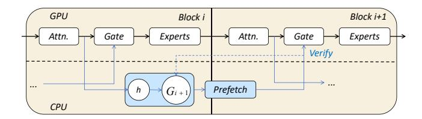
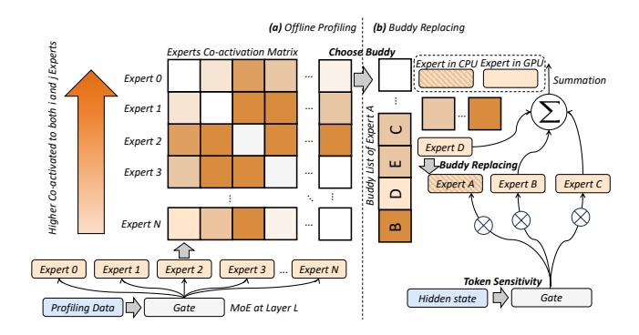
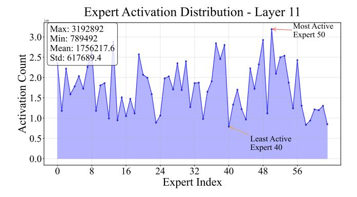
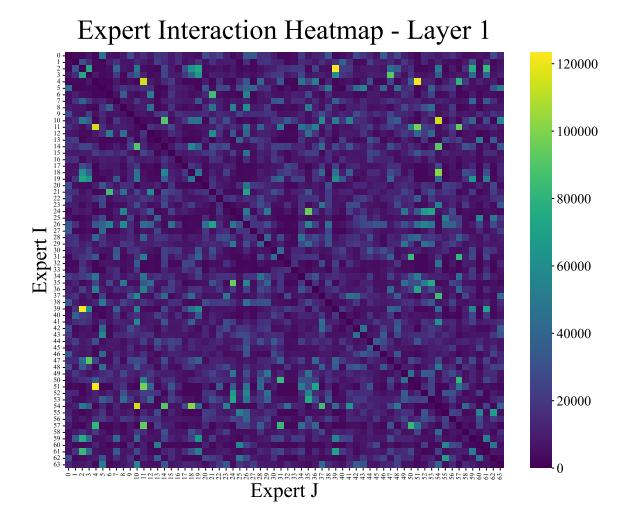

# 2 Background and Motivation

## 2.1 Transformers and Mixture-of-Experts

Transformer architecture, the basis for modern LLMs, utilizes self-attention and dense feed-forward networks (FFNs). In a standard dense Transformer block (Figure 2a), every input token is processed by a single FFN, activating all its parameters. Scaling these FFNs enhances performance, but their dense computation becomes very costly as models get larger. MoE offers a more efficient scaling method [3, 9, 16]. An MoE Transformer (Figure 2b) replaces the dense FFN with an MoE layer. This layer has a pool of independent expert networks (FFNs) and a small gating network. The gating network dynamically selects a small number of experts—usually one or two-for each input token. This sparse activation allows for a massive increase in total parameters without a proportional increase in computational cost per token. As a result, MoE models can match the performance of much larger dense models with less inference computation, though

**Figure 3.** Overview of the expert prefetching pipeline. While the GPU computes block i, the CPU uses the attention output to predict the required experts for the next block (i+1) and prefetches them. This overlaps I/O with computation to hide latency. A verification step is used to handle prediction mismatches.

**Table 1.** Impact of Cache Misses and BuddyMoE on MoE Inference. BuddyMoE's buddy replacement strategy mitigates the latency penalty of a prefetch miss.

| Scenario             | Latency (ms) | Accuracy     |
|----------------------|--------------|--------------|
| Baseline (On Demand) | 9-10         | Lossless     |
| Prefetch Hit         | ~0           | Lossless     |
| Prefetch Miss        | 9-10         | Lossless     |
| BuddyMoE Hit         | ~0           | Lossless     |
| BuddyMoE Miss        | ~0           | Minimal Loss |

this architecture creates a major memory footprint problem for deployment [11, 18].

## 2.2 Mixture-of-Experts and Offloading

MoE layers consist of a gating network and multiple experts. For each token, the gate assigns probabilities and activates the top-k experts, whose outputs are aggregated. This sparse activation saves computation compared to dense feedforward networks, but all expert parameters must still reside in GPU memory for possible activation, creating heavy memory demands [23]. Large MoE models like Mixtral-8×7B have billions of parameters; though only a few experts run per token, the full model still requires 87 GB.

To fit such models on GPUs with limited memory, offloading places inactive experts in CPU memory or storage. The GPU holds frequently used experts (the *expert cache*) and non-expert weights, fetching others over PCIe when needed. While this reduces GPU usage, it adds large latency: transferring one expert from CPU takes tens of milliseconds, far exceeding a single MoE layer's compute time [12, 22].

#### 2.3 Expert Prefetching

To reduce pipeline stalls from on-demand loading, prefetching systems attempt to anticipate expert requirements and transfer them to the GPU cache ahead of time. Techniques employed by systems like MoE-Infinity and Pre-gated MoE use signals such as historical activation frequencies or auxiliary gating logic to inform these predictions [7, 19]. When

**Figure 4.** Expert similarity heatmap for a 64-expert MoE model. The intensity represents the functional similarity between expert pairs, with brighter regions indicating higher similarity. The prevalent bright areas demonstrate significant redundancy across experts, suggesting opportunities for expert substitution during cache misses.

successful, prefetching effectively hides I/O latency by overlapping it with computation. However, the input-dependent nature of expert routing makes perfect prediction infeasible, leading to two primary sources of inefficiency. First, a prediction miss occurs when a required expert is not in the cache, forcing a synchronous fetch that stalls execution. Second, speculative waste arises from loading experts that are not ultimately used, consuming finite PCIe bandwidth and displacing other potentially useful experts [13, 17].

## 2.4 Motivation

The efficiency of MoE inference under memory constraints depends critically on balancing limited GPU memory against the latency penalty of expert loading. Our work is motivated by three key observations that together suggest a new approach to this challenge.

Inherent expert redundancy. Figure 4 shows a similarity analysis of experts in a production MoE model, revealing substantial functional overlap between expert pairs. The bright regions in the heatmap highlight many experts with high similarity scores, indicating that the model's capacity is redundantly distributed. Prior work confirms that aggressive quantization or pruning of selected experts causes minimal accuracy loss, further validating this redundancy [4]. This suggests that experts with overlapping functionality could substitute for one another during inference, especially when memory constraints prevent loading all experts.

**Disproportionate cost of cache misses.** Profiling MoE inference shows that expert loading dominates the pipeline. On edge devices running Mixtral-8×7B, transfers from CPU memory account for 85–94% of inference latency, while computation by the experts themselves is negligible [12, 22]. This imbalance stems from PCIe bandwidth limits (16–32 GB/s versus TB/s within GPU memory). A prefetch miss stalls

the pipeline for tens of milliseconds while waiting for the transfer, delaying the entire inference process. Prefetching systems attempt to mask this cost, but their effectiveness is bounded by the stochasticity of expert routing and imperfect predictions.

Limitations of predictive prefetching. Prefetching can overlap I/O with compute when predictions are accurate, but MoE's input-dependent routing makes perfect prediction unattainable. Current heuristics—ranging from activation frequency tracking to auxiliary gating networks—suffer from two core inefficiencies: prediction misses force synchronous expert loads that stall the pipeline, while speculative prefetching wastes PCIe bandwidth and may evict more useful experts from cache [13, 17]. These problems intensify as the number of experts grows and activation patterns become harder to anticipate.

Together, these observations motivate BuddyMoE's core insight: instead of eliminating cache misses via better prediction, we can tolerate them gracefully by exploiting expert redundancy. By caching functionally similar "buddy" experts, we can substitute a cached buddy when the target expert is unavailable, avoiding catastrophic stalls while preserving acceptable accuracy. In this design, cache misses degrade into minor perturbations absorbed by the model's inherent redundancy.

Challenges. Exploiting expert redundancy for miss tolerance introduces two challenges. First, we must rigorously define "buddy" similarity and identify expert pairs beyond simple heuristics such as output variance or access frequency. Second, substitution unavoidably perturbs outputs, so we need mechanisms to bound accuracy loss while maximizing latency reduction. Addressing this trade-off is central to realizing BuddyMoE's potential [10].

## 3 System Design

BuddyMoE is a replacement-based runtime for MoE inference. It operationalizes two robust empirical regularities of MoE routers: (i) **functional redundancy**—multiple experts implement similar behaviors on overlapping token submanifolds; and (ii) **uneven activation and co-activation**—a small fraction of experts (and expert pairs) accounts for most routing events. BuddyMoE converts these properties into throughput gains under memory pressure by replacing missing or CPU-resident experts with *buddy* experts that are already on the GPU, subject to accuracy-preserving gates.

**Notation and Preliminaries.** Let  $\mathcal{L}$  be the MoE layers and  $\mathcal{E}_{\ell} = \{1, \dots, E_{\ell}\}$  the experts at layer  $\ell \in \mathcal{L}$ . For token x, the router at layer  $\ell$  emits logits  $\mathbf{z}_{\ell}(x) \in \mathbb{R}^{E_{\ell}}$  and probabilities  $\mathbf{p}_{\ell}(x) = \operatorname{softmax}(\mathbf{z}_{\ell}(x))$ . With top-k routing, the selected set is  $S_{\ell}(x) \subset \mathcal{E}_{\ell}$ ,  $|S_{\ell}(x)| = k$ , and  $\tilde{\mathbf{p}}_{\ell}(x)$  denotes  $\mathbf{p}_{\ell}(x)$  renormalized over  $S_{\ell}(x)$ . The memory residency of expert i is  $\operatorname{loc}_{\ell}(i) \in \{\text{GPU}, \text{CPU}\}$ . For micro-batch  $\mathcal{B}$ , the set of experts requested at layer  $\ell$  is  $\mathcal{R}_{\ell}(\mathcal{B})$ .

Figure 5. Overview of the buddy expert replacement system. The left panel shows the experts co-activation matrix derived from profiling data, where darker cells indicate higher co-activation frequency between expert pairs. The right panel illustrates the buddy replacing mechanism: (a) offline profiling identifies frequently co-activated experts with functional redundancy, and (b) runtime buddy replacing selectively substitutes GPU-resident experts with their CPU-based buddies based on activation patterns, token sensitivity, and expert distribution. The system dynamically determines replacement decisions through three key metrics (§3.1-§3.3) to minimize memory transfer overhead while maintaining model accuracy.

## 3.1 Three Key Metrics for Replacement Decisions

BuddyMoE employs three key metrics executed in a strict sequence to determine whether and how to replace CPU-resident experts with their GPU-resident buddies. These metrics balance model accuracy preservation with memory transfer minimization.

**Token Activating Entropy (TAE,** τ). The first metric quantifies token-level tolerance to expert substitution through Token Activating Entropy:

$$\mathrm{TAE}_{\ell}(x) = -\sum_{i \in S_{\ell}(x)} \tilde{p}_{\ell}(i \mid x) \log \tilde{p}_{\ell}(i \mid x) / \log k \in [0, 1].$$

Low TAE indicates peaky routing where the token has strong preference for specific experts and is thus *sensitive* to replacement. High TAE indicates diffuse routing with several comparable experts, making the token *tolerant* to substitution. We forbid replacement for token x at layer  $\ell$  when  $\text{TAE}_{\ell}(x) \leq \tau$  and allow it otherwise. Implementation details include: (i) using renormalized top-k probabilities  $\tilde{\mathbf{p}}_{\ell}(x)$  to avoid artifacts from the tail; (ii) optional temperature smoothing with  $\tilde{\mathbf{p}}_{\ell}(x;T) = \text{softmax}(\mathbf{z}_{\ell}(x)/T)$  restricted to  $S_{\ell}(x)$  to stabilize TAE across layers  $(T \in [0.8, 1.2] \text{ works well})$ ; (iii) percentile calibration where  $\tau$  is picked as the p-th percentile of the per-layer TAE distribution (for  $p \in [10, 20]$ ), making the gate robust across models and domains. For deployments

requiring extra caution, TAE can be combined with a probability margin  $m_{\ell}(x) = \tilde{p}_{\text{max}} - \tilde{p}_{\text{2nd}}$  to forbid replacement if  $(\text{TAE} \leq \tau) \lor (m_{\ell}(x) \geq \gamma)$ .

*Expert Distribution Gate (CPU/GPU Residency, \beta).* The second metric provides batch-aware residency signaling to prevent broad, risky replacements. For micro-batch  $\mathcal B$  at layer  $\ell$ , we define the fraction of currently required experts that are on CPU:

$$\delta_{\ell}(\mathcal{B}) = \frac{\left|\left\{i \in \mathcal{R}_{\ell}(\mathcal{B}) : \log_{\ell}(i) = \text{CPU}\right\}\right|}{\left|\mathcal{R}_{\ell}(\mathcal{B})\right|}.$$
 (2)

Given threshold  $\beta \in [0, 1]$ , we bypass replacement when  $\delta_{\ell}(\mathcal{B}) \geq \beta$  and proceed otherwise. The intuition is that when many requested experts are on CPU, broad replacement would affect many tokens simultaneously and risks compounding errors. When only a few are on CPU, targeted replacement avoids bursty CPU→GPU traffic with limited accuracy exposure. The  $\beta$  threshold can be related to a transfer budget: let  $B_{PCIe}$  be an allowed per-step transfer budget and  $\bar{w}$  the average bytes per expert (weights plus optimizer state if any). Let  $\hat{n}_{\text{cpu}}(\ell)$  estimate the number of CPU-only invocations without replacement. Choosing  $\beta$  that maintains  $\hat{n}_{\mathrm{cpu}}(\ell) \cdot \bar{w} \leq B_{\mathrm{PCIe}}$  keeps the system within bandwidth budget. In practice, a fixed  $\beta$  per deployment tier suffices, though adaptive  $\beta$  based on a running bandwidth meter is a drop-in extension. In tensor/pipeline parallel setups, we compute  $\delta_{\ell}$ per partition and apply the gate locally.

**Buddy Selection Priority Score** ( $\Psi$ ). If the token passes the TAE gate and the batch passes the distribution gate, and a requested expert  $i \in S_{\ell}(x)$  is not on GPU, we attempt replacement with a buddy  $j \in \mathcal{B}_{\ell}(i;\alpha)$  that is currently GPU-resident. Candidates are prioritized using:

$$\Psi_{\ell}(j \mid i, x) = \underbrace{q_{j \mid i}}_{\text{Global Sim.}} \underbrace{\left(1 + \eta \, \hat{z}_{\ell}^{(j)}(x)\right) \cdot \left(1 - \kappa \, \text{hop}(j)\right)}_{\text{Local Compat.}}, \quad (3)$$

where  $\hat{z}_{\ell}^{(j)}(x)$  is a normalized router logit for j on token x (if available), hop(j) counts cross-partition hops (0 for same-GPU), and  $\eta, \kappa \geq 0$  are small tunables (default  $\eta = \kappa = 0$ ). For top-k routing, multiple missing experts from  $S_{\ell}(x)$  might map to the same buddy. To avoid collapsing diversity, we discourage reusing an already-chosen buddy for that token by reducing its  $\Psi_{\ell}$  multiplicatively (e.g., by a factor < 1) on subsequent picks for the same x. If no GPU-resident buddy exists, we fall back to either prefetching the original i (paying transfer cost) or skipping the expert per the baseline MoE drop policy, depending on SLA and the router's token capacity settings.

## 3.2 Expert Co-activation Matrix Analysis

The buddy identification process in BuddyMoE is grounded in two robust empirical regularities observed during model inference: uneven expert activation and sparse co-activation

**Figure 6.** Uneven expert activation distribution in Layer 11 of a 64-expert MoE model. The activation count varies significantly across experts, with a few "popular" experts (e.g., Expert 50) accounting for a disproportionately large share of routing events compared to less active ones (e.g., Expert 40). This skew is a key empirical regularity exploited by BuddyMoE.

**Figure 7.** Expert co-activation heatmap for Layer 1. Each cell (i, j) indicates how frequently experts i and j were selected together for the same token. The sparse, bright pattern demonstrates that co-activation is highly non-uniform: specific pairs of experts are frequently co-activated, suggesting functional redundancy. This pattern forms the basis for identifying "buddy" experts.

patterns. These properties, visualized in Figure 6 and Figure 9 respectively, reveal that not all experts are equally utilized and that their inter-dependencies are highly structured, which forms the basis of our buddy replacement strategy.

**Empirical Evidence from Profiling.** Over a profiling corpus  $\mathcal{D}_{\text{prof}}$ , we record per-layer statistics: (i) per-expert activations  $A_{\ell}(i)$ , the number of tokens for which  $i \in S_{\ell}(x)$ ; and (ii) pairwise co-activations  $M_{\ell}(i, j)$ , the number of tokens

for which  $i, j \in S_{\ell}(x)$  simultaneously. The conditional coactivation distribution with pivot i is defined as:

$$q_{j|i} = \frac{M_{\ell}(i,j)}{\sum_{j'} M_{\ell}(i,j')}, \quad j \neq i, \quad q_{i|i} = 0.$$
 (4)

In practice,  $A_{\ell}(\cdot)$  exhibits a heavy-tailed distribution (Figure 6) where few "popular" experts dominate activation patterns. More importantly, holding i fixed, the mass of  $q_{j|i}$  concentrates on a small subset of peers: top-r peers (with  $r \ll E_{\ell}$ ) often cover a large majority of the co-activations with i. This skew, visible as sparse bright cells in the co-activation matrix (Figure 9), indicates that a handful of peers systematically appear with i, suggesting functional similarity and redundancy.

**From Evidence to Buddy Definition.** For each pivot i, we sort peers by  $q_{j|i}$  to obtain the expert sequence  $\pi_i(1), \pi_i(2), \ldots$  with  $q_{\pi_i(1)|i} \geq q_{\pi_i(2)|i} \geq \ldots$ . We call j a buddy of i if it lies within the Cumulative Frequency Threshold (CFT) defined coverage of this sequence. Intuitively, the buddy list is a small, high-coverage set of peers that most frequently coactivate with i and are therefore most suitable substitutes when i is unavailable on the GPU.

Layer-wise Heterogeneity. The co-activation patterns exhibit layer-wise heterogeneity: early layers tend to show broader redundancy with more diffuse co-activation patterns, while later layers are more specialized with tighter expert clusters. This heterogeneity informs our per-layer calibration of the CFT parameter  $\alpha_\ell$  and allows us to adapt the buddy list sizes across the model depth.

## 3.3 Buddy Replacing Mechanism

The buddy replacing mechanism converts co-activation patterns into runtime replacement decisions through a two-stage process.

Offline Profiling and Buddy List Construction. The offline stage transforms raw profiling data into compact buddy lists through the Cumulative Frequency Threshold (CFT) mechanism. We collect router traces over a held-out profiling set  $\mathcal{D}_{\text{prof}}$  that matches the intended deployment domain. To stabilize estimates: (i) we accumulate both binary co-activations and probability-weighted co-activations  $(\sum_x \mathbb{1}\{i,j\in S_\ell(x)\}\cdot \min(\tilde{p}_\ell(i|x),\tilde{p}_\ell(j|x)))$ ; (ii) we apply Laplace smoothing  $M_\ell\leftarrow M_\ell+\epsilon$  before normalization; (iii) we optionally down-weight early warm-up steps to avoid cold-cache artifacts.

Given  $\alpha \in (0, 1]$ , we define the minimal prefix size:

$$t_i(\alpha) = \min \left\{ t \mid \sum_{r=1}^t q_{\pi_i(r)|i} \ge \alpha \right\}.$$
 (5)

The buddy list of i is then:

$$\mathcal{B}_{\ell}(i;\alpha) = \{\pi_i(1), \, \pi_i(2), \, \dots, \, \pi_i(t_i(\alpha))\}.$$
 (6)

CFT directly encodes our design goal: a small set that covers most co-activations for i. Larger  $\alpha$  yields broader coverage (higher chance that some buddy is on the GPU), while smaller  $\alpha$  is more conservative (tighter similarity, smaller lists). We cap  $|\mathcal{B}_{\ell}(i;\alpha)| \leq K_{\max}$  for metadata control and ensure  $t_i(\alpha) \geq 1$  for any i with nonzero activity. We allow a per-layer  $\alpha_{\ell}$  or a monotone schedule, and report  $|\mathcal{B}_{\ell}(i;\alpha_{\ell})|$  distributions to verify compactness.

**Runtime Buddy Replacement.** During runtime inference, the buddy replacing mechanism executes for each token and layer when CPU-resident experts are requested. The system first checks whether replacement is permitted through the TAE and distribution gates described in Section 3.1. If both gates allow replacement, the system searches the precomputed buddy list  $\mathcal{B}_{\ell}(i;\alpha)$  for the missing expert i to find a suitable GPU-resident substitute. The selection prioritizes buddies based on their co-activation frequency  $q_{j|i}$ , with optional adjustments for token-specific compatibility and topology awareness. This runtime mechanism ensures that replacements are made judiciously, maintaining model accuracy while minimizing memory transfer overhead.

**Sharding and Topology Awareness.** In distributed settings with tensor or pipeline parallelism, the buddy mechanism adapts to the hardware topology. If buddies cross partition boundaries, we penalize candidates that require cross-link traffic through the topology penalty term in the selection score  $\Psi_{\ell}$ . This ensures that buddy replacements preferentially utilize locally available experts, further reducing communication overhead.

## 3.4 System Overview and Integration

BuddyMoE integrates the co-activation analysis, buddy replacing mechanism, and three key metrics into a cohesive system that achieves high throughput under memory constraints while preserving model accuracy.

**End-to-End Workflow.** The complete BuddyMoE workflow operates in two phases. During the offline phase, we profile the model on representative data to construct the co-activation matrix  $M_{\ell}(i,j)$ , derive expert sequences  $\pi_i(\cdot)$  for each pivot expert, and apply the Cumulative Frequency Threshold to generate compact buddy lists  $\mathcal{B}_{\ell}(i;\alpha)$ . These precomputed structures encode the functional redundancy patterns specific to each model and deployment domain.

During the online inference phase, for each token and layer, the system executes a three-stage decision pipeline. First, the Token Activating Entropy gate assesses whether the token is sensitive to expert substitution based on its routing distribution entropy. Second, the distribution gate evaluates the batch-level CPU residency ratio to prevent broad replacements when many experts are offloaded. Third, if both gates permit, the buddy selection mechanism identifies the best

available substitute from the precomputed buddy list, prioritizing based on global co-activation frequency, local token compatibility, and topology considerations.

Design Principles and Trade-offs. BuddyMoE's design reflects several key principles. The system prioritizes accuracy preservation through conservative gating: tokens with strong expert preferences are never substituted, and replacements are avoided when too many experts are on CPU. The use of precomputed buddy lists eliminates runtime profiling overhead while capturing model-specific redundancy patterns. The three-metric framework provides multiple safety valves, each addressing a different failure mode: token sensitivity (TAE) prevents quality degradation on important tokens, distribution gating ( $\delta$ ) avoids cascading errors from broad replacement, and buddy selection scoring ( $\Psi$ ) ensures the best available substitute is chosen.

The system parameters  $(\tau, \beta, \alpha)$  offer deployment-time trade-offs between throughput and accuracy. Conservative settings (low  $\tau$ , low  $\beta$ , low  $\alpha$ ) maximize accuracy at the cost of more memory transfers, while aggressive settings reduce transfers but may impact model quality. The layer-wise calibration capability allows these trade-offs to be tuned per layer based on the observed redundancy patterns, with early layers typically tolerating more aggressive replacement than specialized later layers.

Memory and Computational Efficiency. BuddyMoE adds minimal overhead to the baseline MoE inference path. The buddy lists require only  $O(K_{\max} \cdot E_\ell)$  storage per layer, where  $K_{\max}$  is typically small (5-20). The TAE computation reuses the existing router probabilities with only an entropy calculation added. The distribution gate requires a simple count of CPU-resident experts in the batch. Buddy selection is a lookup in the precomputed list followed by a residency check. These operations are negligible compared to the expert forward pass computations they enable by avoiding memory transfers.

Integration with Existing Systems. BuddyMoE integrates seamlessly with existing MoE serving infrastructure. The system preserves the standard MoE interface and requires no changes to model weights or router architecture. It operates as a runtime layer between the router and expert execution, making replacement decisions transparent to both upstream (router) and downstream (expert computation) components. The profiling phase can leverage existing training or validation pipelines, and the buddy lists can be serialized and distributed alongside model checkpoints. For systems with existing prefetching or caching mechanisms, BuddyMoE complements these approaches by reducing the pressure on the memory hierarchy when prefetching misses occur.

