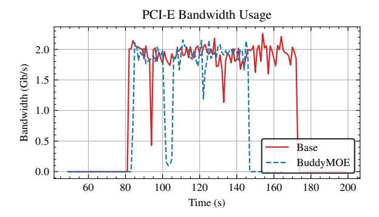

# 4 Implementation

To mitigate the significant latency incurred by swapping MoE layers between host and device memory, we propose a dynamic, post-processing mechanism termed *Buddy Expert Substitution*. This technique operates immediately after the gating network selects the *top-k* experts for each token. The core principle is to preemptively replace a selected expert that is not resident in GPU memory with a functionally similar "buddy" expert that is already cached on the device. This substitution avoids high-latency data transfers from the host, thereby maintaining computational throughput. Our approach integrates three key components: a pre-computed expert similarity profile, a substitution algorithm that preserves expert diversity, and a highly parallelized implementation designed for minimal overhead.

The foundation of our method is a static, pre-computed buddy profile that quantifies the functional similarity between all experts within each MoE layer. This profile, generated offline, establishes a ranked list of the most suitable substitutes for every expert in the model. The substitution logic, detailed in Algorithm 1, is executed for each token in the batch. For every expert assigned to a token, the algorithm first checks its GPU residency status using the boolean mask M. If an expert is not resident, a search for a substitute is initiated by iterating through its ranked list of buddies in the profile  $\mathcal{B}$ , up to a search limit H. A candidate buddy is deemed suitable only if it is resident on the GPU and is not already part of the token's active expert set,  $\mathcal{U}_t$ . Upon finding the first suitable buddy, the substitution is performed, the active expert set is updated, and the algorithm proceeds to the next expert for that token.

To ensure this substitution process introduces negligible latency, the entire logic is encapsulated within a custom CUDA kernel. The workload is partitioned across the GPU by assigning a dedicated CUDA thread block to manage the substitutions for a single token, and within each block, a distinct thread is assigned to each of the token's *top-k* experts. This structure enables concurrent evaluation and replacement. A critical challenge in this parallel design is efficiently enforcing the uniqueness constraint for substitutes (i.e., that  $b_{id} \notin \mathcal{U}_t$ ). We resolve this by employing block-level shared memory to maintain a record of the experts already assigned to the token. When a thread identifies a viable buddy, it uses an atomic compare-and-swap operation to claim that buddy expert, a lock-free mechanism that prevents race conditions where multiple threads might otherwise select the same substitute simultaneously. This GPU-native implementation ensures that the substitution logic is executed with high efficiency, effectively decoupling the MoE computation from I/O-bound expert swapping.

<span id="page-7-0"></span>**Algorithm 1** The Buddy Expert Substitution algorithm for a single MoE layer.

#### 1: Input:

- 2:  $S \in \mathbb{N}^{T \times K}$ : Matrix of selected expert indices for T tokens and K experts per token.
- 3:  $\mathcal{M} \in \{\text{true}, \text{false}\}^E$ : Boolean mask of GPU residency for E experts.
- 4:  $\mathcal{B} \in \mathbb{N}^{E \times R_{\text{max}}}$ : Pre-computed buddy profile, where  $\mathcal{B}[i,j]$  is the *j*-th best buddy for expert *i*.
- 5:  $H \in \mathbb{N}^+$ : Hyperparameter defining the maximum buddy search rank.

#### 6: Output:

```
7: S': The modified matrix of expert indices.
8: procedure BuddySubstitute(S, M, B, H)
9: S' ← S
10: for each token t from 1 to T do
11: Let Ut be the set of unique experts assigned to token t in S'.
```

```
for each expert rank k from 1 to K do
12:
                        e_{id} \leftarrow \mathcal{S}'[t,k]
13:
                        if \mathcal{M}[e_{id}] is false then
14:
                              for rank r from 1 to H do
15:
                                    b_{id} \leftarrow \mathcal{B}[e_{id}, r]
16:
                                    if \mathcal{M}[b_{id}] is true and b_{id} \notin \mathcal{U}_t then
17:
                                          S'[t,k] \leftarrow b_{id}
18:
                                          \mathcal{U}_t \leftarrow \mathcal{U}_t \cup \{b_{id}\}
19:
                                          break
20:
            return S'
21:
```

#### 5 Evaluation

This section presents a comprehensive evaluation of Buddy-MoE, a system designed to optimize MoE model inference in memory-constrained environments. We analyze how Buddy-MoE maintains model accuracy while improving inference throughput through strategic expert replacement based on co-activation patterns.

## 5.1 Experimental Setup

Model and Hardware Configuration. We evaluate Buddy-MoE using DeepSeek-V2-Lite, configured with 64 experts per MoE layer and a top-6 gating policy that activates six experts per token. This configuration represents a typical production deployment scenario for large-scale MoE models. Our experimental infrastructure consists of a single-node system equipped with an NVIDIA A100 GPU (PCIe interface) and an Intel Xeon Platinum 8457C processor. We intentionally use a single-GPU configuration with CPU offloading to evaluate performance characteristics relevant to resource-constrained deployment scenarios.

**Software Environment and Methodology.** We implement BuddyMoE within the llama.cpp framework, utilizing its CUDA backend for GPU kernel execution and native CPU

**Table 2.** Performance at cache rate c = 0.75

<span id="page-7-1"></span>

| Method   | τ    | $ \mathcal{B} $ | ρ | ARC-E | ARC-C | Avg / t/s            |
|----------|------|-----------------|---|-------|-------|----------------------|
| Original | -    | -               | _ | 0.81  | 0.66  | 0.735 / 34.23        |
| Random   | -    | _               | - | 0.62  | 0.48  | 0.55 / 39.67         |
| BuddyMoE | 0.75 | 4               | _ | 0.70  | 0.58  | 0.64 / 37.42         |
| BuddyMoE | 0.95 | 16              | _ | 0.62  | 0.43  | 0.525 / 37.12        |
| BuddyMoE | 0.95 | 16              | 3 | 0.76  | 0.63  | <b>0.695</b> / 36.75 |
| BuddyMoE | 0.95 | 16              | 4 | 0.60  | 0.48  | 0.54 / 38.50         |

offloading mechanisms for expert management. All experiments maintain default llama.cpp configurations for numerical precision, tokenization, and key-value caching to ensure reproducibility. Performance evaluation focuses on two primary metrics: model accuracy, measured using ARC-Easy and ARC-Challenge benchmarks (reported as individual scores and arithmetic mean), and inference throughput, measured in tokens per second including all system overheads from CPU-GPU transfers, routing decisions, and expert prefetching.

**System Parameters and Baselines.** BuddyMoE provides several parameters to control the accuracy-throughput tradeoff. The cache rate  $c \in \{0.375, 0.50, 0.75\}$  determines the fraction of experts retained in GPU memory. The co-activation frequency threshold (CFT)  $\tau$  controls buddy set construction, resulting in buddy set sizes  $|\mathcal{B}|$  typically ranging from 2 to 16 experts. The replacement budget  $\rho$  limits the maximum number of expert replacements per token, providing fine-grained control over the replacement strategy.

We compare BuddyMoE against two baseline approaches. The original baseline uses only true experts without replacement, representing maximum accuracy but potentially incurring prefetch-induced latency penalties. The random replacement baseline substitutes missing experts with uniformly selected GPU-resident experts, providing a naive comparison point for our co-activation-based strategy.

## 5.2 Performance Analysis

High Cache Rate Performance (c = 0.75): Table 2 presents performance characteristics when 75% of experts remain GPU-resident, representing a moderately constrained scenario. The original baseline achieves maximum accuracy of 0.735 with throughput of 34.23 tokens per second. Random replacement improves throughput to 39.67 t/s (Token Per Second) but severely degrades accuracy to 0.55, demonstrating the inadequacy of uninformed replacement strategies.

BuddyMoE demonstrates superior performance across multiple configurations. The optimal configuration ( $\tau = 0.95$ ,  $|\mathcal{B}| = 16$ ,  $\rho = 3$ ) achieves 0.695 average accuracy at 36.75 t/s. This represents only a 5.4% accuracy reduction compared to the original baseline while delivering 7.4% higher throughput.

Table 3. Performance at cache rate = 0.50

<span id="page-8-0"></span>

| Method   | 𝜏    | B  | 𝜌 | ARC-E | ARC-C | Avg / t/s     |
|----------|------|----|---|-------|-------|---------------|
|          |      |    |   |       |       |               |
| Original | –    | –  | – | –     | –     | – / 28.56     |
| Random   | –    | –  | – | 0.28  | 0.18  | 0.23 / 33.14  |
| BuddyMoE | 0.99 | 2  | – | 0.62  | 0.44  | 0.53 / 28.95  |
| BuddyMoE | 0.95 | 16 | – | 0.36  | 0.24  | 0.30 / 31.87  |
| BuddyMoE | 0.95 | 16 | 3 | 0.72  | 0.55  | 0.635 / 30.21 |
| BuddyMoE | 0.95 | 16 | 4 | 0.58  | 0.52  | 0.55 / 31.02  |

Table 4. Performance at cache rate = 0.375

<span id="page-8-1"></span>

| Method   | 𝜏    | B  | 𝜌 | ARC-E | ARC-C | Avg / t/s     |
|----------|------|----|---|-------|-------|---------------|
| Original | –    | –  | – | –     | –     | – / 24.78     |
| Random   | –    | –  | – | 0.14  | 0.18  | 0.16 / –      |
| BuddyMoE | 0.95 | 16 | – | 0.21  | 0.14  | 0.175 / 30.22 |
| BuddyMoE | 0.95 | 16 | 3 | 0.76  | 0.53  | 0.645 / 27.33 |
| BuddyMoE | 0.95 | 16 | 4 | 0.51  | 0.51  | 0.51 / 27.46  |

Importantly, this configuration maintains 26.4% higher accuracy than random replacement while achieving comparable throughput, validating our co-activation-based approach. Moderate Cache Rate Performance (c = 0.50): Table [3](#page-8-0) examines system behavior under increased memory pressure, with only 50% of experts retained in GPU memory. Random replacement catastrophically fails under these conditions, achieving only 0.23 average accuracy despite maintaining 33.14 t/s throughput, rendering the model effectively unusable.

BuddyMoE demonstrates good resilience under these constraints. The configuration with replacement budget = 3 achieves 0.635 average accuracy at 30.21 t/s, representing a 176% improvement over random replacement while maintaining competitive throughput. Smaller buddy sets (|B| = 2) with stricter CFT thresholds ( = 0.99) maintain reasonable accuracy (0.53) but incur modest throughput penalties, illustrating the trade-offs between buddy set size and replacement effectiveness.

## Extreme Memory Constraint Performance (c = 0.375):

Table [4](#page-8-1) evaluates performance under extreme memory constraints, with only 37.5% of experts GPU-resident. This scenario represents the practical limit of memory-constrained deployment. The original baseline achieves 24.78 t/s under these conditions, while random replacement produces unusable accuracy of 0.16.

BuddyMoE with = 3 maintains functional performance with 0.645 average accuracy at 27.33 t/s, achieving 10.3% higher throughput than the original baseline. This remarkable accuracy retention under severe memory constraints demonstrates the effectiveness of co-activation-based expert replacement. The system maintains usable model performance in scenarios where conventional approaches fail entirely.

<span id="page-8-2"></span>

Figure 8. A comparison of PCIe bandwidth trends for the Base and Buddy-MoE methods. The chart highlights the efficiency of the Buddy-MoE method, which uses 20% less bandwidth.

