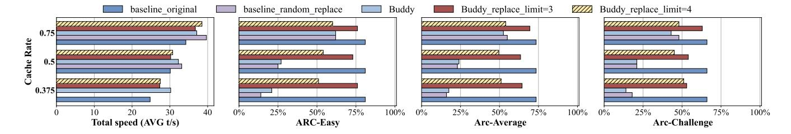

# 5.3 PCIe Bandwidth Usage

We tested the PCIe bandwidth for different methods of handling data prefetch failures. Our test measured how much data was sent over the PCIe bus. As shown in Figure [8](#page-8-2) a clear difference: the Base method used about 20% more PCIe bandwidth than the BuddyMoE method for PCIe reads. This is because the base method transfers missing data from the main computer memory, while the BuddyMoE method only looks for it in the GPU's own memory.

This difference in how they work shows a key advantage of the BuddyMoE method. By avoiding extra trips to the main memory, it creates less traffic and keeps the bandwidth use more stable. In short, for tasks that need to be fast and efficient, the buddymoe method is a better choice because it puts less strain on the system's main data bus.

## 5.4 Analysis of Expert Co-activation Structure

Figure [9](#page-9-0) visualizes the expert co-activation frequency matrix for Layer 1, revealing the structural patterns that enable effective buddy expert identification. The heatmap demonstrates highly non-uniform co-activation frequencies across expert pairs, with specific combinations showing significantly elevated joint activation rates.

These sparse, high-intensity patterns reveal strong functional relationships between specific expert pairs, validating our core hypothesis that certain experts exhibit sufficient functional similarity to serve as effective substitutes during inference. The non-uniform distribution of co-activation frequencies provides the statistical foundation for informed buddy selection, enabling replacement decisions that preserve model functionality while improving throughput. This structural analysis confirms that expert co-activation patterns encode meaningful functional relationships that can be exploited for efficient inference under memory constraints.

**Figure 9.** Expert co-activation frequency heatmap for Layer 1. Cell intensities represent the frequency with which expert pairs are jointly activated during token processing. The sparse distribution of high-intensity regions indicates strong functional relationships between specific expert pairs, providing the statistical foundation for buddy expert selection.

## 6 Related Work

Mixture-of-Experts Models. The MoE architecture scales language models by activating only a sparse subset of parameters per token. Shazeer et al. introduced the sparsely-gated MoE layer, where a gating network routes each input to a small subset of expert feed-forward networks instead of a dense layer [16]. Subsequent large-scale systems, such as Google's GShard [9] and the Switch Transformer [3], demonstrated the effectiveness of this idea at unprecedented scales. GShard combined conditional computation with automatic sharding and demonstrated MoE models beyond 600B parameters (and discussed scaling up to trillions). The Switch Transformer simplified gating to top-1 (a single expert per token) and achieved state-of-the-art results with up to ~1.6T parameters; a representative configuration (Switch-C) uses 2048 experts per layer across 15 layers—i.e., tens of thousands of experts across the network. These works showed MoEs can match or exceed dense models' quality while activating only a fraction of parameters, setting the stage for modern MoE LLMs (e.g., Mixtral, DeepSeek-MoE, Snowflake Arctic). However, the memory footprint of storing all experts remains a challenge at inference time for models with tens to hundreds of billions of total parameters.

Memory Offloading for Large Models. Memory offloading is a common technique to deploy large-scale models on hardware with constrained GPU memory. General-purpose systems like DeepSpeed's ZeRO-Infinity [15] and Hugging Face Accelerate [5, 6] offload coarse-grained model components such as entire layers to CPU memory or NVMe storage. MoE models, however, present a unique offloading challenge due to their fine-grained, dynamic expert activations. Systems must swap individual experts with low latency, making I/O management critical.

Research in this area has focused on two primary strategies: predictive prefetching and intelligent cache management. For prefetching, MoE-Infinity [19] traces historical expert usage to predict and load upcoming experts, aiming to hide data transfer latency. Similarly, Pre-gated MoE [7] integrates an auxiliary *pre-gate* into the model architecture to predict the next layer's expert needs one step ahead. For cache management, EdgeMoE [21] improves upon standard

LRU/LFU eviction policies by designing a heuristic that considers both activation frequency and layer index. It also reduces data transfer volume by applying expert-wise mixed-precision quantization. These works demonstrate that specialized, model-aware strategies are essential for minimizing I/O stalls in offloaded MoE inference.

Reducing Expert Loading Latency. Because on-demand expert loads can dominate end-to-end latency, several strategies aim to mitigate this bottleneck. Quantization and skipping. EdgeMoE uses expert-wise mixed-precision (e.g., assigning lower bit-width to less critical experts) to reduce memory and transfer cost with limited impact on accuracy [21]. AdapMoE adaptively limits the number of activated experts kbased on a sensitivity metric, integrating improved prefetching and caching; it reduces the average number of experts by  $\sim$ 25% and reports  $\sim$ 1.35× speedup without accuracy loss on edge platforms [24]. Dynamic expert pools. SwapMoE maintains a small set of high-value "virtual experts" in GPU memory and swaps others to CPU, showing reduced memory consumption (e.g., 14.2→4.7 GiB) and ~50% latency reduction on Switch Transformer benchmarks, while preserving quality [8]. Complementary to these, Fate uses cross-layer gate signals to prefetch next-layer experts and a shallowfavoring cache, reporting expert-hit rates ~99% and up to  $4.1 \times$  decoding speedups under offloading [2]. In parallel, Lu et al. study post-training expert pruning/skipping, finding that removing or skipping infrequently used experts often yields negligible loss on downstream tasks, reinforcing redundancy in large MoEs [14]. Overall, these methods leverage redundancy and variable expert importance to reduce effective model size or avoid expensive loads, trading negligible accuracy for large efficiency gains.

## 7 Conclusion

The rapid scaling of MoE models has created a deep tension between their computational sparsity and their memory density. Conventional offloading and prefetching systems treat this as a pure I/O optimization problem, striving for perfect prediction in an inherently unpredictable environment. This work proposes a paradigm shift. With BuddyMoE, we argue

that the redundancy in over-parameterized models is not just an inefficiency to be pruned, but a resource to be exploited for system resilience.

By substituting functionally equivalent experts at runtime, we reframe the costly penalty of a prefetch miss as a low-cost, on-the-fly model approximation. This principle of "runtime approximation for system performance" opens new avenues for co-designing LLM architectures and inference systems. Our results show that this approach is highly effective, drastically reducing latency with negligible accuracy loss. As models continue to outgrow hardware, embracing such controlled trade-offs will be essential for making their power accessible and efficient.

## References

- [1] DeepSeek-AI, Aixin Liu, Bei Feng, Bing Xue, Bingxuan Wang, Bochao Wu, Chengda Lu, Chenggang Zhao, Chengqi Deng, Chenyu Zhang, Chong Ruan, Damai Dai, Daya Guo, Dejian Yang, Deli Chen, Dongjie Ji, Erhang Li, Fangyun Lin, Fucong Dai, Fuli Luo, Guangbo Hao, Guanting Chen, Guowei Li, H. Zhang, Han Bao, Hanwei Xu, Haocheng Wang, Haowei Zhang, Honghui Ding, Huajian Xin, Huazuo Gao, Hui Li, Hui Qu, J. L. Cai, Jian Liang, Jianzhong Guo, Jiaqi Ni, Jiashi Li, Jiawei Wang, Jin Chen, Jingchang Chen, Jingyang Yuan, Junjie Qiu, Junlong Li, Junxiao Song, Kai Dong, Kai Hu, Kaige Gao, Kang Guan, Kexin Huang, Kuai Yu, Lean Wang, Lecong Zhang, Lei Xu, Leyi Xia, Liang Zhao, Litong Wang, Liyue Zhang, Meng Li, Miaojun Wang, Mingchuan Zhang, Minghua Zhang, Minghui Tang, Mingming Li, Ning Tian, Panpan Huang, Peiyi Wang, Peng Zhang, Qiancheng Wang, Qihao Zhu, Qinyu Chen, Qiushi Du, R. J. Chen, R. L. Jin, Ruigi Ge, Ruisong Zhang, Ruizhe Pan, Runji Wang, Runxin Xu, Ruoyu Zhang, Ruyi Chen, S. S. Li, Shanghao Lu, Shangyan Zhou, Shanhuang Chen, Shaoqing Wu, Shengfeng Ye, Shirong Ma, Shiyu Wang, Shuang Zhou, Shuiping Yu, Shunfeng Zhou, Shuting Pan, T. Wang, Tao Yun, Tian Pei, Tianyu Sun, W. L. Xiao, and Wangding Zeng. 2024. DeepSeek-V3 Technical Report. CoRR abs/2412.19437 (2024). arXiv:2412.19437 doi:10.48550/ARXIV.2412.19437
- [2] Zhiyuan Fang, Zicong Hong, Yuegui Huang, Yufeng Lyu, Wuhui Chen, Yue Yu, Fan Yu, and Zibin Zheng. 2025. Fate: Fast Edge Inference of Mixture-of-Experts Models via Cross-Layer Gate. arXiv:2502.12224 [cs.AI] https://arxiv.org/abs/2502.12224
- [3] William Fedus, Barret Zoph, and Noam Shazeer. 2022. Switch Transformers: Scaling to Trillion Parameter Models with Simple and Efficient Sparsity. arXiv:2101.03961 [cs.LG] https://arxiv.org/abs/2101.03961
- [4] Elias Frantar, Roberto L. Castro, Jiale Chen, Torsten Hoefler, and Dan Alistarh. 2024. MARLIN: Mixed-Precision Auto-Regressive Parallel Inference on Large Language Models. arXiv:2408.11743 [cs.LG] https://arxiv.org/abs/2408.11743
- [5] Hugging Face. 2025. Accelerate Documentation: Big Model Inference (CPU/Disk Offloading). https://huggingface.co/docs/accelerate/en/ usage\_guides/big\_modeling. Accessed: 2025-08-27.
- [6] Hugging Face. 2025. Accelerate Documentation: DeepSpeed Integration (ZeRO-Offload and ZeRO-Infinity). https://huggingface.co/docs/accelerate/en/usage\_guides/deepspeed. Accessed: 2025-08-27.
- [7] Ranggi Hwang, Jianyu Wei, Shijie Cao, Changho Hwang, Xiaohu Tang, Ting Cao, and Mao Yang. 2024. Pre-gated MoE: An Algorithm-System Co-Design for Fast and Scalable Mixture-of-Expert Inference. arXiv:2308.12066 [cs.LG] https://arxiv.org/abs/2308.12066
- [8] Rui Kong, Yuanchun Li, Qingtian Feng, Weijun Wang, Xiaozhou Ye, Ye Ouyang, Linghe Kong, and Yunxin Liu. 2024. SwapMoE: Serving Off-the-shelf MoE-based Large Language Models with Tunable Memory Budget. arXiv:2308.15030 [cs.AI] https://arxiv.org/abs/2308.15030

- [9] Dmitry Lepikhin, HyoukJoong Lee, Yuanzhong Xu, Dehao Chen, Orhan Firat, Yanping Huang, Maxim Krikun, Noam Shazeer, and Zhifeng Chen. 2020. GShard: Scaling Giant Models with Conditional Computation and Automatic Sharding. arXiv:2006.16668 [cs.CL] https://arxiv.org/abs/2006.16668
- [10] Yuhang Liang, Xinyi Li, Jie Ren, Ang Li, Bo Fang, and Jieyang Chen. 2025. ATTNChecker: Highly-Optimized Fault Tolerant Attention for Large Language Model Training. arXiv:2410.11720 [cs.DC] https://arxiv.org/abs/2410.11720
- [11] Junfeng Lin, Ziming Liu, Yang You, Jun Wang, Weihao Zhang, and Rong Zhao. 2025. WeiPipe: Weight Pipeline Parallelism for Communication-Effective Long-Context Large Model Training. 225–238. doi:10.1145/ 3710848.3710869
- [12] Weijian Liu, Mingzhen Li, Guangming Tan, and Weile Jia. 2025. Mario: Near Zero-cost Activation Checkpointing in Pipeline Parallelism. In Proceedings of the 30th ACM SIGPLAN Annual Symposium on Principles and Practice of Parallel Programming (Las Vegas, NV, USA) (PPoPP '25). Association for Computing Machinery, New York, NY, USA, 197–211. doi:10.1145/3710848.3710878
- [13] Zhengqing Liu, Musa Unal, Matthew J. Parkinson, and Marios Kogias. 2025. DORADD: Deterministic Parallel Execution in the Era of Microsecond-Scale Computing. In Proceedings of the 30th ACM SIG-PLAN Annual Symposium on Principles and Practice of Parallel Programming (Las Vegas, NV, USA) (PPoPP '25). Association for Computing Machinery, New York, NY, USA, 282–296. doi:10.1145/3710848.3710872
- [14] Xudong Lu, Qi Liu, Yuhui Xu, Aojun Zhou, Siyuan Huang, Bo Zhang, Junchi Yan, and Hongsheng Li. 2024. Not All Experts are Equal: Efficient Expert Pruning and Skipping for Mixture-of-Experts Large Language Models. arXiv:2402.14800 [cs.CL] https://arxiv.org/abs/2402. 14800
- [15] Samyam Rajbhandari, Olatunji Ruwase, Jeff Rasley, Shaden Smith, and Yuxiong He. 2021. ZeRO-Infinity: Breaking the GPU Memory Wall for Extreme Scale Deep Learning. arXiv:2104.07857 [cs.DC] https://arxiv.org/abs/2104.07857
- [16] Noam Shazeer, \*Azalia Mirhoseini, \*Krzysztof Maziarz, Andy Davis, Quoc Le, Geoffrey Hinton, and Jeff Dean. 2017. Outrageously Large Neural Networks: The Sparsely-Gated Mixture-of-Experts Layer. In International Conference on Learning Representations. https://openreview.net/forum?id=B1ckMDqlg
- [17] Baixi Sun, Weijin Liu, J. Gregory Pauloski, Jiannan Tian, Jinda Jia, Daoce Wang, Boyuan Zhang, Mingkai Zheng, Sheng Di, Sian Jin, Zhao Zhang, Xiaodong Yu, Kamil A. Iskra, Pete Beckman, Guangming Tan, and Dingwen Tao. 2025. COMPSO: Optimizing Gradient Compression for Distributed Training with Second-Order Optimizers. In Proceedings of the 30th ACM SIGPLAN Annual Symposium on Principles and Practice of Parallel Programming (Las Vegas, NV, USA) (PPoPP '25). Association for Computing Machinery, New York, NY, USA, 212–224. doi:10.1145/3710848.3710852
- [18] Hulin Wang, Yaqi Xia, Donglin Yang, Xiaobo Zhou, and Dazhao Cheng. 2025. Harnessing Inter-GPU Shared Memory for Seamless MoE Communication-Computation Fusion. In Proceedings of the 30th ACM SIGPLAN Annual Symposium on Principles and Practice of Parallel Programming (Las Vegas, NV, USA) (PPoPP '25). Association for Computing Machinery, New York, NY, USA, 170–182. doi:10.1145/3710848.3710868
- [19] Leyang Xue, Yao Fu, Zhan Lu, Luo Mai, and Mahesh Marina. 2025. MoE-Infinity: Efficient MoE Inference on Personal Machines with Sparsity-Aware Expert Cache. arXiv:2401.14361 [cs.LG] https://arxiv. org/abs/2401.14361
- [20] An Yang, Anfeng Li, Baosong Yang, Beichen Zhang, Binyuan Hui, Bo Zheng, Bowen Yu, Chang Gao, Chengen Huang, Chenxu Lv, Chujie Zheng, Dayiheng Liu, Fan Zhou, Fei Huang, Feng Hu, Hao Ge, Haoran Wei, Huan Lin, Jialong Tang, Jian Yang, Jianhong Tu, Jianwei Zhang, Jian Yang, Jiaxi Yang, Jingren Zhou, Junyang Lin, Kai Dang, Keqin Bao,

- Kexin Yang, Le Yu, Lianghao Deng, Mei Li, Mingfeng Xue, Mingze Li, Pei Zhang, Peng Wang, Qin Zhu, Rui Men, Ruize Gao, Shixuan Liu, Shuang Luo, Tianhao Li, Tianyi Tang, Wenbiao Yin, Xingzhang Ren, Xinyu Wang, Xinyu Zhang, Xuancheng Ren, Yang Fan, Yang Su, Yichang Zhang, Yinger Zhang, Yu Wan, Yuqiong Liu, Zekun Wang, Zeyu Cui, Zhenru Zhang, Zhipeng Zhou, and Zihan Qiu. 2025. Qwen3 Technical Report. *CoRR* abs/2505.09388 (2025). arXiv:2505.09388 doi:10. 48550/ARXIV.2505.09388
- [21] Rongjie Yi, Liwei Guo, Shiyun Wei, Ao Zhou, Shangguang Wang, and Mengwei Xu. 2025. EdgeMoE: Empowering Sparse Large Language Models on Mobile Devices. arXiv:2308.14352 [cs.LG] https://arxiv.org/abs/2308.14352
- [22] Yongkang Zhang, Haoxuan Yu, Chenxia Han, Cheng Wang, Baotong Lu, Yunzhe Li, Zhifeng Jiang, Yang Li, Xiaowen Chu, and Huaicheng Li. 2025. SGDRC: Software-Defined Dynamic Resource Control for

- Concurrent DNN Inference on NVIDIA GPUs. In Proceedings of the 30th ACM SIGPLAN Annual Symposium on Principles and Practice of Parallel Programming (PPoPP '25). ACM, 267–281. doi:10.1145/3710848.3710863
- [23] Runxin Zhong, Yuyang Jin, Chen Zhang, Kinman Lei, Shuangyu Li, and Jidong Zhai. 2025. FlashTensor: Optimizing Tensor Programs by Leveraging Fine-grained Tensor Property. In Proceedings of the 30th ACM SIGPLAN Annual Symposium on Principles and Practice of Parallel Programming (Las Vegas, NV, USA) (PPoPP '25). Association for Computing Machinery, New York, NY, USA, 183–196. doi:10.1145/3710848.3710864
- [24] Shuzhang Zhong, Ling Liang, Yuan Wang, Runsheng Wang, Ru Huang, and Meng Li. 2024. AdapMoE: Adaptive Sensitivity-based Expert Gating and Management for Efficient MoE Inference. In Proceedings of the 43rd IEEE/ACM International Conference on Computer-Aided Design (ICCAD '24). ACM, 1–9. doi:10.1145/3676536.3676741