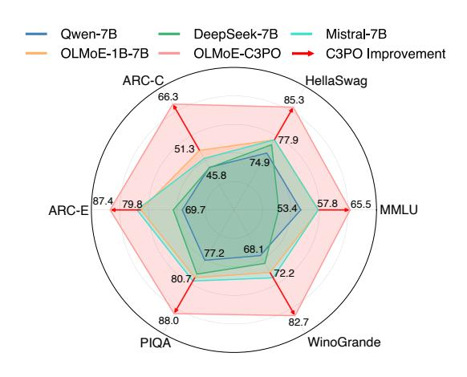
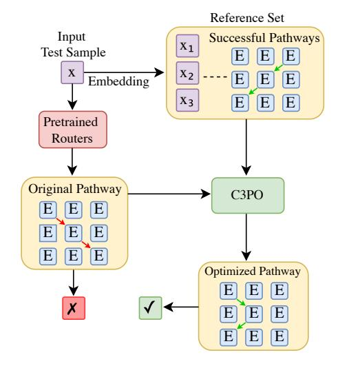
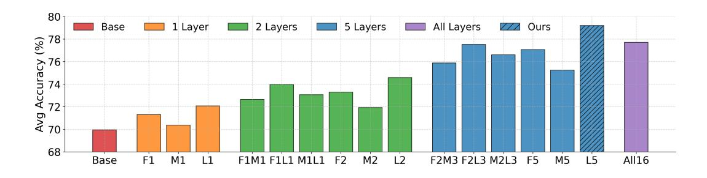
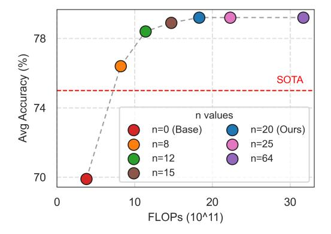
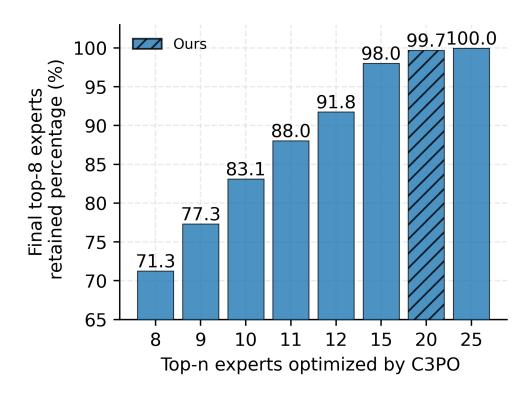

# 2 Related Work

MoE LLMs MoE architectures have been widely adopted in LLMs to improve efficiency and specialization [\(Shazeer et al.,](#page-10-3) [2017\)](#page-10-3). Recent works such as OLMoE [\(Muennighoff et al.,](#page-10-4) [2024\)](#page-10-4) and DeepSeekMoE [\(Dai et al.,](#page-9-2) [2024\)](#page-9-2) demonstrate the effectiveness of sparse MoE layers in reducing active parameters while maintaining model capacity. These models leverage token-choice routing to activate subsets of experts dynamically, enabling fine-grained specialization. The performance of MoE models heavily depends on expert selection mechanisms. Traditional routing strategies are trained end-to-end with the model [\(Fedus et al.,](#page-9-0) [2022;](#page-9-0) [Jiang et al.,](#page-10-5) [2024\)](#page-10-5), but our study reveals significant sub-optimality in these pathways.

Efficient Adaptation of LLMs Recent work has explored efficient adaptation of LLMs to downstream tasks with minimal computational overhead, aligning closely with our goal of efficient inference-time optimization. Among these approaches, In-Context Learning [\(Brown et al.,](#page-9-1) [2020\)](#page-9-1) appends task demonstrations to the input prompt to steer model behavior through attention mechanisms, avoiding weight updates but significantly increasing sequence length and memory requirements. Alternative methods like Prefix Tuning [\(Li & Liang,](#page-10-2) [2021\)](#page-10-2) prepend trainable vectors to transformer layers to guide model outputs, while Prompt Tuning [\(Lester et al.,](#page-10-1) [2021\)](#page-10-1) learns continuous or discrete prompt tokens through gradient updates to embedding parameters. While these methods share our objective of avoiding full parameter retraining, C3PO introduces two fundamental innovations. First,

Figure 1: Comparison of OLMoE-1B-7B (1B activated parameters) with C3PO against multiple 7B dense models across six benchmarks. C3PO improves OLMoE-1B-7B's accuracy by 7-15%, outperforming 7B models over all benchmarks, validating the efficiency of MoE architecture and C3PO's optimization effectiveness.

Figure 2: Pathway optimization in C3PO. For a test sample, C3PO retrieves successful pathways (green arrows) from similar samples in the reference set and adjusts the initial pathway (red arrow) based on them to achieve better prediction.

where existing techniques either modify model weights or substantially expand input length, our method preserves all original model parameters entirely while maintaining the standard input token budget. Second, rather than relying on static task-specific adaptations encoded through prompts or tuned parameters, we dynamically optimize routing weights for each test sample based on similarity to successful reference examples.

### 3 Methodology

MoE LLMs use routers to dynamically select and weight experts across layers, forming a specific pathway. However, these end-to-end trained routers often produce suboptimal pathways for challenging or out-of-distribution samples, which can significantly degrade the performance of MoE on diverse downstream tasks. The importance of expert pathways has been broadly demonstrated on six benchmarks in our experiments: There exists a substantial performance gap between the base model (using the default expert pathways) and the oracle (using the optimal expert pathways) as shown in Table 1, revealing the potential benefits of optimizing expert pathways during inference.

To address this limitation, Critical-Layer, Core-Expert, Collaborative Pathway Optimization (C3PO) introduces a dynamic test-time re-mixing mechanism that adapts the pathway matrices for each test sample based on similar samples in a **reference set**—a collection of samples on which the MoE LLM's outputs are correct or preferred. Specifically, given a reference set of m samples  $\{(x_i, y_i)\}_{i=1}^m$  and their corresponding expert pathway matrices  $\{\omega_i\}_{i=1}^m$  (where each  $\omega_i \in \mathbb{R}^{L \times E}$ , with L denoting the number of layers and E the number of experts) on which the model makes correct predictions (i.e.,  $f(x_i, \omega_i) = y_i$ ), for a new test sample x, the goal of C3PO is to find an improved expert pathway matrix  $\omega$  for x that leads to more accurate and higher-quality output  $f(x, \omega)$ .

#### 3.1 Gradient Descent

We iteratively update  $\omega$  using gradient descent:

$$\omega \leftarrow \omega - \lambda \nabla_{\omega} L(\omega), \tag{1}$$

where  $\lambda$  is the learning rate and  $L(\omega)$  is the objective function. Two variants are considered:

**Oracle (Upper Bound)** Assuming we know the ground truth label y for x, we set

$$L(\omega) = \ell(f(x,\omega), y), \tag{2}$$

where  $\ell(\cdot, \cdot)$  is the loss function (e.g., cross-entropy or L2 loss) measuring the discrepancy between model output  $f(x, \omega)$  and ground truth y. Although impractical to have the ground truth in real scenarios, this method provides a performance ceiling to reveal the degradation caused by sub-optimal expert pathways and evaluate the effectiveness of other methods.

**Neighborhood Gradient Descent (NGD)** Without the truth label y for x, we approximate the gradient of  $\omega$  by using the loss functions of the nearest neighbors of x in the reference set:

$$L(\omega) = \frac{\sum_{i \in \mathcal{N}(x)} K(x_i, x) \ell(f(x_i, \omega), y_i)}{\sum_{i \in \mathcal{N}(x)} K(x_i, x)},$$
(3)

where  $K(\cdot, \cdot)$  is the kernel function, e.g., Gaussian kernel, Matern kernel, etc. By leveraging loss information from the neighborhood of x, NGD establishes a test-time adaptation mechanism without accessing truth label y. This approach effectively aligns  $\omega$  with the successful expert pathways in the reference set.

### 3.2 Kernel Regression

Kernel regression estimates the optimal expert pathways by computing a weighted average of the neighbors' expert pathway matrices:

$$\hat{\omega} \triangleq \frac{\sum_{i \in \mathcal{N}(x)} K(x_i, x) \,\omega_i}{\sum_{i \in \mathcal{N}(x)} K(x_i, x)}.\tag{4}$$

Although setting  $\omega \leftarrow \hat{\omega}$  already improves performance in the experiments, we further refine the result by interpolating between the initial  $\omega$  and  $\hat{\omega}$ :

$$\omega \leftarrow \alpha \, \omega + (1 - \alpha) \, \hat{\omega}, \tag{5}$$

with the optimal  $\alpha$  chosen as

$$\alpha^* = \arg\min_{\alpha} L(\alpha \,\omega + (1 - \alpha) \,\hat{\omega}). \tag{6}$$

This refinement step balances the kernel regression estimate with the original expert pathway matrices.

#### 3.3 Mode Finding (Meanshift)

Mode finding shifts  $\omega$  toward the densest region of the mixing weight space to capture the most consistent routing patterns among neighbors. The update is performed as:

$$\omega \leftarrow \alpha \, \omega + (1 - \alpha) \, \bar{\omega}, \tag{7}$$

where the local average  $\bar{\omega}$  is computed in the  $\omega$ -space:

$$\bar{\omega} \triangleq \frac{\sum_{i \in \mathcal{N}(\omega)} K(\omega_i, \omega) \, \omega_i}{\sum_{i \in \mathcal{N}(\omega)} K(\omega_i, \omega)}.$$
(8)

Here,  $\mathcal{N}(\omega)$  denotes the neighborhood defined in the expert pathway matrices space.

### 3.4 Neighborhood and Embedding Space

**Neighborhood** The neighborhood  $\mathcal{N}(x)$  can be defined via kNN or  $\epsilon$ -ball:

$$\mathcal{N}(x) \triangleq \arg\min_{A \subseteq 2^m, |A| \le k} \sum_{i \in A} d(x_i, x), \tag{9}$$

$$\mathcal{N}(x) \triangleq \{ i \in [m] : d(x_i, x) \le \epsilon \}, \tag{10}$$

where  $d(\cdot, \cdot)$  is an appropriate distance metric.

**Embedding Space** Instead of applying  $K(\cdot, \cdot)$  and  $d(\cdot, \cdot)$  directly on the raw inputs  $x_i$  and x, we can replace x and  $x_i$  with their embedding E(x) and  $E(x_i)$ , where  $E(\cdot)$  is a pre-trained embedding model applied to the task description of each sample.

#### 3.5 Efficient Pathway Optimization

Given that pathway models consist of multiple layers with numerous experts per layer, optimizing all layers and experts can be computationally expensive. To mitigate this challenge, we investigate selective optimization strategies, focusing on critical layers and core experts to determine whether such targeted approaches can maintain or even enhance overall model performance. Our analysis is performed on OLMoE, optimizing only the routing weights of the last token, whose effectiveness is demonstrated in Section [4.3.](#page-6-1)

Critical Layers We first explore the role of critical layers by examining various layer-specific optimization strategies. Our experiments, as shown in Figure [3,](#page-4-0) systematically compare scenarios including optimization of early (F), middle (M), deep (L), and combinations of these layers. Our analysis, illustrated in Figure [3,](#page-4-0) reveals a clear hierarchy: optimizing more layers improves performance, but full-layer optimization (All16) is surprisingly inefficient. The last five layers (L5) yield the highest accuracy, outperforming both partial and full-layer optimization. This suggests that deeper layers are disproportionately responsible for refining task-specific representations, making full-layer updates computationally wasteful. Beyond the number of layers, layer positioning plays a pivotal role. A consistent pattern emerges: M1 < F1 < L1, M2 < F2 < L2, M5 < F5 < L5. Late layers contribute the most to performance, but early layers also have a greater impact than middle layers. This is likely because early layers encode fundamental feature representations, while deeper layers specialize in high-level semantic understanding. Middle layers, in contrast, appear to play a more transitional role with less direct influence on final predictions. These findings redefine optimization strategies. Instead of expending resources on full-layer updates, focusing on critical layers—specifically, the last five—delivers superior accuracy while significantly reducing computational overhead.

Figure 3: Analysis of critical layers in OLMoE (F: early layers, M: middle layers, L: late layers). Optimizing only the last five layers (L5) achieves the highest accuracy, outperforming full-layer optimization (All16) and partial combinations (e.g., F2L3).

Core Experts After identifying the critical layers, it is also important to determine which experts within these layers should be optimized for maximum efficiency. OLMoE activates only 8 out of 64 experts per inference step for each token, making selective optimization crucial. Figure [4](#page-5-0) illustrates the trade-off between accuracy and computational cost (FLOPs) as a function of the number of top experts (top-*n* experts before optimization) selected for optimization. Our experiments show that optimizing beyond the top-8 experts improves accuracy, with gains continuing up to the top-12 experts and stabilizing at the top-20. Notably, optimizing only the top-20 experts achieves the same performance as optimizing all 64, significantly reducing computational cost. Further analysis (Figure [5\)](#page-5-1) reveals that optimizing the top-8 experts captures 71.3% of the final top-8 experts identified after full optimization. Expanding to the top-20 ensures 99.8% alignment, effectively covering the optimal selection. Since the top-8 activated experts (determined post-optimization) are already included in the pre-optimization top-20, peak performance is maintained with far fewer experts requiring full optimization. In summary, focusing on the core experts—the top-20 experts per layer—strikes an optimal balance between efficiency and accuracy, minimizing computational overhead while preserving peak performance.

Figure 4: Accuracy-FLOPs Trade-off by changing the number of core experts (*n*) of OLMoE to optimize by C3PO. The accuracy achieves the greatest boosting at *n* = 8 and plateaus at *n* = 20, indicating 8-20 core experts suffices to retain most gain by pathway optimization.

Figure 5: Average percentage of the top-8 experts (*after optimizing all experts*) being retained in the top-*n* experts identified by pretrained router in OLMoE. The results indicate that selecting *n* ≥ 20 in advance can effectively cover almost all the 8 core experts contributing to performance.

