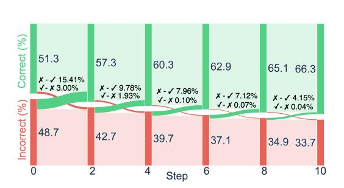
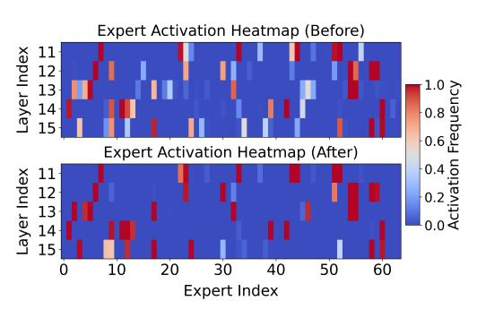

# 4 Experiment

### 4.1 Experimental Settings

Models We evaluate two recent MoE LLMs: OLMoE and DeepSeekMoE. OLMoE uses 16 transformer layers with 64 experts per layer, activating 8 experts per token. This design yields 6.9B total parameters, with 1.3B active per token. DeepSeekMoE features a 28-layer architecture that includes 2 shared experts and 64 routed experts per layer, activating all shared experts and 6 routed experts per token. This results in 16.4B total parameters and 2.8B active parameters per forward pass.

Evaluation benchmarks and reference sets We use a variety of benchmarks and reference sets across four key language model tasks. For general knowledge, we employ MMLU with BIG-Bench and SuperGLUE as references. For commonsense reasoning, we use HellaSwag and PIQA, along with CommonsenseQA and SocialIQA as references. Scientific question answering is assessed using ARC-C and ARC-E, with OpenBookQA and SciQ as references. For coreference resolution, we use WinoGrande with KnowRef as a reference. To prevent overlap, reference samples with a question similarity above 0.95 are removed during the *k*NN search. Further details are provided in Appendix [A.2.](#page-12-0)

Baselines We compare different variants of C3PO with both dense and MoE LLMs across various parameter scales, as shown in Tables [1](#page-6-0) and [2.](#page-7-0) Additionally, we compare with three adaptation techniques—In-Context Learning (ICL), Prefix Tuning, and Soft Prompt Tuning. For ICL, we retrieve similar reference samples based on embedding similarity and use them as few-shot demonstrations. In contrast, Prefix Tuning and Soft Prompt Tuning are trained on the full reference sets while keeping the base model frozen.

Evaluations We adopt zero-shot evaluation protocols, as our methods rely solely on external reference sets. The final performance is reported as the mean accuracy across all benchmarks.

### 4.2 Main Results

Comparison of different baselines and C3PO methods Table [1](#page-6-0) compares various methods for OLMoE and DeepSeekMoE across six benchmarks. Neighborhood Gradient Descent (NGD) consistently outperforms the base models and established baselines, achieving up to a 15.0% improvement on ARC-C for OLMoE and 10.8% for DeepSeekMoE. Although the Oracle (upper bound) represents

the theoretical maximum (requiring ground truth labels at inference), NGD attains 85–95% of this potential without such labels, highlighting its effectiveness in optimizing MoE routing weights.

Advantages of C3PO over State-of-the-Art models Table [2](#page-7-0) compares LLMs across six benchmarks, categorized by active parameter counts. Notably, OLMoE-C3PO, despite using only 1B active parameters, outperforms many larger models. Among all configurations, OLMoE-C3PO delivers the best overall performance, showcasing the efficiency of our approach in maintaining competitive performance while using fewer parameters. Additional details on the baseline models can be found in Appendix [A.3.](#page-13-0)

|                                                     | MMLU                 | HellaSwag            | ARC-C                | ARC-E                | PIQA                 | WinoGrande           | Avg                  |  |  |  |
|-----------------------------------------------------|----------------------|----------------------|----------------------|----------------------|----------------------|----------------------|----------------------|--|--|--|
| DeepSeekMoE                                         |                      |                      |                      |                      |                      |                      |                      |  |  |  |
| Base model                                          | 46.2                 | 78.0                 | 50.3                 | 73.8                 | 79.9                 | 70.1                 | 66.4                 |  |  |  |
| In-Context Learning Prefix Tuning Soft Prompt | 49.0 47.8 49.3 | 81.6 77.9 78.6 | 56.3 52.4 55.1 | 76.2 73.8 74.7 | 81.4 79.2 80.5 | 72.3 70.3 72.0 | 69.5 66.9 68.8 |  |  |  |
| Mode Finding Kernel Regression NGD            | 48.0 53.8 55.4 | 78.8 82.3 85.7 | 57.0 59.8 61.1 | 75.9 78.9 80.7 | 81.2 84.5 85.8 | 72.0 75.8 77.5 | 68.8 72.5 74.4 |  |  |  |
| Oracle (upper bound)                                | 63.8                 | 92.5                 | 70.8                 | 85.2                 | 90.3                 | 82.1                 | 80.8                 |  |  |  |
|                                                     |                      |                      | OLMoE                |                      |                      |                      |                      |  |  |  |
| Base model                                          | 57.8                 | 77.9                 | 51.3                 | 79.8                 | 80.7                 | 72.2                 | 69.9                 |  |  |  |
| In-Context Learning Prefix Tuning Soft Prompt | 60.3 59.3 59.7 | 80.6 78.2 79.5 | 58.1 54.5 55.9 | 82.5 80.4 81.3 | 83.6 82.1 82.4 | 76.8 73.5 74.1 | 73.7 71.3 72.2 |  |  |  |
| Mode Finding Kernel Regression NGD            | 58.9 63.1 65.5 | 79.1 82.0 85.3 | 57.8 64.6 66.3 | 81.8 84.7 87.4 | 82.4 86.6 88.0 | 74.3 80.2 82.7 | 72.4 76.9 79.2 |  |  |  |
| Oracle (upper bound)                                | 72.2                 | 91.5                 | 74.8                 | 91.4                 | 93.6                 | 87.7                 | 85.2                 |  |  |  |

Table 1: Accuracy (%) comparison of baseline models, three C3PO variants (mode finding, kernel regression, NGD), and test-time adaptation methods (ICL, prefix tuning) across six tasks. NGD improves DeepSeekMoE by 8.0% (66.4% → 74.4%) and OLMoE by 9.3% (69.9% → 79.2%), capturing around 93% of the Oracle (upper bound).

### 4.3 Ablation Study

We conduct an ablation study on OLMoE to dissect the core design choices in C3PO and their impact on performance. Specifically, we examine: (1) which tokens to optimize, (2) the effectiveness of different neighborhood selection strategies, and (3) the influence of key hyperparameters, including optimization steps and kernel function choices. Additional analyses can be found in Appendix [A.4.](#page-14-0)

Token optimization strategies Table [3](#page-7-1) summarizes how routing weight optimization at different token positions affects performance in C3PO. We evaluated modifications on the first, middle, and last tokens using one or three tokens. Optimizing only the last token achieves the highest accuracy (79.20%, a 9.25% improvement over the baseline), while expanding to three tokens lowers accuracy to 77.90%. This indicates that focusing on the final token is the most effective optimization strategy.

Neighborhood selection Table [4](#page-7-2) compares neighborhood selection strategies for routing weight optimization. Both the *ϵ*-neighborhood and *k*-Nearest Neighbors (*k*NN) methods improve upon the baseline, with *k*NN at *k* = 3 achieving the highest accuracy of 79.20% (+9.25%). Although the optimal *ϵ*-neighborhood setting is *ϵ* = 0.5, it still underperforms compared to *k*NN. These results suggest that a moderate number of neighbors optimally balances local adaptability and generalization.

|                                                           | MMLU      | HellaSwag | ARC-C | ARC-E | PIQA        | WinoGrande | Avg         |  |
|-----------------------------------------------------------|-----------|-----------|-------|-------|-------------|------------|-------------|--|
| LMs with $\sim$ 1B active pa                              | arameters |           |       |       |             |            |             |  |
| Pythia-1B                                                 | 23.1      | 45.1      | 26.2  | 48.1  | 68.7        | 52.3       | 43.9        |  |
| Llama3.2-1B                                               | 27.4      | 57.9      | 32.1  | 53.9  | 72.4        | 57.4       | 50.2        |  |
| OLMo-1B                                                   | 24.1      | 61.8      | 29.6  | 55.7  | <b>75.6</b> | 56.8       | 50.6        |  |
| TinyLyne-1B-7B                                            | 24.7      | 58.9      | 32.5  | 53.7  | 73.3        | 58.6       | 50.3        |  |
| LMs with $\sim$ 2-3B active                               | parameter | s         |       |       |             |            |             |  |
| OpenMoE-3B-9B                                             | 23.8      | 41.5      | 25.2  | 46.3  | 59.7        | 48.2       | 40.8        |  |
| StableLM-2B                                               | 31.6      | 65.1      | 37.2  | 67.2  | 76.1        | 62.6       | 56.6        |  |
| JetMoE-2B-9B                                              | 39.4      | 72.6      | 51.8  | 72.1  | 73.5        | 63.4       | 62.1        |  |
| Gemma2-3B                                                 | 43.7      | 66.3      | 58.4  | 75.2  | 71.8        | 64.5       | 63.3        |  |
| Qwen1.5-3B-14B                                            | 51.3      | 71.4      | 68.2  | 82.7  | 74.3        | 65.1       | 68.8        |  |
| LMs with $\sim$ 7-9B active                               | parameter | s         |       |       |             |            |             |  |
| Llama2-7B                                                 | 42.9      | 74.6      | 44.9  | 68.4  | 77.4        | 66.7       | 62.5        |  |
| Qwen-7B                                                   | 53.4      | 74.9      | 45.8  | 69.7  | 77.2        | 68.1       | 64.9        |  |
| Mistral-7B                                                | 59.6      | 81.0      | 53.8  | 79.6  | 82.2        | 74.0       | 71.7        |  |
| DeepSeek-7B                                               | 48.0      | 76.8      | 45.7  | 71.9  | 80.0        | 70.0       | 65.4        |  |
| Llama3.1-8B                                               | 57.7      | 77.9      | 48.7  | 80.8  | 81.4        | 73.5       | 70.0        |  |
| OLMo2-7B                                                  | 63.2      | 85.3      | 59.7  | 83.1  | 82.3        | 76.1       | <b>75.0</b> |  |
| Ours (LMs with $\sim$ 1B and $\sim$ 3B active parameters) |           |           |       |       |             |            |             |  |
| DeepSeekMoE-3B-16B                                        | 46.2      | 78.0      | 50.3  | 73.8  | 79.9        | 70.1       | 66.4        |  |
| DeepSeekMoE-C3PO                                          | 55.4      | 85.7      | 61.1  | 80.7  | 85.8        | 77.5       | 74.4        |  |
| OLMoE-1B-7B                                               | 57.8      | 77.9      | 51.3  | 79.8  | 80.7        | 72.2       | 69.9        |  |
| OLMoE-C3PO                                                | 65.5      | 85.3      | 66.3  | 87.4  | 88.0        | 82.7       | 79.2        |  |

Table 2: Models grouped by active parameters (1B, 2-3B, 7-9B) evaluated on six benchmarks. OLMoE-C3PO (1B active) achieves 79.2% average accuracy, outperforming most 7-9B dense models (e.g., Llama2-7B 62.5%, Mistral-7B 71.7%), demonstrating MoE+C3PO's efficiency.

| Model               | Avg (%)      |
|---------------------|--------------|
| Base model          | 69.95        |
| First 1 Token       | 74.45        |
| Middle 1 Token      | 71.40        |
| Last 1 Token (Ours) | <b>79.20</b> |
| First 3 Tokens      | 73.63        |
| Middle 3 Tokens     | 70.73        |
| Last 3 Tokens       | 77.90        |

Table 3: Optimizing pathways at token(s) of different positions (first/middle/last) and number (1 or 3 tokens) in OLMoE. Optimizing only the last token yields the best accuracy, while three-token C3PO degrades performance.

| Model                                                    | Avg (%)                        |
|----------------------------------------------------------|--------------------------------|
| Base model                                               | 69.95                          |
| $\epsilon = 0.3$ $\epsilon = 0.5$ $\epsilon = 0.7$ | 73.68 77.12 76.87        |
| k = 1 $k = 3  (Ours)$ $k = 5$                            | 75.28 <b>79.20</b> 77.70 |

Table 4: Comparison of  $\epsilon$ -ball and kNN neighborbood in C3PO on OLMoE. k=3 achieves the highest accuracy, proving moderate neighbor counts balance locality and generalization.

Figure 6: Impact of NGD optimization steps (xaxis) on OLMoE for ARC-C task accuracy for OLMoE. The first 6 steps yield an 11.6% gain (initial 51.3% → 62.9%), reaching 66.3% at Step 10. Only 5.1% of initially correct predictions flip, confirming stable and efficient convergence.

Figure 7: Heatmap comparison of expert activation frequency in OLMoE's last five layers for ARC-C (top: base model, right: C3POoptimized). Post-optimization, activations concentrate, focusing on high-frequency experts per layer (darker = higher usage), showing C3PO enhances expert specialization and reduces redundancy.

Step numbers Table [5](#page-8-1) demonstrates that the optimization step count significantly affects routing weight performance. Performance improves substantially from 3 to 10 steps (+2.5% between 3-5 steps alone), but plateaus thereafter. The minimal fluctuations at 20 and 50 steps suggest that 10 steps provide optimal balance between computational efficiency and accuracy.

| #Steps     | Avg (%) |
|------------|---------|
| Base model | 69.95   |
| 3          | 74.22   |
| 5          | 76.90   |
| 10 (Ours)  | 79.20   |
| 20         | 79.25   |
| 50         | 79.22   |

Table 5: Increasing NGD steps in C3PO improves the accuracy on OLMoE.

| Kernel                                            | Avg (%)                          |
|---------------------------------------------------|----------------------------------|
| Base model                                        | 69.95                            |
| Linear Polynomial Matern Gaussian (Ours) | 69.95 73.33 76.28 79.20 |

Table 6: Comparison of different kernel choices in C3PO on OLMoE.

Kernel choice Table [6](#page-8-2) compares kernel functions for NGD. The Gaussian kernel [\(Williams &](#page-11-0) [Rasmussen,](#page-11-0) [2006\)](#page-11-0) yields the highest average accuracy (79.20%, a +9.25% improvement over the base model), outperforming the Polynomial [\(Cortes,](#page-9-3) [1995\)](#page-9-3) (73.33%) and Matern [\(Williams & Rasmussen,](#page-11-0) [2006\)](#page-11-0) (76.28%) kernels. This indicates that the Gaussian kernel most effectively captures non-linear relationships in high-dimensional spaces, making it optimal for routing optimization.

#### 4.4 Understanding C3PO Optimization: Prediction Evolution and Expert Specialization

Prediction Evolution: How C3PO Improves Accuracy Over Optimization Step Figure [6](#page-8-3) tracks the progression of predictions over 10 NGD optimization steps on ARC-C. A sharp accuracy increase (+11.6%) occurs within the first 6 steps, reaching +15.0% by Step 10. Notably, only 5.1% of initially correct predictions become incorrect, suggesting that as optimization converges, adjustments to routing weights stabilize, leading to more refined improvements rather than disruptive changes. This demonstrates the effectiveness and stability of NGD optimization in enhancing MoE model performance.

Expert Specialization: How C3PO Refines MoE Routing Figure [7](#page-8-0) visualizes expert activation patterns in the last 5 layers before and after C3PO optimization. Initially, most experts remain underutilized, with only 12-20 experts being frequently activated. After optimization, activation becomes more concentrated, reinforcing specialization among highly utilized experts. This suggests that C3PO refines expert selection, enabling the model to make more efficient use of a subset of core experts rather than diffusing activation across many different experts. An example of how C3PO refines MoE routing can be found in Appendix [A.1.](#page-12-1)

