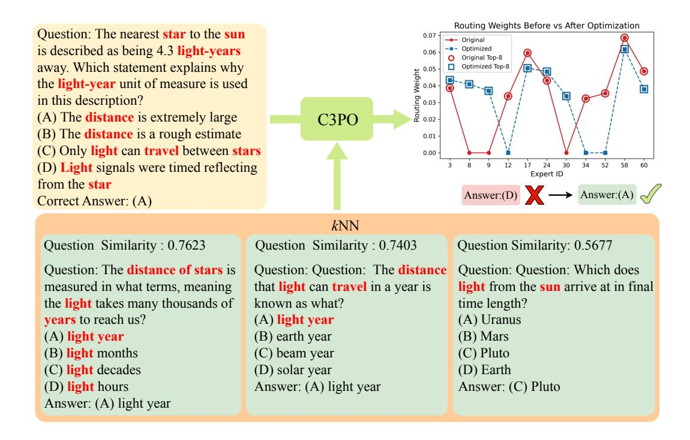

# A Appendix

#### A.1 Example Case

Figure 8: An example of how C3PO optimizes the expert routing weights. Here we only show the routing weights of the last1 layer. The polyline with red dots represents the original routing weights of the test sample, while the polyline with blue dots represents the optimized routing weights. C3PO optimizes the original routing weights by leveraging similar questions in the reference set, then changing the test sample's top-8 experts and their corresponding weights, eventually turning an incorrect answer into a correct one.

