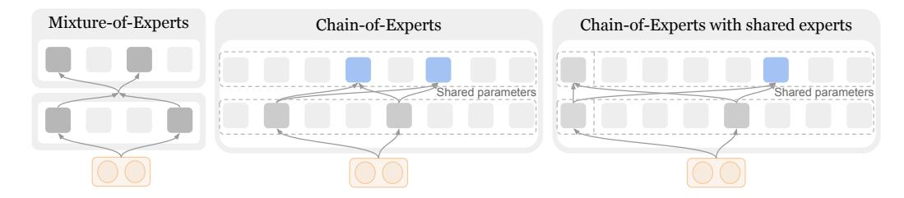
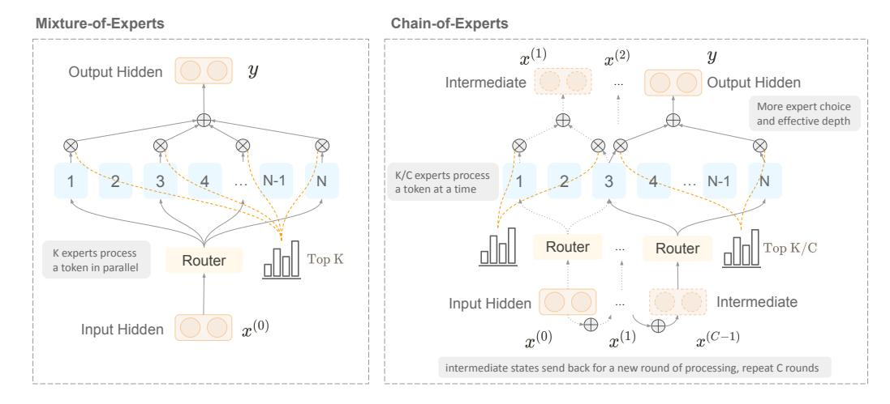
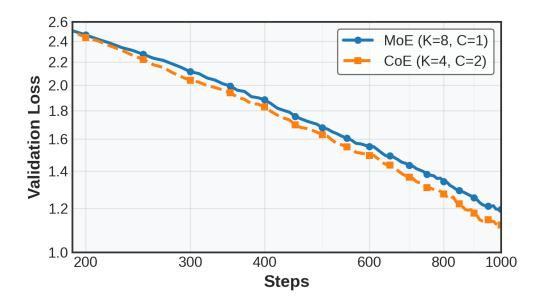
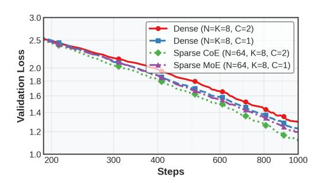
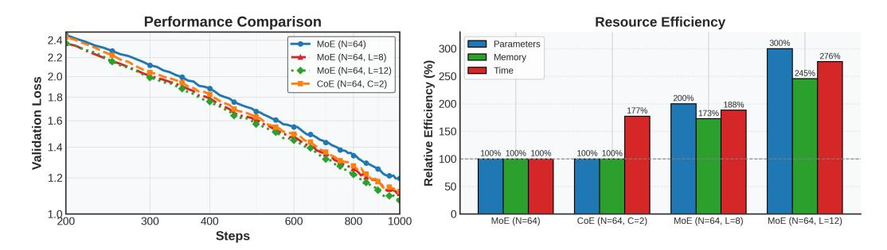
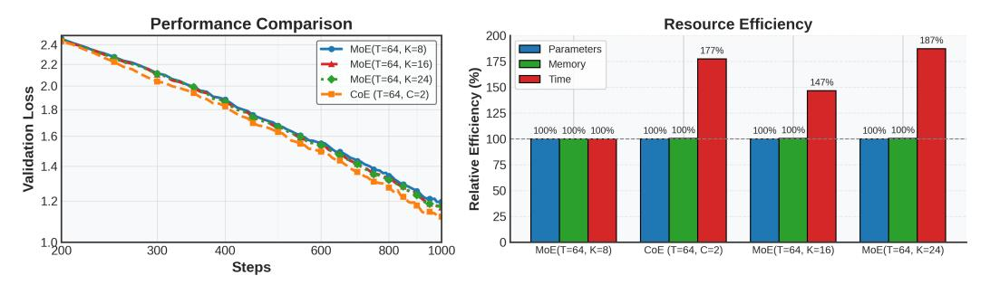
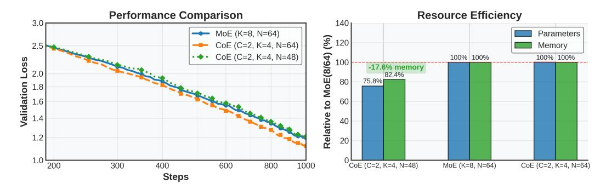
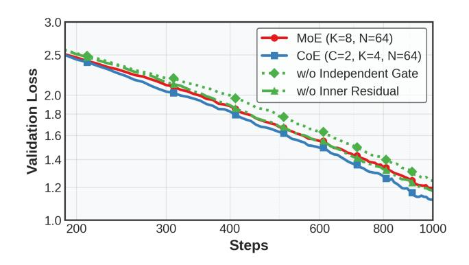
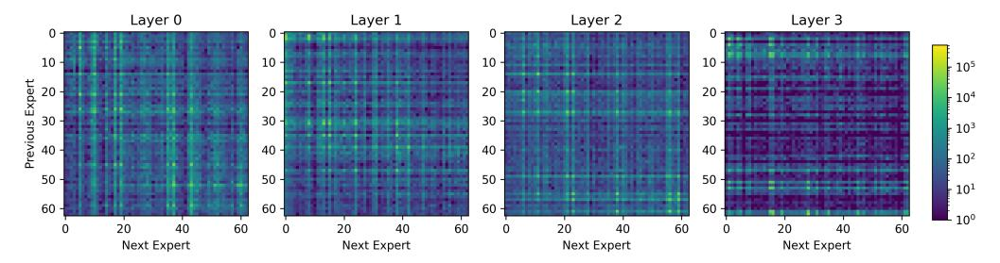

# 1 Introduction

Mixture-of-Experts (MoE) architectures have emerged as a dominant strategy for scaling large language models (LLMs), delivering significant gains in compute efficiency by sparsely activating a small subset of expert networks per input token [\[1,](#page-9-0) [2,](#page-9-1) [3,](#page-9-2) [4,](#page-9-3) [5\]](#page-9-4). This sparsity enables models to scale their parameter count independently from runtime cost, allowing for improved memory utilization and throughput during inference. Recent MoE systems have demonstrated strong empirical performance across a wide range of domains—including language [\[6,](#page-9-5) [7,](#page-10-0) [8,](#page-10-1) [9\]](#page-10-2), reasoning [\[10,](#page-10-3) [11\]](#page-10-4), and multimodal vision-language tasks [\[12,](#page-10-5) [13\]](#page-10-6).

Progress in MoE research has largely centered on scaling up expert capacity [\[14,](#page-10-7) [15\]](#page-10-8), improving routing algorithms [\[6,](#page-9-5) [16,](#page-10-9) [5\]](#page-9-4), and enhancing training stability [\[12\]](#page-10-5). These approaches often rely on a shared architectural assumption: *experts are conditionally and independently activated in parallel*, with no explicit interaction between them. While this design maximizes parallelism and system efficiency, it may also constrain the model's ability to exploit complementary reasoning patterns across

∗Equal contribution.

†Equal advising.

Figure 1: Comparison between Mixture-of-Experts (MoE) and Chain-of-Experts (CoE). Under the same model depth and parameters, CoE enables iterative expert communication to offer more flexible expert choice compared to MoE.

experts. As a result, existing MoE models could underutilize their available capacity, particularly for complex tasks that benefit from multi-expert coordination.

We challenge this independence assumption by introducing **Chain-of-Experts** (**CoE**) (Figure 1), a new MoE framework that enables *sequential communication* among intra-layer experts through iterative processing. While keeping the total number of experts used to process a token within a layer unchanged, CoE allows experts to process tokens in a "relay race" manner rather than independently: experts receive the intermediate representation from their predecessors, process it, and pass it to their successors, enabling richer expert composition and higher effective depth. Furthermore, sequential expert chains introduces a new scaling axis—*depth through iteration*—which could complement or even surpasses traditional scaling via width or layer depth.

In our experiments, under equivalent compute, CoE yields better performance (e.g., math validation loss drops from 1.20 to 1.12), higher efficiency (17.6–42% lower memory usage with comparable accuracy), and greater specialization (823× more effective expert combinations). These gains stem from a simple change: **iterative MoE layers with independent routing and residual connections at each iteration**. Our design is grounded in prior observations that experts often learn complementary roles and are highly specialized for different uses [17]. We empirically show that CoE consistently outperforms standard MoEs on reasoning-intensive tasks, particularly under compute-constrained regimes. We further analyze the impact of iteration count, gating design, and communication depth, offering a new lens on scaling modular language models efficiently.

### 2 Background: Mixture-of-Experts Transformers

We begin by formalizing the output computation of a standard Mixture-of-Experts (MoE) layer, a widely adopted mechanism to increase model capacity without a proportional increase in computation cost. In a typical Transformer architecture, certain Feed-Forward Network (FFN) sublayers are replaced by sparse MoE modules, where only a small subset of the available experts are activated per token.

Let  $x \in \mathbb{R}^d$  denote the input token embedding, and let  $\{E_i(\cdot)\}_{i=1}^N$  be a set of N expert networks, each structurally identical to a standard FFN. A gating function determines which  $K \ll N$  experts are selected for a given input, assigning a nonzero routing weight  $g_i$  to each selected expert. The output of the MoE layer is computed as:

$$y = \sum_{i=1}^{N} g_i \cdot E_i(x), \tag{1}$$

where the gating weights  $g_i$  are defined as:

$$g_i = \begin{cases} s_i, & s_i \in \text{TopK}(\{s_j\}_{j=1}^N, K), \\ 0, & \text{otherwise}, \end{cases} \quad \text{with} \quad s_i = \text{Softmax}(e_i^\top x). \tag{2}$$

Here,  $e_i \in \mathbb{R}^d$  is the router vector associated with the *i*-th expert. The dot product  $e_i^\top x$  measures the affinity between the input token and expert  $E_i$ . The TopK operator selects the K experts with the highest affinity scores, and the Softmax normalizes these scores over all experts. This gating

Figure 2: **Illustration of Chain-of-Experts.** MoE Top-K experts operate in parallel without interaction, CoE enables the same number of experts to process sequentially via intermediate representations, allowing deeper network processing with the same per-token expert processing. Residual connections are enabled and iteration-independent routers are used for more effective training.

mechanism ensures sparsity: only K experts are active per token, significantly reducing compute and memory usage.

Some recent MoE variants [18] introduce *shared experts* across all tokens or layers to improve generalization and parameter efficiency. In such cases, the MoE output is extended as follows:

$$y = \sum_{i=1}^{M} \hat{E}_i(x) + \sum_{i=1}^{N} g_i \cdot E_i(x),$$
(3)

where  $\{\hat{E}_i(\cdot)\}_{i=1}^M$  denotes a set of shared experts that are applied uniformly to all tokens, while  $\{E_i(\cdot)\}_{i=1}^N$  are sparsely gated token-specific experts. Together, these mechanisms define the standard MoE formulation used in many scalable Transformer-based language models [1,3,4,6]. Our work builds on top of this foundation but departs from the conventional parallel and independent expert structure by introducing sequential communication across selected experts.

## 3 Chain-of-Experts: Communicative Expert Processing

While standard MoE routes each token through a fixed set of experts in a single forward pass, this design inhibits communication across experts within each layer. Intuitively, a token might benefit from passing through multiple experts in sequence—allowing each to refine the representation conditioned on what others have already processed.

To capture this notion of iterative processing, we propose an expert chaining mechanism that processes tokens over C communication steps, named Chain-of-Experts (CoE), as an alternative of current MoE layers. As shown in Figure 2, different from MoE layers, the token is re-routed to a new set of experts, each seeing the hidden state produced in the previous step. Formally, given an input token embedding x, we initialize the first hidden state as:

$$x^{(0)} = x, (4)$$

Then, at each iteration  $t = 1, \dots, C$ , we compute the next hidden state as:

$$x^{(t)} = \sum_{i=1}^{N} g_{t,i} \cdot E_i(x^{(t-1)}) + \mathbb{I}_r \cdot x^{(t-1)}, \tag{5}$$

where  $E_i$  is the *i*-th expert and  $g_{t,i}$  is the gating weight at step t. The term  $\mathbb{I}_r \cdot x^{(t-1)}$  denotes a residual connection, which we include by setting  $\mathbb{I}_r = 1$ . This simple addition helps preserve

information and stabilizes updates across iterations. The output after C iterations is:

$$y = x^{(C)}. (6)$$

This formulation naturally introduces expert communication—each expert in round t builds on what was computed in round t-1. Instead of forcing all experts to work independently, the model learns to decompose reasoning across steps. To ensure computational cost remains comparable to standard MoE, we could select only K/C experts at each iteration.

**Iteration-based Independent Routing.** To enable tokens to reevaluate and make adaptive routing decisions based on progressively refined hidden states, we assign a separate router to each iteration. Specifically, the gating weight  $g_{t,i}$  is defined as:

$$g_{t,i} = \begin{cases} s_{t,i}, & s_{t,i} \in \text{TopK}(s_{t,j} \mid 1 \le j \le N, K/C) \\ 0, & \text{otherwise} \end{cases}, \tag{7}$$

where  $s_{t,i} = \text{Softmax}(e_{t,i}^{\top}x^{(t-1)})$ . This independent routing mechanism across iterations allows each step to adapt freely: experts engaged in later iterations can refine, reinterpret, or build upon the intermediate representations produced earlier, enabling a form of progressive, layered processing.

Our iterative framework transforms MoE from a shallowly parallel system into a sequential expert reasoning process, while preserving its sparsity and modularity. When aligning both depth and total expert parameters, CoE offers a richer set of expert combinations compared to standard MoE by enabling expert reuse. As illustrated in Figure 1, we compare a two-layer Transformer equipped with MoE, where each layer contains four experts and activates two per token. With CoE, under the same parameter budget, we can achieve comparable depth using only a single Transformer layer with two communication steps. This setup allows more diverse expert compositions without significantly increasing computational cost. It is worth noting that Universal Transformers [19], such as MoEUT [15], also adopt a form of parameter reuse, while occurring across different Transformer layers, whereas CoE reuses experts within the same layer.

### 4 Experimental Setup

#### 4.1 Dataset and Metrics

We conduct our experiments on the general open-domain SlimPajama [20] and the reasoning domain-specific MetaMathQA [21] datasets. We train models on them separately and jointly (1:1 proportion) to evaluate the effect of sequential expert communication across domains. To assess the generalization performance, we track validation loss during training to measure optimization efficiency and convergence speed, and evaluate zero-shot performance on four standard benchmarks which span reasoning and commonsense tasks, including ARC-E [22], HellaSwag [23] and PIQA [24], with (normalized or soft) answer accuracy1.

#### 4.2 Training Settings

Training is performed using the AdamW optimizer with a learning rate of 3e-4, weight decay of 0.01, and betas set to (0.9, 0.95). We use a linear learning rate schedule with 10% warmup. Models are trained using a batch size of 64 and a sequence length of 512. To stabilize training, we apply gradient clipping with a threshold of 1.0.

#### 4.3 Model Configuration

Our model is built upon the **DeepSeek-V2-Lite** [25] architecture, following the same design while scaling down to a smaller configuration with 544 million parameters (excluding embeddings) to facilitate faster convergence and enable efficient experimental validation. The transformer backbone comprises 4 layers, each with hidden size 1024 and 8 attention heads. All layers are configured as MoE layers with a total of 63 routed experts and 1 shared expert. For each token, the router selects 8 routed experts and the shared expert, and each expert has an intermediate size of 704. In our CoE setup, we apply 2 iterations of expert processing with inner residual connections and enable independent gating per iteration. This configuration ensures a fair comparison between traditional MoE and CoE under similar parameter budgets and architectural depth.

&lt;sup>1https://github.com/EleutherAI/lm-evaluation-harness/issues/1396

Table 1: General benchmark performance comparison between CoE and MoE. Under fixed expert compute across training sources, CoE (K=4, C=2) generally achieves better performance than MoE (K=8, C=1) on most settings, especially when trained and evaluated on mathematical reasoning datasets.

| Training Dataset  | Model        | ARC-E |       | HellaSwag |       | PIQA  |       |
|-------------------|--------------|-------|-------|-----------|-------|-------|-------|
|                   |              | Acc   | Norm  | Acc       | Norm  | Acc   | Norm  |
| SlimPajama        | MoE K=8, C=1 | 27.2% | 26.4% | 25.8%     | 25.1% | 52.9% | 51.0% |
|                   | CoE K=4, C=2 | 28.1% | 26.8% | 26.0%     | 25.1% | 53.1% | 51.1% |
| MetaMathQA        | MoE K=8, C=1 | 26.4% | 25.8% | 26.1%     | 26.0% | 54.6% | 52.3% |
|                   | CoE K=4, C=2 | 26.5% | 26.0% | 25.9%     | 26.3% | 54.5% | 51.4% |
| Combined Training | MoE K=8, C=1 | 26.4% | 28.0% | 26.5%     | 26.4% | 56.2% | 54.2% |
|                   | CoE K=4, C=2 | 27.7% | 28.2% | 26.5%     | 26.8% | 55.2% | 53.3% |

- (a) Validation loss with same expert budget. (b) Iteration effect under sparse and dense setting.

Figure 3: CoE reduces validation loss more effectively than MoE under equal expert compute, specifically in sparse settings. CoE (K=4, C=2) outperforms MoE (K=8, C=1) with the same per-token expert processing (left). The benefit is amplified in sparse routing, where communication fosters specialization, but diminishes in dense settings where all experts are active (right).

#### 4.4 System and Infrastructure

All experiments are implemented within PyTorch, and we also borrow the Fully-Sharded Data Parallel (FSDP) Trainers from the veRL framework[2](#page-0-0) [\[26\]](#page-11-2), extending them to support multi-round expert execution and fine-grained token-level logging. The full detailed experimental code will be opensourced soon. We conduct training on NVIDIA H100 GPUs, and each run completes within one GPU hour, enabling reproducibility without the need for large-scale compute infrastructure.

## 5 Experimental Results and Analysis

In this section, we discuss several research questions that guide our investigation into how CoE may enable more effective language modeling:

- 1. Section [5.1:](#page-5-0) under the same compute budget, can the *communicative token processing* mechanism enhance language modeling compared to parallel processing?
- 2. Section [5.2:](#page-5-1) when scaling up computation, can expert iteration could serve as a better scaling factor compared to existing factors, such as model depth, width, expert choice count?
- 3. Section [5.3:](#page-6-0) what design choices could make sequential expert processing effective?
- 4. Section [5.4:](#page-7-0) does the expert communication mechanism enable step-wise expert specialization?
- 5. Section [5.5:](#page-8-0) does chain-of-expert processing exhibit a theoretical advantage in combinatorics and representational flexibility that explains its improved efficiency?

We explore these questions in the following subsections below. We also investigate the effect of shared experts in the Supplementary.

2 <https://github.com/volcengine/verl>

Figure 4: Depth scaling comparison. CoE (C=2) with 4 layers matches the performance of deeper MoE models (L=8 or 12) with significantly lower memory and parameter usage.

Figure 5: Width scaling comparison. CoE (C=2) outperforms MoE variants with increased expert selection (K=16 or 24), while using similar resources.

#### 5.1 Communicative Processing can be Better than Parallel Processing in MoEs

We begin by discussing whether communicative processing could lead to better language modeling by setting a fixed expert-processing count at 8 per layer, adapting the communication steps C to explore whether models can benefit from expert communication. As shown in Figure [3a,](#page-4-0) CoE (C = 2, K = 4) consistently outperforms MoE (K = 8) with equal expert processing per token, reducing validation loss from 1.20 to 1.12 while exhibiting faster convergence. This advantage also generalizes beyond loss curves: as summarized in Table [1,](#page-4-1) CoE outperforms or achieves comparable performance as MoE on multiple downstream benchmarks across ARC-E, HellaSwag, PIQA. Due to the small model size, the comparison has not yet shown a significant gap, but it has already demonstrated the potential of CoE under different settings.

Interestingly, we find that CoE's advantage is primarily realized in sparse configurations. As shown in Figure [3b,](#page-4-0) when the model selects only a subset of experts per step (sparse routing), increasing the number of communication steps C leads to a noticeable improvement in validation loss. In contrast, under dense settings where all experts are always active (e.g., Total=K=8, C=2), iterative processing provides limited gain over one-shot routing. We hypothesize that this is because sparsity encourages expert specialization, allowing different iterations to focus on refining different token aspects. Without sparsity, the repeated processing simply deepens the computation path without introducing additional diversity, diminishing the benefit of communication. We further investigate this phenomenon in Section [5.4,](#page-7-0) where we show that different iteration lead to diverse expert sets.

#### 5.2 Expert Communication Steps can Serve as a Better Scaling Factor

To confirm the scaling effect of expert communication, we compare the communication step count (C) in CoE to conventional scaling dimensions in MoE architectures, such as network depth and expert selection width. Across three controlled experiments on the Math domain, we find that increasing communication steps in CoE can offer a more efficient scaling path, gaining comparable or better performance with lower memory and compute overhead.

(a) CoE can match deeper MoE with lower memory cost. To control for network depth, we fix the number of experts (N=8) and the number of experts selected per token (K=8), and scale the

Figure 6: Matched performance with fewer experts. CoE (N=48) achieves similar performance to MoE (N=64) while reducing memory usage by 17.6%.

number of transformer layers from 4 to 8 and 12. We compare these models to a 4-layer CoE model with C=2 expert communication steps. As shown in Figure [4,](#page-5-2) CoE achieves similar performance to MoE (L=12) while reducing memory usage by 42%. Unlike deeper MoE variants, CoE maintains constant parameter count and layer depth, reducing memory overhead with similar training time.

(b) CoE can outperform wider MoE under equal selection budget. We next scale the width of expert selection by varying the chosen experts each layer K from 8 to 16 and 24 in standard MoE, while keeping T=64 and L=4. In contrast, CoE retains K=8 but introduces communication (C=2). As shown in Figure [5,](#page-5-3) CoE achieves better convergence while consuming comparable memory and compute. This indicates that increasing C could be a more effective way to expand expert processing than simply increasing K.

(c) CoE delivers matched performance with fewer total experts. We further present that CoE can reduce the total number of experts while preserving performance. In Figure [6,](#page-6-1) CoE with C=2, K=4, and N=48 achieves similar validation loss to MoE with K=8 and N=64, but reduces memory usage by 17.6%. This demonstrates that CoE can achieve compute-efficient generalization by improving expert reuse instead of relying on scale alone.

Together, these results suggest that expert communication steps (C) in CoE offer a more efficient and scalable way to expand model capacity. Unlike traditional depth or width scaling which often increases memory footprint and compute cost, scaling C improves expert reuse and compositional depth without growing parameter count or memory usage.

### 5.3 Key Components Enabling Effective Sequential Expert Processing

To understand what makes sequential expert routing effective in CoE, we conduct an ablation study focusing on two key architectural choices: iteration-specific gating and inner residual connections. Both components are designed to improve expert compositionality and training stability. We compare ablated variants against standard CoE and a strong MoE baseline.

Iteration-specific gating enables per-step specialization. A central hypothesis of CoE is that each communication step should dynamically route tokens to different experts based on their evolving representation. To test this, we construct a variant that removes iteration-specific gating and instead reuses the same expert selection across all steps. Formally, the update rule becomes:

$$x^{(0)} = x,$$

$$x^{(t)} = \sum_{i=1}^{M} \hat{\mathbf{E}}_{i}(x^{(t-1)}) + \sum_{i=1}^{N} g_{i} \cdot \mathbf{E}_{i}(x^{(t-1)}) + \mathbb{I}_{r} \cdot x^{(t-1)}, \quad t = 1, \dots, C,$$

$$y = x^{(C)},$$
(8)

where the gating weights gi are fixed across iterations. This design removes the model's ability to condition expert routing on intermediate computation states.

Figure 7: Ablation study. Removing either iteration-specific gating or inner residuals significantly reduces performance. Both components are critical to the effectiveness of sequential expert routing in CoE.

As shown in Figure [7,](#page-7-1) this shared-gating variant significantly underperforms: its validation loss quickly plateaus around 1.5, worse than both standard CoE and the MoE baseline. These results highlight the importance of step-specific routing in CoE—without it, the model fails to leverage the compositional benefits of iterative reasoning.

Inner residuals stabilize multi-step refinement. We also investigate how residual connections should be applied across communication steps. In standard CoE, residuals are applied at each iteration—referred to as *inner residuals*—to support progressive token-wise refinement. An alternative design applies a single *outer residual* after all iterations, skipping intermediate feedback. Formally, this variant modifies the update rule as:

$$x^{(0)} = x,$$

$$x^{(t)} = \sum_{i=1}^{M} \hat{\mathbf{E}}_{i}(x^{(t-1)}) + \sum_{i=1}^{N} g_{t,i} \cdot \mathbf{E}_{i}(x^{(t-1)}), \quad t = 1, \dots, C,$$

$$y = x^{(C)} + x,$$

$$(9)$$

where only the final output receives residual feedback from the original input. As shown in Figure [7,](#page-7-1) this outer-residual-only design leads to slower convergence and higher final validation loss when trained on mathematical data. These results suggest that inner residuals play a key role in stabilizing multi-step reasoning, allowing more effective credit assignment and optimization along the iterative expert path.

Together, these results confirm that CoE's performance gains stem not only from multi-step routing, but also from the architectural mechanisms that support specialization via independent gating and stable refinement via inner residual connections.

#### 5.4 Co-activation Patterns Reveal Step-wise Expert Specialization

To further understand how communication steps affect routing behavior, we visualize the coactivation matrix between the two iterations of CoE. For each token routed to experts in iteration 0 and 1, we accumulate expert pair frequencies, resulting in a K × K co-activation matrix per layer. Figure [8](#page-8-1) shows the matrices across four layers trained and evaluated on MetaMathQA, and we present more settings for this expert co-activation in the Supplementary.

We observe that expert pairs are not uniformly distributed: each layer exhibits a diverse set of expert combinations across steps, suggesting that different iterations route to meaningfully different experts. This supports our hypothesis that CoE leverages iteration-specific gating to perform progressive, compositional refinement. Moreover, the sparsity and asymmetry of the co-activation matrices imply that the model is not simply repeating expert usage, but adapting routing based on intermediate representations.

Figure 8: Expert co-activation between communication steps. For each selected layer, we plot a matrix counting how often each expert pair (e0, e1) is activated across the two communication steps in CoE. The non-uniform, asymmetric patterns indicate that routing decisions differ meaningfully between steps, supporting the emergence of step-wise expert specialization.

Together with the results in Figure [7](#page-7-1) and Table [1,](#page-4-1) this analysis highlights that CoE achieves more than deeper computation—it enables structured multi-step specialization that standard MoE cannot capture.

#### 5.5 Theoretical Analysis: Combinatorial Flexibility and Effective Depth

We hypothesize the performance advantages of CoE could stem from two properties: combinatorial flexibility in expert selection and implicit depth expansion through expert communication. Conventional MoEs that select 2k experts in a single step, while CoE performs two separate top-k routing operations across iterations. This change increases the number of possible expert combinations from C(n, 2k) to C(n, k) 2 . For example, with n = 64 and k = 4, CoE leads to 823× more expert pairings than one-shot routing. It allows the model to encode a significantly more diverse set of expert interactions, which may improve its ability to route tokens in a more diverse manner.

In addition, CoE introduces iterative processing that deepens token representations over time. Since expert outputs from the first iteration influence routing in the second, the model applies distinct transformations across steps. A token may be refined by different experts or revisited by the same expert, enabling multi-pass representation refinement. This increases the model's effective depth without increasing parameter count or layer count. Recent analyses [\[27,](#page-11-3) [28,](#page-11-4) [29\]](#page-11-5) suggest that deeper internal computation pathways correlate with improved reasoning, particularly in math and logical inference. By enabling step-wise expert composition, CoE supports this depth-like refinement within a sparse, modular architecture.

