# A Extended Related Works

Mixture-of-Experts (MoE). MoE architectures extend neural capacity through conditional computation [\[30\]](#page-11-6), activating only a small subset of experts per input [\[1\]](#page-9-0). Modern MoE-based LLMs like Mixtral [\[10\]](#page-10-3) adopt top-2 routing across 8 feed-forward experts, reducing memory footprint during inference. This pattern enables models to scale parameter counts without increasing runtime cost. Several open models including DeepSeek [\[6,](#page-9-5) [25,](#page-11-1) [31,](#page-11-7) [32\]](#page-11-8), Phi-3.5 [\[7\]](#page-10-0), Qwen3 [\[9\]](#page-10-2), and Llama 4 [\[8\]](#page-10-1) demonstrate the practicality of MoE in production-grade systems. Complementary efforts such as OLMoE [\[11\]](#page-10-4) and Skywork [\[33\]](#page-11-9) also explore hybrid routing schemes and inference-time budget control.

Iterative Computation and Effective Depth. Iterative processing architectures offer an alternative scaling axis by reusing modules across time [\[34,](#page-11-10) [35,](#page-12-0) [36,](#page-12-1) [42\]](#page-12-7). Early work such as Schmidhuber [\[43\]](#page-12-8) and Hochreiter and Schmidhuber [\[44\]](#page-12-9) emphasized iteration (recurrence) as a means for structured memory and temporal abstraction. Modern models like Universal Transformers [\[19\]](#page-10-12) and Adaptive Computation Time (ACT) [\[37\]](#page-12-2) dynamically control depth through halting units, while ALBERT [\[38\]](#page-12-3) and Takase and Kiyono [\[45\]](#page-12-10) achieves parameter efficiency via cross-layer sharing. Implicit infinite-depth computation is enabled by deep equilibrium models (DEQ) [\[39\]](#page-12-4), and recent dynamic-depth strategies include early-exit [\[46\]](#page-12-11), LayerDrop [\[47\]](#page-12-12), and residual depth scaling [\[48\]](#page-12-13). More recently, latent-space recurrence has been explored as a lightweight mechanism for test-time refinement: Geiping et al. [\[29\]](#page-11-5) show that recursive hidden-state iteration improves math and logical reasoning. These methods internalize multi-step computation, in contrast to chain-of-thought prompting [\[40\]](#page-12-5). They also tend to be more compression-resilient [\[41\]](#page-12-6), consistent with findings on the robustness of recurrent representations [\[49,](#page-13-0) [50\]](#page-13-1).

Expert Reuse and Interaction. In addition to sparse activation, recent research focuses on improving expert utility through reuse and structural regularization. SparseUT [\[14\]](#page-10-7) and MoEUT [\[15\]](#page-10-8) integrate MoE into Universal Transformers, enabling both depth-sharing and expert reuse. MoEUT further unifies attention and FFN expert selection and adds normalization to stabilize cross-layer reuse. Layerwise recurrent MoE (RMoE) [\[16\]](#page-10-9) introduces a recurrent router state, enhancing contextaware routing decisions. DeepSeekMoE [\[6\]](#page-9-5) and OLMoE [\[11\]](#page-10-4) separates experts into global and token-routed groups to promote common feature sharing. However, these systems mostly adopt inter-layer sharing. Intra-layer expert communication remains relatively unexplored, opening opportunities for expert collaboration across time steps and interaction loops, an idea central to our Chain-of-Experts formulation.

## B Impact of Shared Experts

Our framework allows for flexible inclusion of shared experts across both CoE and MoE variants. To assess their utility, we conduct a controlled comparison using four configurations: CoE with and without a shared expert, and MoE with and without a shared expert. All these models are trained on the MetaMathQA dataset.

As shown in Table [2,](#page-15-0) introducing a shared expert leads to higher PIQA normalization scores. These gains are more pronounced in the smaller K=4, C=2 configuration, suggesting that shared experts help compensate for limited expert diversity by providing a stable backbone for generalization. On ARC-E and HellaSwag, however, performance remains largely similar, and in some cases models without shared experts slightly outperform their counterparts. It indicates that while shared experts can enhance performance on certain tasks, their benefit is not universal and may depend on task characteristics or expert routing depth.

## C Extended Training and Analysis

### C.1 Extending Training Steps

We extend training to 10,000 steps, 10% warmup to examine whether earlier conclusions hold under increased compute. Note that compute on MoE layers is approximately proportional to C × K,

Table 2: Impact of shared expert on CoE performance across benchmarks. Using a shared expert yields marginal gains on PIQA for both MoE and CoE, while overall performance remains comparable across settings with and without shared experts.

| Setting               | ARC-E |       | HellaSwag |       | PIQA  |       |
|-----------------------|-------|-------|-----------|-------|-------|-------|
|                       | Acc   | Norm  | Acc       | Norm  | Acc   | Norm  |
| MetaMathQA (1 shared) |       |       |           |       |       |       |
| K=4, C=2              | 26.5% | 26.0% | 25.9%     | 26.3% | 54.5% | 51.4% |
| K=8, C=1              | 26.4% | 25.8% | 26.1%     | 26.0% | 54.6% | 52.3% |
| MetaMathQA (0 shared) |       |       |           |       |       |       |
| K=4, C=2              | 27.1% | 25.6% | 26.5%     | 26.0% | 52.2% | 51.6% |
| K=8, C=1              | 26.7% | 25.0% | 26.2%     | 26.5% | 54.0% | 52.2% |

representing the total number of expert invocations per token per layer. As shown in Figures [9](#page-16-0) and [10,](#page-17-0) all models eventually converge, but the scaling behavior differs.

In both the MetaMathQA (Figure [9\)](#page-16-0) and the general-domain SlimPajama settings (Figure [10\)](#page-17-0), CoE with K=8, C=2 consistently achieves a lower final validation loss than MoE with K=8, C=1. It indicates that increasing C in CoE offers a notable scaling factor. Additionally, CoE with K=4, C=2 converges faster than MoE early in training, though its final loss is similar. It suggests that CoE benefits more from compute scaling, especially in the high-capacity regime, and that increasing C is an effective lever for improving convergence without increasing total parameters or GPU memory requirements.

### C.2 Extending Communication Steps

To further explore the scaling behavior of CoE, we extend the communication steps C beyond the previously studied C = 2. Figures [9](#page-16-0) and [10](#page-17-0) report validation loss curves under fixed K = 8 and increasing C ∈ {2, 3, 4}. While increasing C from 1 to 2 yields a clear improvement, further increasing C shows diminishing or unstable gains, especially on the MetaMathQA benchmark.

Although CoE (K = 8, C = 3/4) extends computation within a fixed parameter space, the performance only matches or slightly outperforms the baseline in early training, and the final convergence is less robust. It suggests that naive scaling of C may lead to inefficient communication or unstable optimization dynamics, and may require more training compute to converge. Efficiently extending the communication horizon remains an open challenge, and we leave the development of more principled techniques for more effective expert communication to future work.

#### C.3 Extended Analysis on Residual Connections

In addition to the residual strategy proposed in Section [5.3,](#page-6-0) we explore an alternative residual design inspired by [\[29\]](#page-11-5), where the initial representation is added as a residual at every iteration. Formally, the update rule is defined as:

$$x^{(0)} = x,$$

$$x^{(t)} = \sum_{i=1}^{M} \hat{\mathbf{E}}_{i}(x^{(t-1)}) + \sum_{i=1}^{N} g_{t,i} \cdot \mathbf{E}_{i}(x^{(t-1)}) + x^{(0)}, \quad t = 1, \dots, C,$$

$$y = x^{(C)}.$$
(10)

We compare this variant (denoted as *Init*) with two other designs: adding residuals from the previous iteration (*Inner*) and from a separate outer loop representation (*Outer*). All methods are trained for 1000 steps on the MetaMathQA dataset. The loss comparison is presented in Table [3.](#page-16-1)

These results suggest that residual connections must be carefully designed. While the *Init* method provides some improvement over the *Outer* strategy, it still underperforms compared to *Inner* residual we used, which we adopt as the default in all main experiments.

Table 3: Residual loss under different residual connection strategies.

|      | Inner Residual | Outer Residual | Init Residual |
|------|----------------|----------------|---------------|
| Loss | 1.12           | 1.21           | 1.18          |

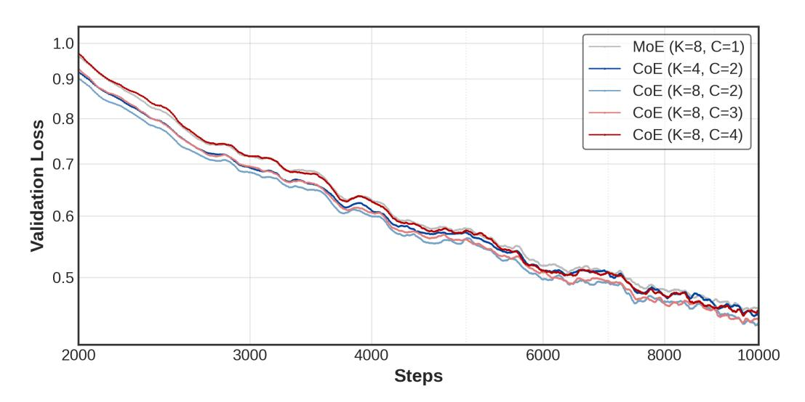

Figure 9: Validation loss on MetaMathQA across 10,000 steps.

## D Analysis of Expert Co-Activation Visualizations

Each visualization in Figures [11](#page-18-0)[–22](#page-20-0) consists of four heatmaps, corresponding to the four transformer layers in our model. These heatmaps characterize expert transition behaviors across CoE iterations. Specifically, each heatmap presents a two-dimensional expert-to-expert transition matrix, where the x-axis denotes the *Next Expert* (i.e., experts assigned in iteration t + 1), and the y-axis represents the *Previous Expert* (i.e., experts assigned in iteration t). The intensity of each cell reflects the normalized frequency that tokens, previously processed by a given expert, are routed to another expert in the subsequent iteration at the same layer.

#### D.1 Effect of Dataset on Expert Co-Activation Patterns

We observe a consistent trend across datasets: expert transitions in general-domain corpora (SlimPajama) are more evenly distributed, whereas transitions in domain-specific data (Meta-MathQA) tend to be more concentrated (*e.g.*, Figure [17](#page-19-0) vs. Figure [15\)](#page-19-1). It suggests that experts in general-domain settings engage in a richer and more diverse interaction pattern, potentially due to the broader range of linguistic phenomena. Interestingly, we also find that both SlimPajama and MetaMathQA exhibits increasing expert specialization in the final layers compared to the early layers, as evidenced by the emergence of dominant transition paths in the last one or two layers.

#### D.2 Temporal Dynamics of Expert Co-Activation During Training

On the general-domain dataset SlimPajama, we observe that expert transitions become progressively more concentrated as training proceeds—particularly in deeper layers such as layer 3 (*cf.* Figure [17](#page-19-0) vs. Figure [18\)](#page-19-2). As the model is exposed to more diverse textual patterns, it gradually converges on a smaller subset of routing pathways that are reused consistently. This is reflected visually in the heatmaps: bright regions grow brighter, and dark regions become darker, indicating increasing polarization in expert assignment. Such a trend suggests that the model is identifying persistent and efficient expert transitions that generalize across large-scale linguistic contexts. In effect, the routing structure simplifies over time—emphasizing a few highly specialized paths that dominate token flow in later layers.

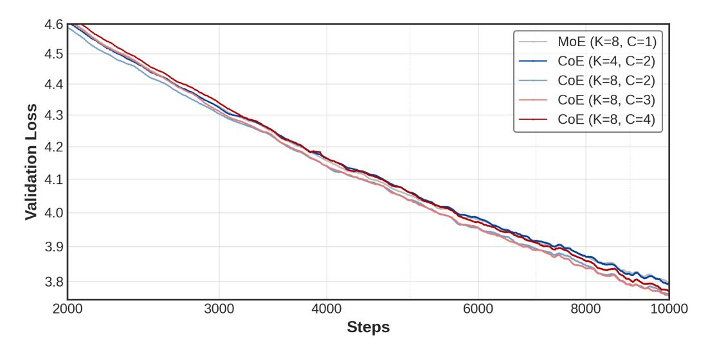

Figure 10: Validation loss on general-domain SlimPajama across 10,000 steps.

In contrast, on the more focused domain of MetaMathQA, expert transitions begin with a relatively narrow distribution—most tokens are routed similarly across iterations, resulting in sharp, localized activation patterns in early training (*cf.* Figure [15\)](#page-19-1). However, as training progresses, these patterns become more diffuse (*cf.* Figure [16\)](#page-19-3), reflecting a growing diversity in how tokens are routed across experts. This divergence likely arises because the model initially relies on uniform strategies when the domain is small and predictable, but later discovers the benefits of assigning different reasoning problems to different expert transitions. That is, instead of collapsing to fixed pipelines, the model in MetaMathQA explores increasingly differentiated expert flows as it learns to segment mathematical tasks by latent structure.

#### D.3 Intra-Layer Expert Flow and Role Differentiation

Within each layer, the diagonal intensity remains relatively low, indicating that experts tend not to reprocess tokens they previously handled. It affirms the flowing nature of CoE, where tokens are progressively transformed by distinct experts. However, we do observe a clear asymmetry between rows and columns in some matrices. Specifically, certain experts frequently act as entry points—handling more tokens in earlier iterations (brighter rows), while others serve as accumulators—processing aggregated representations in later iterations (brighter columns). This role differentiation is particularly pronounced on MetaMathQA (see Figure [20\)](#page-20-1), suggesting emergent task-driven specialization among experts.

### D.4 Comparison with MoE: Stability of Expert Usage

Unlike MoE, which often suffers from expert dropout or collapse in deeper layers during late training stages, CoE maintains robust expert utilization. Specifically, we find that in CoE, each expert tends to be predominantly used in either the first or second layer, but rarely vanishes entirely. This distribution alleviates the expert collapse issue observed in MoE [\[3\]](#page-9-2), i.e., the CoE routing scheme could naturally induce expert usage diversity and layer-specific specialization.

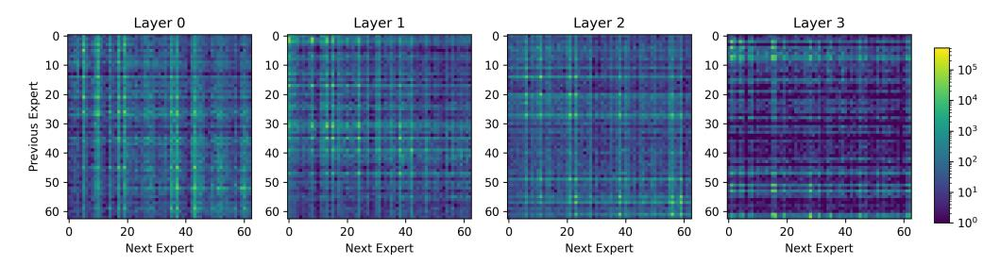

Figure 11: Layer-wise routing pattern on MetamathQA under the 4-experts-per-iteration, 2-iteration setup (2k training steps).

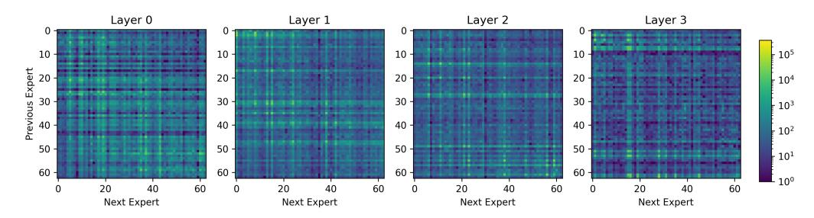

Figure 12: Layer-wise routing pattern on MetamathQA under the 4-experts-per-iteration, 2-iteration setup (10k training steps).

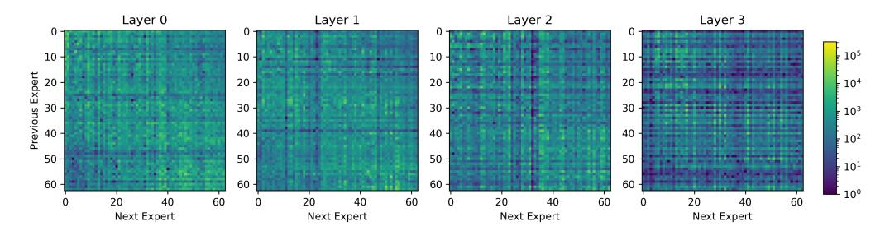

Figure 13: Layer-wise routing pattern on SlimPajama under the 4-experts-per-iteration, 2-iteration setup (2k training steps).

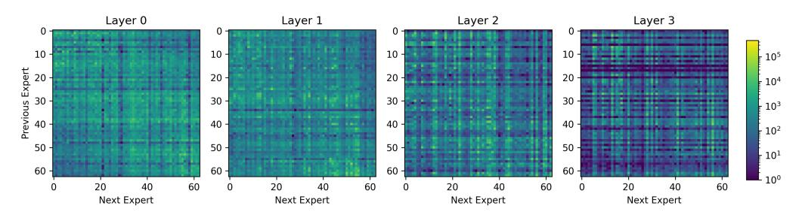

Figure 14: Layer-wise routing pattern on SlimPajama under the 4-experts-per-iteration, 2-iteration setup (10k training steps).

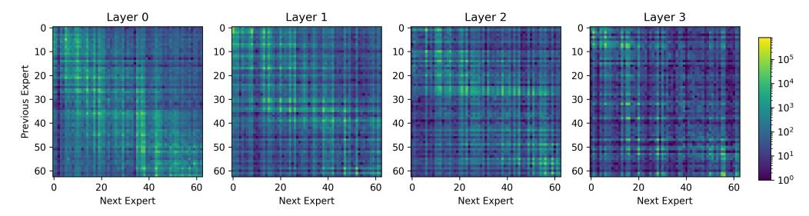

Figure 15: Layer-wise routing pattern on MetamathQA under the 8-experts-per-iteration, 2-iteration setup (2k training steps).

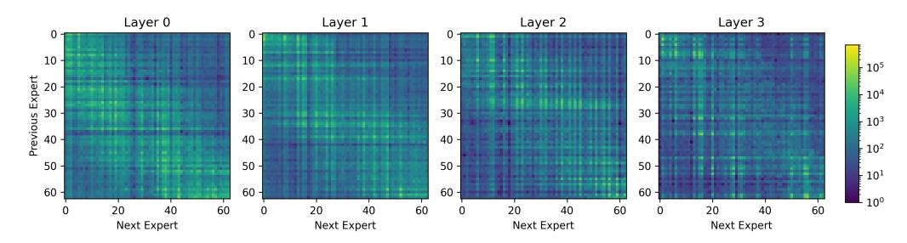

Figure 16: Layer-wise routing pattern on MetamathQA under the 8-experts-per-iteration, 2-iteration setup (10k training steps).

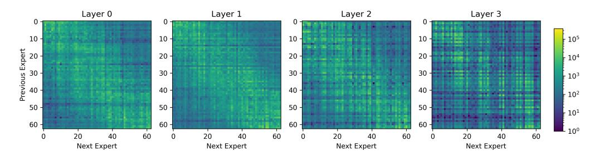

Figure 17: Layer-wise routing pattern on SlimPajama under the 8-experts-per-iteration, 2-iteration setup (2k training steps).

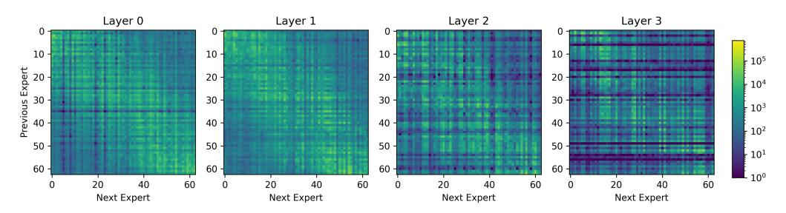

Figure 18: Layer-wise routing pattern on SlimPajama under the 8-experts-per-iteration, 2-iteration setup (10k training steps).

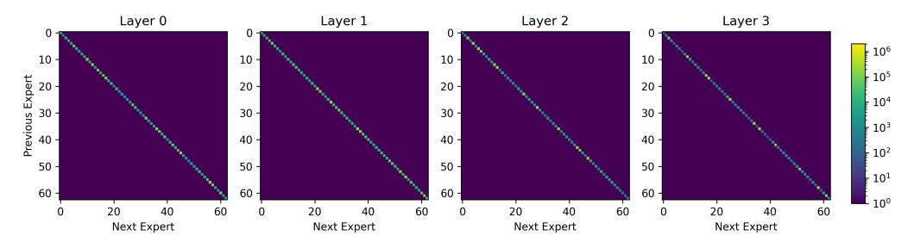

Figure 19: Layer-wise routing pattern on MetamathQA under the 8-experts-per-iteration, 1-iteration setup (2k training steps).

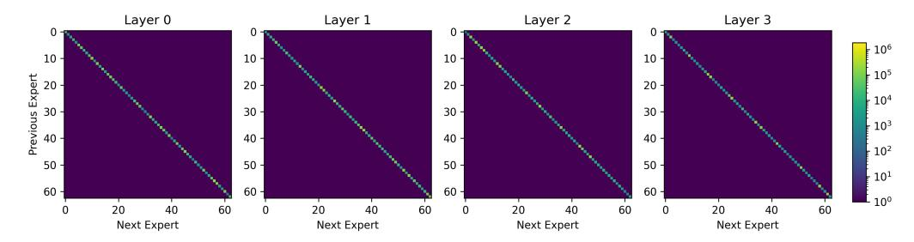

Figure 20: Layer-wise routing pattern on MetamathQA under the 8-experts-per-iteration, 1-iteration setup (10k training steps).

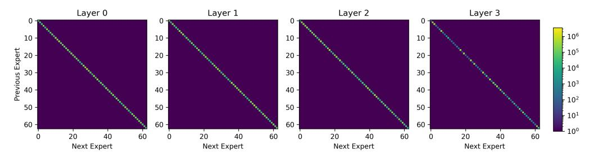

Figure 21: Layer-wise routing pattern on SlimPajama under the 8-experts-per-iteration, 1-iteration setup (2k training steps).

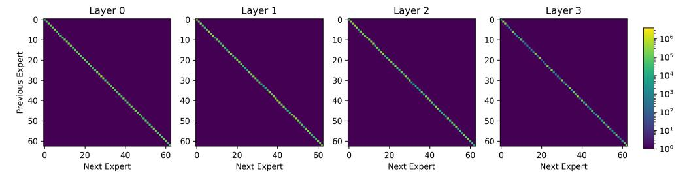

Figure 22: Layer-wise routing pattern on SlimPajama under the 8-experts-per-iteration, 1-iteration setup (10k training steps).