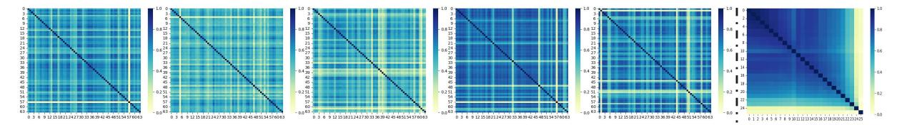

## Cluster-Driven Expert Pruning for Mixture-of-Experts Large Language Models

Hongcheng Guo1,\*, Juntao Yao2,\*, Boyang Wang1 , Junjia Du3 , Shaosheng Cao4,† , Donglin Di5 , Shun Zhang1 , Zhoujun Li1,†

1Beihang University, 2University of Washington, 3Nanyang Technological University, 4Xiaohongshu Inc. 5Tsinghua University

## Abstract

Mixture-of-Experts (MoE) architectures have emerged as a promising paradigm for scaling large language models (LLMs) with sparse activation of task-specific experts. Despite their computational efficiency during inference, the massive overall parameter footprint of MoE models (e.g., GPT-4) introduces critical challenges for practical deployment. Current pruning approaches often fail to address two inherent characteristics of MoE systems: 1).intralayer expert homogeneity where experts within the same MoE layer exhibit functional redundancy, and 2). inter-layer similarity patterns where deeper layers tend to contain progressively more homogeneous experts. To tackle these issues, we propose Cluster-driven Expert Pruning (C-PRUNE), a novel two-stage framework for adaptive task-specific compression of MoE LLMs. C-PRUNE operates through layerwise expert clustering, which groups functionally similar experts within each MoE layer using parameter similarity metrics, followed by global cluster pruning, which eliminates redundant clusters across all layers through a unified importance scoring mechanism that accounts for cross-layer homogeneity. We validate C-PRUNE through extensive experiments on multiple MoE models and benchmarks. The results demonstrate that C-PRUNE effectively reduces model size while outperforming existing MoE pruning methods [1](#page-0-0) .

## 1 Introduction

*"The true art of model compression is not merely reducing parameters, but preserving functionality while achieving efficiency."* – Inspired by Carl Jung

The Mixture-of-Experts (MoE) paradigm, first conceptualized in early modular networks [\(Cai](#page-6-0) [et al.,](#page-6-0) [2024\)](#page-6-0), has evolved into a cornerstone for scaling large language models (LLMs) through sparse expert activation. Initial implementations in RNNs [\(Shazeer et al.,](#page-7-0) [2017\)](#page-7-0) demonstrated its potential, while subsequent adaptations to Transformer architectures [\(Lepikhin et al.,](#page-7-1) [2020;](#page-7-1) [Muzio](#page-7-2) [et al.,](#page-7-2) [2024;](#page-7-2) [Lu et al.,](#page-7-3) [2024;](#page-7-3) [Guo et al.,](#page-6-1) [2024\)](#page-6-1) and decoder-only GPT variants [\(Zhu et al.,](#page-7-4) [2024;](#page-7-4) [Sun](#page-7-5) [et al.,](#page-7-5) [2024;](#page-7-5) [Jiang et al.,](#page-6-2) [2024\)](#page-6-2) have established MoE as a mainstream approach for balancing performance and computational cost. However, the exponential growth of MoE model parameters (e.g., trillion-scale models) creates a critical deployment paradox: while inference activates only subsets of experts, the full parameter footprint remains prohibitive for real-world applications.

Existing compression efforts face two fundamental limitations. First, while expert pruning has shown promise in specialized domains like machine translation [\(Zhang et al.,](#page-7-6) [2024a\)](#page-7-6)—where language-specific experts can be selectively removed [\(Zhang et al.,](#page-7-7) [2024b\)](#page-7-7)—these methods rely heavily on task-specific signals (e.g., gate activation statistics [\(Muzio et al.,](#page-7-2) [2024\)](#page-7-2)) or require costly retraining pipelines [\(Chen et al.,](#page-6-3) [2022\)](#page-6-3), making them impractical for general-purpose LLMs. Second, current approaches neglect the intrinsic structural properties of MoE models: I. Intra-layer homogeneity: Experts within the same layer frequently develop functional overlap due to training dynamics [\(Lin et al.,](#page-7-8) [2024\)](#page-7-8). II. Inter-layer similarity: Deeper layers exhibit progressively redundant expert patterns [\(Liu et al.,](#page-7-9) [2024\)](#page-7-9). As evidenced by recent analyses [\(Chen et al.,](#page-6-4) [2024;](#page-6-4) [Xue et al.,](#page-7-10) [2024\)](#page-7-10), this hierarchical redundancy renders conventional pruning strategies—which treat experts as independent units—both inefficient and performancedegrading, as shown in Figure [1.](#page-1-0)

To address these challenges, Building on insights

\*Equal contribution.

†Corresponding author.

1We provide code. [https://github.com/Fighoture/](https://github.com/Fighoture/MoE_unsupervised_pruning) [MoE\\_unsupervised\\_pruning](https://github.com/Fighoture/MoE_unsupervised_pruning)

Figure 1: Visualization of expert cosine similarity in DeepSeek-V2-Lite based on math subject samples. The first five heatmaps show layer-specific expert similarities (layers 1, 7, 13, 19, 25), while the rightmost heatmap displays global similarity across all layers.

from modular network analysis [\(Cai et al.,](#page-6-0) [2024\)](#page-6-0) and task-specific compression [\(Li et al.,](#page-7-11) [2024\)](#page-7-11), we propose Cluster-driven Expert Pruning (C-PRUNE), C-PRUNE leverages the inherent structure of MoE models through two key steps: (1) *Layer-wise Clustering*, which groups functionally similar experts within Homogeneity-aware layers using parameter space analysis, extending beyond simple activation counting [\(Zhang et al.,](#page-7-7) [2024b\)](#page-7-7); and (2) *Global Clustering Optimization*, which globally prunes redundant clusters across layers while preserving depth-specific functionality, overcoming the limitations of layer-isolated approaches in prior work [\(Fe](#page-6-5)[dus et al.,](#page-6-5) [2022\)](#page-6-5). By combining these strategies, C-PRUNE effectively reduces redundancy while preserving the task-specific functionality essential for maintaining strong model performance.

We validate C-PRUNE through extensive experiments on multiple MoE variants (e.g., DeepSeek-MoE) and benchmarks, demonstrating its effectiveness in achieving significant parameter reduction (25-35%) without compromising performance. Our results highlight that C-PRUNE outperforms existing pruning methods, particularly in lowcompression regimes, and provides insights into the depth-dependent homogeneity trends of MoE models. The key contributions include:

- The first self-adaptive systematic framework addressing both intra-layer and inter-layer redundancy in MoE LLMs, validated through theoretical analysis and empirical studies.
- A task-specific pruning methodology that outperforms task-agnostic approaches [\(Zhang](#page-7-6) [et al.,](#page-7-6) [2024a\)](#page-7-6), while maintaining generalizability.
- Empirical evidence proves the effect of C-PRUNE and challenges the assumption of layer-independent expert utility, revealing depth-dependent homogeneity trends.

## 2 Related Work

## 2.1 Mixture-of-Experts Models

First introduced in [\(Cai et al.,](#page-6-0) [2024;](#page-6-0) [Lin et al.,](#page-7-8) [2024;](#page-7-8) [Liu et al.,](#page-7-9) [2024\)](#page-7-9), a Mixture-of-Experts (MoE) model contains multiple separate networks, and each network processes a subset of the entire dataset. This separation can be viewed as a modular transformation of a multi-layer network. MoE structure is used for designing Recurrent Neural Networks (RNNs) in [\(Shazeer et al.,](#page-7-0) [2017\)](#page-7-0) and further extended to encoder-decoder Transformerbased models [\(Lepikhin et al.,](#page-7-1) [2020;](#page-7-1) [Muzio et al.,](#page-7-2) [2024;](#page-7-2) [Lu et al.,](#page-7-3) [2024\)](#page-7-3). With the recent development of decoder-only GPT family of models [\(Zhu](#page-7-4) [et al.,](#page-7-4) [2024;](#page-7-4) [Sun et al.,](#page-7-5) [2024;](#page-7-5) [Roberts,](#page-7-12) [2024;](#page-7-12) [Qorib](#page-7-13) [et al.,](#page-7-13) [2024\)](#page-7-13), MoE models based on this structure gain popularity [\(Jiang et al.,](#page-6-2) [2024\)](#page-6-2). In this paper, we focus on post-training expert pruning/skipping methodologies for MoE LLMs.

#### 2.2 Expert Pruning for MoE Models

Expert pruning within MoE models has garnered attention in the realm of Natural Language Processing [\(Chen et al.,](#page-6-4) [2024;](#page-6-4) [Xue et al.,](#page-7-10) [2024;](#page-7-10) [Li](#page-7-11) [et al.,](#page-7-11) [2024;](#page-7-11) [Cao et al.,](#page-6-6) [2015\)](#page-6-6), particularly in machine translation tasks [\(Zhang et al.,](#page-7-6) [2024a\)](#page-7-6). In these contexts, the translation of specific languages often renders the expertise of other language specialists superfluous. The most activated experts are reserved in [Zhang et al.](#page-7-7) [\(2024b\)](#page-7-7) to prune a machine translation MoE model, and [Muzio et al.](#page-7-2) [\(2024\)](#page-7-2); [Lu et al.](#page-7-3) [\(2024\)](#page-7-3) proposes expert pruning metrics based on gate statistics collected during decoding. Although these methods actively deal with expert pruning for MoE models, they are still limited to the machine translation domain with linguistic models. Researchers in [\(Chen et al.,](#page-6-3) [2022\)](#page-6-3) provide a dropping-while-training method that progressively drops the non-professional experts for target downstream tasks, and experiments are carried out on Switch Transformers models [\(Fedus](#page-6-5)

et al., 2022). However, in the LLM era, it is usually difficult to afford such a training paradigm (Yang et al., 2024; Chen and Varoquaux, 2024; Kumar, 2024).

## 3 Methodology

#### 3.1 Task Definition

The expert pruning task can be formulated as a multi-objective optimization problem:

$$\min_{\{\hat{\Theta}^l\}} \underbrace{\mathbb{E}_{(x,y)\sim\mathcal{D}}\mathcal{L}(\hat{\mathcal{M}}(x;\hat{\mathcal{F}}),y)}_{\text{Task Loss}} \\
+ \lambda_1 \underbrace{\sum_{l=1}^{L} \text{Sim}(\Theta^l \setminus \hat{\Theta}^l)}_{\text{Similarity Constraint}} \\
+ \lambda_2 \underbrace{\sum_{l=1}^{L} \|\hat{W}^l\|_{2,1}}_{\text{Sparsity Penalty}} \tag{1}$$

where  $\operatorname{Sim}(S) = \frac{1}{|S|^2} \sum_{i,j \in S} \rho_{ij}$  measures intra-set similarity, and  $\|\cdot\|_{2,1}$  enforces column-wise sparsity in routing matrices.

#### 3.2 Progressive Pruning Framework

Our method operates through two coordinated phases:

## **Phase 1: Layerwise Redundancy Reduction** For each MoE layer *l*:

$$\mathcal{L}_{l} = \underbrace{\mathbb{E}_{x} \left[ \|F^{l}(x) - \hat{F}^{l}(x)\|_{2} \right]}_{\text{Function Preservation}} + \gamma \underbrace{\sum_{i < j \in s^{l}} \rho_{ij}}_{\text{Redundancy Penalty}} + \beta \underbrace{\text{KL}(p_{\text{orig}}^{l}(y|x)\|p_{\text{pruned}}^{l}(y|x))}_{\text{Distribution Alignment}}$$
(2)

where  $s^l$  denotes experts scheduled for pruning in layer l.

