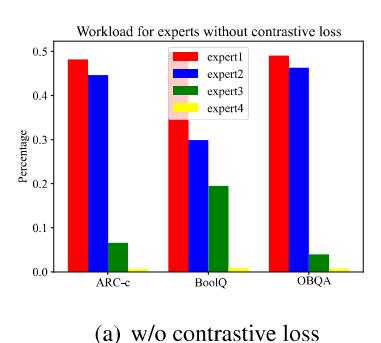
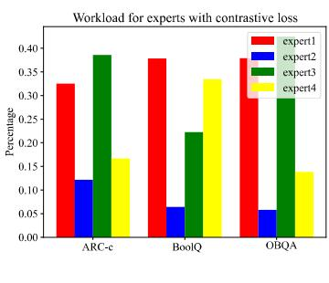
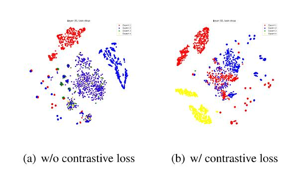

# 4.1 Motivation

As demonstrated in OMoE (Feng et al., 2025), the vanilla MoE variant lacks specialization and modularity, causing LoRA experts to collapse into similar distributions. The lack of specialization and redundant knowledge minimizes the utilization of capacity, which exacerbates performance degradation in heterogeneous tasks. Existing MoE variants (Li et al., 2024; Liu et al., 2023; Luo et al., 2024) leverage balance loss to promote specialization among the experts, but fall far short.

Ideally, experts should exhibit modularity and high specialization with minimal redundancy. To quantify these properties, we leverage MI, a basic concept in information theory, to evaluate the dependence between inputs and experts in MoE. An intuitive illustration of expert specialization is

Figure 2: Architecture of CoMoE. Activated experts  $e_i^t$ ,  $i \in \text{top2}$  in top-2 routing are selected as the query q and positive keys  $k^+$ , while inactivated experts  $e_i^t$ ,  $i \notin \text{top2}$  serve as negative keys  $k^-$ .

provided in Appendix K. Thus, we formalize the aforementioned idea using MI to quantify the specialization and redundancy between the experts in top-k routing:

- Maximizing the MI between inputs and activated experts: Promote activated experts to respond to inputs that highly match, thereby encouraging specialization. In addition, MI can serve as an information bottleneck that filters irrelevant noise.
- Minimizing the MI between inputs and inactivated experts: Suppress the response of inactivated experts to irrelevant inputs, thereby preventing multiple experts from learning similar representations.

#### 4.2 MI Gap for Top-k Routing

Building upon the motivation, we begin by defining an MI Gap for input token x and task experts set M in top-k routing. For simplicity, we denote  $I(\cdot;\cdot)$  as MI,  $H(\cdot)$  as Shannon entropy, and  $E_i(\cdot)$  as the network of expert i. Correspondingly, the representations of activated and inactivated experts are formulated as  $e^+ = E^+(x)$  and  $e^- = E^-(x)$ .

Given an input token, an ideal expert in MoE should retain specialized knowledge while discarding redundant knowledge with others. Intuitively, this equals the uncertainty reduction in the activated experts given the input token. We use p to denote the joint distribution as well as their associated marginals. Then the MI between the input token x and task experts set M is defined as:

$$I(x; M) = \mathbb{E}_{x, \mathcal{M} \sim \mathcal{D}} \left[ \log \frac{p(M|x)}{p(M)} \right]$$
 (4)

where p(M|x) and p(M) follow empirical distributions according to the existing input and output dataset  $\mathcal{D}$ . Then, we establish a lower bound for I(x; M) to convert it to the MI between x and the expert representation e = E(x):

$$I(x; M) = \mathbb{E}_{x, \mathcal{M}} \left[ \log \frac{p(x \mid M)}{p(x)} \right]$$

$$= \mathbb{E}_{x, \mathcal{M}} \left[ \log \int_{e} \frac{p(x \mid e)p(e \mid M)}{p(x)} de \right]$$

$$= \mathbb{E}_{x, \mathcal{M}} \left[ \log \mathbb{E}_{e} \frac{p(x \mid e)}{p(x)} \right]$$

$$= \mathbb{E}_{x, \mathcal{M}} \left[ \log \mathbb{E}_{e} \frac{p(e \mid x)}{p(e)} \right],$$
(5)

where  $p(e \mid x)$  can be approximated by the expert network E(x). Since  $\log(\cdot)$  is a convex function, Jensen's inequality yields the theoretical lower bound of I(x; M):

$$I(x; M) \ge \mathbb{E}_{x,e,\mathcal{M}} \left[ \log \frac{p(e \mid x)}{p(e)} \right].$$
 (6)

In the top-k routing, the input token x and the expert representation e form samples (x,e), which can be categorized into two different datasets:  $(x,e^+) \sim \mathcal{D}_{\text{top-k}}$ , samples from the activated experts; and  $(x,e^-) \sim \mathcal{D}_{\neg \text{top-k}}$ , samples from the inactivated experts. For clarity, we denote  $M^+$  as the activated task experts and  $M^-$  as the inactivated. Then, we define the MI gap for top-k routing as:

**Definition 1** *MI Gap for activated experts and inactivated experts in top-k routing is defined by:* 

$$\Delta I = I_{top-k}(x, M^{+}) - I_{\neg top-k}(x, M^{-}),$$
 (7)

where Iiop-¢ is the MI between input token x and activated experts M\*, and I-top-¢ is the MI between input token x and inactivated experts M~.

The MI terms Jtop-« and [-top-« can be converted into a similar form as Eq. 5. To maximize the MI gap AT, it is necessary to maximize the MI between x and the activated task experts M+ while minimizing the MI between x and M/~. When the experts exhibit high specialization, each expert only yields high mutual information for specific token subsets. Concurrently, when knowledge redundancy among the experts is minimized, the mutual information between tokens and inactivated experts approaches zero.

### 4.3 Contrastive Representation for MI Gap

To estimate the MI gap, Eq. 6 provides a lower bound for the MI between input token x and task experts M. In practice, p(e|x)/p(e) cannot be calculated directly, thus we use two score functions h;(-) and h2(-) to measure the information density ratio, which preserves the MI between x and e for the activated and inactivated experts, respectively. Let hi(x,et) x p(et|x)/p(et) and ho(x,e~) x p(e|x)/p(e~ ). Then, we adopt contrastive learning to estimate the MI gap.

Instead of estimating Jtop-« and J-top-k Separately, we simplify the learning process by establishing a single contrastive objective to estimate AI. Specifically, we define the samples (x, e+) from the activated experts in Djop-k aS positive samples. And the negative samples are sampled from the inactivated experts in D\_top-k. The loss function of contrastive learning can be formulated as:

$$\mathcal{L}_{\text{NCE}} = -\mathbb{E}_{p(x,e^{+})} \mathbb{E}_{\mathcal{D}_{\neg \text{top-k}}} \left[ \log \frac{h_{1}(x,e^{+})}{h_{1}(x,e^{+}) + \sum_{e^{-} \in \mathcal{D}_{\neg \text{top-k}}} h_{2}(x,e^{-})} \right]. \tag{8}$$

Intuitively, the score function quantifies the exponential correlation between input token x and expert representation e, assigning higher scores to positive samples and lower scores otherwise. The following theorem shows that the proposed contrastive objective can serve as an estimation for the MI gap with sufficient negative samples.

Theorem 1 (InfoNCE). The MI gap AI = Lrop-x(@, €\*) — T-top-k(, €~ ) can be lower bounded by the contrastive objective, as follows:

$$\Delta I \ge \log(N) - \mathcal{L}_{\text{NCE}},$$
 (9)

where N is the number of negative samples from the inactivated experts.

Ince = log(NV) — £nce approximates the true MI gap as N increases, which is a tight lower bound. Please refer to Appendix A for full derivations.

To optimize the contrastive objective in Eq. 8, hy(-) and hg(-) are adopted to estimate the information density. Ideally, h1(-) assigns high scores only to positive samples (x, e\*), and h2(-) assigns low scores only to negative samples (x, e~ ). Coincidentally, (x,e~) ~ D-top-k can serve as negative samples for the scoring function h(-), while (x,e\*) ~ Dtop-k functions as positive samples for ho(-), establishing a synergistic relationship between them. Thus, we integrate h1(-) and ho(-) into a single function h(-), which assigns high scores to (2, e+) and low scores to (x, e~ ). Then, we can simplify Eq. 8 into a new version:

$$\hat{\mathcal{L}}_{\text{NCE}} = -\mathbb{E}_{p(x,e^{+})} \mathbb{E}_{\mathcal{D}_{\neg \text{top-k}}} \left[ \log \frac{h(x,e^{+})}{h(x,e^{+}) + \sum_{e^{-} \in \mathcal{D}_{\neg \text{top-k}}} h(x,e^{-})} \right].$$
(10)

(X, Ctop-k) and (x, €-top-«) form a bidirectional sample pair, with each entity acting as both a positive and negative reference to its counterpart. For implementation, we choose the exponential similarity function:

$$h(x,e) = \exp(E^{+}(x) \cdot e)/\tau, \tag{11}$$

which is commonly used to measure the similarity between two representations. Here, 7 is a temperature hyperparameter.

In optimization, the score function assigns high scores to the representations of activated experts and low scores to inactivated experts. The derived InfoNCE loss in Eq. 10 can be generalized as a common contrastive loss: for each query Go = Ey (x), its positive keys k\* are obtained from the representations of other activated experts ink\* ~ Dtp-k, k\* A qi, while negative keys k~ are sampled from k~ ~ D\_top-k. The contrastive loss can be written as:

$$\mathcal{L}_{con} = \sum_{i=1}^{k} -\log \left(\frac{\exp(q_i \cdot k_i^+/\tau)}{\exp(q_i \cdot k_i^+/\tau) + \sum_{k_i^-} \exp(q_i \cdot k_i^-/\tau)}\right),$$
(12)

where &; denotes the number of activated experts.

| Method            | Params | ST/MT | ARC-e                | ARC-c                    | BoolQ                | OBQA                 | PIQA                 | Avg.                 |
|-------------------|--------|-------|----------------------|--------------------------|----------------------|----------------------|----------------------|----------------------|
| LoRA              | 2.9%   | ST    | 73.8                 | 50.9                     | 62.2                 | 80.4                 | 82.1                 | 69.9                 |
| LOKA              | 2.9%   | MT    | 61.3 ( -12.5 )       | 55.7 ( +4.8 )            | 66.7 ( +4.5 )        | 71.6 ( -8.8 )        | 72.4 ( <b>-9.7</b> ) | 65.5 ( -4.4 )        |
| DoRA              | 2.9%   | ST    | 76.5                 | 59.8                     | 71.7                 | 80.6                 | 82.7                 | 74.3                 |
| DONA              | 2.970  | MT    | 64.5 ( -12 )         | 54.1 ( <b>-5.7</b> )     | 65.4 ( <b>-6.3</b> ) | 75.8 ( <b>-4.8</b> ) | 71.9 ( -10.8 )       | 66.3 ( <b>-8</b> )   |
| MOELoRA 1.0%      | 1.00%  | ST    | 76.8                 | 60.2                     | 72.0                 | 81.1                 | 82.7                 | 74.6                 |
|                   | 1.0%   | MT    | 76.1 ( <b>-0.7</b> ) | 59.3 ( <b>-0.9</b> )     | 71.5 ( <b>+0.1</b> ) | 80.7 ( <b>-0.4</b> ) | 82.1 ( -0.3 )        | 73.9 ( <b>-0.5</b> ) |
| MiLoRA            | 0.93%  | ST    | 77.8                 | 61.2                     | 72.8                 | 81.7                 | 83.3                 | 75.4                 |
| MILOKA            | 0.95%  | MT    | 77.4 ( <b>-0.4</b> ) | 61.5 ( <del>+0.3</del> ) | 72.3 ( <b>-0.3</b> ) | 81.3 ( -0.4 )        | 83.5 ( +0.3 )        | 75.2 ( <b>-0.1</b> ) |
| MixLoRA           | 2.9%   | ST    | 78.4                 | 56.1                     | 72.7                 | 81.6                 | 83.2                 | 74.4                 |
| MIXLOKA           | 2.9%   | MT    | 76.6 ( <b>-1.8</b> ) | 64.2 ( +8.1 )            | 71.2 ( -1.5 )        | 81.6 ( <b>-0.0</b> ) | 82.7 ( <b>-0.5</b> ) | 75.3 ( <b>+0.9</b> ) |
| OMoE-LoRA         | 0.73%  | ST    | 79.3                 | 56.6                     | 73.5                 | 80.6                 | 84.5                 | 74.9                 |
| OMOE-LOKA         | 0.75%  | MT    | 79.8 ( <b>+0.5</b> ) | 66.8 ( +10.2 )           | 72.4 ( -1.1 )        | 76.8 ( <b>-3.8</b> ) | 81.6 ( <b>-2.9</b> ) | 75.4 ( <b>+0.5</b> ) |
| CoMoE LoDA (over) | 1 4507 | ST    | 80.3                 | 57.3                     | 72.9                 | 80.4                 | 83.6                 | 74.9                 |
| CoMoE-LoRA (ours) | 1.45%  | MT    | 79.6 ( <b>-0.7</b> ) | 66.5 ( +9.2 )            | 71.8 ( -1.1 )        | 81.2 ( +0.8 )        | 81.8 ( -1.8 )        | 76.2 ( +1.3 )        |

Table 1: Overall comparison of different PEFT methods for multi-task learning. The backbone model is LLaMA-2 7B. ST refers to the single-task settings, while MT refers to the multi-task settings. Reported results are accuracy scores, with differences between MT and ST indicated in red for decreases and in blue for increases.

| Method     | Params | ARC-e | ARC-c | BoolQ | OBQA | PIQA | SIQA | HellaS | WinoG |
|------------|--------|-------|-------|-------|------|------|------|--------|-------|
| LoRA       | 2.9%   | 73.8  | 50.9  | 62.2  | 80.4 | 82.1 | 69.9 | 88.4   | 66.8  |
| DoRA       | 2.9%   | 76.5  | 59.8  | 71.7  | 80.6 | 82.7 | 74.1 | 89.6   | 67.3  |
| MixLoRA    | 2.9%   | 78.4  | 56.1  | 72.7  | 81.6 | 83.2 | 78.0 | 92.8   | 76.8  |
| CoMoE-LoRA | 1.45%  | 80.3  | 57.3  | 72.9  | 80.4 | 83.6 | 79.2 | 93.2   | 77.3  |
| CoMoE-DoRA | 1.45%  | 80.2  | 57.0  | 73.3  | 81.2 | 83.8 | 79.1 | 92.8   | 77.3  |

Table 2: Overall comparison of different PEFT methods for single-task learning, using base models with different numbers of parameters. Bold indicates the best results.

#### 4.4 Training Approach

In standard supervised fine-tuning, the primary objective is to minimize the cross-entropy loss  $\mathcal{L}_{CE}$  between predicted tokens and target tokens.

As a core component in MoE, the top-k router directly determines which experts are activated during inference. Based on our analysis and derivations in Sections 4.2 and 4.3, we incorporate the contrastive loss as an auxiliary optimization objective, with the complete workflow illustrated in Fig. 2. The contrastive loss effectively enhances the distinctiveness of experts, thereby promoting specialization and reducing redundancy among the experts. By incorporating the contrastive loss in Eq. 12, the total loss is computed as:

$$\mathcal{L}_{\text{total}} = \mathcal{L}_{CE} + \lambda \cdot \mathcal{L}_{\text{con}}, \tag{13}$$

where  $\lambda$  is a hyperparameter to scale the auxiliary loss. Our method requires no pretraining and can be seamlessly integrated into existing MoE architectures. To summarize, the complete algorithm pseudocode is provided in Appendix B.

### 5 Experiments

In this section, we conduct extensive experiments coupled with ablation and visualization experiments to evaluate the effectiveness of CoMoE, accompanied by concise analyses.

#### 5.1 Experimental Settings

Datasets and Benchmarks. We conduct experiments on a collection of tasks: (a) Diverse commonsense reasoning datasets: ARC-e and ARC-c (Clark et al., 2018), OpenBookQA (OBQA) (Mihaylov et al., 2018), PIQA (Bisk et al., 2020), SocialIQA (SIQA) (Sap et al., 2019), and BoolQ (Clark et al., 2019). (b) A science completion task: Hellaswag (Zellers et al., 2019). (c) A fill-in-the-blank task: Winogrande (Sakaguchi et al., 2021). (d) Math reasoning tasks: GSM8K (Cobbe et al., 2021) (grade-school word problems), AddSub (Hosseini et al., 2014) (single-step arithmetic), AQuA (Ling et al., 2017) (algebra multiple-choice), Multi-Arith (Roy and Roth, 2015) (multi-step arithmetic), SingleEQ (Koncel-Kedziorski et al., 2015) (singleequation problems), and SVAMP (Patel et al., 2021) (robustness testing). (e) Symbolic math expression evaluation: Arithmetic (Brown et al., 2020).

We utilize the PEFT framework provided by (Hu et al., 2023; Li et al., 2024) for training on these

| Method     | GSM8K | AddSub | AQuA | MultiArith | SinglLEQ | SVAMP | Arithmetic | Avg.  |
|------------|-------|--------|------|------------|----------|-------|------------|-------|
| LoRA       | 31.1  | 84.8   | 17.6 | 88.3       | 90.2     | 65.0  | 2.69       | 54.2  |
| CoMoE-LoRA | 32.2  | 89.9   | 31.4 | 91.7       | 90.2     | 66.0  | 80.9       | 68.90 |

Table 3: Performance comparison between LoRA and CoMoE-LoRA on math reasoning tasks. COMoE-LoRA achieves substantial improvements under multi-task settings.

datasets. We choose LLaMA-2 7B and Gemma 2B as our backbone models. The detailed statistics and evaluation metrics can be found in Appendix C.

Baselines. In this study, we compare our method with several popular and well-established baselines to assess its performance. For multi-task settings, we evaluate CoMoE against LoRA, its variants, and MoE-based methods, including: (1) LoRA (Hu et al., 2022a); (2) DoRA (Liu et al., 2024), which decomposes LoRA weights into magnitude and direction; (3) MoELoRA (Liu et al., 2023), which decomposes a LORA module into a mixture of experts; (4) MiLoRA (Zhang et al., 2024), which treats each LoRA module as an expert and employs a routing mechanism; (5) MixLoRA (Li et al., 2024), a resourceefficient sparse MoE model based on LoRA; (6) OMoE (Feng et al., 2025), which applies hard constraints to promote diversity. For single-task settings, we compare our approach with other PEFT baselines, including: AdaLoRA (Zhang et al., 2023a); Parallel-Adapter (He et al., 2021); Learned-Adapter (Zhang et al., 2023b); P-tuning v2 (Liu et al., 2021); IAPT (Zhu et al., 2024); BitFit (Ben-Zaken et al., 2022); (IA)? (Liu et al., 2022); SSP (Hu et al., 2022b).

Most of the results are directly extracted from (Zhang et al., 2024), with a few baselines reproduced by running the provided source code. In single-task settings, we compare CoMoE with LoRA, DoRA, and MixLoRA as representative baselines, while comparisons with other methods are presented in Appendix E.

Implementation Details. To evaluate the effectiveness of CoMoE, we apply it on the basis of LoRA and DoRA, respectively, and label them as CoMoE-LoRA and CoMoE-DoRA in the experiments. Unless otherwise specified, CoMoE is configured with r = 16, incorporating 4 experts and a top-2 router, applied to the q, k, v, and o parameters in the attention layers. For all settings, we adopt supervised fine-tuning only. Due to space limitations, the detailed experimental settings for baselines and hyperparameters are provided in Appendix D.

#### 5.2. Main Results

Multi-task Setup. Table 1 summarizes the multitask performance of CoMoE and baselines on LLaMA-2 7B. The results verify that both LoRA and DoRA, due to their lack of MoE structures, struggle to handle heterogeneous datasets, observing a significant drop in multi-task settings (7% ~ 12% degradation). MoE-based PEFT methods (MoELoRA, MiLoRA, MixLoRA, and OMoE) mitigate the performance degradation in multi-task settings but fail to leverage the modularity and specialization in MoE, leaving potential performance gains unexploited. In contrast, CoMoE introduces contrastive learning to promote the modularization and specialization of experts, enabling efficient utilization of the MoE's capacity. Thus, CoMoE not only improves parameter efficiency (reduces the number of experts) but also achieves an average accuracy gain of +1.3. In addition, we evaluate CoMoE-LoRA on several math reasoning tasks under more complex multi-task settings, as shown in Table 3. The results related to LoRA are reproduced from (Luo et al., 2024). Compared with LoRA, CoMoE achieves a notable improvement in performance, further demonstrating its generalization in math reasoning tasks.

Single-task Setup. In this setup, we compare the performance of CoMoE and baselines in singletask settings. The experimental results are shown in Table 2. Comparisons with other baselines are provided in Appendix E. CoMoE demonstrates superior parameter efficiency while maintaining comparable performance, with a reduction of approximately 50% in tunable parameters. Remarkably, the diversity among experts even yields accuracy improvements on a subset of datasets (e.g., ARC-e, BoolQ, and SIQA). The performance differences between multi-task and single-task settings are further analyzed in Appendix J.

#### 5.3. Ablation Studies and Further Analysis

Effects of the Hyperparameter \. We further evaluate X € {0.0,0.001,0.01,0.1, 1.0} on the BoolQ and the multi-task settings (ARC-c, ARC-

Figure 3: Performances under different coefficients  $\lambda$ . (a) In single-task settings. (b) In multi-task settings.

| Method  | ARC-e  | ARC-c | BoolQ | OBQA | Avg. |
|---------|--------|-------|-------|------|------|
| CoMoE-△ | 80.5   | 67.0  | 72.4  | 78.4 | 74.6 |
| CoMoE-∇ | 79.7   | 65.1  | 72.3  | 76.8 | 73.5 |
| CoMoE-♦ | ¦ 77.9 | 65.3  | 72.1  | 77.6 | 73.2 |
| CoMoE-⋈ | 77.7   | 66.6  | 72.4  | 80.0 | 74.2 |

Table 4: Performance comparison of different CoMoE variants on four datasets.

e, BoolQ, and OBQA). Experimental results in Fig. 3(a) and (b) demonstrate that  $\lambda=1e-2$  yields optimal performance in both single-task and multitask settings. In single-task configurations, model performance shows gradual improvement as the value increases from 0, 0.001 to 0.01, suggesting that even individual tasks can benefit from diversity. However, significant performance degradation occurs at higher values (0.1 and 1.0), indicating that excessive diversity impedes effective dataset adaptation. This phenomenon is more pronounced in multi-task settings, where the model shows amplified gains from diversity.

**Effects of the Number of Experts** *n***.** The results are provided in Appendix F. We can see that Co-MoE benefits from more experts.

**Ablation on Different Backbones.** We conduct multi-task experiments on Gemma 2B, with detailed results provided in Appendix G.

Model Efficiency. Please refer to Appendix H.

Layer-wise Diversity Analysis. Having established the benefit of expert diversity in multi-task settings, we naturally ask: Which layers in LLMs benefit most from diverse experts? Using LLaMA-2 7B as a case, we simplify the large language model into three levels: low (from layer 1 to 10), medium (from layer 11 to 20), and high (from layer 21 to 32), and inject CoMoE into them. Specifically, four types of layer-wise diversity configurations are explored: (1) CoMoE-△, applying CoMoE in low layers; (2) CoMoE-▽, applying Co-

MoE in high layers; (3) **CoMoE-**♦, applying Co-MoE in medium layers; (4) **CoMoE-**♦, applying CoMoE in low and high layers. Our experiments in Table 4 reveal that CoMoE-♦ and CoMoE-♦ achieve superior performance, outperforming CoMoE-¬ and CoMoE-♦ by 0.7~1.4 on average accuracy across datasets. This performance gap stems from the placement of CoMoE in lower transformer layers, which is critical for establishing diversity early in the processing hierarchy.

Analysis of Workload Balance. The primary distinction between CoMoE and vanilla MoE variants lies in the contrastive learning objective that promotes specialization and modularity among experts. To further elucidate the effectiveness of Co-MoE, we conducted an in-depth analysis of expert activation in MoE under a multi-task setting. Fig. 4 presents a comparative visualization of expert workload distributions before and after introducing the contrastive loss. Without contrastive loss, all tasks predominantly concentrated on expert 1 and 2, indicating insufficient differentiation and an imbalanced workload. After introducing contrastive loss, distinct tasks exhibited marked differences in expert selection. For ARC-c, expert 1 and 3 showed significantly increased activation frequency. For BoolQ, expert 1 and 4 formed a stable collaborative relationship. Notably, our method did not incorporate any routing balance loss, yet the collaboration among experts emerged naturally. Visualization of Expert Representations. To demonstrate the impact of contrastive loss on expert diversity, we conduct qualitative analysis by visualizing expert representations before and after its incorporation, which is illustrated in Fig. 5. In multi-task settings, we choose the OBQA dataset for example and the visualizations of other datasets

## 6 Conclusion

In this paper, we focus on the problem of redundant knowledge learning in MoE, which leads to the underutilization of its capacity. To address this issue, we propose Contrastive Representation for MoE (CoMoE), a novel MoE variant that promotes modularization and specialization. Specifically, we

are provided in Appendix I. The results demon-

strate that the absence of contrastive loss leads to

substantial redundancy among experts, compromis-

ing their discriminability. In contrast, the introduc-

tion of contrastive loss fosters divergent experts,

culminating in specialization and modularity.

(b) w/ contrastive loss

Figure 4: Comparison of the workloads of experts before and after contrastive loss incorporation in a multi-task setting. (a) Without contrastive loss. (b) With contrastive loss.

Figure 5: Comparison of expert representations in obqa before and after contrastive loss incorporation in a multitask setting. (a) Without contrastive loss. (b) With contrastive loss.

define a mutual information (MI) gap between activated and inactivated experts and approximate it through a contrastive objective. This objective effectively captures the MI gap and is incorporated into supervised fine-tuning as an auxiliary optimization term. Experiments on various tasks demonstrate that CoMoE outperforms the baselines in multi-task settings and enhances expert modularity.

### Limitations

We show that our proposed method can significantly improve the specialization of experts and the performance of MoE in multi-task settings. However, there are several limitations to acknowledge: (a) The computational cost of COMoE. CoMoE leverages inactivated experts as negative samples, and its computational cost is proportional to O(N). To alleviate the computational burden, a complexity reduction strategy and empirical validation are provided in Appendix H. However, it substantially improves expert specialization and modularization, achieving remarkable performance with a limited

number of experts; (b) Other evaluation benchmarks were not considered. Nevertheless, COMoE is simple and can be easily integrated with different backbone models and various downstream tasks.

#### Ethics Statement

This paper proposes a novel method to enhance parameter-efficient fine-tuning based on the Mixture-of-Experts architecture, which simultaneously improves expert modularization and specialization while boosting performance on heterogeneous and complex datasets. The experiments employ widely adopted benchmark datasets in the research community that, to our knowledge, involve no privacy concerns or ethical controversies. The experiments are conducted on the opensource LLaMA-? series of large language models. It should be emphasized that this work represents fundamental research focused exclusively on advancing MoE-based fine-tuning methods for LLMs, rather than developing applications.

