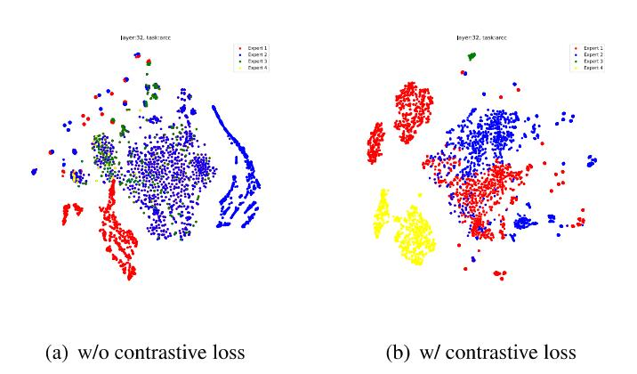

# J Analysis of Performance Differences Between Multi-task and Single-task Settings

CoMoE exhibits consistently stronger performance in multi-task setups compared to single-task training, as demonstrated in both math and reasoning benchmarks. This observation suggests that the expert specialization mechanism of CoMoE is particularly well-suited for heterogeneous data distributions. In contrast, under simple or narrow

Figure 6: Comparison of expert representations in ARC-c before and after contrastive loss incorporation in a multi-task setting. (a) Without contrastive loss. (b) With contrastive loss.

Figure 7: Comparison of expert representations in BoolQ before and after contrastive loss incorporation in a multi-task setting. (a) Without contrastive loss. (b) With contrastive loss.

| Number of Experts | 4      | 5      | 6      | 7      | 8      |
|-------------------|--------|--------|--------|--------|--------|
| Training Time (h) | 75     | 9.0    | 10.8   | 12.0   | 13.0   |
| Average Accuracy  | 0.7248 | 0.7309 | 0.7248 | 0.7381 | 0.7239 |

Table 10: Training time and accuracy with varying number of experts. Training time grows linearly with expert count.

| Number of Experts | 4      | 5      | 6      | 7      | 8      |
|-------------------|--------|--------|--------|--------|--------|
| Training Time (h) | 75     | 75     | 75     | 7.6    | 7.6    |
| Average Accuracy  | 0.7424 | 0.7357 | 0.7311 | 0.7305 | 0.7319 |

Table 11: Training time and accuracy after applying fixed-size negative sampling. Training time remains constant regardless of expert count.

| Method                   | _  Params   ARC-e |      | ARC-c     | BoolQ | OBQA | PIQA |  |  |
|--------------------------|-------------------|------|-----------|-------|------|------|--|--|
|                          |                   |      | Baselines |       |      |      |  |  |
| Parallel-Adapter   0.96% |                   | 67.1 | 54.2      | 65.2  | 76.3 | 69.8 |  |  |
| Learned-Adapter   0.94%  |                   | 69.3 | 54.4      | 64.9  | 78.4 | 75.6 |  |  |
| P-tuning v2              | 0.97%             | 63.5 | 51.3      | 61.2  | 76.1 | 66.2 |  |  |
| IAPT                     | 0.96%             | 66.3 | 54.7      | 67.8  | 79.2 | 77.3 |  |  |
| BitFit                   | 1.00%             | 65.9 | 54.1      | 66.4  | 77.2 | 76.6 |  |  |
| (IA)?                    | 0.90%             | 68.1 | 54.6      | 67.2  | 78.1 | 75.4 |  |  |
| SSP                      | 0.93%             | 71.6 | 57.6      | 69.6  | 79.5 | 79.7 |  |  |
| AdaLoRA                  | 0.92%             | 73.8 | 57.9      | 69.2  | 80.4 | 82.1 |  |  |
| MOELoRA                  | 1.00%             | 76.8 | 60.2      | 72.0  | 81.1 | 82.7 |  |  |
| MiLoRA                   | 0.93%             | 778  | 61.2      | 72.8  | 81.7 | 83.3 |  |  |
| MiDoRA                   | 0.93%             | 7715 | 61.3      | 72.9  | 81.3 | 83.1 |  |  |
| Our proposed methods     |                   |      |           |       |      |      |  |  |
| CoMoE-LoRA               | 1.45%             | 80.3 | 57.3      | 72.9  | 80.4 | 83.6 |  |  |
| CoMoE-DoRA               | 1.45%             | 80.2 | 57.0      | 73.3  | 81.2 | 83.8 |  |  |

Table 12: An overall comparison of different PEFT methods for single-task learning. Most results are extracted from the original papers or reproduced by running the provided source code. The backbone model is LLaMA-2 7B.

single-task settings (e.g., ARC-c or OBQA), models may overfit to the specific task distribution and potentially achieve better results through memorization rather than generalization. To further illustrate this difference, consider the following math problem:

> "Eight more than four times the number of coffee mugs in the teacher's lounge is 40. How many coffee mugs are in the teacher's lounge?"

A model trained under the single-task setting responds:

> "Assistant: Eight more than four times the number of coffee mugs in the teacher's lounge is 40. That means four times the number of coffee mugs in the teacher's lounge is 40 — 8 = 32. So, the number of coffee mugs in the teacher's lounge is 32. The answer is 32."

This output is incorrect—it skips formal equation modeling and instead relies on direct arithmetic subtraction, leading to an erroneous conclusion. This reflects a typical overfitting behavior, where the model learns shallow patterns from the training set rather than robust reasoning strategies. Such behavior is more likely in single-task regimes due to limited exposure to diverse reasoning formats.

In contrast, the same problem posed to a multitask trained model yields:

"Assistant: Eight more than four times the number of coffee mugs is 40. We can write this as 4x + 8 = 40. We can solve this equation to find x. 4x + 8 = 40. 4x = 40-8. 4x = 32. x = 32/4 =8. The number of coffee mugs must be 8. The answer is 8."

This response correctly models the algebraic structure and performs a step-by-step solution. It demonstrates stronger generalization and compositional

reasoning ability, which we attribute to the diversity and inductive bias introduced by multi-task training. These findings underscore the advantage of CoMoE in multi-task settings, especially for problems requiring structured reasoning.

