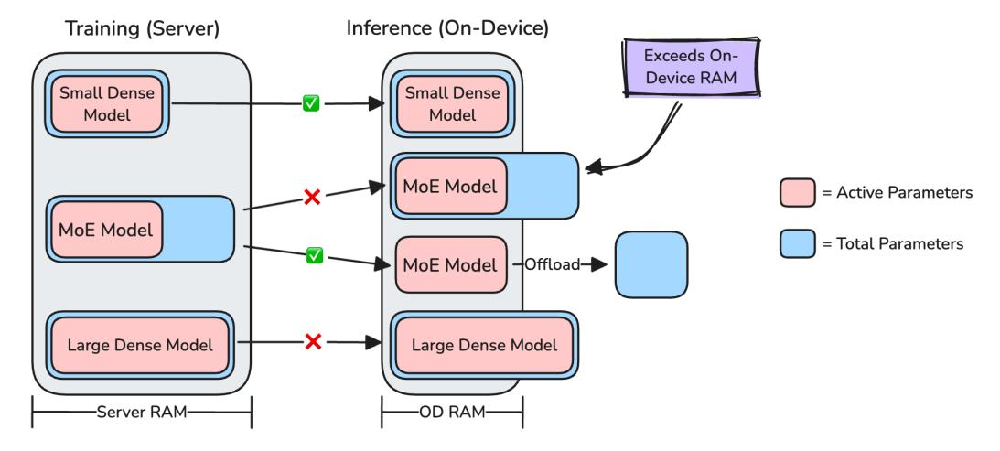
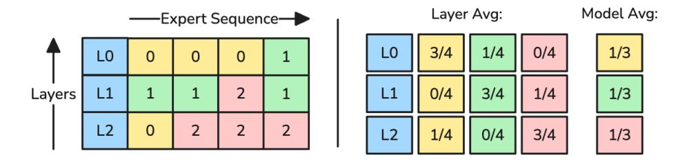

# **1 Introduction**

Mixture of Experts (short: MoEs) have been a popular extension of the transformer architecture [Vaswani et al.](#page-13-0) [\(2023\)](#page-13-0), introducing the idea that each token of the input sequence is not fed through a single, dense network per layer, but a set of sub-networks, or "experts". To allow every input token to utilize a mixture of expert, the sub-networks are usually combined with a gating mechanism, which determines the contribution of each expert.

In the general MoE setting, going back to [Jacobs et al.](#page-12-0) [\(1991\)](#page-12-0) and [Jordan and Jacobs](#page-13-1) [\(1993\)](#page-13-1), all experts are used to compute the final layer output. Building on top of this general architecture, sparse Mixture of Expert models have been proposed as a more compute-efficient alternative, only allowing a subset of experts to be activated for each token [Cai](#page-11-0) [et al.](#page-11-0) [\(2024\)](#page-11-0). Recently, many foundational models have adopted the MoE approach, such as Qwen [Bai et al.](#page-11-1) [\(2023\)](#page-11-1); [Yang et al.](#page-14-0) [\(2024\)](#page-14-0), OLMoE [Muennighoff et al.](#page-13-2) [\(2024\)](#page-13-2), Mixtral [Jiang et al.](#page-12-1) [\(2024\)](#page-12-1), Deepseek [\(2024\)](#page-11-2), *inter alia*.

In comparison to large-scale foundational Mixture of Expert models, optimized for highly parallelized server-side inference, in this work, we focus on small-scale foundational MoEs models deployed on edge devices[1](#page-0-0) . As such, this comes with a set of challenges around single-sample, on-device inference, which can be classified into three categories: Quality, Memory and Latency.

*Quality:* We tackle the fundamental research question if Mixture-of-Expert models can improve language modeling abilities over dense models at on-device scale. In comparison to previous work (e.g. [Jiang et al.](#page-12-1) [\(2024\)](#page-12-1)), we set up a truly fair comparison between MoEs and dense models. Here, we define a "fair comparison" of an MoE model against its dense counterpart by aligning for both, the same number of active parameters (i.e. FLOP aligned, short: *FA*) and total parameters (i.e. parameter aligned, short: *PA*). We further assume that a "fair comparison" between models should reduce confounding factors. Along those lines, we normalize models for training datasets, recipes, and architectures wherever possible. This way, we can make a clear performance attribution to the MoE component in isolation. In our evaluation, we show that MoE-style architectures improve the average language modeling performance by at least 2.35% absolute across on-device model sizes. Based on these results, we propose a novel MoE model extension following the core intuition of "expert specialization". Using weight-decomposed experts, we show up to an additional 1.1% language modeling improvements.

1Meta Reality Labs, 2Perceptron, 3Meta GenAI

∗This work was performed while at Meta.

1We focus on two model sizes: "Wearables-sized" models at 200M active parameters and "Phone-sized" models at 1.4B active parameters.

**Figure 1** Server-side training environment (left) compared to the memory-constraint inference environment (right), showing deployment restrictions for parameter heavy MoEs and large dense models on edge devices.

Memory/Latency: For server-side models, language modeling ability presents the main dimension for model improvements. In the on-device context, however, we face two additional hard constraints: Memory and latency. As depicted in Figure 1, models trained in server environments, with loose memory and latency restrictions, face additional constraints for inference on edge-devices. While these restrictions are architecture independent, MoE-style models with a high total parameter count are more impacted. Luckily, the sparsity property of MoE architectures allows to circumvent this restriction by offloading unused experts, effectively reducing the model size in memory to the active parameter count (see Figure 1). Reducing the model memory through expert offloading, however, comes at the cost of 4-20x increased inference latency, since experts might need to be offloaded for every single token in the output sequence Xue et al. (2024). To relax this memory/latency trade-off, we propose a novel "block-wise expert selection" loss, reducing expert offloads by 6x and, in turn, improving inference latency by 50% compared to default offloaded MoEs.

#### 2 CoSMoEs Models

#### 2.1 Sparse Mixture-of-Experts

At the core of this work is the sparse Mixture-of-Expert (MoE) architecture, popularized by works such as GShard Lepikhin et al. (2020) and Switch Transformers Fedus et al. (2022). While MoEs can generally be implemented for different parts of the architecture, the most common approach is to replace the single dense feed-forward layer with a router component and multiple experts (see Figure 2). Selecting a discrete subset of experts at each step, sparse MoE models can be defined by their active parameters (FLOPs) and total parameters (model size in memory). The resulting FLOP-to-parameter ratio directly translates to increased training and inference efficiency, without sacrificing model performance. To find a suitable subset of experts, different expert routing paradigms have been established, either selecting experts per token (token choice or "TC") Shazeer et al. (2017) or per expert (expert choice or "EC") Zhou et al. (2022). Here, we use the token choice expert routing paradigm (illustrated in Figure 2) following the findings in OLMoE Muennighoff et al. (2024), showing that EC does not bring clear improvements for text-only models. Please note that from here on out, we will refer to sparse MoEs as solely "MoEs" for brevity. However, all evaluated models in this paper are sparse versions of Mixture-of-Expert models.

### 2.2 Weight-Decomposed Experts

To reduce the naturally large total parameter count of MoE-style models, we propose a lightweight definition of experts using matrix weight decompositions ("WD") similar in spirit to Low Ranking ("LoRa") adapters Hu et al. (2021). Intuitively, individual experts are intended to "specialize" towards a subset of, ideally,  $\frac{1}{\#Experts}$  tokens. Based on this intuition, we replace expert matrices of shape  $n \times m$  with weight decompositions of shape  $n \times r$  and  $n \times r$  as shown in

**Figure 2** Sparse Mixture-of-Experts architecture with Token Choice (TC) Routing and k=2

Figure [3](#page-3-0) and defined in Equation [1:](#page-2-1)

$$M_{n \times m} \approx L_{n \times r} \times R_{r \times m} \tag{1}$$

Here, the original matrix M is replaced by L and R, with r ≪ n and r ≪ m. In preliminary experiments, we test multiple reduction factors for r and find that a decomposition of half the hidden dimension results in the best trade-off between parameter reduction and model performance. Weight decomposed models are from here on out prefix with a *WD* term. To ensure a paramter-aligned comparison, we adjust the number of heads and layers as further elaborated on in section [3.1.](#page-4-0)

#### **2.3 Block-wise Expert Selection**

We now explore the second restrictive dimension of MoEs for on-device use cases: Memory and Latency. Multiple lines of research have previously explored inference-time optimizations using predictive expert offloading and bitwidth adaptations, such as EdgeMoE [Yi et al.](#page-14-3) [\(2023\)](#page-14-3), Mixtral [Eliseev and Mazur](#page-11-4) [\(2023\)](#page-11-4) and DeepSpeed [Aminabadi et al.](#page-11-5) [\(2022\)](#page-11-5). Here we explore the expert offloading problem from a new vantage point, proposing a "Block-wise Expert Selection" (BlES) training loss term to reduce the number of expert replacements. Our BlES loss is thereby closely related to the expert load balancing loss proposed in [Fedus et al.](#page-11-3) [\(2022\)](#page-11-3):

Let R be a router logits tensor with shape (B, T, E). With B as the batch-dimension, T as the sequence length and E as the expert dimension. We compute the routing weights W by applying the softmax function to R, scaled by a temperature parameter τ as:

$$W = \operatorname{softmax}(\tau R) \tag{2}$$

In the non-differentiable part of the loss, we select the top-k experts K for each token based on the routing weights W. Let S be the selected experts tensor with shape (B, T, K) following

$$S = top_{-}k(W, K) \tag{3}$$

We then compute the number of hard expert replacements H by comparing consecutive tokens' expert assignments as:

$$H_{e} = \sum_{b=1}^{B} \sum_{t=1}^{T-1} |(S_{[b,t+1]} == e) - (S_{[b,t]} == e)|$$

$$H = \sum_{e=1}^{E} H_{e}$$
(4)

where e is the expert index and S[b,t] == e is 1 if expert e is one of the top-k candidates for token t. This approach counts every expert replacement twice (1 → 0 for the active expert and 0 → 1 for newly active expert). As a result, we

Figure 3 Feed Forward Layer: Standard (left) and Weight-Decomposed (right).

divide H by two and normalize by the batch-size, top-k and number of tokens as follows:

$$H_{norm} = \frac{\left\lfloor \frac{H}{2} \right\rfloor}{B \cdot K \cdot (T - 1)} \tag{5}$$

To keep the overall loss term differentiable, we compute a soft expert selection L by combining the per-expert probability differences between consecutive tokens along the token dimension T. With  $L_{norm}$  as the normalized soft expert selection, we compute:

$$L = \sum_{b=1}^{B} \sum_{t=1}^{T-1} \sum_{e=1}^{E} |W_{b,t+1,e} - W_{b,t,e}|$$

$$L_{norm} = \frac{L}{B \cdot T}$$
(6)

The final loss is defined as product of the hard and the soft expert selection loss.

$$loss = H_{norm} \cdot L_{norm} \tag{7}$$

As described above, the block-wise expert selection loss is defined on sequence level. We adjust the standard load balancing loss Fedus et al. (2022) to also operate on sequence level (following Lin et al. (2024)) to avoid loss inconsistencies, allowing the model to "cheat". For example, using 2 experts and 2 layers, the loss function can be exploited by consistently selecting expert 0 in layer 0 and expert 1 in layer 1, hence having a perfect 50:50 load balancing loss at the model level, as well as a minimal BIES on sequence level. See Figure 4 for a visualization of this example using 3 layers and 3 experts.

**Figure 4** Example expert selection (for simplicity, k=1) for individual layers and the complete model.

