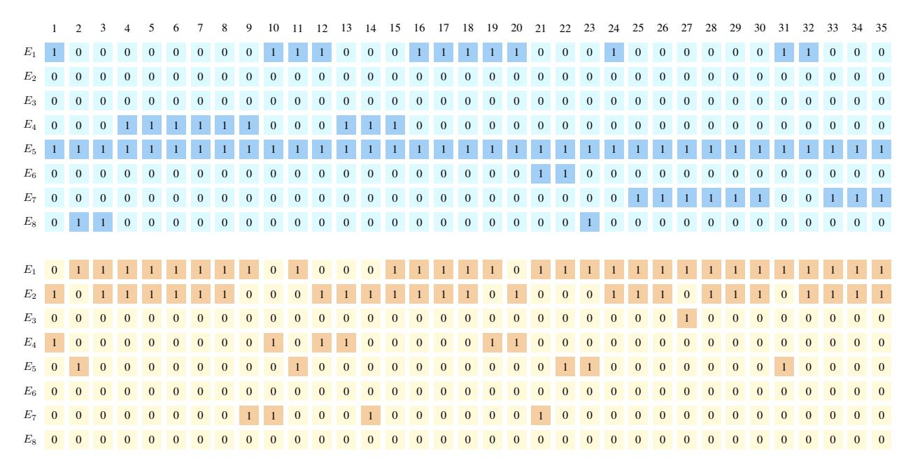
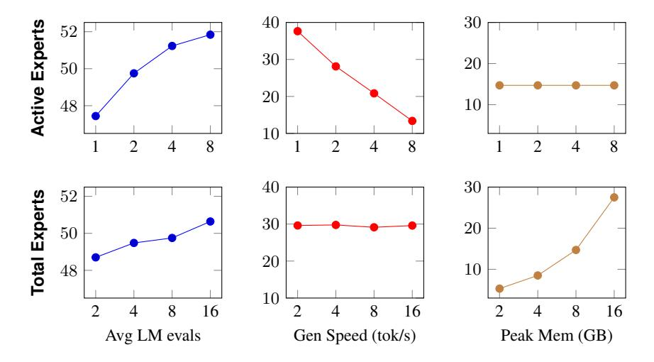
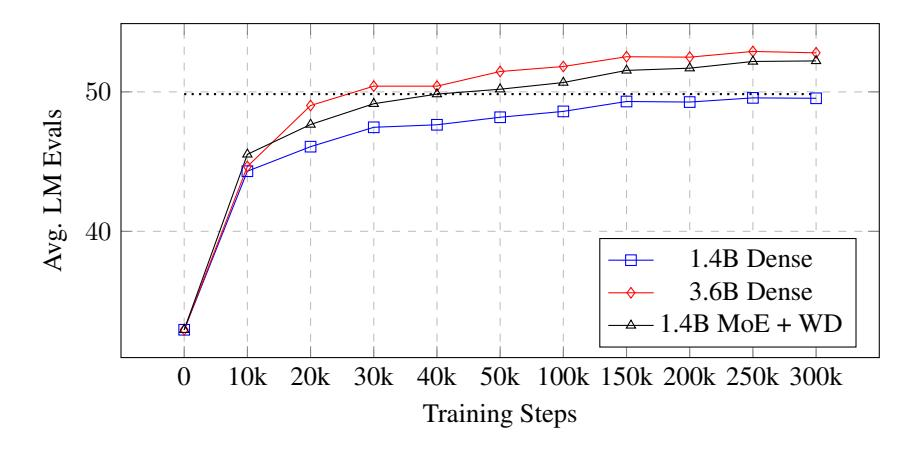

# **3 Evaluation**

## **3.1 Model Setup and Training Recipes**

We compare two on-device sizes: "Phone-sized" (∼1-3B parameters) and "Wearable-sized" (∼100-300M parameters) as well as three architectures: Dense, MoE and WD MoE, all presented in Table [1.](#page-4-1) We further train the standard MoE architecture with our novel "Block-wise Expert Selection" (BlES) loss[2](#page-4-2) . All models are based on the Llama3 architecture, with the additional MoE component consisting of eight total experts, with two active for every token. We follow standard approaches provided in the Huggingface codebase for the expert implementation [Wolf et al.](#page-13-6) [\(2020\)](#page-13-6). We keep model all hyper-parameters as constant as possible while aligning dense and MoE models along the active and total parameter counts. When in doubt, we follow the findings in [Liu et al.](#page-13-7) [\(2024\)](#page-13-7) and select depth over breadth.

| Model                                       | Params        | L  | H  | Hid  | Seq  | Steps | Bsz  |  |
|---------------------------------------------|---------------|----|----|------|------|-------|------|--|
| Phone-sized models, ∼1B-3B Parameters       |               |    |    |      |      |       |      |  |
| Dense                                       | 1.50B         | 16 | 32 | 2048 | 2048 | 310k  | 2048 |  |
| MoE                                         | 1.37B (3.75B) | 24 | 18 | 1440 | 2048 | 310k  | 2048 |  |
| + WD                                        | 1.42B (3.65B) | 26 | 20 | 1600 | 2048 | 310k  | 2048 |  |
| Dense                                       | 3.61B         | 28 | 24 | 3072 | 2048 | 310k  | 2048 |  |
| Wearable-sized models, ∼100-200M Parameters |               |    |    |      |      |       |      |  |
| Dense                                       | 189M          | 19 | 8  | 512  | 2048 | 310k  | 2048 |  |
| MoE                                         | 188M (377M)   | 19 | 8  | 432  | 2048 | 310k  | 2048 |  |
| + WD                                        | 188M (377M)   | 32 | 10 | 400  | 2048 | 310k  | 2048 |  |
| Dense                                       | 380M          | 29 | 12 | 768  | 2048 | 310k  | 2048 |  |

**Table 1** On-device model candidates. Params = #Active (#Total) Parameters, L = Layers, H = Self-Attention Heads, Hid = Hidden size, Seq = Sequence length, Bsz = effective batch-size

### **3.2 Training Datasets**

To pre-train all models using the FineWeb Education dataset (FW-edu, [Penedo et al.](#page-13-8) [\(2024\)](#page-13-8)), a 1.4 trillion token text dataset provided by Huggingface [Wolf et al.](#page-13-6) [\(2020\)](#page-13-6). Compared to other popular, open-source pre-training datasets, such as RedPajamas [Computer](#page-11-6) [\(2023\)](#page-11-6); [Weber et al.](#page-13-9) [\(2024\)](#page-13-9), FW-edu represents a smaller scale, yet high-quality, general purpose language dataset, filtered with Llama-70B educational prompts.

#### **3.3 Metrics and Benchmarks**

To evaluate the **language modeling performance** we use the public EleutherAI LM eval harness and nine language modeling evaluations [Gao et al.](#page-11-7) [\(2024\)](#page-11-7), namely, MMLU, AGI-English, Arc-challenge and -easy, BoolQ, PIQA, SIQA, HellaSwag and WinoGrande. We pick this subset in accordance with Llama3 [Grattafiori et al.](#page-11-8) [\(2024\)](#page-11-8) and MobileLLM [Liu](#page-13-7) [et al.](#page-13-7) [\(2024\)](#page-13-7) evaluations. We exclude long-context evaluations (e.g. SQuAD, DROP, QuAC), due to our sequence length restriction of 2048. To evaluate our **Block-wise Expert Selection (BlES)** loss, we show two offloading-specific metrics: The Expert Replacement Ratio (ExRep) and optimal expert balance. Specifically, the Expert Replacement is defined along the lines of equations [4](#page-2-2) and [5,](#page-3-2) calculating the percentage of realized replacements. Regarding the optimal expert balance, we calculate the average per-layer delta between the uniform distribution and the realized expert balance. Lastly, to investigate the model candidates' **memory and latency performance**, we show the per-token model latency (i.e. the realized generation speed) and peak memory.

#### **3.4 Results**

#### **3.4.1 Language Modeling Performance**

Our results on the language modeling task are presented in Table [2.](#page-5-0) We show a random baseline in the top row of the table, followed by the main model comparisons. The MoE-based results are framed by two rows of dense model candidates. On top of each sub-table, we show the FLOP aligned model (short: *FA*), at the bottom we present the

2The BlES model uses the standard MoE model architecture and is not separately mentioned in Table [1.](#page-4-1)

| Model                                       | Params                                | MMLU  | AGI-E | Arc-C | Arc-E | BoolQ        | PIQA  | SIQA         | HellaS       | OBQA        | WinoG | Avg          |
|---------------------------------------------|---------------------------------------|-------|-------|-------|-------|--------------|-------|--------------|--------------|-------------|-------|--------------|
| Random Baseline                             |                                       |       |       |       |       |              |       |              |              |             |       |              |
| Random                                      | _                                     | 24.53 | 16.07 | 21.08 | 25.25 | 51.07        | 51.74 | 33.11        | 26.31        | 29.40       | 50.83 | 32.94        |
|                                             | Phone-sized models, ∼1B-3B Parameters |       |       |       |       |              |       |              |              |             |       |              |
| Dense                                       | 1.50B                                 | 24.78 | 17.99 | 36.95 | 74.03 | 59.08        | 74.54 | 41.76        | 59.88        | 41.20       | 57.54 | 48.78        |
| MoE                                         | 1.37B (3.75B)                         | 25.96 | 17.65 | 42.58 | 76.77 | 60.89        | 75.52 | 42.12        | 65.07        | 42.40       | 62.35 | 51.13        |
| + BIES                                      | 1.37B (3.75B)                         | 25.40 | 17.50 | 41.55 | 77.02 | 62.81        | 76.06 | 41.91        | 63.14        | 42.60       | 59.04 | 50.70        |
| + WD                                        | 1.42B (3.65B)                         | 23.90 | 18.20 | 43.69 | 76.81 | <u>66.76</u> | 76.39 | <u>45.14</u> | 66.51        | 42.80       | 62.04 | <u>52.22</u> |
| Dense                                       | 3.61B                                 | 26.41 | 16.82 | 44.54 | 77.9  | 65.87        | 77.48 | 43.3         | 67.18        | 45.00       | 63.46 | 52.80        |
| Wearable-sized models, ~100-200M Parameters |                                       |       |       |       |       |              |       |              |              |             |       |              |
| Dense                                       | 189M                                  | 22.9  | 16.82 | 23.29 | 56.82 | 57.09        | 64.15 | 37.82        | 36.36        | 32.8        | 50.99 | 39.90        |
| MoE                                         | 188M (377M)                           | 25.27 | 17.37 | 27.9  | 63.09 | 58.39        | 69.04 | 39.61        | 44.09        | <u>34.4</u> | 53.03 | 43.22        |
| + BlES                                      | 188M (377M)                           | 24.27 | 17.58 | 24.83 | 58.84 | 59.82        | 66.49 | 38.64        | 39.70        | 33.40       | 49.96 | 41.35        |
| + WD                                        | 188M (377M)                           | 23.64 | 17.16 | 28.58 | 62.58 | 57.13        | 69.31 | 40.28        | <u>46.15</u> | 33.20       | 54.38 | 43.24        |
| Dense                                       | 380M                                  | 24.79 | 17.86 | 28.92 | 64.35 | 52.02        | 69.21 | 39.97        | 46.53        | 33.80       | 51.62 | 42.91        |
| Public Baselines across Model Sizes         |                                       |       |       |       |       |              |       |              |              |             |       |              |
| MobLLM (2024)                               | 135M                                  | 23.02 | 17.45 | 19.97 | 46.38 | 60.34        | 64.96 | 38.08        | 38.17        | 28.40       | 52.57 | 38.93        |
| MobLLM (2024)                               | 350M                                  | 26.33 | 17.47 | 23.89 | 56.4  | 61.96        | 68.88 | 39.87        | 49.57        | 31.00       | 57.38 | 43.28        |
| Llama3.2 (2024)                             | 1.4B                                  | 36.92 | 18.80 | 31.31 | 65.40 | 63.61        | 74.54 | 42.84        | 47.74        | 26.20       | 60.06 | 46.70        |
| Llama3.2 (2024)                             | 3.6B                                  | 54.01 | 22.53 | 42.32 | 74.41 | 72.81        | 76.71 | 47.13        | 55.32        | 31.20       | 69.30 | 54.50        |
| OLMoE (2024)                                | 1.68B (6.92B)                         | 25.74 | 17.19 | 40.87 | 74.20 | 60.52        | 74.70 | 44.37        | 60.38        | 38.40       | 58.72 | 49.50        |

**Table 2** Model comparison on zero shot LM evaluations. Params = #Active (#Total) Parameters, BIES = Block-wise Expert Selection, WD = Weight-Decomposed, MobLLM = MobileLLM. Public baselines are evaluated using the EleutherAI LM eval harness (2024).

parameter aligned (short: *PA*) dense model. For the MoE candidates, we show the standard MoE followed by the BIES and weight decomposed (WD) versions. In the bottom sub-table we show additional models from the literature to put our results into context3.

Phone-sized models: We show that all MoE model candidates outperform the random baseline by a large margin and consistently improve over the FA dense model by at least 2%. Comparing individual tasks, we find that for MMLU and AGI-English, all tested models only provide minor gains compared to the random baseline, showing clear potential for further improvements in this area. Regarding all other evaluation tasks, clear improvements are observed. Between MoE models, the weight decomposed model performs best overall, while for individual metrics the top-performing candidate varies. We also find a minor performance regression when using the block-wise expert selection loss. Compared to the PA dense model, MoE candidates perform better in 3 out of 10 metrics, falling only about half a percent short on average. Putting our observed model performances into the context of previously published models (1B and 3B Llama3.2, OLMoE 1B-7B), we find that the MoE model candidates outperform the FA Llama 3.2 1B and OLMoE models, however, can not reach the PA Llama 3.2 3B performance. We believe that this clearly shows that our MoE-style models are competitive to top open source candidates.

Wearable-sized models: The wearbale-sized evaluation shows generally similar trends. All MoE candidates outperform the random baseline and FA dense model. MMLU and AGI-English results are insignificantly above the random baseline, while all other tasks show meaningful improvements. The weight-decomposed model achieves the best MoE performance, this time even outperforming the PA dense model. At wearable-scale, at least one of the MoE models outperforms the PA dense model in 6 of 10 tasks. Looking at the comparison to the previously published MobileLLM model, we see improvements at the 125M and 350M parameter scale. Again, the BIES model shows a slight performance drop compared to the standard MoE setup.

| Model  | ExRep $(\downarrow)$ | Tok/s Gen (↑) | $\Delta \mathrm{Uni}\left(\downarrow\right)$ |
|--------|----------------------|---------------|----------------------------------------------|
| MoE    | 43.82                | 15.02         | 9.60                                         |
| + BlES | 6.55                 | 23.10         | 9.67                                         |

**Table 3** Impact of the BIES Loss on Expert Replacement (in percent), generation speed (token/second), and diversion from the uniform expert distribution (in percent)  $\downarrow$  = lower is better,  $\uparrow$  = higher is better.

&lt;sup>3Previously published models are also evaluated using the EleutherAI LM eval harness, but not aligned for confounding factors and, hence, not directly comparable.

#### **3.4.2 Offload Efficiency**

As previously shown in Figure [1,](#page-1-0) executing MoE models on-device requires offloading experts to stay within memory constraints. This necessity, however, causes significant latency regressions, rooted in the added offloading overhead. Let E be the set of experts, S the set of selected experts, and N = E \ S the set of non-selected experts. For each token in the output sequence, the following offloading logic is applied to ensure the number of experts in GPU memory never exceeds the number of active experts:

If 
$$S \neq S_{prev}$$
:  
 $\forall e \in N \rightarrow \text{CPU}$   
 $\forall e \in S \rightarrow \text{GPU}$   
 $S_{prev} \leftarrow S$  (8)

Since the expert selection and, hence, offloading frequency is data-dependent, we use a 100 sample subset of the C4 dataset [Raffel et al.](#page-13-10) [\(2020\)](#page-13-10) as a proxy for general text data. Table [3](#page-5-2) presents the results of this evaluation along three dimensions: The expert replacement percentage (ExRep), the realized inference speed in tokens per second (the full set of on-device benchmarks, putting the generation speeds into context, is presented in section [3.4.3\)](#page-6-0), and the model diversion from the ideal uniform expert balance (∆Uniform). Comparing the standard MoE model with our BlES extension, we find that the additional loss term causes a significant reduction in expert replacements, reducing the number of expert switches by over 6 times. This also directly converts into a real-world generation speed improvement of over 1.5x. Looking at the third metrics in Table [3,](#page-5-2) we observe a minor increase in the optimal expert balancing metric of less than 1% relative[4](#page-6-1) .

Besides the quantitative results in Table [3,](#page-5-2) we show a qualitative example in Figure [5.](#page-7-0) Compared to the standard MoE model (bottom), the BlES loss extended model (top) effectively reduces the number of expert replacements from 21→11, while conserving expert diversity (both models actively use 6 out of the 8 experts).

Furthermore, to get a better understanding of the per-layer impact of the BlES loss, we plot the layer-wise expert balance analysis in Figure [6.](#page-7-1) We find that when using the blocked expert selection, a larger expert divergence is observed in lower layers, while the standard MoE model shows a generally higher expert balance divergence in higher layers. While we don't have a clear understanding of the reasoning and impact of these differences, we believe that higher expert diversity in later layers seems preferable, given the general intuition that lower layers encode more local, syntactic information, while higher layers represent more global and semantic structures.

#### **3.4.3 On-Device Benchmarks**

We now evaluate the model candidates along the two main on-device dimensions, namely, latency and peak memory. Given that on-device models are oftentimes executed in either CPU based environments or using proprietary accelerators, we compare model latency in both, CPU and GPU environments[5](#page-6-2) . Furthermore, despite a variety of inferenceoptimizations available across different modeling frameworks and code bases (e.g. EdgeMoE [Yi et al.](#page-14-3) [\(2023\)](#page-14-3)), this paper targets training-time improvements. As a result, we use standard inference code provided in the Huggingface Transformers library [Wolf et al.](#page-13-6) [\(2020\)](#page-13-6) and the gpt-fast codebase [PyTorch Labs](#page-13-11) [\(2023\)](#page-13-11) without further inference optimizations.

Table [4](#page-8-0) shows our results along four dimensions: (1) The language modeling performance, as previously shown in Table [2,](#page-5-0) (2) the model inference speed in tokens per second, measured across 128 tokens in CPU and GPU environments, (3) the model peak memory after 128 token generations in GB of RAM and (4) the suitability of the model for on-device inference (in line with Figure [1\)](#page-1-0).

Besides the previously shown model candidates, we add an additional standard MoE offloading setup following equation [8,](#page-6-3) indicated as "Offl", besides the "BlES" offloaded model.

*Latency:* Looking at the generation latency, we find that on CPU, the FA dense model achieves the highest token per second generation, MoE model candidates are slightly slower, and the PA dense model regresses the generation speed by 2x. On GPU, MoE models generally produce less tokens per second than dense models, mainly caused by the

4Please note that the shown inference latency improvement is batch-size dependent.

5Please note that our evaluations are executed in a server environment and actual on-device accelerator numbers might vary.

**Figure 5** Example expert replacements. 1 = Active Expert, 0 = Inactive Expert. Top: BlES, Bottom: MoE.

**Figure 6** Per layer analysis of the divergence of the expert routing from the uniform expert distribution. Large values indicate expert collapse and use of a pseudo-dense layer.

deeper architecture (see layer comparisons in Table [1\)](#page-4-1). Looking at offloading enabled models, further slowdowns can be observed due to expert offloading delays. Comparing the standard offloaded MoE model against our BlES offloaded model, we find the 1.5x speed-up in generation speed, as previously presented in Table [3.](#page-5-2)

To put these results into context, inference-based offloading strategies, such as [Eliseev and Mazur](#page-11-4) [\(2023\)](#page-11-4) and [Aminabadi](#page-11-5) [et al.](#page-11-5) [\(2022\)](#page-11-5) achieve a 2-3x and 5.5x generation latency reduction at the most comparable model size, which is still significantly larger than our on-device sized models. Furthermore, while orthogonal to our train-time improvements, inference-time offloading methods can oftentimes not be used in on-device centered scenarios, due to their additional modeling components required to predict future expert use.

*Peak Memory:* We find that without expert offloading, the generation peak memory of the MoE model candidates is, as expected, comparable to the PA dense model. Using expert offloading, peak memory during generation is reduced to the FA dense model, given that only active parameters are kept in memory, making only offloaded MoE models true on-device candidates (see in the right-most column).

#### **3.4.4 On-Device Expert Ablations**

In the previous sections, we followed the standard MoE setup with two active and eight total experts. Going beyond this popular MoE setup, we now ablate these dimensions and explore their impact on on-device model quality, latency and memory. Specifically, we're exploring a suite of eight model ablations trained for 50,000 steps using a range of

| Model  | LM Eval |      | Latency       | Mem  |   |
|--------|---------|------|---------------|------|---|
| Setup  | Avg     |      | Gen (tok/sec) | Gen  |   |
| Metric | %       | CPU  | GPU           | GB   | / |
| Dense  | 48.78   | 4.47 | 73.10         | 5.8  |   |
| MoE    | 51.13   | 4.30 | 40.60         | 14.7 |   |
| + WD   | 52.22   | 3.85 | 33.50         | 14.2 |   |
| + Offl | 51.13   | 4.30 | 15.02         | 5.4  |   |
| + BlES | 50.70   | 4.30 | 23.10         | 5.4  |   |
| Dense  | 52.80   | 1.77 | 42.60         | 14.0 |   |

**Table 4** On-device benchmarks. Gen = Generation of 128 tokens (1 token prefill), Offl = Offloaded, BlES=Block-wise Expert Selection. Mem = Peak GPU memory. = Phone-sized, assuming <6GB of RAM use (e.g. iPhone 12 Pro).

**Figure 7** Active (top) and total (bottom) expert ablations of the 1.4B MoE model after 50,000 steps (∼210B tokens)

active and total parameter counts. Figure [7](#page-8-1) summarizes our findings along the active expert (left) and total expert (right) dimensions. For the active expert ablations, we fix the number of total experts to be 8, while the total expert ablations are fixed along the active parameter count (active experts=2).

*Active Expert Ablation:* A larger number of active experts and, hence, a larger number of forward FLOPs improves model quality. However, approaching 8 active experts, returns are diminishing. Looking at the generation speed between settings, we find that the generation speed decreases linearly, while the peak memory is constant across increasing numbers of active experts[6](#page-8-2) .

*Total Expert Ablation:* In this setup, model quality increases near linearly with the number of total experts. However, in comparison to the active parameter ablation, the quality improvement is less prominent (compare scales between sub-graphs). In regards of the generation speed and peak memory, increasing the total expert count does not impact generation speed, since the active experts and, hence, FLOPs are fixed. However, the number of total experts significantly impacts the peak memory consumption[7](#page-8-3) .

To summarize, increasing the number of active and total experts improves model quality, however, requires a trade-off regarding either generation speed (i.e. latency) or memory.

6The peak memory would increase between settings if we actively offload experts.

7The peak memory would be constant if we actively offload experts, however, this would further impact the generation speed.

**Figure 8** Training dynamics across different model candidates

