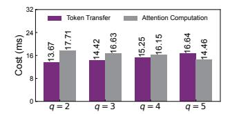

# E. Convergence Evaluation

We study the impact of token condensation on model quality by evaluating three models across different datasets and metrics. Specifically, the MoE-TransformerXL model is evaluated on the WikiText-103 dataset [32] using the perplexity (PPL) metric, where lower PPL values indicate better performance. For MoE-BERT-Large and MoE-GPT2, we evaluate them on the SQuAD [33] and SAMSum [34] datasets, using F1 and ROUGE-1 metrics, respectively. The larger F1 and ROUGE-1 values indicate better performance. The results are shown in Table IV. When a static threshold of 0.3 is applied, the test accuracy experiences a significant drop. For example, the F1 score of the MoE-BERT-Large model decreases from 90.82 to 85.41 under a threshold of 0.3. In contrast, our proposed LUFFY model, employing an adaptive condensation strategy, preserves the model's performance while delivering a significant training speedup.

## F. Sensitivity Analysis

We study the sensitivity of system parameters used in the sequence migration algorithm (§ IV-A) and the fast similarity measurement (§ V-A). We use the MoE-TransformerXL model to conduct the evaluation.

**Parameters of migration algorithm.** In the first step of sequence migration algorithm, top-q GPUs with minimum traffic are selected. We change the value of q and show the

(a) Impact of different candidate

(b) Accuracy of the cost model.

(c) Impact of the fast similarity mea- (d) Training convergence with differsurement.

ent configurations of fast similarity measurement.

Fig. 10: Sensitivity analysis on migration algorithm and fast similarity measurement.

corresponding traffic and computation time in Figure 10(a). We can see that more candidate GPUs can reduce the attention computation cost since each sequence has more choices to stay with others of similar lengths. In contrast, a small candidate size means we mainly focus on traffic optimization, and the cost of token transfer is minimized.

We also evaluate the effectiveness of the cost model of attention computation (§ IV-B). We collect the real costs of attention computation under different data inputs, e.g., number of sequences and sequence lengths. We compare the estimated cost with the real cost and report the results in Figure 10(b). It can be observed that our performance model introduces only a trivial error in the estimation of computation cost, with an average error of about 5% across all models.

Parameters of fast similarity measurement. We study the impact of the fast similarity measurement by setting different configurations of  $S_1$  and  $S_2$ . First, we study the impact of these parameters on the cost of similarity measurement. As shown in Figure 10(c), we can see that the measurement cost can be significantly reduced when  $S_1$  and  $S_2$  become close, because the similarity values of less pairs need to be re-calculated.

We then study the impact of  $S_1$  and  $S_2$  on the effectiveness of the convergence. The training loss over time is shown in Figure 10(d). When we increase  $S_2$ , more token pairs are directly regarded as dissimilar and assigned with a similarity of 0. In other words, fewer tokens are condensed in the dispatch and combine phases, and the training time is prolonged. In contrast, decreasing  $S_1$  makes more token pairs be assigned with a similarity of 1, indicating that more tokens can be condensed and the total training time is reduced. However, some token pairs may be wrongly estimated as similar, which brings a negative impact to the training convergence.

## VIII. RELATED WORK

MoE Models. Existing works show that model quality is strongly associated with the number of model parameters [2], [3], [35]. Recently, MoE has been widely applied as a promising solution to increase the model size and improve the model quality [36], [37], [38], [39], [6]. PaLM [40] and GLaM [41], proposed by Google, achieve surprising results in various language tasks, such as language modeling and machine translation. Recently, Mixtral 8×7B [23] has been released by Mistral AI, which achieve near state-of-the-art performance on various tasks. The success of this model inspires severl follow-up works, such as LLaMA-MoE [42], OpenMoE [43], and DeepSeekMoE [44].

Distributed MoE Training. The MoE models have giant model sizes and are typically trained with multiple GPUs, using an expert parallelism [45], [20], [8]. Existing works introduce a series of techniques to optimize the efficiency of distributed MoE training. BASE layers [46] implements expert parallelism based on FairSeq [47]. DeepSpeed-MoE [7] introduces a hierarchical all-to-all algorithm to reduce communication costs. Tutel [8] introduces the switchable parallelism and dynamic pipeline to handle unbalanced workloads of MoE. Followed by this work, PipeMoE [48] and MPipeMoE [49] study adaptive technologies to find optimal pipeline settings to improve the efficiency of pipeline parallelism for MoE training. SE-MoE [50] also adopts a hierarchical all-to-all algorithm to improve communication efficiency. Alpa [51] develops the automated parallelism for MoE models, considering both inter-operator and intra-operator parallelism. Smart-MoE [21] studies automated parallelism and decomposes the search space into static pools for efficient hybrid parallelism searching. Lina [11] systematically analyzes all-to-all overhead and designs a novel communication scheduling scheme to improve all-to-all efficiency. ScheMoE [52] introduces a framework to schedule communication and computation tasks in MoE training. However, these existing works cannot reduce the data transmission size for token push and pull operations, which is the main bottleneck for distributed MoE training. LUFFY introduces two novel techniques to significantly reduce the total data transmission, improving the MoE training efficiency.

Janus [10] adopts a data-centric paradigm to reduce communication costs by transferring experts, which typically have smaller sizes than tokens. FasterMoE [13] introduces a dynamic shadowing approach, which only transfers popular experts instead of tokens among GPUs, to reduce communication costs and achieve workload balance. Although Janus and FasterMoE can effectively reduce data transmission, they introduce intensive GPU resource competition and reduce the parallelism levels of expert running. In contrast, LUFFY reduces the data transmission by migrating sequences, instead of transferring experts, which always parallelizes expert running at the maximum level.

