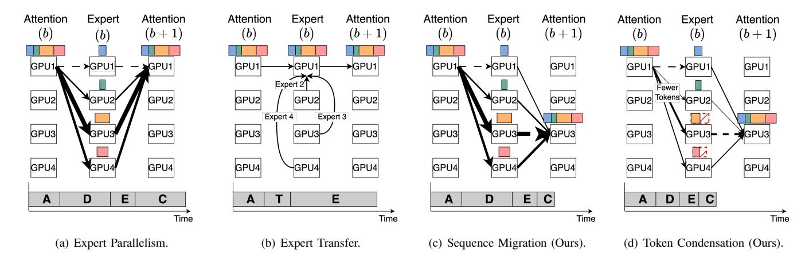
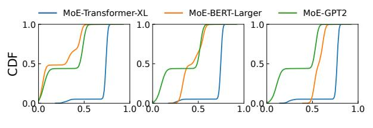
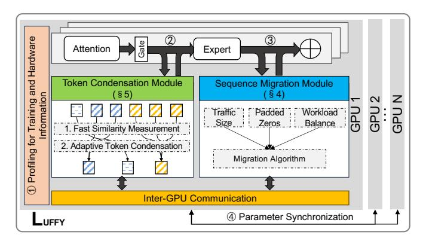

# I. INTRODUCTION

The recent success of large-scale language models (LLM), e.g., GPT, has demonstrated that model capability often increases with the growth of model sizes [\[1\]](#page-10-0), [\[2\]](#page-10-1), [\[3\]](#page-10-2), [\[4\]](#page-10-3), however, which comes with a huge computational cost. Mixture-of-Experts (MoE) has been proposed as one of the most popular LLM structures, thanks to its unique sparse activation feature with great promises in reducing computational overhead [\[5\]](#page-10-4), [\[6\]](#page-10-5). It decomposes the dense part of the model into multiple *experts*. Input sentences, also referred to as sequences, are divided into tokens as basic processing units. A gate network routes these tokens to only a few experts instead of all experts.

Fahao Chen is with the University of Aizu, Aizuwakamatsu, Japan (e-mail: d8232101@u-aizu.ac.jp).

Peng Li is with the School of Cyber Science and Engineering, Xi'an Jiaotong University, Xi'an, China (e-mail: pengli@xjtu.edu.cn).

Zicong Hong with the Department of Computing, The Hong Kong Polytechnic University, Hong Kong, China (e-mail: zicong.hong@connect.polyu.hk).

Zhou Su is with the School of Cyber Science and Engineering, Xi'an Jiaotong University, Xi'an, China (e-mail: zhousu@ieee.org).

Song Guo is with the Department of Computer Science and Engineering, The Hong Kong University of Science and Technology, Hong Kong, China (e-mail: songguo@cse.ust.hk).

Despite the promises of MoE, how to efficiently train MoE models is still an open challenge, mainly because their giant model sizes could easily exceed the memory limit of a single GPU. Therefore, distributed MoE training over multiple GPUs has become one of the hottest topics in AI system research [\[7\]](#page-10-6), [\[8\]](#page-10-7). Since MoE models have giant sizes and unique structures, some recent works [\[5\]](#page-10-4), [\[6\]](#page-10-5) have recognized that traditional parallelism schemes, e.g., data parallelism and model parallelism, can be hardly applied to distributed MoE training. Recently, *expert parallelism* [\[5\]](#page-10-4) has been proposed as a novel parallelism scheme dedicated to MoE. As shown in [Figure 1\(a\),](#page-1-0) experts, which are usually with large sizes, in each MoE layer are distributed across different GPUs, while nonexpert components (e.g., multi-head attention) with moderate sizes are replicated over all GPUs. Expert parallelism can maximize GPU resource utilization and thus has become the mainstream of distributed MoE training [\[9\]](#page-10-8), [\[10\]](#page-10-9), [\[11\]](#page-10-10). Several popular open-source model training frameworks, such as Microsoft's DeepSpeed-MoE [\[7\]](#page-10-6) and Tutel [\[8\]](#page-10-7), have supported expert parallelism.

1

However, the default expert parallelism, as shown in [Fig](#page-1-0)[ure 1\(a\),](#page-1-0) suffers from a high network burden because of the all-to-all intermediate data exchange among GPUs before and after experts. Many tokens in a GPU may be pushed to experts located at others by the gate network. This process is usually termed as the dispatch phase. After being processed by experts, tokens are pulled back to original GPUs to revert into sequences, in a so-called combine phase. GPUs need to transmit massive tokens through the inter-GPU network in both dispatch and combine phases, which significantly degrades the efficiency of distributed MoE training. Existing works have revealed that the communication costs become the main bottleneck of the whole system [\[12\]](#page-10-11), [\[10\]](#page-10-9), [\[11\]](#page-10-10). Some recent works, e.g., Lina [\[11\]](#page-10-10), have proposed to hide this bottleneck by overlapping token transmission and expert computation, but they cannot reduce the size of intermediate data and are still far from fundamentally solving the communication challenge.

Another line of works have proposed to copy remote experts to local GPUs, if there is too much intermediate data pushed out. An example is shown in [Figure 1\(b\).](#page-1-1) Janus [\[10\]](#page-10-9) follows this idea and designs sophisticated algorithms to decide when and how to fetch remote experts. FasterMoE [\[13\]](#page-10-12) has proposed a dynamic expert fetching scheme guided by a performance model. However, experts could be large and incur high transmission cost. Moreover, copying more experts to local GPUs

<span id="page-1-0"></span>

<span id="page-1-1"></span>Fig. 1: Comparison between existing works and our ideas. We assume that each GPU holds one expert (e.g., GPU k holds Expert k). A: attention computation; E: expert computation; D: token dispatch; C: token combine; T: expert transfer. Each rectangle represents a part of a sequence, and the width of a rectangle indicates its length. Arrows with solid and dashed lines represent intra-GPU and inter-GPU traffic, respectively, and the arrow width indicates the amount of traffic. The red hatched rectangles in (d) represent the tokens eliminated by token condensation. The block index is denoted by b.

intensifies GPU resource competition. The improved communication efficiency is traded with reduced parallelism levels of expert running. In addition, all existing works mainly focus on experts, without much study about multi-head attention, which is the most compute-intensive component of MoE [\[14\]](#page-10-13), [\[15\]](#page-10-14).

The above facts motivate us to explore whether it is possible to reduce inter-GPU traffic while maintaining a high degree of expert parallelism. This paper gives a positive response by conducting a holistic system study of jointly optimizing communication and computation. We present LUFFY, a distributed MoE training system that can significantly improve time-toaccuracy by two key techniques. First, instead of moving experts, LUFFY migrates sequences among GPUs to reduce cross-GPU token pulling in the combine phase. As shown in [Figure 1\(c\),](#page-1-2) if many tokens of a sequence are pushed to a remote GPU, this sequence can be migrated to that GPU. After migration, this sequence is reverted by pulling its tokens to the new location, followed by being fed to the multi-head attention of the next block. Such a sequence migration can hide heavy token pulling paths within GPUs, thus reducing inter-GPU traffic. Meanwhile, it avoids copying experts over GPUs, so that we can save GPU memory and maintain high degree of expert parallelism. Furthermore, sequence migration provides a new chance to optimize attention computation by gathering sequences of similar lengths, so that we can reduce padded zeros when aligning them for batch processing.

We then shift our focus from the combine phase to the dispatch phase, where the second technique, token condensation, can be applied to further reduce inter-GPU traffic. Token condensation is based on an important observation that a considerable number of tokens pushed to the same expert exhibit high similarity, which has not yet been exploited by existing works. For example, when training the MoE-TransformerXL model, we find that about 62% tokens pushed to the same expert are very similar, and sending only one of them has almost no influence on the final training accuracy. <span id="page-1-3"></span><span id="page-1-2"></span>Therefore, we propose the token condensation, as shown in [Figure 1\(d\),](#page-1-3) to identify similar tokens and then to eliminate redundant transmissions. Note that token condensation can reduce traffic not only in the dispatch phase but also in the combine phase because we further find that token similarity can be preserved after passing experts.

Although sequence migration and token condensation are promising, it is non-trivial to bring them into full play in practical MoE training due to following technical challenges. First, sequence migration needs to decide which sequences should be migrated to which GPUs. LUFFY features an algorithm to make migration decisions by jointly considering the token pulling cost and efficiency of the subsequent attention computation. Note that attention computation is affected by two factors. One is about how many sequences should be handled by each GPU, and the other is about whether these sequences have similar lengths, so that we can reduce padded zeros. Second, token condensation should have a low overhead in identifying similar tokens. A straightforward pair-wise comparison is with high computational complexity and it can hardly work in practice. We equip LUFFY with a fast algorithm to identify similar tokens by fully exploiting token features during MoE training. In addition, token condensation needs to strike a balance between the amount of condensed tokens and training convergence. If more tokens are condensed, we can have lower communication costs but may miss important differences between tokens, which would slow down or even compromise the training convergence. Therefore, LUFFY uses a dynamic condensation policy that can adjust token condensation rate according to training convergence status.

We implement LUFFY using PyTorch and evaluate its performance on a testbed consisting of 16 V100 GPUs. The experimental results show that LUFFY can achieve a speedup of up to 2.73× compared to state-of-the-art MoE training systems.

<span id="page-2-0"></span>

Fig. 2: An illustration of MoE.

| Model             | Expert=4, Batch = 8 |        |       | Expert=4, Batch = 16 |        |       | Expert=8, Batch = 8 |        |       |
|-------------------|---------------------|--------|-------|----------------------|--------|-------|---------------------|--------|-------|
|                   | S (GB)              | C (ms) | R (%) | S (GB)               | C (ms) | R (%) | S (GB)              | C (ms) | R (%) |
| MoE-TransformerXL | 3.19                | 327    | 18.1  | 6.15                 | 507    | 14.8  | 3.98                | 381    | 30.5  |
| MoE-BERT-Large    | 6.73                | 439    | 36.6  | 13.07                | 859    | 40.3  | 7.92                | 477    | 47.5  |
| MoE-GPT2          | 6.53                | 411    | 34.6  | 12.13                | 707    | 35.9  | 7.52                | 452    | 45.9  |

TABLE I: Communication bottleneck for distributed MoE training. The total number of experts is set equal to the number of GPUs. **S** means the data transfer size. **C** and **R** mean the time of all-to-all communication and its ratio in a batch of training.

#### II. BACKGROUND AND MOTIVATION

### A. MoE and Distributed MoE Training

Transformer [1] emerges as the primary architecture for many complex tasks in natural language processing (NLP), computer vision, and beyond. As Figure 2 depicts, the Transformer architecture consists of multiple blocks, each of which includes a multi-head attention layer and a Feed-Forward Network (FFN) layer. MoE structure has been widely used to scale up Transformer-based models [16], [6], [17] by replacing the FFN layer with an MoE layer, consisting of a gate network and multiple expert networks that are essentially FFNs. The instinct behind the MoE is that each expert could be trained to handle a specific kind of input. Thus, the whole model capability becomes stronger as more experts are integrated.

However, more experts significantly enlarge the MoE model size, with higher running costs. For example, Switch Transformer [6] with 256 experts per block requires more than 50GB memory to accommodate the model parameters. However, the current mainstream GPUs peak at 48GB, while many ranging from 12GB to 24GB. Thus, traditional data parallelism and pipeline parallelism could hardly be applied for efficient distributed training or inference over multiple GPUs. Recently, expert parallelism [6], [5] has been proposed as a novel hybrid parallelism dedicated to MoE by exploiting its unique features [18], [19], [20], [13]. Specifically, multiple experts are distributed across different GPUs, while other components, such as attention layers, are replicated on GPUs. The gate network selects experts for each input token and dispatches them to corresponding GPUs containing the required experts. This process needs an all-to-all communication between GPUs and is called *dispatch phase*. After the expert computation, another all-to-all operation is initiated to combine tokens into sequences for the execution of subsequent layers, which is called combine phase. In this paper, we mainly focus on optimizing the expert-parallelism-based distributed MoE training. Although there are some research works about hybrid parallelism strategies [21], [8], they are orthogonal to our work.

#### B. Motivations

**Traffic pattern of MoE training**: We first conduct experiments to study the communication cost incurred by the all-to-all token push and pull operations in the default expert parallelism<sup>1</sup>. Table I shows the data transfer size of all-to-all

<span id="page-2-1"></span><sup>1</sup>We focus on the communication cost, which is mainly caused by the all-to-all operations for tokens, excluding gradient synchronization.

operations in a training batch of MoE-TransformerXL [22], MoE-BERT-Large [2], and MoE-GPT2 [3]. We here use top-2 gating and other preliminary experiments follow the same setting. When training the MoE-BERT-Large with 4 experts per block by setting the batch size as 8, the total data transfer size reaches 6.73GB. Moreover, we can see that the amount of data transmission increases with larger batch sizes and more experts. The communication time becomes a significant portion of the total training time. When training MoE-BERT-Large with 4 experts per block and a batch size of 8, the communication time is 439ms, which is 36.6% of the total training time. When the number of experts increases to 8, this ratio grows to 47.5%. There are similar observations for other models.

In addition, we find that each sequence activates very a few experts. We randomly select some sequences and show the portion of tokens pushed to different experts in Figure 3. Statistically, more than half of sequences use no more than 3 experts when training MoE-TransformerXL and MoE-BERT-Large. MoE-GPT2 has a stronger bias in expert activation, and more than 80% sequences use only 1 or 2 experts. The biased expert activation is mainly attributed to the data distribution in each sequence, which results in a non-uniform output of the gate network. This characteristic exists throughout the training process, even at the beginning of the training with a randomly initialized gate network. A similar observation has been reported in [13].

To reduce the all-to-all communication cost, some recent works [10], [13], [9] have proposed to transfer experts instead of intermediate data between GPUs, which are effective when the expert size is smaller than volume of tokens. However, this method cannot fundamentally address the communication bottleneck, especially when facing large expert sizes. For example, recent Mixtral 8×7B [23] has 256 experts in total, and each expert is with a size of about 300MB. In addition, the execution of experts co-located on the same GPU cannot be well parallelized because of resource competition. To demonstrate this issue, we migrate different numbers of experts to a single GPU and measure the corresponding running time. As shown in Figure 4, the computation time increases as more experts are migrated to the same GPU. For example, as we increase the number of experts from 1 to 3 for MoE-BERT-Large, its expert computation time grows to  $1.88 \times$ .

**Token Similarity**: We collect token embeddings routed to the same experts and compare their cosine similarity, a common metric to evaluate embedding similarity [24], [25], [26]. We here use a normalized cosine similarity and its value ranges

<span id="page-3-0"></span>

Fig. 3: Biased expert activation for sequences under different models after 30 training iterations, where a training iteration indicates the training on a batch of data. Different colors represent hotness values, which indicate the portions of tokens routed to different experts.

<span id="page-3-1"></span>

Fig. 4: Batch time on one GPU with different number of experts. The batch size is set as 1.

from [0,1]. A larger value means higher similarity. Due to space limits, we selectively report the results of three blocks (i.e., block 1, block 3, and block 6) of studied models. The results are presented in Figure 5(a), which reveals a significant prevalence of similar tokens across different models. For example, about 25% of token pairs in the first block of the MoE-TransformerXL model have a similarity greater than 0.75. Similarly, in the sixth block of the MoE-BERT-Large model, about 57% of token pairs have a similarity greater than 0.55. In addition, we notice that token pairs tend to show increased similarity in deeper levels. For example, in the first block of the MoE-TransformerXL model, only 25% of token pairs have a similarity greater than 0.75, but this proportion increases to 85% in the sixth block. In the case of MoE-GPT2, the proportion of token pairs with similarity above 0.50 increases from 18% in the first block to 50% in the sixth block. This trend of higher similarity in deeper layers can be attributed to the significant reduction in the rank of

<span id="page-3-2"></span>

(a) Token similarity over different blocks.

<span id="page-3-3"></span>

(b) Token similarity change after the expert execution.

Fig. 5: Token similarity and the change after the expert execution after 30 training iterations. All results are shown over block 1 (**left**), block 3 (**middle**), and block 6 (**right**).

the embedding matrix [27]. The above observations suggest a great chance of reducing communication costs by eliminating the transmission of similar tokens.

We further check whether token similarity could be preserved after they pass through the same experts. If similar tokens would be quite different after passing experts, this idea does not work because once we select to transmit only one of similar tokens, their differences are dismissed in the subsequent expert computation. To verify similarity preservation, we select some token pairs whose similarity exceeds a certain threshold, which is set to 0.75 for MoE-TransformerXL, 0.55 for MoE-BERT-Large, and 0.50 for MoE-GPT2, and show their similarity changes in Figure 5(b). We can see that the similarity of token pairs has changed only slightly after passing through experts. For example, in the first block of the MoE TransformerXL, about 95% of token pairs have a similarity change of less than 0.2. Similarly, in the MoE-BERT-Large model, about 36% of token pairs in the third block have a similarity change below 0.10, and this proportion increases to 98% in the sixth block.

## III. SYSTEM OVERVIEW

LUFFY is designed with the goal of improving time-to-accuracy of distributed MoE training across multiple GPUs. To achieve this goal, LUFFY follows several important design principles. First, inter-GPU traffic should be minimized. The all-to-all token push and pull operations have been recognized as the main system bottleneck by existing works. The main solution adopted by existing works is to move experts or to exploit network resources with complex scheduling algorithms. LUFFY explores the possibility of fundamentally solving this challenge by reducing number of tokens sent over the network. Second, the computation part, involving not only experts but also attention layers, of MoE training should also be efficient. Many existing works have excessive concerns about the all-to-all token communication, but share

<span id="page-4-0"></span>

Fig. 6: Architecture overview of LUFFY.

little consideration of expert or attention computation. Third, LUFFY should not compromise the training convergence, and thus preserve the quality of the final MoE model. LUFFY can allow a certain level of computational approximation during training for acceleration, but approximation errors should be constrained.

An overview of LUFFY's design is shown in [Figure 6.](#page-4-0) LUFFY is based on expert parallelism that each GPU has one or a few experts and a full copy of attention layers. An important design choice that makes LUFFY different from existing work is that it does not allow expert movement during training, so that it can parallelize expert running at the maximum level. LUFFY's superiority stems from two novel designs: *sequence migration* and *token condensation*. Sequence migration works in the combine phase, to strategically decide locations where sequences should be re-constructed and then be fed to the subsequent attention layers. An algorithm is designed to make migration decisions by jointly considering token pulling cost and running efficiency of attention layers. The second key design, token condensation, can be applied for both dispatch and combine phases. It eliminates the transmission of similar tokens to reduce inter-GPU traffic. Moreover, since only one of similar tokens reaches and goes through the corresponding expert, we can save a lot of expert computation. A fast heuristic algorithm is proposed to quickly identify similar tokens. In addition, the approximation error during expert computation can be constrained to guarantee training convergence.

The system workflow is as follows. As shown in [Figure 6,](#page-4-0) ① LUFFY profiles training information (e.g., batch sizes and sequence lengths) and hardware information (e.g., GPU speed) at the start of each training iteration. Here an iteration is defined as the process of training a batch of data. After profiling, GPUs load training data and proceed to train the MoE model. ② GPUs run attention computations locally, and then send the output to the token condensation module that identifies similar tokens and reduces redundant transmissions. ③ Expert computation is launched after receiving tokens. Meanwhile, the sequence migration module decides where tokens should be pulled back for re-construction. After that, LUFFY follows these decisions to collect tokens in the combine phase. ④ Finally, GPUs compute gradients based on the loss function and synchronize parameters of attention layers and

```
Algorithm 1: Sequence Migration Algorithm
```

```
Input: The set of sequences N, the set of GPUs M;
1 For sequence i, we estimate traffic fi,j supposing to
   migrate i to GPU j;
```

<sup>2</sup> Put top-q GPUs with minimum traffic into a candidate set H<sup>i</sup> ;

```
3 for each sequence i do
4 for each GPU j ∈ Hi do
5 si,j = Tatt(Bj←i
                         , Lj←i) − Tatt(Bj , Lj );
6 Migrate sequence i to the GPU j
                                     ∗ with maximum
      si,j if it has sufficient capacity.
7 return j
          ∗
            for each sequence;
```

experts for the next iteration.

## IV. SEQUENCE MIGRATION

To minimize token transmissions in the combine phase, an intuitive idea is to migrate each sequence to the GPU accommodating the most of its tokens, so that only a few other ones need to be pushed out and pulled back over the network. However, this approach performs poorly in practice because some GPUs would be assigned too many sequences, leading to a serious workload imbalance of following attention computation. In addition, if sequences of different lengths are batched together, short sequences must be padded with zeros to align with other long ones, leading to GPU memory waste and additional computation [\[28\]](#page-10-27). In LUFFY, we design a sequence migration algorithm that holistically considers the communication cost of the combine phase and the computational efficiency of subsequent blocks. We first present the algorithm design in [§ IV-A](#page-4-1) and then give details of a cost model that plays an important role in the algorithm in [§ IV-B.](#page-5-0)

