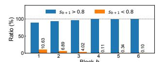
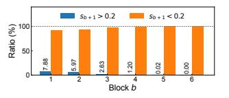
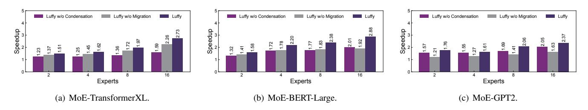

# *A. Migration Algorithm Design*

The sequence migration problem could be difficult because of dual optimization objectives (i.e., both communication and computation cost) and a large optimization space (i.e., there could be lots of possible combinations of sequences and GPUs). To tackle this, we propose a heuristic approach consisting of two steps: one focuses on finding out some candidate GPUs for each sequence with less traffic, and the other step then gathers sequences with similar lengths by migrating them to one of candidate GPUs.

The pseudo codes of the proposed algorithm are shown in [algorithm 1.](#page-4-2) For each sequence i, we estimate its token pulling traffic if it is migrated to different GPUs. We choose the top-q GPUs with minimum traffic as candidate locations, and include them into set Hi . A large q can provide more flexibility when we gather sequences with similar lengths in the next step, but may come with higher traffic cost. Setting q = 1 goes to the other extreme that we put all efforts in minimizing traffic, without considering attention computation.

After getting all Hi , we continue to find a GPU for each sequence from its candidate set. Similar sequences are expected to stay at the same GPU to reduce padded zeros. Note that we do not directly count the number of padded zeros as the metric for decision making, as it does not accurately reflect the impact on computational cost. Suppose there is a sequence a of length 11 that needs to be migrated. There are two GPUs as candidates, GPU1 with a sequence of length 1, and GPU2 with two sequences of length 6. Migrating sequence a to either GPU results in 10 padded zeros. However, migrating sequence a to GPU2 is a better choice with lower cost because of less attention computation among tokens.

Therefore, we propose a cost model to estimate the attention computation time. Given B sequences and the maximum sequence length L, the cost model can be described as a function  $T_{att}(B,L)$ , whose details are presented in § IV-B. As shown in lines 3-6, for sequence i, we select a GPU with the minimum cost growth from its candidate set. Meanwhile, we also consider the capacity constraints of GPUs. A GPU can accommodate more short sequences but less long ones.

#### B. Cost Model

The performance of the migration algorithm depends on the accurate estimation of attention computation cost. As the attention operation is typically compute-bound [9], we can estimate the cost of each attention layer as follows.

$$T_{att}(B, L) = \left\{ \underbrace{\frac{3BLd^2}{P}}_{\text{Linear projection}} + \underbrace{\frac{2BL^2d}{P}}_{\text{Dot-product}} \right\}, \tag{1}$$

where d is the feature dimension and P denotes GPU speed. The rationale of this model is explained as follows. Each attention layer consists of two key operations. First, the input tokens are linearly projected into corresponding queries, keys, and values, denoted by Q, K, and V, respectively. Second, a scaled dot product operation is performed to compute the attention scores and weighted outputs as  $Attention = softmax(\frac{QK^T}{\sqrt{d}})V$ .

According to the above workflow, the total operations for each linear projection is  $BLd^2$ . Note that there are three linear projections to generate Q, K, and V, respectively. The scaled dot product operation for each sequence has two parts, where one is the dot product of Q and K, resulting in a total operations of  $BL^2d$ . Then, the softmax is applied, followed by the multiplication of V and attention scores, with  $BL^2d$  operations. Thus, the number of computational operations for the scaled dot product operation is  $2BL^2d$ . We ignore the cost of the softmax operation since it is significantly lower than that of matrix multiplication, which has been also verified by [29]. The speed P is profiled by running an attention layer several times with varying B and L.

#### V. TOKEN CONDENSATION

Token condensation contains two main tasks, measuring token similarity and deciding "how similar" are tokens to be condensed. An intuitive idea is to compute the pairwise similarity (e.g., cosine similarity) between each pair of tokens and use a predefined similarity threshold to decide which

(a) Similarity change for token pairs (b) Similarity change for token pairs in block b and have  $s_b>0.8$ . in block b and have  $s_b<0.2$ .

Fig. 7: Similarity change across consecutive blocks for the MoE-TransformerXL model.

tokens should be condensed. However, this approach can hardly work in practice for the following reasons.

First, computing pairwise similarity between every two tokens has a high overhead, because of the massive number of tokens involved in MoE training and their high-dimensional embeddings (e.g., each token of MoE-TransformerXL has 1024 dimensions). The high overhead would counteract the benefit of token condensation in reducing communication cost. To address this challenge, we propose a fast similarity measurement algorithm to efficiently compute the similarity between tokens by strategically skipping unnecessary similarity computations in § V-A.

Second, condensing more tokens means less network traffic, but would increase the risk of compromising convergence due to computational errors. A trade-off between communication efficiency and training convergence should be considered to improve the time-to-accuracy. Moreover, we find that tokens become more similar as the training proceeds, which implies that we can condense more tokens in later training rounds. Motivated by the above observations, we design an adaptive condensation strategy to dynamically set the similarity threshold in § V-B.

#### A. Fast Similarity Measurement

Our design goal here is to make the measurement process fast by reducing the pairwise similarity computation between tokens. To better present our idea, we model tokens and their similarity relationship as a fully connected graph. By default, all edge weights, which represent similarity levels, in the graph need to be measured, leading to high computational overhead. However, we find that some tokens are obviously similar or dissimilar according to expert activation and historical knowledge. We can skip their similarity calculation by directly assigning the weights of corresponding edges as 0 or 1. Specifically, our fast similarity measurement algorithm works as follows.

1) Measuring similarity by expert activation. We first find out edges whose associated tokens are pushed to different experts, and set their weights as 0. The design rationale is as follows. Experts of an MoE model are often designed to process different kinds of input. Thus, it is expected that similar tokens are routed to and processed by the same expert. In other words, tokens assigned to different experts are highly unlikely to be similar. Note that tokens going to the same expert are

not definitely similar, and we need to continue to check them in the next step.

- 2) Measuring similarity by historical similarity. We then identify obviously dissimilar and similar tokens according to historical information. This design is based on the observation that token pairs that are extremely similar or dissimilar in the previous block always tend to keep this pattern. As shown in Figure 7(a), we randomly select some token pairs whose similarity values are greater than 0.8 and check their value changes in several consecutive blocks. We can see that about 90% of token pairs still keep their similarity of greater than 0.8. We also check dissimilar token pairs whose similarity values are less than 0.2 and show results in Figure 7(b). Based on this observation, in the b-th block, we identify tokens as similar ones (whose link weights are set to 1) if  $s_{b-1} > S_1$ , or dissimilar ones (whose link weights are 0) if  $s_{b-1} < S_2$ , where  $S_1$  and  $S_2$  are two adjustable system parameters.
- 3) Calculating similarity of rest token pairs. Up to now, similarity of most of token pairs has been decided. The rest ones are highly uncertain and we measure them by conducting real cosine similarity calculation. Note that similarity calculations in this step could be quick because they can be easily parallelized.

## B. Adaptive Token Condensation

After token similarity measurement, we need to decide which tokens should be condensed, i.e., not being transmitted in the dispatch phase. Specifically, we delete the edges in the graph whose weights are below a given threshold, which generates a sparse graph composed of multiple subgraphs. For each subgraph, we keep the token with the highest degree for transmission and condense its neighboring tokens. We repeat this process until all tokens are condensed in subgraphs.

To achieve a trade-off between communication efficiency and training convergence, we introduce an adaptive token condensation strategy, which adaptively generates a condensation threshold to ensure the training convergence. The basic idea is as follows. The early stage of MoE training is often accompanied by unstable training convergence. Thus, we need a high threshold to prevent most tokens from being condensed to maintain convergence. As the training progresses, the model tends to converge, and we should lower the threshold to condense more tokens so that the data transmission can be reduced as much as possible. Specifically, we set the threshold  $h_t$  for training iteration t according to the loss value in the previous iteration:

$$h_t = \frac{1}{1 + \exp(l_{norm})}, \quad l_{norm} = \frac{l_{ini} - l_{t-1}}{l_{ini}},$$
 (2)

where  $l_{ini}$  and  $l_{t-1}$  are the loss values in the first and previous training iterations, respectively. The normalized loss decrease in the training iteration t-1 is denoted by  $l_{norm}$ . The early training stages have a small normalized loss decrease  $l_{norm}$ , and thus we obtain a large condensation threshold to keep tokens as much as possible. As training progresses,  $l_{norm}$  becomes larger, indicating that the training tends to be stable.

| Model name     | Experts | Layers | $d_{model}$ | $d_{hidden}$ | len  | Size         |  |
|----------------|---------|--------|-------------|--------------|------|--------------|--|
| MoE-           | 2, 4    | 18     | 1024        | 4096         | 250  | 0.44B, 0.74B |  |
| Transformer-XL | 8, 16   | 10     | 1024        | 4090         | 230  | 1.34B, 2.55B |  |
| MoE-           | 2, 4    | 24     | 768         | 3072         | 512  | 0.54B, 0.94B |  |
| BERT-Large     | 8, 16   | 24     | 708         | 3072         | 312  | 1.74B, 3.36B |  |
| MoE-GPT2       | 2, 4    | 12     | 768         | 3072         | 1024 | 0.18B, 0.29B |  |
|                | 8, 16   | 12     |             |              |      | 0.52B, 0.97B |  |

TABLE II: Specifications of models for evaluation.  $d_{model}$  refers to the dimension of token embedding while  $d_{hidden}$  refers to the hidden dimension of FFN layer, i.e., an expert. B is the abbreviation of billion.

Thus, we lower the threshold  $h_t$  to eliminate more tokens. We use an exponential function here to make the threshold unbiased since the loss decrease becomes trivial in the stable stages of the training.

#### VI. IMPLEMENTATION

LUFFY is implemented using PyTorch [30] by adding about 4.5K lines of codes. The developers can easily invoke LUFFY as a plug-in-play plugin.

Sequence Migration Controller. In LUFFY, a machine is selected to run the sequence migration module and it is called controller. It collects all the information needed for algorithm input and makes migration decisions. The required information used in the migration algorithm, e.g., which GPU each token is dispatched to for expert running, is distributed across GPUs and will be gathered by the controller. This operation can be parallelized with expert running. To guide the sequence migration, the controller maintains three hash tables: token\_to\_sequence, token\_to\_gpu, and sequence\_to\_gpu, to record the information of execution location for tokens and sequences. For instance, sequence\_to\_gpu maintains the information about which GPU each token should be sent to for sequence combining, and it will be updated by the controller according to the migration algorithm outputs. Both tables token to sequence and sequence to gpu will guide GPUs on how to exchange tokens for sequence combining with torch.distributed.rpc APIs.

**Token Condensation Scheduler.** Each GPU maintains a CUDA stream as the token condensation scheduler, which calculates token similarities and conducts token condensation. The scheduler creates a token graph with DGL [31] APIs. Each node represents a token, endowed with two features: the corresponding expert index generated by the gate and the token embedding. Initially, we generate edge features based on the historical similarity between the connected tokens. We define an edge-wise function edge\_sim\_calculation to calculate the similarity between tokens efficiently. To achieve token condensation, the scheduler maintains a hash table  $token\_to\_token$  to indicate how tokens are condensed. For example,  $token\_to\_token(i) = j$  represents that token i is condensed and we need to use the expert output of token j to replace it.

## VII. EVALUATION

## A. Setup

**Testbed.** We evaluate LUFFY on a testbed of 16 NVIDIA V100 GPUs with 16GB memory and PCIe connections, aligned with

the settings in [\[13\]](#page-10-12). We use Ubuntu 20.04 with Linux kernel version 5.15, NVIDIA driver 525.85, CUDA 11.7, and cuDNN 8.6.0.

Models. We consider three popular MoE models, including (1) MoE-TransformerXL [\[22\]](#page-10-21), a 18-block decoder model; (2) MoE-BERT-Large [\[2\]](#page-10-1), a 24-block encoder model; and (3) MoE-GPT2 [\[3\]](#page-10-2), a 12-block decoder model. The number of experts in each MoE layer varies from 2, 4, 8, to 16. All models are equipped with top-2 gate networks. We set the batch size as 64 for all models. We set the number of experts equal to the number of GPUs, similar to the common practice [\[6\]](#page-10-5), [\[11\]](#page-10-10). More details of the models used in our experiments are shown in Table [II.](#page-6-1)

Baselines. We compare LUFFY with the following baselines. (1) Vanilla: the MoE implementation with expert parallelism, adopted by DeepSpeed [\[7\]](#page-10-6); (2) EXT (Expert Transfer): an MoE training paradigm that optimizes the communication cost by transferring activated experts across GPUs, instead of dispatching and combining tokens, which is adopted in Janus [\[10\]](#page-10-9); and (3) HYT (Hybrid of Token and Expert Transfer): it improves the end-to-end MoE training efficiency by strategically transferring popular experts to all GPUs, which is adopted in FasterMoE [\[13\]](#page-10-12).

## *B. End-to-End Performance*

[Figure 8](#page-8-0) shows the overall speedup by normalizing the average iteration time over that of Vanilla, where an iteration indicates the training on a batch of data. All methods use the same configurations when training on the same model, such as sequence length and batch size. LUFFY outperforms other baselines under all models and its superiority becomes clearer when there are more experts. For instance, with a number of experts ranging from 4 to 16, LUFFY provides a speedup from 1.51× to 2.73× over the vanilla on the MoE-TransformerXL model. This is because more experts means more all-to-all traffic, but LUFFY has stronger capability to reduce the total number of data transfers through token condensation and sequence migration, resulting in a higher speedup.

EXT and HYT also show obvious improvement over the vanilla solution. However, it's important to note that they may introduce significant competition for GPU resources during model computation, which can compromise the benefits of expert transfer by reducing parallelism. As a result, their performance improvement may be limited. LUFFY optimizes training efficiency by jointly considering communication costs and computation efficiency, resulting in higher performance gains. Compared to EXT and HYT, LUFFY achieves up to 1.65× and 1.46× speedup, respectively. More details about the results are as follows.

MoE-TransformerXL. The MoE-TransformerXL has larger experts, which can result in higher communication cost when transferring them. EXT copies remote experts to local GPUs once they are activated, which may not always be the best choice. Thus, it has smaller speedup under MoE-TransformerXL than other models. In contrast, HYT and LUFFY well consider expert sizes and have achieved higher performance.

MoE-BERT-Large. The MoE-BERT-Large model has more experts because of its large number of MoE blocks. When transferring these experts, there may be competition for GPU resources, which can result in longer computation times for expert running. Furthermore, the negative impact of expert transfer is amplified with more MoE blocks. Our LUFFY model achieves approximately 1.61× and 1.80× speedup compared to EXT and HYT, respectively.

MoE-GPT2. The MoE-GPT2 model has a small number of experts but a large number of tokens in each MoE block due to the long sequence length. Therefore, both EXT and HYT provide a high speedup with expert transfer. However, our LUFFY still achieves respective 1.33× and 1.53× speedups compared to EXT and HYT.

Moreover, the speedup provided by LUFFY is from not only communication reduction but also computation savings. This is because token condensation decreases the number of tokens processed by experts, thereby reducing computation costs. We show more results and analysis of communication and computation improvements in [§ VII-C.](#page-7-0)

## *C. Performance Breakdown*

We then break down the batch training time into three parts (computation time for attention and expert running, and communication time for token and expert transfer) and show the results in [Table III.](#page-8-1) We report the time cost in milliseconds for each part as well as the speedup, compared to Vanilla. EXT and HYT can significantly reduce the communication cost by about 3.84× and 4.45× compared to Vanilla. However, they sacrifice the parallelism level of expert running by introducing intensive GPU resource contention. The computation cost is increased by about 1.81× and 1.62× with EXT and HYT, respectively. The computation costs of EXT and HYT increase with more experts. For the MoE-GPT2 model with 16 experts, the computation costs of EXT and HYT are 3.57× and 3.13× higher than that of Vanilla. In contrast, our LUFFY optimizes communication efficiency without sacrificing the parallelism level of expert running. In addition, the sequence migration and token condensation modules introduced by LUFFY can also optimize the efficiency in both expert and attention running computation. As a result, LUFFY respectively achieves average speedups of 1.35× and 2.66× on communication and computation, compared to Vanilla.

## *D. Ablation Study*

We conduct ablation experiments to study the performance improvement of different components in LUFFY. We use Vanilla as a baseline and report the average speedup of different components in [Figure 9.](#page-8-2) We see that the token condensation and sequence migration modules provide different performance gains for different MoE models. Specifically, for the MoE-TransformerXL model, we find that token condensation provides a higher performance improvement compared to sequence migration. This is because MoE-TransformerXL model has more similar tokens (as demonstrated in [Figure 5\(a\)\)](#page-3-2) and thus token condensation can condense more tokens, leading to reduce inter-GPU traffic. When only the token condensation

Fig. 8: Batch training time speedup of different MoE training systems.

| Model              | Method  | #Experts=2          |                   | #Experts=4  |                   | #Experts=8         |                    | #Experts=16        |                    |
|--------------------|---------|---------------------|-------------------|-------------|-------------------|--------------------|--------------------|--------------------|--------------------|
| Model              |         | Computation         | Communication     | Computation | Communication     | Computation        | Communication      | Computation        | Communication      |
|                    | Vanilla | 2169                | 843               | 2102        | 1522              | 1923               | 2548               | 1533               | 4599               |
| TransformerXL HY   | EXT     | 2403(0.92×)         | $209(4.03\times)$ | 2714(0.78×) | $370(4.11\times)$ | 3054(0.63×)        | $625(4.07\times)$  | 3699(0.41×)        | $1233(3.73\times)$ |
|                    | HYT     | $2265(0.96\times)$  | $197(4.28\times)$ | 2387(0.84×) | $357(4.26\times)$ | $2629(0.72\times)$ | $539(4.73\times)$  | $3204(0.48\times)$ | $1068(4.31\times)$ |
|                    | LUFFY   | 1521(1.43×)         | $480(1.76\times)$ | 1389(1.51×) | $851(1.79\times)$ | 1225(1.57×)        | $1043(2.35\times)$ | 1012(1.52×)        | $1238(3.72\times)$ |
| MoE- BERT-Large | Vanilla | 973                 | 899               | 953         | 2122              | 918                | 3072               | 756                | 4284               |
|                    | EXT     | $1258(0.77\times)$  | $314(2.87\times)$ | 1989(0.48×) | $561(3.60\times)$ | 2011(0.45×)        | $1181(2.60\times)$ | $2112(0.36\times)$ | $1728(2.48\times)$ |
|                    | HYT     | $1123(0.87\times)$  | $281(3.21\times)$ | 1794(0.53×) | $506(3.99\times)$ | 1843(0.49×)        | $1083(2.84\times)$ | 1914(0.39×)        | $1386(3.09\times)$ |
|                    | LUFFY   | 784(1.24×)          | $404(2.23\times)$ | 728(1.31×)  | $672(3.01\times)$ | 638(1.44×)         | $1042(2.95\times)$ | 525(1.44×)         | $1225(3.49\times)$ |
| MoE-GPT2           | Vanilla | 955                 | 881               | 847         | 1573              | 774                | 2592               | 676                | 3834               |
|                    | EXT     | $1399(0.68 \times)$ | $209(4.22\times)$ | 1706(0.49×) | $374(4.21\times)$ | $2048(0.38\times)$ | $544(4.77\times)$  | $2402(0.28\times)$ | $718(5.34\times)$  |
|                    | HYT     | $1278(0.75\times)$  | $174(5.06\times)$ | 1509(0.56×) | $331(4.75\times)$ | 1741(0.45×)        | $435(5.96\times)$  | $2095(0.32\times)$ | 557(6.88×)         |
|                    | LUFFY   | $752(1.27\times)$   | $292(3.02\times)$ | 724(1.17×)  | $780(2.02\times)$ | 669(1.16×)         | $963(2.69\times)$  | 571(1.18×)         | 1330(2.88×)        |

TABLE III: Performance breakdown. We use Vanilla as the baseline. Blue values indicate efficiency improvements while red values indicate efficiency degradation.

Fig. 9: Performance improvements of the optimizations separately. We use Vanilla as the baseline and show speedups of different optimizations in LUFFY.

| Model name             | Dataset      | Metric    | Vanilla | Luffy $(h = 0.3)$ | Luffy $(h = 0.8)$ | LUFFY |
|------------------------|--------------|-----------|---------|-------------------|-------------------|-------|
| MoE- Transformer-XL | WikiText-103 | PPL ↓     | 25.13   | 31.52             | 25.79             | 25.28 |
| MoE- BERT-Large     | SQuAD        | F1 ↑      | 90.82   | 85.41             | 88.29             | 89.17 |
| MoE-GPT2               | SAMSum       | ROUGE-1 ↑ | 45.56   | 38.14             | 43.86             | 43.57 |

TABLE IV: The impact of token condensation on test accuracy.

is enabled, LUFFY provides about  $1.74\times$  speedup over the baseline. In contrast, in the MoE-GPT2 model, the tokens have less similarity and the benefit of token condensation is less than in the MoE-TransformerXL model, which brings only  $1.38\times$  speedup. On the other hand, MoE-GPT2 shows stronger biased expert activation and thus we have a large optimization space that can be exploited by the sequence migration, with about a  $1.72\times$  speedup. In the MoE-BERT-Large model, both token condensation and sequence migration provide high performance gains.

