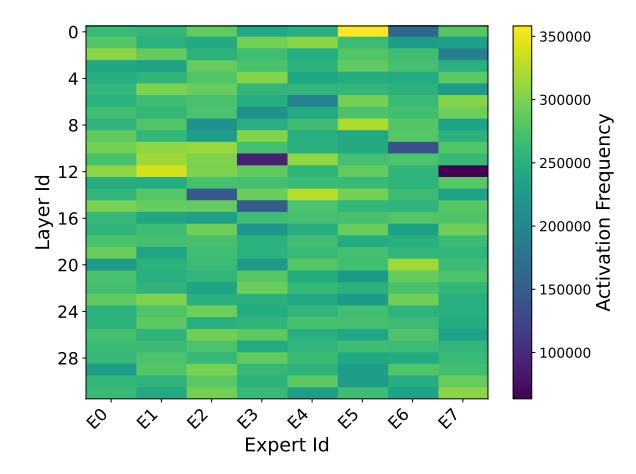

# 2 Background and Motivation

In this section, we first outline the MoE Transformer architecture and explain why its routing dynamics make inference highly memory-bound. We then describe GPU-NDP hybrid systems, highlighting how near-data execution mitigates weight-transfer overheads but introduces new challenges due to context-agnostic expert placement. Finally, we discuss quantization for MoE models and motivate the need for a context-aware strategy to match NDP constraints while preserving accuracy.

#### 2.1 MoE-based Transformers

In MoE-based Transformers, each feed-forward network (FFN) is replaced by a set of expert FFNs, and a router selects a small subset per token. Given a hidden state  $\mathbf{x} \in \mathbb{R}^d$ , the router  $R(\mathbf{x})$  produces scores  $w = \operatorname{Softmax}(W_g\mathbf{x})$ , and only the top-k experts are activated. Each expert FFN typically consists of two linear layers with an intermediate activation.

In practice, the parameter footprint of MoE models exceeds onpackage HBM capacity, so expert parameters are placed in an external tier and fetched on demand during inference [17, 18, 31]. The router's per-token, per-layer decisions yield small and rapidly

Figure 2: Activation frequency of all experts in Mixtral-8x7B.

changing working sets, which makes naive weight fetching particularly costly during the decoding stage.

## 2.2 GPU-NDP Hybrid Systems for MoE

To address the memory-bound nature of MoE inference and the limited capacity of GPU HBM, recent work has explored heterogeneous systems that couple GPUs with near-data processing (NDP) devices. Among these, CXL-attached NDP devices provide large-capacity DDR-class memory and high internal bandwidth. They can execute computations adjacent to offloaded parameters and support much larger MoE models at lower cost, making them a practical and deployable solution.

Building on the observation that expert activations are highly skewed, recent GPU-NDP MoE systems such as MoNDE [18] and PIMoE [33] introduce the concept of *hot* and *cold* experts. As shown in Figure 2, which reports the activation frequency of all experts in Mixtral-8×7B [16] on the WikiText-2 [24] task, the distribution is far from uniform: a few experts are frequently activated, whereas some remain rarely used. This skew implies heterogeneous arithmetic intensities (compute-to-memory ratios) across experts, suggesting a device-aware mapping: pin hot, compute-intensive experts in GPU HBM, and place cold or infrequently used experts in the NDP

tier, effectively turning parameter movement into cheaper activation movement [18].

However, prior GPU−NDP MoE systems largely rely on *ondemand* swapping and *context-agnostic* decisions at inference time. Under limited GPU↔CXL memory bandwidth, such reactive policies still incur substantial expert-transfer overheads and can reduce GPU utilization, which limits their efficiency and fails to fully exploit the inherent hot–cold characteristics of MoE experts.

