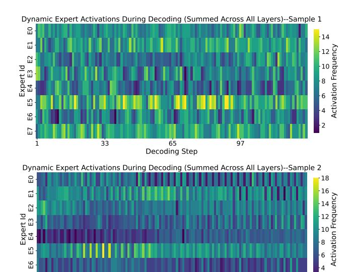

# 3.1 Context-Dependent Expert Activations

MoE models exhibit highly dynamic expert activation patterns. Our empirical observations show that, during the inference, the distribution of activated experts changes significantly between consecutive decoding steps and even across different inputs. Figure 3 illustrates these variations using two randomly sampled inputs from the C4 [26] dataset. In Sample 1, the activated experts exhibit highly irregular behavior across decoding steps, with neither uniform activation patterns nor similarity between adjacent steps. In Sample 2, the activation pattern across decoding steps appears more structured. However, this contrast between the two samples highlights a key phenomenon: expert activation is highly context-dependent. Even within the same dataset, different input sequences can trigger different activation behaviors.

Such variability implies that a static placement or a global frequency metric cannot capture an expert's importance. Therefore,

Figure 3: Different expert activation patterns for two samples with Mixtral-8×7B on the C4 dataset, indicating the context dependence.

merely assigning experts to different devices is insufficient, and the placement should be dynamically adjusted based on contexts.

