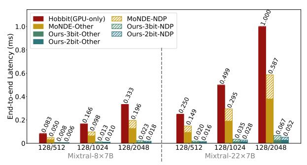
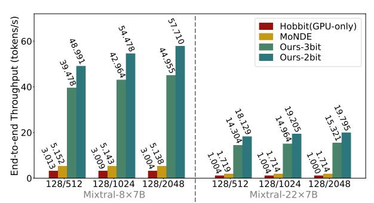

# 4.1 Expert Placement Module

As shown in Section 3.2, for the same input sequence, the expert activation distributions from prefill closely match those in decoding. We leverage this property to determine the GPU–NDP expert placement once per sequence. As shown in Lines 9–18 of Algorithm 1, at the beginning of prefill, we collect two statistics for each expert e in each MoE layer l: (i) its activation frequency  $P_{l,e}$  and (ii) its accumulated routing score  $W_{l,e}$ . These two metrics capture different aspects of expert usage: frequency reflects how often an expert is selected, while routing score reflects the confidence of each activation. Then we compute a normalized importance score:

$$S_{l,e} \; = \; \alpha \, \widetilde{P}_{l,e} \; + \; (1-\alpha) \, \widetilde{W}_{l,e},$$

where  $\alpha \in [0,1]$  controls the tradeoff and  $\widetilde{P}_{l,e}$  and  $\widetilde{W}_{l,e}$  denote normalized quantities. Based on  $S_{l,e}$ , we select the top-K most important experts in each layer and migrate them to GPU in FP16, subject to the GPU memory capacity. The remaining experts reside on CXL-NDP. Importantly, expert placement is performed *only once* after the prefill stage, and the decoding stage uses this fixed placement without further migration, i.e., each sequence undergoes only a single expert migration. For each routing decision, the computation is performed on the device hosts the selected experts.

## 4.2 Expert Bitwidth Selector on NDP

After expert placement is fixed, we quantize the experts that remain on NDP to reduce compute pressure during inference. Rather than quantizing weights on the fly, for each NDP-resident expert we cache a set of GPTO [9]-quantized replicas at bitwidths 1, 2, 3, 4. We then use a prefix-structured mixed-precision allocation to assign bitwidths to NDP-resident experts under a layer-wise average bitwidth budget, as shown in Lines 1-8 and 19-22 of Algorithm 1. Consider a layer with E total experts, among which  $E_{NDP}$  are placed on NDP. For these  $E_{NDP}$  NDP-resident experts, we allow candidate bitwidths {1, 2, 3, 4}, taking 1-bit as the initial bitwidth. This discrete bitwidth set enables average 2-bit or 3-bit quantization by mixing experts assigned to different bitwidths. Let  $\bar{b}$  denote the target average bitwidth on NDP for this layer. The corresponding number of "bitwidth increments" is  $R = E_{NDP}(\bar{b} - 1)$ , where each step  $1 \rightarrow 2$ ,  $2 \rightarrow 3$ , or  $3 \rightarrow 4$  consumes one unit of this increment budget. We reuse the importance ordering obtained in the expert placement module and index experts in descending order of importance as i = 1, ..., E. We construct a per-layer loss table using a calibration dataset such as C4. For each expert i and each bitwidth  $b \in \{1, 2, 3, 4\}$ , we measure a loss  $L_i(b)$ , defined as the MSE between the quantized output and a full-precision reference. From this table we extract the direct gains of moving from 1-bit to higher

$$\Delta_i(2) = L_i(1) - L_i(2), \quad \Delta_i(3) = L_i(1) - L_i(3),$$

$$\Delta_i(4) = L_i(1) - L_i(4).$$

To evaluate the total gain achieved by assigning higher bitwidths to the more important experts, we first accumulate these per-expert gains into prefix sums. Specifically, for any k, the cumulative benefits of upgrading the top-k experts from 1-bit to 2-, 3-, or 4-bit are

$$C_2(k) = \sum_{i=1}^k \Delta_i(2), \quad C_3(k) = \sum_{i=1}^k \Delta_i(3), \quad C_4(k) = \sum_{i=1}^k \Delta_i(4).$$

To keep the assignment aligned with the importance ranking, we enforce a prefix structure: more important experts receive quantization configurations with smaller expected loss (usually larger bitwidths), and less important ones receive progressively coarser settings. Let  $n_4$ ,  $n_3$ ,  $n_2$ ,  $n_1$  be the numbers of experts assigned to 4-, 3-, 2-, and 1-bit, respectively, with

$$n_4 + n_3 + n_2 + n_1 = E_{\text{NDP}}.$$

By treating 1-bit as the initial bitwidth, the bitwidth budget translates to

$$3n_4 + 2n_3 + n_2 = R$$
.

Given this structure, the total gain achieved by assigning  $(n_4, n_3, n_2)$  higher-precision experts is

$$\begin{split} G(n_4,n_3,n_2) &= C_4(n_4) \\ &+ \left[ C_3(n_4 + n_3) - C_3(n_4) \right] \\ &+ \left[ C_2(n_4 + n_3 + n_2) - C_2(n_4 + n_3) \right]. \end{split}$$

Intuitively, once the experts are sorted by importance, a prefix-structured assignment is fully determined by how many of the most important experts use each bitwidth. We therefore treat the counts  $(n_4, n_3)$  as search variables and derive  $n_2$  and  $n_1$  from the constraints. Concretely, we let  $n_4$  range over all integers such that  $0 \le n_4 \le E_{\text{NDP}}$  and  $3n_4 \le R$ , and for each fixed  $n_4$  we let  $n_3$  range over all integers such that  $0 \le n_3 \le E_{\text{NDP}} - n_4$  and  $3n_4 + 2n_3 \le R$ . For each feasible  $(n_4, n_3, n_2)$ , the total gain  $G(n_4, n_3, n_2)$  can be evaluated in constant time using the prefix sums  $C_2(\cdot)$ ,  $C_3(\cdot)$ ,  $C_4(\cdot)$ , and we simply keep the tuple  $(n_4^{\star}, n_3^{\star}, n_2^{\star})$  that attains the largest gain. Since the dominant time cost comes from enumerating all feasible  $(n_4, n_3)$  pairs, the per-layer time complexity is  $O(E_{\text{NDP}}^2)$ . And as we only apply this selection to NDP-resident experts and  $E_{\text{NDP}}$  is not large in practice, the overall overhead  $O(LE_{\text{NDP}}^2)$  across L layers is negligible relative to the inference cost.

Finally, once expert placement and NDP-side expert quantization bitwidth selection are completed before the decoding stage, we keep these configurations fixed during decoding, as shown in Lines 23-32 of Algorithm 1.

## 5 Evaluation

#### 5.1 Experimental Setup

Models and Datasets. We evaluate two popular MoE models, Mixtral-8×7B [16] and Mixtral-8×22B [32], to assess the effectiveness of our method on large-scale MoE models, as detailed in Table 1. We evaluate our method on a set of language understanding and reasoning benchmarks, including MMLU[11], MathQA[1], HellaSwag[39], ARC-Easy[6], ARC-Challenge[6], BoolQ[5], WinoGrande[27], and PIQA[3]. MMLU is evaluated in a 5-shot setting, while all other

tasks use zero-shot evaluation. All accuracy results are obtained using the EleutherAI LM Evaluation Harness [10].

Table 1: Configs of evaluated MoE models

| Model              | Hidden        | Layers | Experts | Top-k | Experts Params. | Params. |
|--------------------|---------------|--------|---------|-------|-----------------|---------|
| Mixtral-8×7B [16]  | (4096, 14336) | 32     | 8       | 2     | 45.1B           | 46.7B   |
| Mixtral-8×22B [32] | (6144, 16384) | 56     | 8       | 2     | 135.5B          | 140.6B  |

System Settings. To enable a fair and intuitive comparison, we adopt the same GPU–NDP system configuration used in MoNDE [18] and build our NDP system simulator on Ramulator [19] following the same methodology. The detailed configuration is summarized in Table 2. Our method migrates only a small number of high-importance experts to the GPU, while the remaining low-bitwidth experts are executed on the NDP devices. For the GPU-only baseline, all experts are loaded to the GPU on demand via PCIe. We evaluate multiple input—output length configurations to measure end-to-end latency and decoding throughput. Considering GPU memory capacity, for Mixtral-8×7B we place four hot experts per layer on the GPU and the remaining four on the NDP device. For Mixtral-8×22B, two hot experts per layer reside on the GPU and six are executed on the NDP device.

**Table 2: System configurations** 

| Component  | Specification   | Value                        |  |  |  |  |
|------------|-----------------|------------------------------|--|--|--|--|
| System     | Composition     | 1×H100 GPU + 1×DDR-based NDP |  |  |  |  |
|            | Interconnect    | PCIe Gen4 ×16                |  |  |  |  |
| GPU (H100) | SM Count        | 132                          |  |  |  |  |
|            | Peak Compute    | 989.4 TFLOP/s                |  |  |  |  |
|            | Memory Capacity | 80 GB HBM3                   |  |  |  |  |
| NDP Device | Capacity        | 512 GB                       |  |  |  |  |
|            | Bandwidth       | 512 GB/s                     |  |  |  |  |
|            | Compute Units   | 64 × (4×4 Systolic Arrays)   |  |  |  |  |
|            | Clock Frequency | 1 GHz                        |  |  |  |  |

Baselines. For performance evaluation, we use MoNDE [18] on the same GPU–NDP system as our primary baseline. We also include a GPU-only baseline HOBBIT [31], which is a mixed-precision expert offloading system. For accuracy evaluation, we mainly compare our method against the accuracy of the original full-precision models, which also represents the accuracy of MoNDE.

## 5.2 Performance Evaluation

We evaluate end-to-end latency and decoding throughput on two large MoE models, Mixtral-8×7B and Mixtral-8×22B, to demonstrate the benefits of the GPU–NDP system. Experiments are conducted under multiple input/output length configurations, and we additionally report the isolated NDP-side latency improvements. Figures 5 and 6 compare our method with all baselines. "Ours-3bit" and "Ours-2bit" denote average 3-bit and 2-bit bitwidth on the NDP device.

On Mixtral-8×7B, Ours-3bit achieves a **6.6–8.3**× end-to-end speedup over MoNDE on the same GPU–NDP system, while Ours-2bit achieves **7.9–10.6**×. The corresponding decoding throughput improvements reach **8.7**× and **11.2**×, respectively. On Mixtral-8×22B, Ours-3bit attains **7.6–8.7**× speedup and Ours-2bit achieves

9.5–11.2×, with decoding throughput gains of  $8.9\times$  and  $11.5\times$ . For both models, the NDP-side execution alone sees approximately  $5\times$  (3-bit) and  $8\times$  (2-bit) latency reductions.

These results show that our method benefits not only from low-precision NDP execution but, more importantly, from significant reductions in expert migration, which improves overall pipeline efficiency. Compared with the GPU-only baseline (Hobbit), our method delivers even larger gains: Ours-2bit achieves up to 18× speedup on Mixtral-8×7B and 19× on Mixtral-8×22B.

Figure 5: End-to-end latency comparison across different methods, with NDP-side latency shown separately to highlight the benefits of our method in both reducing NDP computation and minimizing expert migration.

Figure 6: End-to-end decoding throughput.

