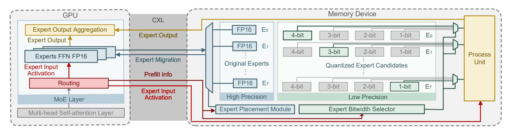

# Context-Aware Mixture-of-Experts Inference on CXL-Enabled GPU-NDP Systems

Zehao Fan\* Rensselaer Polytechnic Institute Troy, NY, USA

Yayue Hou Rensselaer Polytechnic Institute Troy, NY, USA Zhenyu Liu\* Rensselaer Polytechnic Institute Troy, NY, USA

> Hadjer Benmeziane IBM Research Europe Switzerland

Liu Liu Rensselaer Polytechnic Institute Troy, NY, USA Yunzhen Liu University of Massachusetts Amherst Amherst, MA, USA

Kaoutar El Maghraoui IBM T. J. Watson Research Center Yorktown Heights, NY, USA

#### **Abstract**

Mixture-of-Experts (MoE) models scale large language models through conditional computation, but inference becomes memorybound once expert weights exceed the capacity of GPU memory. In this case, weights must be offloaded to external memory, and fetching them incurs costly and repeated transfers. We address this by adopting CXL-attached near-data processing (CXL-NDP) as the offloading tier to execute cold experts in place, converting expensive parameter movement into cheaper activation movement. Unlike prior GPU-NDP systems that are largely context-agnostic and reactive, we develop a context-aware MoE system that uses prefill-stage activation statistics to guide decoding-stage expert placement, dynamically pins hot experts in GPU-side HBM, and maps the remainder to CXL-NDP. To meet NDP's limited compute throughput, we introduce context-aware mixed-precision quantization that allocates per-expert bitwidths (1-4 bit) based on prefill stage. The resulting MoE inference system overlaps GPU and NDP execution while minimizing cross-device movement. The evaluation on the GPU-NDP system shows that our approach achieves up to 8.7× decoding throughput improvement over state-of-the-art method, while incurring only a 0.13% average accuracy drop.

## Keywords

Mixture-of-Experts (MoE), Near Data Processing (NDP), Quantization, System Design

#### 1 Introduction

Mixture-of-Experts (MoE) models[16, 23, 25, 29, 36] enable scaling large language models (LLMs) via conditional computation: Each Transformer layer replaces its FFN with a pool of experts and activates only a small subset per token. This sparsity preserves pertoken FLOPs while growing parameters, but it typically causes the full model to exceed GPU memory capacity. For example, inference with Mixtral 8×22B [32] in FP16 precision requires approximately 280 GB of memory, far exceeding the memory capacity of a single GPU, and therefore makes inference *memory-bound*: since all experts must remain accessible, naively offloading weights to external memory (e.g., CXL memory) forces frequent parameter transfers

over PCIe that dominate latency and reduce GPU utilization. As reported in [40], the latency of migrating an expert from the CPU to the GPU can exceed 90% of the total execution time of a Transformer block, greatly surpassing both expert and non-expert computation.

To overcome this bottleneck, recent work has explored heterogeneous systems that couple GPUs with near-data processing (NDP) devices [13, 18, 33, 38]. Among these, CXL-attached memory with near-data processing (CXL-NDP) provides large-capacity DDR-class memory and high internal bandwidth. These devices can execute expert computation near memory, converting large parameter movement into small activation movement, and they support much larger MoE models at lower cost, making them a practical and promising solution.

However, efficiently deploying MoE on GPU-NDP systems remains challenging. Prior GPU-NDP MoE systems are largely contextagnostic and rely on reactive or static policies that ignore the inherent dynamism of MoE routing: expert activation varies across layers, decoding steps, and even input sequences. As a result, on-demand expert placement can trigger unnecessary migrations between the GPU and the CXL-NDP tier, causing bandwidth contention. Static expert placement also presents a problem: experts mapped to NDP may suddenly become frequently activated (hot) and impose heavy compute pressure, while GPU-resident experts may become rarely activated (cold) and remain underutilized. Moreover, NDP compute units operate under tight power and area budgets, and even executing cold experts at full precision can introduce significant compute pressure and erode the benefits of near-data execution, shift the bottleneck to the NDP side, and erode the benefits of near-data execution.

To this end, we introduce a *context-aware* expert placement and quantization strategy for efficient MoE inference on GPU–NDP system, as shown in Figure 1. Our design leverages runtime prefill statistics to guide both expert *placement* and *precision*. Our main contributions are:

1) Empirical analysis of context-aware expert behavior. We quantify the context dependence of MoE routing and show that expert activations vary significantly across decoding steps and input sequences, making static and on-demand expert placement ineffective.

\*Both authors contributed equally to this work.

Figure 1: System overview. During MoE inference, prefill-stage expert activation statistics are collected and fed to two modules: the Expert Placement Module, which runs once per sequence to determine an efficient GPU/NDP expert mapping; the Expert Bitwidth Selector, which uses the same statistics to assign per-expert quantization bitwidths on the NDP device, improving system performance while reducing accuracy loss.

- 2) Prefill-guided expert placement. We further observe that prefill-stage routing distributions strongly predict decoding-stage behavior. This finding enables our informed expert placement: During the prefill stage of each sequence, we collect expert activation statistics to determine its importance. Important experts are placed on the GPU in full precision, while the remaining experts stay on NDP in low precision. The decoding stage then follows this prefill-guided placement, preserving MoE's context awareness without incurring frequent expert migration.
- 3) Context-aware mixed precision for NDP. We adopt a mixed-precision quantization inspired by the recent method MC [14]. For each NDP-resident expert, we cache a set of GPTQ [9]-quantized replicas at different precisions. We then apply a prefix-structured mixed-precision allocation to assign bitwidths based on the same prefill-stage expert importance information and a precomputed quantization loss table.

