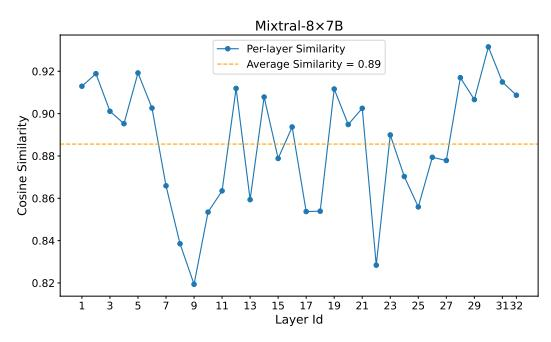

# <span id="page-2-2"></span>3.2 Context-Aware Opportunities from Prefill

While expert placement in GPU–NDP systems should ideally be dynamic, this dynamism also brings a practical challenge. The purpose of introducing NDP is to reduce the overhead caused by expert offloading and migration. If the system updates the placement too frequently, for instance at every decoding step, the additional transfers may eliminate the bandwidth benefits provided by NDP. As a result, it becomes important to define appropriate conditions and timing for expert migration.

<span id="page-2-1"></span>

Figure 4: Expert activation similarities between prefill and decoding, motivating context-aware design.

Fortunately, our analysis provides a useful observation that helps address this issue. Within the same sequence, the expert activation probability distribution during the prefill stage is often very similar to the distribution observed during decoding. Figure 4 shows this effect for the Mixtral-8×7B [16] model on the TruthfulQA [22] task.

<span id="page-3-1"></span>Algorithm 1 Context-aware Expert Placement and Quantization

**Require:** MoE model with L layers, E experts; GPU-side expert budget K (per layer); NDP-side expert avg. bitwidth  $\bar{b}$ ; mixing coefficient  $\alpha$ ; calibration dataset  $\mathcal{D}_{\text{cal}}$ 

1: Offline Calibration (once)

```
2: for l = 1 to L do
         for e = 1 to E do
 3:
              for b \in \{1, 2, 3, 4\} do
 4:
                   Estimate loss L_{l,e}(b) on \mathcal{D}_{cal}
 6:
         end for
 7:
 8: end for
 9: Online Inference (for each sequence)
10: Prefill:
11: Run prefill and collect for each layer l and expert e: activation
     counts P_{l,e} and routing-score sums W_{l,e}.
12: Expert Importance and Placement
13: for l = 1 to L do
         \tilde{P}_{l,e} \leftarrow \text{Norm}(P_{l,e}), \ \tilde{W}_{l,e} \leftarrow \text{Norm}(W_{l,e})
14:
         S_{l,e} \leftarrow \alpha \tilde{P}_{l,e} + (1-\alpha) \tilde{W}_{l,e}
15:
         \mathcal{H}_l \leftarrow \text{top-}K \text{ experts by } S_{l,e}
                                                                       ▶ GPU, FP16
16:
         C_l \leftarrow \{e \mid e \notin \mathcal{H}_l\}
                                                               ▶ experts on NDP
17:
18: end for
19: Expert Bitwidth Assignment on NDP (Prefix-Split)
20: for l = 1 to L do
         b_{l,e} \leftarrow \text{PrefixSplit}(\{S_{l,e}\}_{e \in C_l}, \{L_{l,e}(b)\}_{e \in C_l}, \bar{b}) \rightarrow \text{Sec.4.2}
21:
22: end for
23: Decoding:
24: for each decoding step do
         for each selected expert e in layer l do
25:
              if e \in \mathcal{H}_l then
26:
                   Run expert on GPU (FP16)
27:
28:
                   Run expert on NDP with bitwidth b_{l,e}
29:
               end if
30:
         end for
31:
32. end for
```

We compute the cosine similarity between the prefill and decoding expert activation probability distributions and report the average across all samples. Mixtral-8×7B has eight experts per layer, and the average similarity across all layers reaches 0.89.

These results indicate that the prefill stage already provides a reliable estimate of how experts will be activated during decoding. Therefore, the activation statistics collected in the prefill stage can be used to guide expert placement for the remainder of the inference. This approach helps avoid unnecessary migrations while still capturing context-aware activation behavior.

## 4 Context-Aware MoE System Design

This section presents our context-aware MoE system design based on GPU-NDP, which consists of two tightly coupled components, as shown in Figure 1: (i) a *dynamic expert placement module* that

leverages routing statistics collected during the prefill stage to decide which experts reside on GPU and which remain on CXL-NDP, and (ii) a *dynamic bit-width selector* that applies mixed-precision quantization to NDP-resident experts under a per-layer bit-width budget. Together, these components exploit the contextual activation dynamics of MoE models and enable efficient inference with minimal expert migration.

