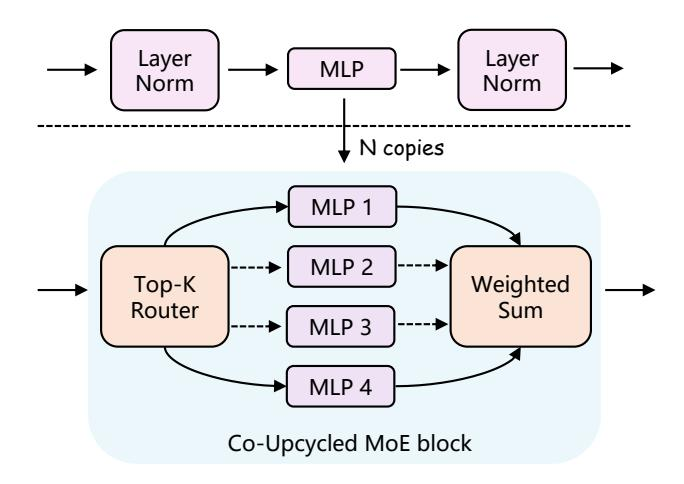

# 2.1. Multimodal LLM

While the ultimate goal for mulitmodal models may be generative across various modalities [\[4,](#page-8-5) [63,](#page-10-9) [70\]](#page-10-10), modern multimodal LLMs primarily focus on integrating additional modalities, such as vision, into LLMs. Instruct-BLIP [\[13\]](#page-8-1) adopts Q-Former [\[38\]](#page-9-5) to sample from visual tokens for LLM to feed-forward and follow the instructions. Flamingo [\[1\]](#page-8-6) and IDEFICS [\[25,](#page-9-6) [34\]](#page-9-7) use shared decoder for visual-language understanding. Qwen-VL [\[3\]](#page-8-0) uses three-stage training to convert QwenLM to Qwen-VL. LLaVA series [\[46](#page-10-2)[–48\]](#page-10-3) adopt visual instruction tuning that uses instruction-following data to convert LLM into multimodal LLM. ShareGPT4V [\[8\]](#page-8-2) collects detailed image caption data from GPT4V to augment the LLaVA models. HoneyBee [\[6\]](#page-8-4) investigates different designs of the MLP connector for better alignment. VILA [\[44\]](#page-9-1) unfreezes the LLM during pre-training with interleaved image-text data. MoE-LLaVA [\[43\]](#page-9-8) adopts the MoE design in small LLMs and reaches comparable performance to LLaVA with large LLMs. VCoder [\[28\]](#page-9-9) adopts various vision adapters to enhance visual perception abilities. SPHINX [\[20,](#page-9-2) [45\]](#page-9-3) adopts multiple visual encoders to enrich the visual features with scaled data and models. InternLM-Xcomposer [\[14,](#page-8-7) [73\]](#page-10-11) is trained with interleaved text-image composition data and achieves state-of-the-art performance. InternVL [\[10\]](#page-8-3) scales up the vision encoder to a 6B ViT model. MM1 [\[54\]](#page-10-4) summarizes the essential steps towards building a strong multimodal LLM from a pre-trained LLM. Mini-Gemini [\[42\]](#page-9-0) further collects guided generation into the pipeline.

### 2.2. Mixture-of-Experts

Mixture-of-Experts [\[26\]](#page-9-10) is proposed to utilize a set of expert networks to address specific tasks by employing a gating network to determine the selection of these experts. Recently, it has gained popularity in the design of large language models [\[17\]](#page-8-8). The mainstream practice [\[60\]](#page-10-6) is to replace the dense MLP layers with Top-K sparsely-gated mixture-of-experts (MoE) layers in the transformer [\[68\]](#page-10-5).

MoE in Language Subsequent works [\[18,](#page-9-11) [35\]](#page-9-12) have further scaled up MoE-based large language models with improved stability and load balancing of experts. The design of gating networks often involves selecting the top-k experts for each token [\[35,](#page-9-12) [60\]](#page-10-6). Various routing strategies have been explored, such as choosing top-k tokens by experts [\[75\]](#page-11-0), oneto-one matching between experts and tokens [\[36\]](#page-9-13). Besides routing strategies, maintaining the load balance of experts is crucial for training MoE models. ST-MoE [\[77\]](#page-11-1) adopts loading balancing loss and router-z loss to ensure a balanced distribution of the experts. Upcycling [\[33\]](#page-9-14) proposes training sparse experts from dense checkpoints to stabilize training and lower the cost. Recent large language models like Gemini-Pro [\[58\]](#page-10-8) and DBRX [\[65\]](#page-10-7) are also based on the MoE design.

MoE in Vision The success of MoE extends to the vision community, particularly following the popularity of vision transformers [\[5,](#page-8-9) [15,](#page-8-10) [22,](#page-9-15) [23,](#page-9-16) [27,](#page-9-17) [39,](#page-9-18) [76\]](#page-11-2). V-MoE [\[59\]](#page-10-12) reaches

Figure 3. Initialization of MoE blocks via Co-Upcycling. Each MLP expert within the MoE block during the visual instruction tuning stage is initialized from the corresponding pre-trained MLP.

comparable performance to dense ViT while only requiring half of the compute. LIMoE [\[55\]](#page-10-13) replaces dense MLP layers with MoE layers in CLIP and observes improvements in zero-shot image classification. Residual MoE [\[69\]](#page-10-14) corporates residual design into MoE transformer and saves over 30% training cost. AdaMV-MoE [\[9\]](#page-8-11) proposes an adaptive MoE framework for multi-task learning.

