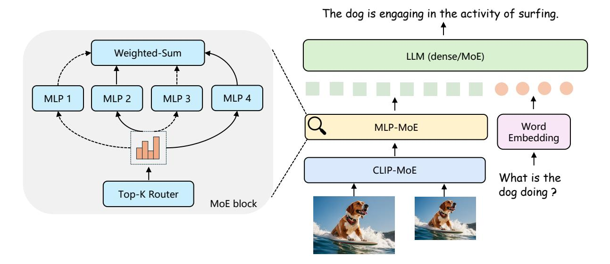

# Abstract

*Recent advancements in Multimodal Large Language Models (LLMs) have focused primarily on scaling by increasing text-image pair data and enhancing LLMs to improve performance on multimodal tasks. However, these scaling approaches are computationally expensive and overlook the significance of efficiently improving model capabilities from the vision side. Inspired by the successful applications of Mixture-of-Experts (MoE) in LLMs, which improves model scalability during training while keeping inference costs similar to those of smaller models, we propose CuMo, which incorporates Co-upcycled Top-K sparselygated Mixture-of-experts blocks into both the vision encoder and the MLP connector, thereby enhancing the multimodal LLMs with neglectable additional activated parameters during inference. CuMo first pre-trains the MLP blocks and then initializes each expert in the MoE block from the pre-trained MLP block during the visual instruction tuning stage, with auxiliary losses to ensure a balanced loading of experts. CuMo outperforms state-of-the-art multimodal LLMs across various VQA and visual-instructionfollowing benchmarks within each model size group, all while training exclusively on open-sourced datasets. The code and model weights for CuMo are open-sourced at [https://github.com/SHI-Labs/CuMo.](https://github.com/SHI-Labs/CuMo)*

## 1. Introduction

The advent of GPT-4V [\[56\]](#page-10-0) has sparked excitement within open-source communities to transform large language models (LLM) into multimodal LLMs. Recent multimodal LLMs [\[3,](#page-8-0) [13,](#page-8-1) [47\]](#page-10-1) typically integrate pre-trained vision encoders and LLMs with visual instruction tuning data to fine-tune the pre-trained LLMs, enhancing their visual understanding capabilities. To further scale up multimodal

Figure 1. Comparisons of CuMo Mistral-7B with state-of-the-art 7B multimodal LLMs. CuMo outperforms strong open-sourced models such as Mini-Gemini and LLaVA-NeXT, as well as the private MM1 model.

LLMs, previous efforts [\[8,](#page-8-2) [42,](#page-9-0) [44,](#page-9-1) [46,](#page-10-2) [48,](#page-10-3) [54\]](#page-10-4) primarily focus on training the model with a more extensive collection of text-image paired data and employing stronger LLMs, significantly increasing training efforts. On the vision side, recent work concentrates on leveraging multiple vision encoders [\[20,](#page-9-2) [45\]](#page-9-3) to enrich visual content, employing larger vision encoders [\[10\]](#page-8-3), and using advanced visionlanguage connectors [\[6\]](#page-8-4) to improve performance on multimodal tasks. However, these techniques result in an increased number of additional parameters and generate additional visual tokens for LLMs to process, making it inefficient to scale.

In terms of efficiently scaling up models, Mixture-of-Experts (MoE) has become the de-facto framework in modern large-scale neural networks, particularly in natu-

\* Work done during an internship at ByteDance Inc., San Jose, CA. Correspondence to X. Wang (xinyao.wang@bytedance.com) and H. Shi.

Figure 2. Architecture of CuMo. CuMo incorporates sparse Top-K MoE blocks into the CLIP vision encoder and vision-language MLP connector, thereby improving the multimodal LLM capabilities from the vision side. Skip connections are omitted for simplicity. Further implementation details are provided in Section [3.2.](#page-3-0)

ral language processing (NLP). Most large language models (LLM) are built upon the transformer [\[68\]](#page-10-5) architecture, wherein sparse MoE is used to replace the dense MLP block with the Top-K sparsely-gated MoE block [\[60\]](#page-10-6). Recent state-of-the-art open-sourced [\[30,](#page-9-4) [65\]](#page-10-7) and private [\[58\]](#page-10-8) LLMs have predominantly adopted the sparse MoE architecture. These models are scaled up using the MoE design during training while maintaining relatively lower inference costs as only selected MLP experts are activated during the feed-forward process. Nevertheless, the development and optimization of MoE-based models have been largely tailored to LLMs, and the exploration of scaling multimodal LLMs with MoE, especially on the vision side, remains largely unexplored.

Motivated by these observations, we introduce CuMo, which integrates Top-K sparsely-gated MoE blocks into the vision encoder and the MLP connector of multimodal LLMs, as depicted in Figure [2.](#page-1-0) We also explore the associated training recipe and methodology for CuMo. Firstly, we pre-train the MLP connector and perform pre-finetuning to warm up the whole model without introducing the MoE architecture, which stabilizes the following visual instruction tuning stage with newly incorporated sparse MoE blocks. Then, we replace each MLP block with the sparse MoE block in the MLP connector and the vision encoder through co-upcycling. Each expert within the sparse MoE block is initialized from the corresponding MLP block after the pretraining and the pre-finetuning stages. Additionally, each MoE block contains a Top-K router trained from scratch to select experts during the visual instruction tuning stage with auxiliary losses on the router to maintain a balanced loading of experts. We conduct further comparisons between co-upcycled LLMs and pre-trained MoE-based LLMs. The results show that the pre-trained MoE-based LLMs significantly outperform the co-upcycled LLMs. As a result, the upcycling of LLMs is not included in CuMo. Our models are trained fully on open-sourced datasets that are converted to visual instruction following formats. Experimental results demonstrate that CuMo outperforms other stateof-the-art multimodal LLMs on various VQA and multimodal instruction-following benchmarks within the same model size group, as illustrated in Figure [1.](#page-0-0) Our contributions can be summarized as follows:

- We introduce CuMo, which integrates co-upcycled sparsely-gated MoE layers into both the MLP connector and the vision encoder, enhancing the multimodal LLM with only slightly additional activated parameters.
- We outline the training methodology for CuMo, including a three-stage training process with auxiliary losses to stabilize training and ensure a balanced loading of experts.
- We train CuMo exclusively on open-sourced datasets and pre-trained models. It outperforms state-of-the-art opensourced and private multimodal LLMs across multiple competitive benchmarks within each model size group.

## 2. Related Works

