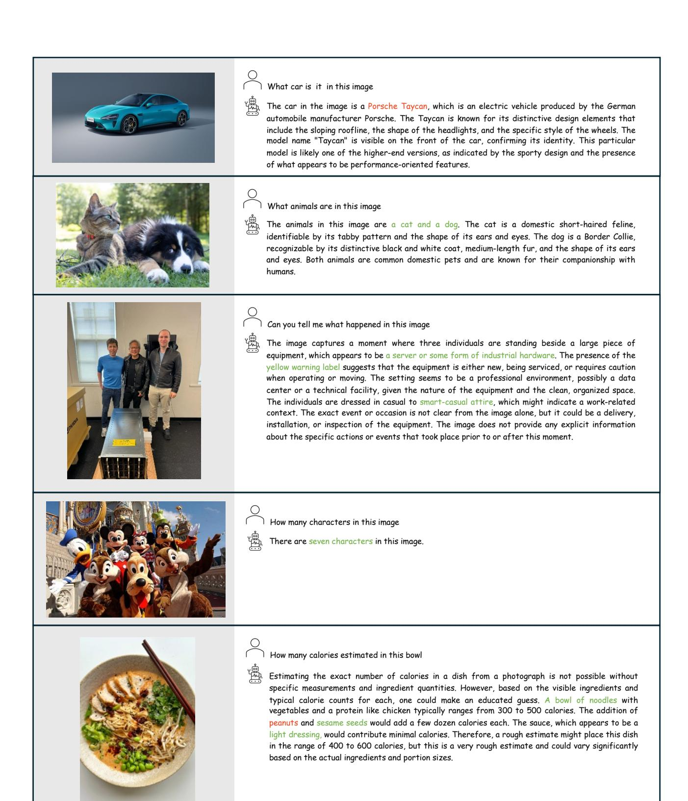

# **Appendix**

The supplementary material elaborates on further aspects of our work concerning the experimental setups and dataset usage. In Appendix A, we provide details on the datasets used for the visual instruction tuning stage and how we converted the mixture of datasets into the visual instruction following formats. In Appendix B, we present the hyperparameters used for the three-stage trainings. In Appendix D, we include additional examples of dialogues between the user and our M3 models.

#### A. Dataset Details

As outlined in Table 8, we provide detailed information on the datasets utilized for the three-stage training process mentioned in Section 3.3. All data are converted into the instruction-following format for training. For the Syndog-EN and DVQA datasets, we didn't use the entire training set as we observed that a large portion of synthetic data negatively impacts the zero-shot performance of the multimodal LLMs.

### **B.** Experimental Setup Details

Table 9 provides an overview of the main hyperparameters used during the three-stage training process. For the final results presented in Table 1, the model was trained using 32 × A100 GPUs with a total batch size of 256 and a learning rate of 4e-6. All ablation studies were conducted with a total batch size of 128 and learning rates of 2e-5 and 2e-6, as detailed in Section 4.3.

| Hyperparameter    | PT     | PFT     | VIT           |
|-------------------|--------|---------|---------------|
| learning rate     | 1e-3   | 2e-6    | 4e-6          |
| lr schedule       | Cosine | Cosine  | Cosine        |
| batchsize per GPU | 32     | 8       | 8             |
| GPUs              | 8×A100 | 16×A100 | 32×A100       |
| Zero              | Zero2  | Zero3   | Zero3-offload |
| Optimizer         | AdamW  | AdamW   | AdamW         |
| MLP               | Open   | Open    | Open          |
| CLIP              | Freeze | Open    | Open          |
| LLM               | Freeze | Open    | Open          |
| MoE blocks        | -      | -       | ✓             |
| Max Token         | 2048   | 4096    | 4096          |

Table 9. Hyperparameters used in three-stage training on Mistral-7B. PT: Pre-Training stage. PFT: Pre-FineTuning stage. VIT: Visual Instruction tuning stage.

| CuMo                              | CLIP  | MLP    | LLM    | Total  |
|-----------------------------------|-------|--------|--------|--------|
| Mistral-7B                        | 0.30B | 0.025B | 7.25B  | 7.58B  |
| ⇔ Activation Params               | 0.30B | 0.025B | 7.25B  | 7.58B  |
| + Top 2-in-4 MLP-MoE              | 0.30B | 0.10B  | 7.25B  | 7.65B  |
|                                   | 0.30B | 0.05B  | 7.25B  | 7.60B  |
| + Top 2-in-4 CLIP-MoE             | 0.91B | 0.10B  | 7.25B  | 8.26B  |
|                                   | 0.50B | 0.05B  | 7.25B  | 7.80B  |
| $\rightleftharpoons$ Mixtral-8x7B | 0.91B | 0.10B  | 46.70B | 47.71B |
|                                   | 0.50B | 0.05B  | 12.90B | 13.45B |

Table 10. Change of model parameters of CuMo. The 7.80B and 13.45B activation parameters corresponds to Act. of CuMo in Table 1.

#### C. Model Parameters

We include Table 10 to illustrate the evolution of parameters in the CuMo model throughout its construction process. The LLM constitutes a significant proportion of the total parameters, underscoring the potential for further scaling up the vision encoders to bolster the strength of multimodal LLMs.

### **D.** More Dialogues

We add more dialogues between the questions from user and the response from CuMo in Figure 7.

Figure 7. More dialogues between the user and CuMo. We highlight the correct answers and hallucinations from the responses of CuMo.