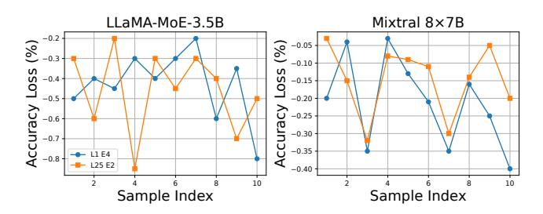
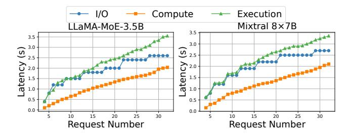
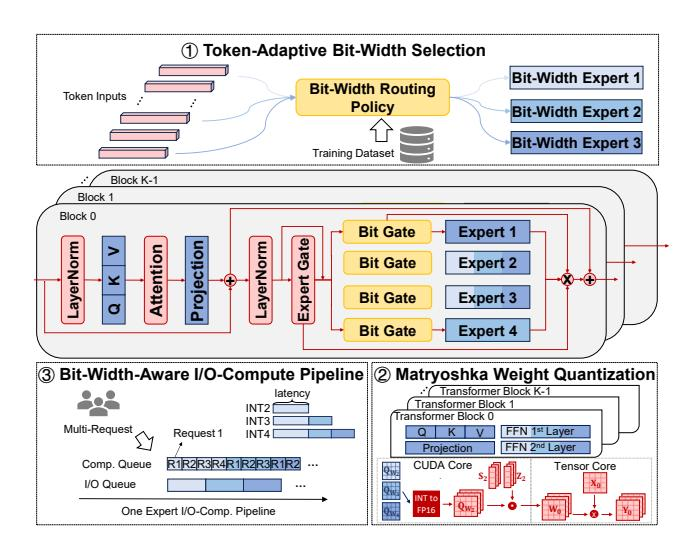
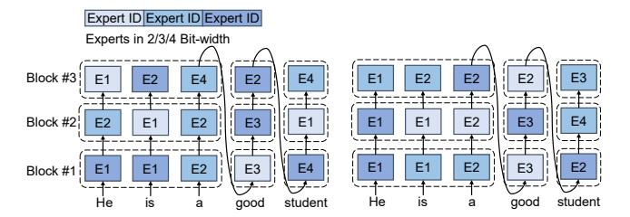
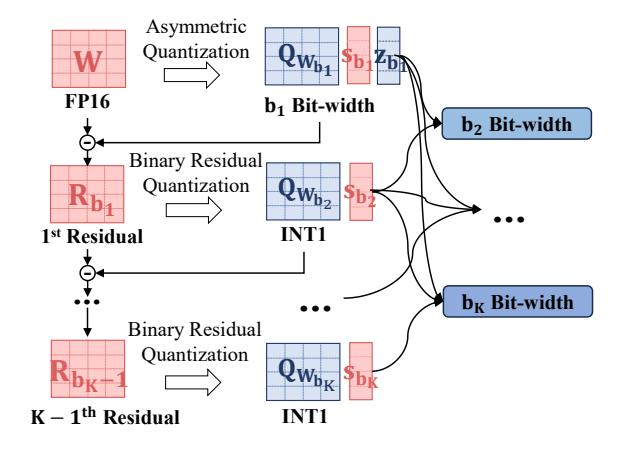
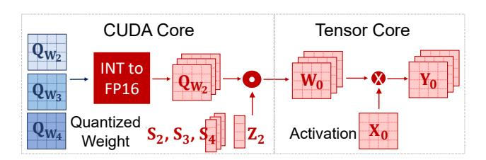
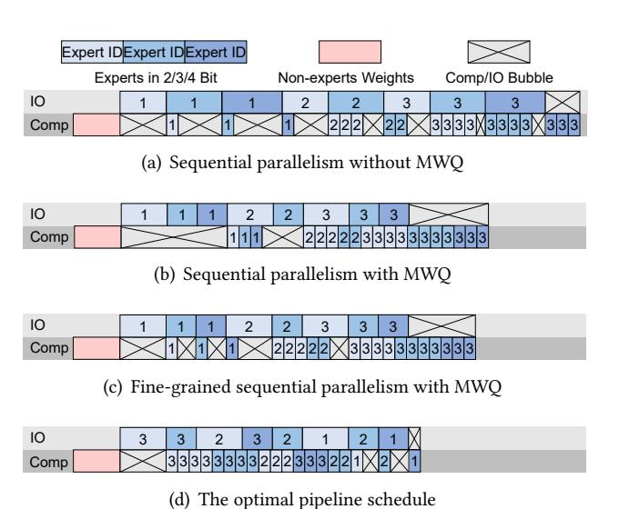

# 2.2 Observation

The above analysis highlights the necessity of optimizing memory usage by quantizing the model expert weights in edge environments. This section investigates the potential advantages of dynamically adjusting the expert bit-width to align with hardware characteristics, a pivotal consideration in the design of D2MoE.

Observation #1: Different bit-width in MoE-based LLM quantization bring different benefits in terms of accuracy-memory-latency. In most cases, the bit-width of quantization weights are predefined hyper-parameters that remain fixed during model inference. However, in MoE-based LLMs, varying the bit-width of different experts can provide distinct advantages in terms of accuracy, memory usage, and inference latency. As illustrated in Table [1,](#page-2-0) the LLaMA-MoE model [\[46\]](#page-14-7) was evaluated with various quantization bitwidth on an RTX 4090 GPU with 24GB of memory using the llama.cpp [\[11\]](#page-13-6) inference framework. The figure demonstrates the impact on memory footprint, latency, and model accuracy under different quantization settings. Specifically, quantizing the model to INT2 compared to INT8 reduces the memory footprint by 58% and improves latency by 30%, but the model accuracy drops drastically by 43%.

Summary: This highlights the importance of incorporating bit-width into the expert selection process for quantized MoEbased LLMs. This consideration is crucial for optimizing model performance in terms of accuracy, memory usage and latency.

<span id="page-3-0"></span>

Figure 2: Accuracy loss of expert quantization to INT1 across 10 samples from the Hellaswag dataset.

Observation #2: The importance of experts changes dynamically according to different input samples. Many LLM quantization methods have found that the model shards (e.g. layers and experts) show different importance to the accuracy of the model, and in order to ensure accuracy and reduce redundant I/O, they allocate higher bit-width to critical slices through offline profiling [14, 39, 42]. However, we observe that the importance of different experts changes dynamically with the input sample. As shown in Figure 2, we quantize expert 4 in layer 1 and expert 2 in layer 25 to INT1 while keeping other experts' bit-width unchanged. We evaluate the accuracy loss (expert importance) of LLaMA-MoE-3.5B and Mixtral 8×7B across 10 samples from the Hellaswag dataset. Our results reveal significant variability in precision loss across samples and even individual tokens. For instance, quantizing the  $4^{th}$  expert in the  $1^{st}$  layer to 1-bit results in a 0.5% accuracy drop on sample 1 for LLaMA-MoE-3.5B and a 0.2% drop for Mixtral 8×7B.

**Summary:** This highlights that the importance of each expert varies for different input samples, and thus, dynamically adjusting the expert bit-width to find the optimal setting for the activated experts is crucial for enhancing model performance.

Observation #3: Large bubble between I/O and computation of quantized experts led to substantial inference delays. Due to the limited memory capacity of edge devices, we adopt an on-demand method for loading activated quantized experts from disk during inference. However, as shown in Figure 3 the existing approach of loading experts in ascending order of expert IDs introduces significant bubbles between I/O and computation, leading to increased inference latency, particularly when request numbers exceeds 25. For instance, in LLaMA-MoE-3.5B with 32 requests, the expert I/O time is 2.6s, the computation time is 2.04s, and the total inference latency for the expert layer is 3.55s, which is 1.36× and 1.74× of the I/O and computation times.

**Summary:** This highlights that the I/O-compute pipeline paradigm for quantized experts create significant inefficiencies. There is a pressing need for designing scheduling plan aimed at minimizing bubbles during inference.

<span id="page-3-1"></span>

Figure 3: Comparison of expert I/O, computation, and inference latency with different request numbers.

### 2.3 Technical Challenges

Despite the insight that the dynamic expert bit-width routing policy is intuitive, there are still several challenges associated with implementing  $D^2MoE$  in complex edge environments. Challenge #1. Unbalanced and inefficient bit-width selection load. Edge devices, constrained by limited computational resources, require a trained lightweight gating network to dynamically select the appropriate bit-width for each expert without introducing significant computational overhead. The training of this gating network poses significant challenges, primarily due to two fundamental issues. Firstly, there is an imbalance in the selection of expert bit-width, as evidenced by the consistent selection of the same bit-width by numerous tokens for a specific expert [8]. Secondly, there is an irrational allocation of bit-width, where the selected expert bit-width is unable to ensure model accuracy [32].

Challenge #2. High memory overhead to store multiple versions of quantized experts. Limited memory on edge devices is also one of the main bottleneck constrain inference performance [14, 21]. If the basic LLM quantization [22, 41] is used, multiple quantization models with different bit-width versions have to be deployed, further exacerbating the high memory costs associated with LLM deployment. Therefore, to make D<sup>2</sup>MoE memory-efficient, a new quantization method should be devised to avoid storing multiple versions of different bit-width.

Challenge #3. Significant runtime overhead on weight dequantization operations. During model inference, the weight-only quantization approach requires the online transformation of quantized weights into the same data type as the activation for matrix computation. This dequantization operation introduces significant runtime overhead, typically accounting for 20%-70% of the entire inference process. To minimize the time spent on dequantization, it is crucial to design specific dequantization kernels tailored to the quantization method and aligned with the hardware characteristics. Challenge #4. Lightweight and efficient online scheduling strategies address the large parallelism bubble

<span id="page-4-0"></span>

Figure 4: The architecture overview of D<sup>2</sup>MoE.

between I/O and computation. Multi-requests are inherently heterogeneous and unpredictable in terms of resource and latency requirements, posing considerable challenges to LLM serving. Existing methods address these challenges by focusing on model placement policies and adaptive batch scheduling to achieve I/O-compute parallelism and reduce response latency [20, 35]. However, quantized LLMs serving must also consider the varying bit-width selections for different requests, complicating the design of a lightweight scheduling algorithm and parallel strategy.

#### 3 D<sup>2</sup>MoE SYSTEM DESIGN

#### 3.1 System Overview

D<sup>2</sup>MoE is the first execution engine designed to enable fast inference of quantized MoE-based LLMs on edge devices. As illustrated in Figure 4, D<sup>2</sup>MoE operates through two primary stages: the offline preprocessing phase and the online execution phase. The offline preprocessing phase, which is executed once prior to deployment, comprises two key modules: 1 token-adaptive bit-width selection and 2 matryoshka weight quantization. Initially, the token-adaptive bit-width selection module optimizes the bit-width allocation for different experts. Specifically, a lightweight plug-in network is trained for each expert using a generic dataset (e.g. C4 dataset) to dynamically select the bit-width for each token to achieve accuracy-memory-latency resources optimization. Following this, the D<sup>2</sup>MoE profiler applies the MWQ module to the MoE-based LLM using a small calibration dataset, effectively reducing the model's memory footprint.

In the online execution phase, the fine-tuned, quantized MoE-based LLMs from the offline preprocessing phase are deployed onto physical edge devices. The  $\rm D^2MoE$  engine then

<span id="page-4-1"></span>

Figure 5: Comparison between fixed and dynamic bitwidth allocation.

implements ③ the bit-width-aware I/O-compute pipeline to manage and schedule the execution of various requests in real-time which effectively minimizes the significant idle periods between I/O and computation, thereby enhancing overall efficiency.

#### 3.2 Token-Adaptive Bit-Width Selection

Inspired by MoD [31], the network can identify tokens critical to accuracy and assign higher bit-width activation experts accordingly. Moreover, dynamic bit-width selection aims to minimize peak memory footprint by making real-time decisions during inference. Our approach further reduces expert memory consumption while maintaining accuracy. As shown in Figure 5, traditional methods (left) quantize experts to a hybrid (e.g., INT2/3/4) bit-width offline and keep it static during inference. In contrast, the proposed token-adaptive bit-width selection (right) achieves the same output quality with significantly lower memory usage through dynamic bit-width allocation, enabling more efficient inference.

It involves 2 steps: (1) *quantized expert capacity* that balances the selection frequency of each bit-width during fine-tuning, and (2) *dynamic bit-width selection loss* that optimizes the router to dynamically allocate bit-width based on the quantized expert capacity.

**Quantized expert capacity** constrains the token capacity of each expert during fine-tuning to prevent overfitting to specific token sequences. Specifically, given that the total number of tokens processed by each transformer block is T, we define the quantized expert capacity as  $\{c_k\}_{k=1}^K$ , where  $\sum_{k=1}^K c_k = 1$ . This formulation indicates that the maximum number of tokens assigned to the k-th bit-width expert during each forward propagation in fine-tuning is  $c_k \cdot T$ . Any tokens exceeding this capacity will skip the computation of the corresponding expert. For example, if the total number of tokens is 60 and the capacity for a particular bit-width is 0.2, then this expert can process at most 12 tokens during fine-tuning. If 14 tokens are assigned to this expert in a forward pass, 2 tokens will be randomly dropped skipping computation for these tokens at this layer.

<span id="page-5-0"></span>

Figure 6: The workflow of MWQ.

The values of  $\{c_k\}_{k=1}^K$  are predefined based on hardware constraints to optimize memory and computational efficiency and remain fixed during fine-tuning. In addition, a balanced allocation across bit-width is crucial, as higher bit-width increase memory consumption, while lower bit-width may compromise accuracy.

**Dynamic bit-width selection loss** is introduced to finetune the bit-width router for selecting the optimal bit-width for activated experts. A lightweight, trainable bit-width router is placed before each expert to dynamically allocate bit-width, ensuring that higher bit-width are used for computing the most critical tokens by appropriately adjusting the logits. However, unlike the expert router, the bit-width router primarily focuses on model accuracy, which may lead to consistently favoring high bit-width due to their typically lower accuracy loss. To address this, we propose a novel bit-width balancing loss that complements the model accuracy loss to balance the selection frequency of different bit-width. Specifically, given a list of candidate bit-width experts  $(\{b_k\}_{k=1}^K)$  and a batch  $\mathcal S$  containing T tokens in a forward propagation, the total loss function can be described as:

$$Loss = \frac{1}{T} \sum_{x \in \mathcal{S}} \left( CE(p(x), q(x)) + \frac{\alpha}{L} \sum_{l=1}^{L} \sum_{k=1}^{K} p_k^l(x) b_k \right). \quad (1)$$

where  $p_k^l(x)$  represents the probability fraction assigned by the bit-width router to the k-th bit-width expert at layer l, p(x) and q(x) denotes the logits of the  $D^2MoE$  model and the original precision model (e.g., FP16) for token x after the LM head layer, respectively.

In this loss function, the first term is the cross-entropy loss, which encourages the bit-width router to prioritize higher bit-width. The second term serves as a regularization term, promoting the selection of lower bit-width to achieve

<span id="page-5-1"></span>

Figure 7: An example of MWQ for the weight matrix W with  $b_1 = 2$  and K = 3.

a balance. Therefore, the bit-width router dynamically selects different bit-width during inference while maintaining overall model accuracy.

#### 3.3 Matryoshka Weight Quantization

Token-adaptive bit-width selection effectively reduces memory overhead during inference. However, traditional quantization methods typically require storing multiple quantized versions at different bit-width, resulting in significant storage overhead. To address this challenge, inspired by the nested structure of Russian matryoshka dolls, we propose a novel multi-step quantization technique, MWQ which restructures expert weights into a nested hierarchy, embedding low bit-width weights within high bit-width weights. In the following sections, we first introduce the MWQ quantization algorithm, followed by the design of its corresponding dequantization kernel tailored to this technique.

3.3.1 Quantization Method. Figure 6 illustrates the multistep process of the proposed MWQ technique leveraging a list of candidate bit-width  $(\{b_k\}_{k=1}^K)$ . The process begins by quantizing the weights to the minimum supported bit-width (e.g., INT2 or INT4, denoted as  $b_1$ ) using asymmetric quantization. Subsequently, the bit-width is iteratively increased by quantizing the residual weights through binary residual quantization until the final  $b_K$  bit-width weight is obtained. In each step, transitioning from  $b_k$  to  $b_{k+1}$ , one additional bit-width is added along with the related scale factors.

Asymmetric Quantization. Sparse expert weights have been shown to be robust to asymmetric quantization, particularly under low bit-width settings [19]. During inference, tensors are dequantized to FP16 to enable matrix multiplication with activations. To mitigate precision loss, we first

apply per-group asymmetric  $b_1$  bit-width quantization. Quantization and dequantization are computed as follows:

$$\mathbf{Q}_{\mathbf{W}_{b_1}} = round(\mathbf{W}/\mathbf{s}_{b_1} + \mathbf{z}_{b_1}), \hat{\mathbf{W}}_{b_1} = (\mathbf{Q}_{\mathbf{W}_{b_1}} - \mathbf{z}_{b_1}) \cdot \mathbf{s}_{b_1}, (2)$$

where  $\mathbf{W} \in \mathbb{R}^{s \times h}$  represents the floating-point weight tensor,  $\mathbf{Q}_{\mathbf{W}_{b_1}} \in \mathbb{R}^{s \times h}$  is the quantized weight tensor, and  $\mathbf{z}_{b_1}, \mathbf{s}_{b_1} \in \mathbb{R}^{s \times h/g}$  are the zero points and scale factors for group-wise quantization. These are optimized as follows:

$$\arg\min_{\mathbf{z}_{b_1},\mathbf{s}_{b_1}} \|\mathbf{W}\mathbf{X} - \hat{\mathbf{W}}_{b_1}\mathbf{X}\|_2^2, \tag{3}$$

where  $\mathbf{X} \in \mathbb{R}^{h \times r}$  denotes the floating-point activation tensor, and g is the group size. To compute weights for higher bitwidth, we quantize the residuals  $\mathbf{R}_{b_1} = \mathbf{W} - \hat{\mathbf{W}}_{b_1}$ .

**Binary Residual Quantization.** To ensure that low bitwidth weights are subsets of higher bit-width weights while maintaining accuracy, we progressively apply per-group quantization with the binary residual approximation based on the  $b_1$  bit-width quantized residuals. The binary residual quantization and dequantization are computed as:

$$\mathbf{Q}_{\mathbf{W}_{b_{k}}} = round(\mathbf{R}_{b_{k-1}}/\mathbf{s}_{b_{k}}), \hat{\mathbf{Q}}_{\mathbf{W}_{b_{k}}} = \mathbf{s}_{b_{k}} \cdot \mathbf{Q}_{\mathbf{W}_{b_{k}}}, \tag{4}$$

where  $k=2,\cdots,K$ ,  $\mathbf{Q}_{\mathbf{W}_{b_k}} \in \{+1,-1\}^{s \times h}$  represents the accumulated one-bit weights from  $b_{k-1}$  to  $b_k$ , and  $\mathbf{s}_{b_k}$  is the per-group scale factor optimized as:

$$\arg\min_{\mathbf{s}_{b_k}} \|\mathbf{W}\mathbf{X} - \hat{\mathbf{W}}_{b_k}\mathbf{X}\|_2^2, \tag{5}$$

where  $\hat{\mathbf{W}}_{b_k} = \hat{\mathbf{W}}_{b_1} + \sum_{i=b_2}^{b_k} \mathbf{s}_{b_i} \mathbf{Q}_{\mathbf{W}_{b_k}}$  is the floating-point approximation of  $b_k$  bit-width quantized weights. By iteratively adding low bit-width quantized weights, arbitrary bit-width quantized weights can be constructed.

For example, as shown in Figure 7, we first apply asymmetric quantization (group size = 6) to obtain INT2 weight  $\mathbf{Q}_{\mathbf{W}_2}$ . Next, the residual  $\mathbf{R}_2$  is quantized via binary residual quantization to obtain an additional 1-bit weight, forming the INT3 weight by combining  $\mathbf{Q}_{\mathbf{W}_2}$  and  $\mathbf{Q}_{\mathbf{W}_3}$ . This process is repeated to generate another quantized weight  $\mathbf{Q}_{\mathbf{W}_4}$ , resulting in INT4 weight as the sum of all previous quantized weights.

Inspired by GPTQ [9], we further enhance the efficiency of post-training quantization by retaining only block-level compensation while eliminating column-level error corrections, ensuring the effectiveness of the MWQ strategy. Algorithm 1 provides a detailed outline of the complete MWQ process.

3.3.2 Dequantization Kernel. In per-group quantization, balancing accuracy enhancement with dequantization overhead is critical, yet prior studies have not facilitated efficient GEMM parallelism on GPU for dynamic bit-width. The primary performance constraint in executing dequantization for MWQ on edge device is the limited parallelism between tensor loading from various storage levels in the GPU and

#### Algorithm 1: Main algorithm of MWQ

```
Input: Weight tensor \mathbf{W} \in \mathbb{R}^{s \times h}, input tensor
                        \mathbf{X} \in \mathbb{R}^{h \times r}, block size \gamma, Hessian regularizer \lambda.
  1: \mathbf{H}^c := Cholesky((2\mathbf{X}\mathbf{X}^T + \lambda \mathbf{I})^{-1})
 2: \mathbf{Q}_{\mathbf{W}_{b_i}} := \mathbf{0}_{s \times h}, i = 1, \cdots, K
 3: for i < K do
               for b = 0, \gamma, 2\gamma, \cdots do
 4:
                        \mathbf{W}^b := \mathbf{W}_{:b:b+v}
 5:
                        if i = 1 then
  6:
                          7:
  8:
  g.
                          \begin{vmatrix} \mathbf{Q}_{\mathbf{W}_{b_i}:,b:b+\gamma} := \text{res\_quant}(\mathbf{R}_i^b) \\ \mathbf{R}_{b_i}^b := \mathbf{R}_{b_{i-1}}^b - \hat{\mathbf{W}}_{b_i}^b \end{vmatrix}
10:
                       \mathbf{E} := (\mathbf{W}_{:,b:b+\gamma} - \mathbf{Q}_{\mathbf{W}_{b;:,b:b+\gamma}}) / \mathbf{H}_{b:b+\gamma,b+\gamma}^c
12:
                        \mathbf{W}_{:,b+\gamma:} := \mathbf{W}_{:,b+\gamma:} - \mathbf{E} \cdot \mathbf{H}_{b:b+\gamma,b+\gamma:}^{c}
       Output: \{\mathbf{Q}_{\mathbf{W}_{b_i}}\}_{i=1}^K
```

<span id="page-6-1"></span>

Figure 8: The dequantization overview of D<sup>2</sup>MoE.

computations within the CUDA cores and Tensor cores. To address this, we have developed a parallel loading dequantization kernel that optimizes all levels of GPU storage.

This approach leverages a key innovation: fully overlapping tensor loading with tensor computations to simultaneously maximize bandwidth usage and computation throughput. Our method achieves loading parallelism by dynamically transferring quantized data from disk directly to GPU's global memory, concurrently with activations moving from global memory to L2 cache. For computation parallelism, as illustrated in Figure 8, expert dequantization in the CUDA cores is synchronized with expert computation in the Tensor core. Notably, traditional bit-transpose methods from various integer formats to FP16 are inefficient; we instead employ an optimized binary operation from the Any-Precision LLM [29], significantly enhancing processing speed.

### 3.4 Bit-Width-Aware I/O-Compute Pipeline

The nested structure of MWO quantization reveals a limitation in the existing I/O-compute pipeline paradigm, which fails to account for scenarios where experts with different bit-width are invoked across multiple requests, leading to significant parallel bubbles. To be specific, Figure 9 compares four distinct scheduling paradigm. The traditional I/Ocompute execution paradigm, which does not employ MWQ, sequences the I/O and compute queue of the expert module in ascending order by expert IDs and bit-width (Figure 9a). MWQ reduces the I/O size of experts by nesting low bit-width weights within high bit-width weights, thereby increasing the utilization frequency of low bit-width weights. For instance, if three requests select Expert 2, with one selecting INT2 and two selecting INT3, MWO ensures that all three requests call the INT2 weight (light blue, Expert 2), while the two requests requiring INT3 further call the medium blue weight (Expert 2). This nesting improves parallel efficiency by reusing low bit-width weights. However, due to sequential execution, significant parallel bubbles still occur (Figure 9b). Furthermore, It has been demonstrated that MWO is capable of performing expert I/O and computation scheduling at a fine-grained bit-width level. (Figure 9c). Ultimately, the optimal schedule (Figure 9d) minimize parallel bubbles by determining the execution order of experts at a fine-grained bit-width level during inference. Therefore,  $D^2$ MoE employs the bit-width-aware I/O-compute pipeline paradigm to reorder the activated experts with different bit-width, thereby reducing I/O wait time. In the following, the memory budget scheduler is introduced with the aim of reducing the frequency of expert I/O. Secondly, the bit-width-aware pipeline problem will be formulated, and then the Hottest-Expert-Bit-First (HEBF) algorithm will be introduced as a solution to the pipeline problem.

3.4.1 Memory Budget. To support MoE-based LLM inference in edge environments with dynamic memory constraints and reduce frequently loading experts, we introduce a memory budget M during expert I/O-compute pipeline. This parameter defines the upper limit of GPU memory allocated to experts and is configurable based on the available memory resources of edge hardware. Increasing the parameter M enables low bit-width weights, which are activated with greater frequency, to remain in GPU memory. Therefore, the necessity for frequent reloading is reduced.

As shown in Algorithm 2, at each layer, we first check whether the memory required by the current expert exceeds the available budget M (line 3). If the memory is sufficient, the pipeline of bit-width-aware I/O and computation is executed directly (line 9), followed by an update of the memory budget (line 10). If the memory is insufficient, high bit-width expert weights are released to free memory (lines 4-6). If the budget

<span id="page-7-0"></span>

Figure 9: Comparison between different I/O-compute parallel strategies.

```
Algorithm 2: Memory-Budget Scheduler
   Input: Generate length n, number of layers L,
           number of bit-width K, available memory
           budget M.
1: for i < n do
       for j < L do
           if layers[j] > M then
 3:
               \mathbf{for}\ k = 0\ \mathbf{to}\ K - 1\ \mathbf{do}
 4:
                    Free(layer[j-1][k])
 5.
                   Update M
 6:
               if layers[j] > M then
 7:
                   Free(layer[j-1][1])
 8:
           Load and Store (layer[j])
 9:
           Update M
10:
```

remains inadequate, low bit-width weights are also released as needed (lines 7-8). Finally, the pipeline is executed, and the memory budget is updated accordingly (lines 9-10).

- 3.4.2 Offline Profiling.  $D^2MoE$  measures the following hardware capabilities of the edge device at installation time.
- $T_{io}(b_k)$ :  $D^2$ MoE measures the average disk access delay for loading one expert in  $b_k$  bit-width, where  $b_k \in \{b_k\}_{k=1}^K$ . It only has to measure one expert per bit-width because all others have the same amount of parameters.
- $T_{comp}(b_k)$ : D<sup>2</sup>MoE calculates the average computation delay by measuring the dequantization delay for an expert with bit-width  $b_k$  and the execution delay for processing

a token. As the sizes of expert weights are deterministic, measuring a single expert per bit-width suffices.

The delays can be recorded offline and subsequently replayed at runtime because they are data-independent [15] and consistently determined by the bit-width.

*3.4.3 Parallelism Planning.* : In order to minimize the inference latency while satisfying the constraints, the goal of parallelism planning is to find an optimal I/O-Compute execution queue.

Variables. For each transformer block l, the set  $\Omega_l$  represents the execution queue, encompassing all the experts' bit-width indices selected. The matrix  $B_{j,k} \in \mathbb{R}^{N \times K}$  indicates the number of times the k-th bit-width of the j-th expert was selected, where N and K respectively denote the total number of experts and bit-width. For every  $s \in \Omega_l$  L(s, j, k) and C(s, j, k) specify the start time of the s-th quantized expert in the execution queues and the index of this quantized expert is the kth bit-width of the jth expert. The terms  $T_{io}(b_k)$  and  $T_{comp}(b_k)$ , previously defined, apply here as well.

**Objective.** Given that inference latency is influenced by bubbles during the parallel execution of tasks in the I/O-compute queues, we define our latency target as the difference between the total time overhead required to complete the compute queue and the load queue:

$$\min \sum_{j=1}^{N} \sum_{k=1}^{K} \left( B_{j,k} T_{comp}(k) - \sigma(B_{j,k} > 0) T_{io}(k) + \sum_{s \in \Omega_{I}} T_{wait} \right)$$

s.t. 
$$L(s+1, j, k) \le C(s, j, k), \forall s \in \Omega_l$$
 (6a)

$$L(s, j, k) \le L(s, j, k+1), \forall k \in \{1, \dots, K\}$$
 (6b)

$$T_{wait} = C(s, j, k) - C(s - 1, j, k) - B_{j,k} T_{comp}(k),$$
 (6c)

where if  $B_{j,k} > 0$  holds,  $\sigma(B_{j,k} > 0) = 1$ , otherwise  $\sigma(B_{j,k} > 0) = 0$ . Constraint (6a) ensures that computation begins only after the loading of the *s*-th quantized expert is complete. Constraint (6b) stipulates that each quantized expert should be loaded sequentially by increasing bit-width, thereby maximizing the reuse of experts with lower bit-width. Constraint (6c) describes how the *s*-th quantized expert waits in the queue until the I/O queue has finished loading.

**Solution.** Although the above problem can be solved using integer linear programming or dynamic programming, doing so online for every token at each expert layer introduces substantial inference delays. To address this, we propose the HEBF algorithm, which prioritizes I/O and computation for experts with higher activation frequencies. Frequently activated experts typically have longer computation times, allowing their execution to overlap with subsequent expert loading, thereby minimizing idle periods. The algorithm proceeds as follows: 1. Construct a queue  $Q_i$  for each expert, sorted in ascending order of bit-width; 2. Pop the

bit-width from the "head" of all expert queues and enqueue the element with the highest frequency into the I/O queue; 3. Sequentially load bit-width experts from the I/O queue and begin computation upon completion of loading. The HEBF algorithm satisfies key constraints: it prioritizes low bit-width experts first (Constraint (6a)), minimizes waiting time by overlapping computation with loading (Constraint (6b)), and ensures that loading completes before computation begins (Constraint (6c)).

#### 4 IMPLEMENTATION

We have fully implemented a prototype system of D<sup>2</sup>MoE with over 2,500 LOC in Python and CUDA in total atop Py-Torch. We use PyTorch's *triton* library [36] for I/O-compute parallel programming, and our CUDA programming is based on NVIDIA Ampere and Ada Lovelace architecture. Our approach focuses on the general process of data loading and MoE-based LLM inference, making it easily adaptable to other frameworks, such as TensorRT[27] and vLLM [20].

#### **5 EVALUATION**

#### 5.1 Experimental Setup

**Models and Datasets.** We evaluate D<sup>2</sup>MoE through two popular decoder-only MoE-based sparse LLMs: LLaMA-MoE-3.5B [46] and Mixtral 8×7B [17] have 8 experts per layer and utilize Top-2 routing, meaning that 2 experts are activated per layer during inference. The pre-trained weights for these models were directly obtained from Hugging Face. Moreover, we use C4 dataset [30] as the training data consists of 2048 random 2048 token segments to train bit-width routers and the calibration data consists of 128 random 2048 token segments to implement MWQ.

Metrics. We focus on model accuracy and throughput under different memory budget for D<sup>2</sup>MoE and the baselines. To evaluate model accuracy, we assess language generation performance by reporting perplexity on WikiText2 [26], and measure zero-shot performance on several popular benchmarks, including PIQA [1], ARC [7], BoolQ [6], HellaSwag [43], and Winogrande [33], using the lm-evaluation-harness [10]. For throughput, both the input and output lengths are 128. Hardware. We evaluate D<sup>2</sup>MoE on two prominent kinds of edge devices, as shown in the Table 2. The offline preprocessing phase of D<sup>2</sup>MoE, including fine-tuning the bit-width routers and MWQ, is carried out on a GPU server equipped with NVIDIA RTX 2×A6000.

**Baselines.** We compare D<sup>2</sup>MoE with two baselines and three state-of-the-art on-device MoE-based LLM inference frameworks: (1) *Hold-in-Memory*: This method quantizes all experts to INT8 and assumes that all model weights hold in GPU memory. Since INT8 quantization is nearly lossless in

<span id="page-9-0"></span>Table 2: Hardware environments for evaluation.

| Hardware  | Environmer           | nt 1   | Environment 2    |             |  |
|-----------|----------------------|--------|------------------|-------------|--|
|           | Device               | Memory | Device           | Memory      |  |
| GPU       | NVIDIA RTX 3060      | 6GB    | Jetson AGX Orin  | 64GB        |  |
| CPU       | Intel Core i7-11800H | 32GB   | ARM Cortex-A78AE | (SoC share) |  |
| Disk      | Samsung 970 EVO      | 1T     | Samsung 970 EVO  | 1T          |  |
| Disk Read | 3.5 GB/s             |        | 3.5 GB/          | s           |  |

terms of accuracy, we use this method as a baseline for evaluating model accuracy. However, it is not memory-efficient. (2) Matryoshka-Free: This method uses GPTQ [9] to quantize all expert into multiple versions INT2/3/4 and employs ondemand loading of experts. This baseline demonstrates the performance enhancements that are attributable to MWQ. (3) Hold-in-Memory-AWQ [23]: This method quantizes all experts to INT4 and keeps all model weights in GPU memory. This baseline provides an efficient benchmark for assessing the overhead of dynamically loading experts in D<sup>2</sup>MoE. (4) EdgeMoE [42]: This approach quantizes experts to different bit-width based on their importance, utilizing a pre-loading mechanism to predict and dynamically load the required experts during inference. (5) MoQE-DynaIO: This method quantizes all expert weights to a uniform bit-width (e.g., INT4/INT8) using the MoQE quantization method [19] and dynamically loads them on demand during inference. Similar to D<sup>2</sup>MoE, the quantized expert weights in all the above methods must be dynamically converted back to the original FP16 format during inference.

**Configuration.** We set the group size as 128 in MWQ and utilize two quantized versions of  $D^2MoE$ :  $D^2MoE$ -V1, which is compared with INT4 MoE-based LLMs, and  $D^2MoE$ -V2, which is compared with INT8 MoE-based LLMs.  $D^2MoE$ -V1 equipped with  $b_1=2$  and  $b_K=4$ , while  $D^2MoE$ -V2 using  $b_1=5$  and  $b_K=8$ . Furthermore, in  $D^2MoE$ -V1, the quantized expert capacity is set to  $\{0.3,0.4,0.3\}$ , and in  $D^2MoE$ -V2, the capacity of each expert is 0.25.

#### 5.2 End-to-End Results

Model Accuracy. Table 3 presents the the model accuracy of D<sup>2</sup>MoE with the baselines in LLaMA-MoE-3.5B and Mixtral 8 ×7B. It has been demonstrated that D<sup>2</sup>MoE and Matryoshka-Free exhibit perplexity and zero-shot performance that closely approximates Hold-in-Memory. This suggests that dynamic bit-width selection can effectively guarantee model accuracy. While EdgeMoE demonstrates comparable perplexity to D<sup>2</sup>MoE, it exhibits reduced accuracy in specific zero-shot tasks. This disparity can be ascribed to the differing significance attributed to the various markers, with EdgeMoE utilizing a predetermined mixture of bit-width to ascertain the importance of the experts, resulting in diminished accuracy. In contrast, both MoQE-DynaIO-INT4 and MoQE-DynaIO-INT8 demonstrate weaker performance in perplexity and

zero-shot tasks. This is due to the quantization method, which results in accuracy loss.

Throughput. Figure 10 shows a combined comparison of the throughput of D<sup>2</sup>MoE with the baseline with different memory budgets in environments 1 and 2. On Mixtral 8×7B,  $D^2MoE$  achieves a throughput improvement of  $1.14\times-1.39\times$ compared to EdgeMoE, and on LLaMA-MoE-3.5B, it improves throughput by 1.06×-1.16× while reducing memory usage by 33%-53%. Against MoQE-DynaIO, D<sup>2</sup>MoE delivers a 1.42×-3.37× throughput gain, particularly in Environment 1, underscoring its suitability for memory-constrained edge devices. The throughput of D<sup>2</sup>MoE approaches that of Holdin-Memory-AWQ as the memory budget increases, demonstrating near-complete overlap between expert loading and computation. For example, as shown in Figure 10(a) in Environment 1, Hold-in-Memory-AWQ achieves 94.3 tokens/s with 2500MB memory, while D<sup>2</sup>MoE reaches 89.14 tokens/s with a reduced budget of 1600MB.

D<sup>2</sup>MoE can adapt to diverse memory budgets on edge devices. For instance, when running Mixtral 8×7B in Environment 1, EdgeMoE and Hold-in-Memory-AWQ fail due to limited GPU memory, while D<sup>2</sup>MoE achieves a throughput of 38.07 tokens/s. Moreover, D<sup>2</sup>MoE scales throughput with memory budgets. As shown in Figure 10(c), with 32 requests, throughput rises from 66.45 tokens/s at M = 200MB to 83.14 tokens/s at M = 1600MB.

**Dense LLM Architecture.** We extend D<sup>2</sup>MoE to dense LLM architecture to compare throughput and peak memory footprint with the traditional approach using a fixed bit-width INT4 on environment 1 with  $M=1600 \mathrm{MB}$ . As illustrated in Figure 11, D<sup>2</sup>MoE consistently outperforms the method that dynamically loads a fixed bit-width FFN layer with varying request numbers, achieving up to a 1.22× increase in throughput and up to a 12% reduction in peak memory consumption. This advantage arises because conventional loading-based quantization methods only load INT4 bit-width, whereas D<sup>2</sup>MoE can dynamically load bit-width lower than INT4, thereby reducing data transfer overhead more effectively.

Moreover, as the number of requests increases, the throughput generally exhibits a near-linear growth. However, once the request number reaches 25, the increase slows down due to hardware computational constraints. This phenomenon also exists in MoE-based models. Nevertheless, the performance gains offered by  $\rm D^2MoE$  are not as pronounced as those observed in MoE-based LLMs, since the FFN layer typically constitutes only  $\rm 50\%-60\%$  of the total parameters in dense models. After quantization, this proportion becomes even smaller, thereby shifting the memory bottleneck to the attention layer.

| Model          | Method             | Perplexity ↓ | PiQA  | Arc.e | BoolQ | HellaSwag | Winogrande |
|----------------|--------------------|--------------|-------|-------|-------|-----------|------------|
| LLaMA-MoE-3.5B | Hold-in-Memory     | 14.55        | 72.32 | 48.76 | 65.56 | 66.34     | 61.77      |
|                | Matryoshke-Free    | 14.58        | 72.29 | 48.71 | 65.48 | 66.28     | 61.76      |
|                | Hold-in-Memory-AWQ | 15.89        | 69.32 | 46.52 | 62.54 | 61.55     | 57.44      |
|                | EdgeMoE            | 14.78        | 71.46 | 47.36 | 64.43 | 64.32     | 59.52      |
|                | MoQE-DynaIO-INT4   | 15.66        | 69.34 | 46.52 | 62.58 | 61.53     | 57.40      |
|                | MoQE-DynaIO-INT8   | 14.55        | 72.32 | 48.74 | 65.58 | 66.28     | 61.71      |
|                | 2MoE-V1<br>D       | 15.68        | 69.32 | 46.52 | 62.50 | 64.28     | 59.52      |
|                | 2MoE-V2<br>D       | 14.58        | 72.29 | 48.72 | 65.51 | 66.23     | 61.71      |
| Mixtral 8×7B   | Hold-in-Memory     | 4.04         | 82.4  | 82.6  | 80.56 | 84.1      | 76.5       |
|                | Matryoshke-Free    | 4.28         | 80.29 | 80.71 | 78.48 | 82.28     | 74.76      |
|                | Hold-in-Memory-AWQ | 4.25         | 80.32 | 81.52 | 78.54 | 83.55     | 75.44      |
|                | EdgeMoE            | 4.38         | 78.46 | 80.36 | 77.43 | 82.32     | 75.52      |
|                | MoQE-DynaIO-INT4   | 4.25         | 80.34 | 81.52 | 78.58 | 83.53     | 75.40      |
|                | MoQE-DynaIO-INT8   | 4.08         | 82.32 | 81.74 | 79.58 | 83.28     | 74.71      |
|                | 2MoE-V1<br>D       | 4.28         | 81.32 | 81.52 | 78.05 | 82.88     | 75.52      |
|                | 2MoE-V2<br>D       | 4.09         | 82.29 | 81.72 | 79.51 | 83.23     | 74.71      |
|                |                    |              |       |       |       |           |            |

<span id="page-10-0"></span>Table 3: Perplexity accuracy (lower is better) and zero-shot accuracy (higher is better) of D2MoE and the baselines in LLaMA-MoE-3.5B and Mixtral 8×7B.

