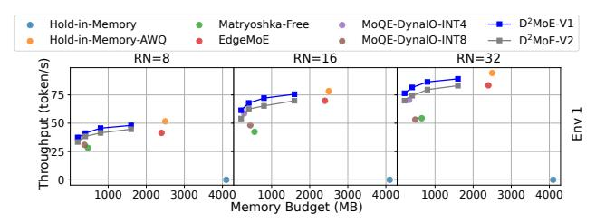
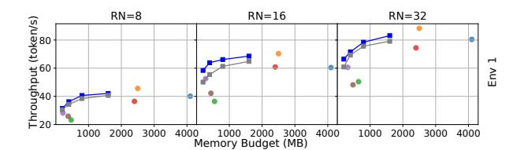
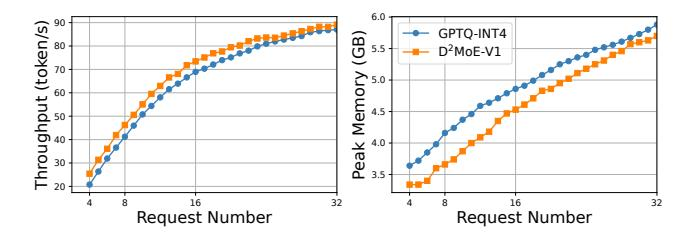
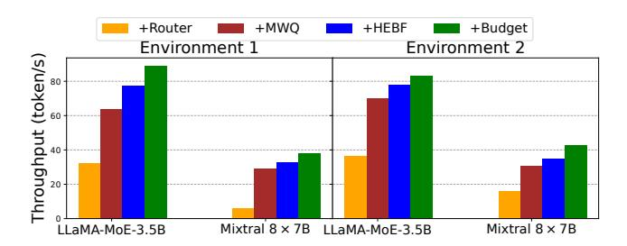

# 5.3 System Overhead

D2MoE Setup Overhead. The overhead of setting up D2MoE before inference, including fine-tuning bit-width routers and applying MWQ to quantize experts, is as follows. For LLaMA-MoE-3.5B, fine-tuning the bit-width routers with a batch size of 64 required approximately 2 hours, while MWQ with a batch size of 16 was completed in 10 minutes. For Mixtral 8×7B, fine-tuning with a batch size of 16 took over 4 hours, and MWQ with a batch size of 4 was completed in 20 minutes. Bit-Width Routing Overhead. As shown in Table [4,](#page-10-1) we evaluate the end-to-end overhead of the D2MoE bit-width router in terms of computation, memory usage, and latency on the LLaMA-MoE-3.5B and Mixtral 8 × 7B models under Environment 1. The additional computation and memory overhead compared to the original MoE-based model is under 0.5%, with an extra latency of approximately 1.5%, primarily attributed to the softmax operation in the router. Despite this minor overhead, the bit-width router significantly reduces data transfer by dynamically selecting lower-bit-width experts while maintaining accuracy.

Table 4: Overhead of D2MoE bit-width router on LLaMA-MoE-3.5B and Mixtral 8×7B.

| Model          | Computation | Memory | Latency |
|----------------|-------------|--------|---------|
| LLaMA-MoE-3.5B | 0.28%       | 0.53%  | 1.67%   |
| Mixtral 8×7B   | 0.22%       | 0.12%  | 1.04%   |

MWQ Dequantization Overhead. As shown in Figure [12,](#page-11-1) we evaluated the dequantization overhead of D2MoE in terms of computation, peak memory usage, and latency during inference on the LLaMA-MoE-3.5B and Mixtral 8×7B models in Environment 1. Dequantization introduces overhead by converting integer weights to floating-point representations via shift operations. This overhead is more significant with fewer requests, as fewer experts reuse the same bit-width. However, as the number of requests increases, the overhead decreases due to improved weight utilization. For instance, on the Mixtral 8×7B, when the number of requests increases from 4 to 32, the computational and latency overhead of D 2MoE-V1 decreases from 20.77% and 18.56% to 16.77% and 5.3%, respectively. While FP16 weights temporarily increase peak memory during dequantization, this memory is released immediately after use, resulting in minimal impact on overall inference efficiency.

Parallelism Planning Overhead. Parallelism planning for various quantized experts constitutes a significant overhead in the D2MoE framework. We conducted profiling on LLaMA-MoE-3.5B and Mixtral 8×7B with request numbers ranging from 4 to 32. The total execution times and the proportion of planning overhead for these models in environment 1 are depicted in Figure [13.](#page-11-2) It is evident that while the execution time for parallelism planning increases with the number of requests, its relative share of the overall inference process decreases. This reduction occurs because the number of loaded quantized experts rises with the increase in requests. Consequently, the additional overhead from parallelism planning

(a) Throughput of LLaMA-MoE in Environment 1.

(b) Throughput of Mixtral 8×7B in Environment 1.

(c) Throughput of LLaMA-MoE in Environment 2.

(d) Throughput of Mixtral 8×7B in Environment 2.

Figure 10: Throughput of D2MoE and baselines with different memory budgets.

Figure 11: Comparison of GPTQ and D2MoE throughput and peak memory in LLaMA2-13B.

remains manageable under on-device inference conditions with multiple requests.

(a) LLaMA-MoE-3.5B in Environment 1.

(b) Mixtral 8×7B in Environment 1

Figure 12: MWQ dequantization overhead of D2MoE.

Figure 13: The overall execution time (ms) and the overhead proportion (%) under different request numbers.

#### 5.4 Ablation Study

Figure 14 illustrates the contribution of each D2MoE component to throughput improvement through step-by-step integration. First, token-adaptive bit-width selection ("+Router") is added, enabling dynamic bit-width selection for each expert but still relying on conventional quantization, which stores multiple bit-width versions. Building on +Router, MWQ ("+MWQ") is introduced, nesting lower bit-width within higher ones to reduce expert loading overhead, improving throughput by 1.91×-4.95×. Next, the hottest-expert-bit-first criterion ("+HEBF") is added, parallelizing expert I/O and computation, further reducing I/O-compute bubbles and increasing throughput by 1.11×-1.21×. Finally, integrating expert memory budget ("+Budget") retains frequently activated low bit-width experts in GPU memory, reducing repeated loading and achieving an additional 1.06×-1.21× improvement. These enhancements due to reduced weight loading and a fine-grained balance of I/O and computation overhead.

Figure 14: Ablation study for each component of D2MoE on LLaMA-MoE and Mixtral 8×7B.

#### 6 DISCUSSION

The transition of LLMs from a dense to a MoE structure effectively sparsifies the model, reducing computational overhead. Building on this, we further slice the experts at the bit-width level, making the model even more sparse. In the future, we could explore finer granularities, such as sparsification at the neuron level within experts, which remains an open challenge. Currently, the D2MoE system has several limitations:

Asynchronous Execution on Edge Devices. D2MoE does not accommodate a parallel execution strategy for multiple, asynchronously received requests on edge devices. In scenarios where multiple requests initiate reasoning asynchronously, different requests activate distinct layers of experts, substantially increasing bandwidth pressure on edge devices. Developing a more sophisticated quantized expert scheduling algorithm could enhance inference speed by improving the I/O efficiency of quantized experts.

**Expert Loading Strategy.** D2MoE relies on the on-demand loading of experts, without considering preloading. This approach, while responsive, may introduce additional I/O wait times. Anticipating and preloading the experts likely to be activated later could foster a more efficient I/O/Compute parallel strategy. However, preloading complicates the I/O and Compute strategy, making it more dynamic. We aim to further investigate the viability of this intricate strategy in future research.

**Suitability for Edge Devices.** D2MoE may not perform optimally on edge devices with limited computational resources, such as smartphones that depend on mobile GPU capabilities. For mobile devices utilizing NPUs, the efficiency of the dequantization process in D2MoE cannot be assured. Nonetheless, these challenges can be solved through tailored NPU arithmetic and system optimizations, areas we plan to explore in our forthcoming efforts.

#### 7 RELATED WORK

**On-device MoE-based LLM Inference.** PowerInfer [34] leverages activation sparsity to facilitate inference acceleration on consumer-grade GPUs. EdgeMoE [42] enhances both

memory and computation efficiency by structuring the MoE models within a hierarchical storage framework. AdapMoE [45] features adaptive expert gating and management by a cohesive algorithm-system co-design, which boosts the inference speeds on edge devices. Fiddler [18] utilizes hybrid GPU-CPU computation on the experts of MoE models, thus minimizing the data transfer between CPUs and GPUs.

LLM Quantization. Post-training quantization currently stands as a prevalent technique for compressing LLMs, significantly reducing storage and I/O overhead by transforming high-precision floating-point numbers into low-precision integers. On the one hand, GPTQ [9], AWQ [22], and Quant-LLM [40] exemplify weight-only quantization methods, where weights are dynamically converted to the same data type as activation during inference. On the other hand, weight-activation quantization methods such as SmoothQuant [41], QServe [24], and AffineQuant [25] enhance inference speed by directly leveraging integer matrix multiplication operators embedded within hardware.

Pipeline Parallelism for LLM. Pipelining techniques are extensively employed to accelerate LLM reasoning by minimizing the gap between I/O and computation. STI [14] enhances I/O and compute resource utilization by applying mixed bit-width quantization to BERT model weights, thereby accommodating various target latencies and accuracy levels. OTAS [4] guarantees resilient transformer model services and handles fluctuations in both user requests and query loads through efficient token management.

#### 8 CONCLUSION

Aiming at enabling efficient on-device MoE-based LLM serving, we conduct an algorithm-system co-design and propose the  $\mathrm{D}^2\mathrm{MoE}$  framework, which introduces adaptive nested quantization based on token properties during multi-request inference.  $\mathrm{D}^2\mathrm{MoE}$  achieves optimal expert bit-width selection through dual routing and dynamic quantized expert scheduling with minimal I/O-compute parallelism bubbles. Realistic evaluation shows that  $\mathrm{D}^2\mathrm{MoE}$  significantly improves the latency-memory trade-off with an affordable inference overhead and guaranteed accuracy on edge devices.

#### 9 ACKNOWLEDGMENTS

This research was supported by fundings from the Hong Kong RGC General Research Fund (152169/22E, 152228/23E, 162161/24E), Research Impact Fund (No. R5060-19, No. R5011-23), NSFC/RGC Collaborative Research Scheme (Grant No. 62461160332 & CRS\_HKUST602/24), Collaborative Research Fund (No. C1042-23GF), Areas of Excellence Scheme (AoE/E-601/22-R), and the InnoHK (HKGAI). We also thank MetaX Technology for supporting this research.

