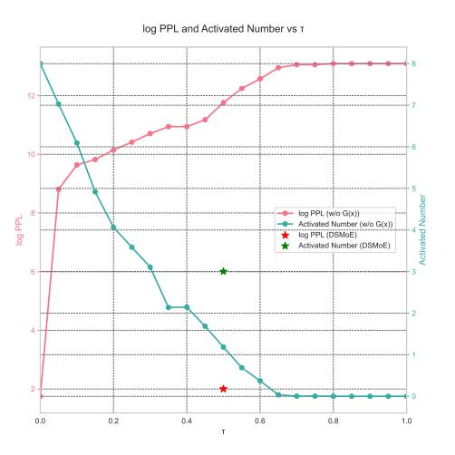
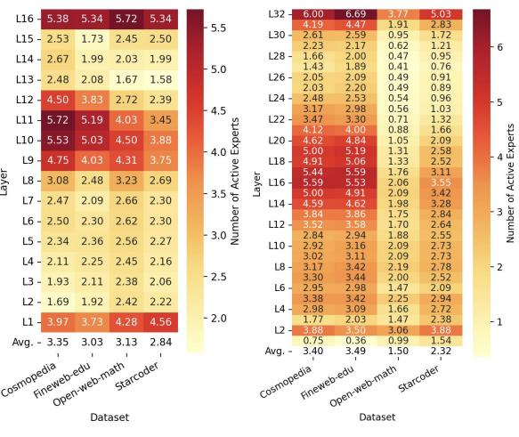

# 6.2 Ablation Study: Training without Piecewise Function G(x)

To validate the necessity of incorporating piecewise function learning during training, we conduct an ablation study by removing the piecewise function G(x) and using the following formula for training:

$$h_t^l = \sum_{i=1}^n o_i * \sigma(\hat{h_t^l} Y_i)$$
 (20)

Figure 2: During the training phase, G(x) is not utilized. In the inference phase, G(x) is employed for activation. The model's perplexity and the number of activated experts vary with the threshold  $\tau$ . The pentagram markers indicate the perplexity and number of activated experts achieved by DSMoE.

Prior to inference, we determine the appropriate activation level by adjusting the threshold value on the validation set, with a step size of 0.05. Figure 2 illustrates the relationship between perplexity and the average number of activated experts on the validation set.

The results clearly demonstrate that as the threshold increases, perplexity rises rapidly while the average number of activated experts decreases correspondingly. This observation indicates that without the piecewise function G(x), all experts participate in computation and gradient updates. Under the

constraint of sparsity loss, the model tends to distribute activation values uniformly across all experts rather than learning to distinctively identify more important experts. This leads to two consequences: first, the activation values for each expert are suppressed to a relatively low level, and second, the learned importance of each expert becomes relatively uniform. Under the same activation constraints as DSMoE, the approach without the piecewise function G(x) exhibits higher perplexity, highlighting how this training-inference inconsistency significantly degrades model performance.

#### **6.3** Layer-wise Activation Patterns Analysis

(a) Heatmap for 1B model (b) Heatmap for 7B model

Figure 3: Heatmap visualization of expert activation counts across different layers and average expert activations for LLaMA-7B and LLaMA-1B models on various validation sets.

We evaluated DSMoE across different validation sets and generated heatmaps to visualize the distribution of activated experts across network layers. Both model sizes exhibit a distinctive activation pattern: higher activation counts at both input and output layers, elevated activation in middle layers, and lower activation in remaining layers - forming a "W-shaped" pattern.

The bottom layers, which typically encode fundamental features, demonstrate high expert activation. This suggests the model's tendency to activate multiple experts in parallel to process multidimensional input features, potentially serving as an "information preservation mechanism" to retain critical base-level information. The top layers, responsible for final decision-making and output generation, show increased expert activation to enhance output robustness by reducing individual ex-

pert bias through collective decision-making. The elevated activation in middle layers suggests these layers serve as critical zones for feature transformation, integration, and processing of long-range dependencies. This bottom-middle-top activation pattern forms a complete information processing pipeline: bottom layers for extensive collection and processing of basic features, middle layers for feature transformation and information integration, and top layers for comprehensive decision-making and output generation.

Furthermore, we observed significant variations in both the average number of activated experts and activation patterns across different test sets. This indicates that DSMoE implements dynamic regulation mechanisms specific to different inputs rather than converging to a homogeneous learning pattern.

These observations provide novel insights for future MoE architectures, suggesting that expert activation counts can be strategically varied across different layers of the network.

## 7 Conclusion

This paper presents DSMoE, a novel approach that achieves model sparsification by partitioning pretrained FFN layers into computational blocks. Experiments on LLaMA models demonstrate superior performance over existing pruning and MoE approaches under equivalent computational constraints, while revealing distinctive layerwise activation patterns for future MoE designs.

