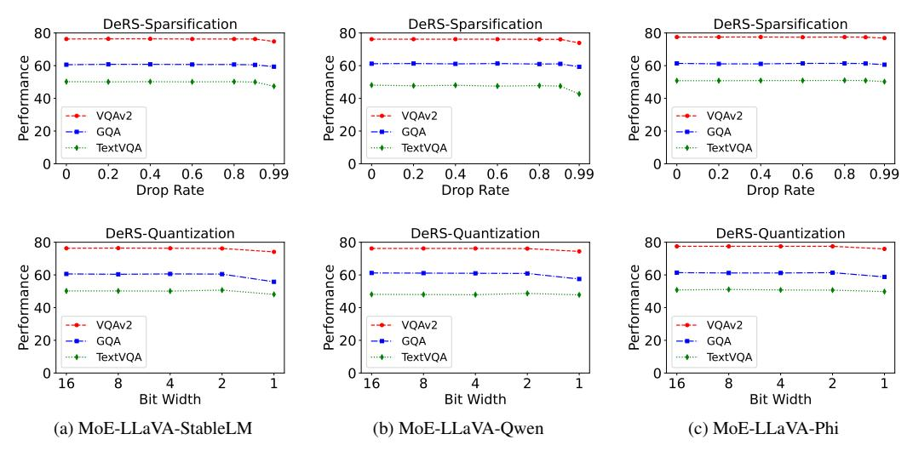
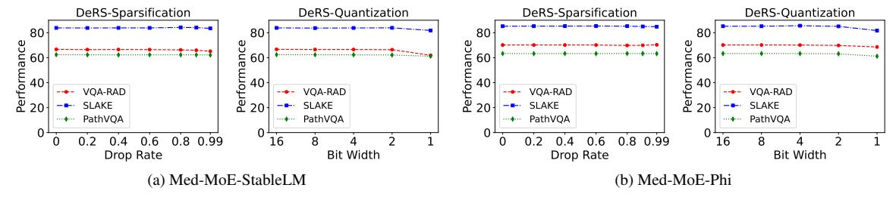

# 3.2. Decompose, Replace, and Synthesis

In this paper, we revisit the Upcycled Mixture-of-Experts and remodel it according to the following three aspects: Decompose, Replace, and Synthesize.

**Decompose.** Since all N experts share the same initial weight  $W_{base}$ , the trained weight of a specific expert  $E_i$  can be expressed as:

$$W_i = W_{base} + \Delta_i \tag{2}$$

This implies that  $\{W_1, \dots, W_N\}$  can be decomposed into an expert-shared base weight  $W_{base}$  and N expert-specific delta weights  $\{\Delta_1, \ldots, \Delta_N\}$ .

**Replace.** Since  $W_{base}$  is pre-trained knowledge learned

from extensive data, the expert-specific delta weight  $\Delta_i$  is actually minor adjustment to  $W_{base}$ . As shown in Fig. 1, the extremely high cosine similarity among the trained experts and the original FFN further supports this opinion, suggesting that these N expert-specific delta weights  $\{\Delta_1, \ldots, \Delta_N\}$ may exhibit some degree of redundancy. Based on this hypothesis, it is feasible to adopt a lightweight representation  $\mathcal{F}(\Delta_i)$  to reformulate the original redundant  $\Delta_i$  without a performance drop. In other words, we can replace the original heavyweight set  $\{W_1, \dots, W_N\}$  with a more parameterefficient set  $\{\mathcal{F}(\Delta_1), \ldots, \mathcal{F}(\Delta_N)\} \cup \{W_{base}\}.$ 

**Synthesis** 

**Synthesis.** Based on  $\{\mathcal{F}(\Delta_1), \ldots, \mathcal{F}(\Delta_N)\}$  and  $W_{base}$ , we synthesize the weight of a specific expert  $E_i$  by fusing the lightweight expert-specific delta weight  $\mathcal{F}(\Delta_i)$  with the expert-shared base weight  $W_{base}$  as follows:

$$\hat{W}_i = W_{base} + \mathcal{F}(\Delta_i) \tag{3}$$

Based on the above framework of *Decompose*, *Replace* and Synthesis (DeRS), we propose two application methods: DeRS compression and DeRS upcycling. DeRS compression focuses on compressing already-trained vanilla upcycled MoE models, while DeRS upcycling is designed to efficiently upcycle existing dense models into MoE architectures for subsequent training and deployment.

### 3.3. DeRS Compression

As shown in Fig. 2, applying DeRS compression to compress an already-trained vanilla upcycled MoE model follows three steps: 1) decomposing the weights of N trained experts into  $W_{base}$  and  $\{\Delta_i\}_{i=1}^N$ ; 2) utilizing a post-training lightweight

Figure 3. Comparisons between vanilla upcycling and the proposed DeRS upcycling in the construction of experts. Instead of making N copies of the original FFN, our DeRS upcycling synthesizes experts by combining the shared FFN with expert-specific lightweight parameters (i.e., in the form of sparse matrixes or low-rank matrixes).

technique  $\mathcal{F}_{post}$  to compress  $\{\Delta_i\}_{i=1}^N$  into more efficient  $\{\mathcal{F}_{post}(\Delta_i)\}_{i=1}^N$ ; and 3) when a specific expert  $E_i$  is needed, synthesizing its weight by summing  $\mathcal{F}_{post}(\Delta_i)$  and  $W_{base}$ . Two different compression designs are proposed as follows:

**Sparsification.** A straightforward implementation is to remove unnecessary elements from the weight matrix. Inspired by [50], we randomly drop most elements of the expert-specific delta weight  $\Delta_i$  and compactly store the obtained sparse matrix  $\mathcal{F}_{post}(\Delta_i)$  as vectors. Given a drop rate p,  $\mathcal{F}_{post}(\Delta_i)$  can be written as:

$$M_i \sim \mathrm{Bernoulli}(p)$$
 
$$\mathcal{F}_{post}(\Delta_i) = (\mathbf{1} - M_i) \odot \Delta_i \ / \ (1-p) \eqno(4)$$

Although the theoretical shape of a sparse weight matrix remains  $\mathbb{R}^{d \times d_h}$ , the actual parameter count of  $\mathcal{F}_{post}(\Delta_i)$  is only  $d \cdot d_h \cdot (1-p)$  due to its compact storage format. In other words, by applying DeRS-Sparsification with the given drop rate p, the parameter count of N trained experts is reduced from the original  $N \cdot d \cdot d_h$  to  $(1+N \cdot (1-p)) \cdot d \cdot d_h$ .

**Quantization.** Additionally, we provide another approach to reduce redundancy by quantizing  $\Delta_i$  to a lower k-bit representation:

$$\mathcal{F}_{nost}(\Delta_i) = Quant(\Delta_i, k) \tag{5}$$

Assuming the original expert weights  $\{W_i\}_{i=1}^N$  are represented with K bits, applying DeRS-Quantization can reduce the parameter storage cost from  $N \cdot K$  to  $K + N \cdot k$ .

### 3.4. DeRS Upcycling

The difference between our proposed DeRS upcycling and vanilla upcycling is presented in Fig. 3. Instead of replicating the original FFN layer N times to form N experts of a MoE layer, we decompose the construction of N experts before training. Specifically, we decompose N expert weights into one trainable expert-shared weight  $W_{shared}$  and N trainable expert-specific incremental weights  $\{\mathcal{F}_{pre}(\Delta_i)\}_{i=1}^N$ , using a parameter-efficient design  $\mathcal{F}_{pre}$ . During both training and inference, the weight  $W_i$  of expert  $E_i$  is synthesized by combining  $W_{shared}$  and  $\mathcal{F}_{pre}(\Delta_i)$  via addition. Here,  $W_{shared}$  is initialized from the weight of the original FFN

layer and  $\mathcal{F}_{pre}(\Delta_i)$  is zero-initialized. We provide two types of parameter-efficient designs  $\mathcal{F}_{pre}$  as follows:

**Sparse Matrix**. Since sparsification can be used to reduce redundancy in our DeRS compression, it's feasible to adopt sparse matrixes as a parameter-efficient form of the trainable expert-specific incremental weights. However, simply employing a vanilla sparse matrix implementation, where the matrix maintains the shape of  $\mathbb{R}^{d \times d_h}$  and most of the element values are zero, can't effectively reduce the number of parameters in practice.

To address this, we reformulate the sparse matrix with a shape of  $\mathbb{R}^{d \times d_h}$  and a sparse rate p into two compact row vectors of length  $d \cdot d_h \cdot (1-p)$ , specifically an index vector I and a value vector V. As shown in Fig. 3(b), the value vector V stores the values of all nonzero elements, while the index vector I stores the positions of these nonzero elements in the original-shaped sparse matrix. These two vectors I and V are mapped back to the sparse matrix using the torch.scatter function. Based on the above efficient implementation of the sparse matrix, we propose the first design of expert-specific incremental weights:

$$\mathcal{F}_{pre}(\Delta_i) = \text{torch.scatter}(I_i, V_i)$$
 (6)

Given a sparse rate p, the index vector  $I_i$  is generated by randomly selecting  $d \cdot d_h \cdot (1-p)$  unique values from the range  $[0, d \cdot d_h)$  and is fixed thereafter, while  $V_i$  serves as the trainable parameter and is initialized to zero.

In terms of the number of trainable expert parameters, vanilla upcycling requires training N expert weights of shape  $\mathbb{R}^{d \times d_h}$ , while the proposed Sparse-Matrix-based DeRS (DeRS-SM) upcycling only necessitates training one  $W_{shared}$  of shape  $\mathbb{R}^{d \times d_h}$  along with N row vectors of length  $d \cdot d_h \cdot (1-p)$ . In other words, our DeRS-SM upcycling decreases the trainable parameter count of experts from  $N \cdot d \cdot d_h$  to  $(1+N \cdot (1-p)) \cdot d \cdot d_h$ .

**Low-rank Matrix**. Since representing the expert-specific incremental weight using the high-dimensional space  $\mathbb{R}^{d\times d_h}$  is redundant, it's sufficient to utilize two low-rank matrixes  $A\in\mathbb{R}^{d\times r}$  and  $B\in\mathbb{R}^{r\times d_h}$  for an efficient representation based on the low-rank matrix factorization. Thus, we develop

Figure 4. Performance of applying different DeRS compression methods to compress three vanilla upcycled MoE-LLaVA models respectively.

Table 1. Performance comparison between vanilla upcycling and our DeRS upcycling on three MoE-LLaVA models on the general multi-modal task. DeRS-SM and DeRS-LM denote the Sparse-Matrix-based and Low-rank-Matrix-based DeRS upcycling respectively. **Added Params** represents the number of additional parameters of the upcycled MoE model compared to its corresponding dense model.

| MoE Model               | Upcycling      | Added   | I                 | mage Q | uestion A | nswering         | g       | Ben  | chmark ' | Toolkit | Overall |
|-------------------------|----------------|---------|-------------------|--------|-----------|------------------|---------|------|----------|---------|---------|
| WIOE WIOGEI             | Method         | Params. | VQA v2 | GQA    | VisWiz    | SQA I | $VQA^T$ | POPE | MMB      | MM-Vet  | Overall |
|                         | Vanilla        | 1.24B   | 76.3              | 60.6   | 34.6      | 62.7             | 50.2    | 86.9 | 60.5     | 27.1    | 57.4    |
| MoE-LLaVA-StableLM [30] | DeRS-SM (ours) | 0.26M   | 76.5              | 60.7   | 34.9      | 62.9             | 50.2    | 87.3 | 60.4     | 28.4    | 57.7    |
|                         | DeRS-LM (ours) | 1.20M   | 76.6              | 60.6   | 34.4      | 62.3             | 50.0    | 87.1 | 60.1     | 28.6    | 57.5    |
|                         | Vanilla        | 1.22B   | 76.2              | 61.2   | 31.8      | 62.4             | 48.1    | 87.5 | 60.4     | 24.4    | 56.5    |
| MoE-LLaVA-Qwen [30]     | DeRS-SM (ours) | 0.26M   | 76.2              | 61.2   | 31.0      | 62.2             | 47.8    | 87.8 | 60.0     | 23.7    | 56.2    |
|                         | DeRS-LM (ours) | 1.19M   | 76.2              | 61.1   | 31.2      | 62.1             | 47.9    | 87.8 | 60.0     | 24.2    | 56.3    |
| MoE-LLaVA-Phi [30]      | Vanilla        | 2.52B   | 77.5              | 61.4   | 42.7      | 68.6             | 50.8    | 86.9 | 66.0     | 32.4    | 60.8    |
|                         | DeRS-SM (ours) | 1.11M   | 77.7              | 61.3   | 42.4      | 69.0             | 51.7    | 87.3 | 65.5     | 33.8    | 61.1    |
|                         | DeRS-LM (ours) | 2.42M   | 77.6              | 61.3   | 42.0      | 69.1             | 51.8    | 87.4 | 66.3     | 32.6    | 61.0    |

the Low-rank Matrix-based DeRS (DeRS-LM) upcycling . As shown in Fig. 3(c), the expert-specific incremental weight can be expressed as  $\mathcal{F}_{pre}(\Delta_i) = A_i \cdot B_i$ , where  $A_i$  is randomly initialized and  $B_i$  is zero-initialized.

Given the rank  $r, r \ll min(d, d_h)$ , our DeRS-LM upcycling reduces the number of trainable expert parameters from  $N \cdot d \cdot d_h$  to  $d \cdot d_h + N \cdot r \cdot (d + d_h)$ .

#### 4. Experiments

In this section, we conduct a series of experiments to evaluate our DeRS compression and DeRS upcycling methods across a range of tasks, including general multi-modal tasks, medical multi-modal tasks, and code generation tasks.

#### 4.1. General Multi-modal Task

Model architecture. We adopt the MoE-LLaVA [30] framework for the experiments of the general multi-modal task. We employ CLIP-Large [42] as the visual encoder. Three upcycled MoE models, respectively initialized from StableLM-

2-1.6B [4], Qwen-1.8B [3] and Phi-2-2.7B [18], serve as the language backbone. Before upcycling, all the dense models have been previously fine-tuned on datasets collected from MIMIC-IT [25], LRV [34], SVIT [52] and LVIS [46]. In each dense model, every other block's FFN layer is upcycled into a MoE layer with 4 experts, where the top-2 experts are dynamically activated when processing each input.

**Datasets.** The upcycled MoE models undergo fine-tuning on the LLaVA-mix-665k [35] dataset, followed by evaluation across five image question-answering benchmarks: VQA-v2 [10], GQA [17], VisWiz [12], ScienceQA-IMG [38] and TextVQA [45]. Besides, three benchmark toolkits, including POPE [29], MMBench [37] and MM-Vet [51], are adopted to evaluate the multi-modal understanding capabilities.

**Results of DeRS Compression.** The experimental results of DeRS compression are shown in Fig. 4. As we can see, the proposed two compression techniques, sparsification and quantization, can effectively reduce the parameter redundancy while not affecting the model's performance. Specifically, as shown in Fig. 4a, applying DeRS-Sparsification

Figure 5. Performance of applying different DeRS compression methods to compress two vanilla upcycled Med-MoE models respectively.

Table 2. Performance comparison between vanilla upcycling and our DeRS upcycling on two Med-MoE models on the medical multi-modal task. DeRS-SM and DeRS-LM denote the Sparse-Matrix-based and Low-rank-Matrix-based DeRS upcycling respectively. The light-gray Added Params denotes the additional parameters introduced by the universal FFN layers that are not considered as experts of MoE layers.

| MoE Model             | Upcycling              | Added               | VQA  | -RAD   | SL   | AKE    | Path | VQA    | Overall |
|-----------------------|------------------------|---------------------|------|--------|------|--------|------|--------|---------|
| MOE Model             | Method                 | Params.             | Open | Closed | Open | Closed | Open | Closed | Overall |
| Med-MoE-StableLM [20] | Vanilla                | 0.42B <b>+1.24B</b> | 51.0 | 82.3   | 82.4 | 85.3   | 33.4 | 91.4   | 71.0    |
|                       | DeRS-SM (ours)         | 0.42B + 0.29M       | 49.5 | 84.2   | 83.8 | 84.9   | 33.1 | 91.6   | 71.2    |
| (EMNLP 24)            | DeRS-LM (ours) 0.42B+1 | 0.42B <b>+1.20M</b> | 53.5 | 81.6   | 83.7 | 84.1   | 33.6 | 91.5   | 71.3    |
| Med-MoE-Phi [20]      | Vanilla                | 0.84B+2.52B         | 55.1 | 85.3   | 84.6 | 85.8   | 35.1 | 91.5   | 72.9    |
| (EMNLP 24)            | DeRS-SM (ours)         | 0.84B + 1.11M       | 55.5 | 85.3   | 84.3 | 86.3   | 35.0 | 91.6   | 73.0    |
|                       | DeRS-LM (ours)         | 0.84B+2.42M         | 55.7 | 84.9   | 84.3 | 85.6   | 35.2 | 91.6   | 72.9    |

to remove 90% of the elements in the delta weights hardly affects the model's performance, but the parameter count of a MoE layer can be reduced from the original 4 experts' parameters to the equivalent of  $(1+4\times0.1)$  experts' parameters. Similarly, we can quantize the expert-specific delta weights from the original 16 bits down to 2 bits using DeRS-Quantization, reducing the parameter storage cost of a MoE layer's 4 experts from original  $4\times16$  to  $16+4\times2$ , while demonstrating the same or even better performance.

Moreover, we can observe that even under extreme DeRS compression settings, such as sparsification with a 0.99 drop rate or quantization with the 1-bit width, there is no significant degradation in the model's performance. This may be attributed to the fact that the three dense models used in the MoE-LLaVA framework have been previously fine-tuned on some multi-modal data. In other words, the expert-shared base weight obtained through decomposition during DeRS compression already has a certain degree of multi-modal understanding capability. As a result, even with the extreme compression of the redundant expert-specific delta weights, the model's performance remains robust.

Results of DeRS Upcycling. Tab. 1 shows the performance of different upcycling methods on three MoE-LLaVA architectures. As we can see, vanilla upcycling results in billions of additional parameters by duplicating the original FFN layer to construct experts, while our DeRS upcycling introduces only millions of extra parameters to achieve the same or superior performance. For example, when upcycling Phi-2-2.7B into the MoE-LLaVA-Phi architecture, vanilla upcycling adds 2.52 billion parameters. In comparison, our DeRS upcycling based on Sparse Matrix (DeRS-SM) and

Low-rank Matrix (DeRS-LM) improve overall performance by 0.3% and 0.2% with just 1.11 and 2.42 million extra parameters ( $2270\times$  and  $1041\times$  reduction), respectively.

These experimental results highlight the efficiency and effectiveness of our DeRS upcycling, which reduces the number of trainable expert parameters by sharing a base FFN across experts and employing multiple expert-specific lightweight parameters.

