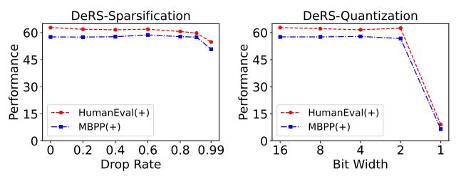

# 4.2. Medical Multi-Modal Task

**Model architecture.** We adopt the settings in Med-MoE [20] to conduct our medical multi-modal experiments. Similarly, the CLIP-Large model is used as the vision encoder. Two dense models, StableLM-2-1.6B and Phi-2-2.7B, which have been fine-tuned on the medical language-image instructionfollowing data of [26], are upcycled into MoE architectures to serve as the language backbones. Specifically, the original FFN layer of every other block is converted into a parallel structure, which consists of a universal FFN layer and a MoE layer with four experts. The MoE layer activates only the top-1 expert for a given input, while the universal FFN processes all inputs. The outputs from the MoE layer and the universal FFN are summed to produce the final output. **Datasets.** We use three medical image question-answering datasets with open- and closed-end question-answering pairs, including VQA-RAD [22], SLAKE [32], and PathVQA [16], to fine-tune and evaluate upcycled MoE models.

**Results of DeRS Compression.** Fig. 5 shows the performance of applying DeRS compression to two vanilla upcycled Med-MoE models. It can be observed that extreme compression of expert-specific delta weights (removing 99%)

Table 3. Performance comparison between vanilla upcycling and our DeRS upcycling on the code generation task. DeRS-SM and DeRS-LM denote the Sparse-Matrix-based and Low-rank-Matrix-based DeRS upcycling respectively. The light-gray Added Params denotes the additional parameters introduced by the universal FFN layers that are not considered as experts of MoE layers.

| MoE Model                 | Upcycling Method | Added Params. | HumanEval | HumanEval+ | MBPP | MBPP+ | Overall |
|---------------------------|---------------------|------------------|-----------|------------|------|-------|---------|
| Coder-MoE [6] (ACL 24) | Vanilla             | 0.81B+2.43B      | 64.6      | 61.0       | 63.9 | 51.4  | 60.2    |
|                           | DeRS-SM (ours)      | 0.81B + 325M     | 66.5      | 62.8       | 63.4 | 51.4  | 61.0    |
|                           | DeRS-LM (ours)      | 0.81B+9.09M      | 65.9      | 62.8       | 62.9 | 51.9  | 60.9    |

of their elements or quantizing them to 1bit) has negligible impact on model performance. This may be attributed to two factors. First, the two dense models utilized within the Med-MoE framework have been previously fine-tuned on relevant yet non-overlapping medical multi-modal datasets. Second, the Med-MoE framework involves replacing the original FFN layer in the dense models with a parallel structure comprising a MoE layer and a universal FFN layer. And in our main experiments, the universal FFN layer is not considered as an expert for compression, as it's not sparsely activated by the router. Consequently, despite the decomposition and delta weight compression applied to the MoE layer's experts, the overall model performance is sustained by the universal FFN. In the Appendix, we further provide experimental results of applying DeRS compression to both experts and the universal FFN. Even with additional compression of the universal FFN, DeRS-Sparsification with a 0.8 drop rate or DeRS-Quantization with a 4-bit width can still significantly reduce redundancy while maintaining performance.

Results of DeRS Upcycling. As shown in Tab. 2, our DeRS upcycling remains efficient and effective across two Med-MoE models on the medical multi-modal task. For the Med-MoE-StableLM, our DeRS-SM and DeRS-LM upcycling strategies significantly reduce the additional parameter count by 1.24 billion compared to vanilla upcycling, while achieving performance improvement of 0.2% and 0.3%, respectively. Furthermore, for the Med-MoE-Phi architecture, the two DeRS upcycling methods reduce the number of additional parameters by 2.52 billion while maintaining comparable performance. Due to the presence of the universal FFN layers, the Med-MoE model obtained through DeRS upcycling still incurs an increase of 0.42 billion or 0.84 billion parameters compared to its corresponding dense model. In the Appendix, we further extend DeRS upcycling to the universal FFN, treating the construction of the universal FFN and the MoE layer's experts as a unified entity. This allows us to achieve performance comparable to that of vanilla upcycling with only a million-level increase in additional parameters over the dense model.

#### 4.3. Code Generation Task

**Model architecture.** Following the settings in [6], we further evaluate our DeRS compression and DeRS upcycling on the code generation task. We directly upcycle the open-source

Figure 6. Performance of applying different DeRS compression methods to compress the vanilla upcycled Coder-MoE model.

language model, DeepSeek-Coder-Base-1.3B [11] into the Coder-MoE architecture for fine-tuning. Specifically, each block's FFN layer is replaced with a combination of a MoE layer and a universal FFN layer. The MoE layer contains four experts, with the top-1 expert activated for each input.

**Datasets.** We utilize *evol-codealpaca-v1*, an open-source Evol-Instruct [40] dataset with 110K instruction-output pairs, to fine-tune the upcycled MoE model. After fine-tuning, we evaluate the model on widely used Python code generation benchmarks, including HumanEval [5] and MBPP [2], as well as on extended HumanEval+ and MBPP+ that contain additional tests generated by EvalPlus [36].

Results of DeRS Compression. As shown in Fig. 6, for the expert-specific delta weights in the Coder-MoE model, removing 60% of their elements or quantizing them to 2 bits can effectively eliminate redundancy without degrading performance. In comparison to the compression results of Med-MoE models shown in Fig. 5, the delta weight redundancy in the Coder-MoE model is notably lower, despite both experimental setups involving a parallel structure comprising a universal FFN and a MoE layer. The lower redundancy may be linked to the fact that the dense model utilized for Coder-MoE has not undergone any prior fine-tuning. Further experiments of compressing both the universal FFN and MoE experts are also provided in the Appendix.

Results of DeRS Upcycling. As shown in Tab 3, our DeRS-SM and DeRS-LM upcycling methods yield significant overall performance improvement of 0.7%-0.8% on the code generation task for the Coder-MoE model, while reducing over 2 billion extra parameters compared to vanilla upcycling. This substantial performance improvement may be attributed to the sparse activation mechanism and the low-budget training setting. In vanilla upcycling, each expert is an independent FFN with extensive parameters, struggling to

Table 4. Ablation studies on the hyper-parameters of two DeRS upcycling methods. DeRS-SM and DeRS-LM denote the Sparse-Matrix-based and Low-rank-Matrix-based DeRS upcycling respectively. The light-gray Added Params represents the additional parameters introduced by the universal FFN layers that are not considered as experts of MoE layers.

(a) Different sparse rates for DeRS-SM upcycling

| DeRS-SM Rate | Added Params.   | HumanEval (+) | MBPP (+)    | Overall |
|-----------------|--------------------|---------------|-------------|---------|
| 0.9999          | 0.81B+0.72M        | 62.8 (60.4)   | 63.7 (51.6) | 59.6    |
| 0.999           | 0.81B+3.64M        | 64.0 (60.4)   | 63.4 (51.6) | 59.9    |
| 0.99            | 0.81B+32.9M        | 64.6 (61.6)   | 62.7 (51.4) | 60.1    |
| 0.9             | 0.81B <b>+325M</b> | 66.5 (62.8)   | 63.4 (51.4) | 61.0    |

Table 5. Ablation studies on whether freezing the expert-shared base FFN for our two DeRS upcycling methods.

| Upcycling Method | Freeze Shared | HumanEval (+)              | <b>MBPP</b> (+)            | Overall      |
|---------------------|------------------|----------------------------|----------------------------|--------------|
| DeRS-SM             | ×                | 66.5 (62.8) 65.2 (61.6) | 62.4 (51.4) 61.4 (50.4) | 61.0 59.7 |
| DeRS-LM             | ×                | 65.9 (62.8) 64.0 (61.0) | 62.9 (51.9) 61.7 (50.6) | 60.9 59.3 |

learn effectively due to the limited training data. In contrast, our DeRS upcycling allows multiple experts to share a base FFN while retaining their specific lightweight incremental parameters. This design enables the base FFN to leverage all training data for robust learning, while partial training data suffices to effectively train the sparsely activated lightweight incremental parameters. In the Appendix, we also present the experimental results of extending DeRS upcycling to the universal FFN within the Coder-MoE architecture, highlighting the ability of DeRS upcycling to achieve extremely efficient upcycled MoE models.

