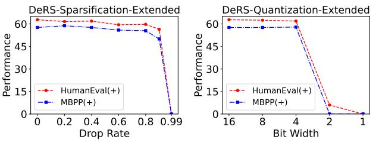

# C. Training settings

The detailed training hyper-parameters and our DeRS upcycling hyper-parameters for experiments on three tasks are provided in Tab. S19.

#### **D. Recommended Application Choices**

Based on extensive experiments, we empirically summarize recommended application choices for different scenarios. If the pre-trained dense model has undergone prior fine-tuning before upcycling, we recommend applying the sparsification-based DeRS compression to efficiently compress the vanilla upcycled MoE model, as well as utilizing sparse-matrix-based DeRS upcycling to efficiently upcycle the dense model into the MoE architecture for training. This is because, in this case, the redundancy in the delta weights is extremely high, and both sparsification and sparse matrixes can significantly reduce redundancy while maintaining performance. Conversely, if the pre-trained dense model has not under-

Figure S8. Performance of applying the extended DeRS compression to compress the vanilla upcycled Coder-MoE model. HumanEval(+) represents the average performance of HumanEval and HumanEval+, similarly for MBPP(+).

gone any prior fine-tuning, we recommend employing the quantization-based DeRS compression and the low-rank-matrix-based DeRS upcycling, as these two methods can effectively reduce redundancy while preserving global modification capabilities.

Since our proposed DeRS compression is based on the assumption that MoE experts share the same pre-trained weight initialization for the decomposition of experts and compression of redundant delta weights, it is not applicable to compressing MoE models trained from scratch. This is because training MoE models from scratch involves randomly initializing the MoE experts, making it impossible to extract redundant delta weights from the trained experts. Moreover, although our proposed DeRS upcycling has the potential to be used for training MoE models from scratch by randomly initializing the expert-shared base FFN, its performance may be limited due to insufficient model capacity.

Table S8. Performance comparison between vanilla upcycling and our extended DeRS upcycling on the code generation task. DeRS-SM† and DeRS-LM† denote the extended Sparse-Matrix-based and Low-rank-Matrix-based DeRS upcycling respectively. Added Params represents the number of additional parameters of the upcycled MoE model compared to its corresponding dense model.

| MoE Model             | Upcycling Method | Added Params. | HumanEval | HumanEval+ | MBPP | MBPP+ | Overall |
|-----------------------|---------------------|------------------|-----------|------------|------|-------|---------|
| Coder-MoE (ACL 24) | Vanilla             | 3.24B            | 64.6      | 61.0       | 63.9 | 51.4  | 60.2    |
|                       | DeRS-SM†            | 406M             | 64.6      | 60.4       | 63.7 | 52.4  | 60.3    |
|                       | DeRS-LM†            | 11.3M            | 65.9      | 62.2       | 63.4 | 51.9  | 60.9    |

Table S9. Detailed results of applying the extended DeRS-Sparsification (with different drop rates) to compress the vanilla upcycled Coder-MoE model on the code generation task. Added Params represents the number of additional parameters of the compressed MoE model compared to its corresponding dense model.

| Vanilla Upcycled MoE Model | Drop Rate | Added Params. | HumanEval | HumanEval+ | MBPP | MBPP+ |
|-------------------------------|--------------|------------------|-----------|------------|------|-------|
|                               | 0.0          | 3.24B            | 64.6      | 61.0       | 63.9 | 51.4  |
|                               | 0.2          | 3.24B            | 63.4      | 59.8       | 64.7 | 52.9  |
|                               | 0.4          | 2.43B            | 63.4      | 60.4       | 62.9 | 52.4  |
| Coder-MoE                     | 0.6          | 1.62B            | 61.0      | 57.9       | 61.2 | 50.6  |
| (ACL 24)                      | 0.8          | 0.81B            | 62.2      | 57.3       | 61.4 | 49.6  |
|                               | 0.9          | 0.41B            | 58.5      | 54.3       | 55.4 | 44.6  |
|                               | 0.99         | 0.04B            | 0.0       | 0.0        | 0.0  | 0.0   |

Table S10. Detailed results of applying the extended DeRS-Quantization (with different bit width) to compress the vanilla upcycled Coder-MoE model on the code generation task. Added Params represents the number of additional parameters of the compressed MoE model compared to its corresponding dense model.

| Vanilla Upcycled MoE Model | Bit Added Width Params. |       | HumanEval | HumanEval+ | MBPP | MBPP+ |
|-------------------------------|----------------------------------|-------|-----------|------------|------|-------|
|                               | 16                               | 3.24B | 64.6      | 61.0       | 63.9 | 51.4  |
|                               | 8                                | 2.03B | 64.6      | 60.4       | 63.7 | 51.6  |
| Coder-MoE                     | 4                                | 1.01B | 63.4      | 60.4       | 63.7 | 52.1  |
| (ACL 24)                      | 2                                | 0.51B | 6.0       | 6.0        | 0.0  | 0.0   |
|                               | 1                                | 0.25B | 0.0       | 0.0        | 0.0  | 0.0   |

Table S11. Detailed results of applying the extended DeRS-Sparsification (with different drop rates) to compress two vanilla upcycled Med-MoE models on the medical multi-modal task. Added Params represents the number of additional parameters of the compressed MoE model compared to its corresponding dense model.

| Vanilla Upcycled | Drop | Added   |      | VQA-RAD |      | SLAKE  |      | PathVQA |
|------------------|------|---------|------|---------|------|--------|------|---------|
| MoE Model        | Rate | Params. | Open | Closed  | Open | Closed | Open | Closed  |
|                  | 0.0  | 1.66B   | 51.0 | 82.3    | 82.4 | 85.3   | 33.4 | 91.4    |
|                  | 0.2  | 1.66B   | 51.0 | 82.3    | 82.5 | 85.3   | 33.3 | 91.4    |
|                  | 0.4  | 1.25B   | 50.8 | 82.3    | 82.5 | 85.1   | 33.2 | 91.3    |
| Med-MoE-StableLM | 0.6  | 0.83B   | 50.3 | 82.0    | 82.4 | 85.6   | 33.1 | 91.4    |
| (EMNLP 24)       | 0.8  | 0.42B   | 48.6 | 82.3    | 82.7 | 85.3   | 33.2 | 91.5    |
|                  | 0.9  | 0.21B   | 48.8 | 82.3    | 82.4 | 85.3   | 33.0 | 91.4    |
|                  | 0.99 | 0.02B   | 42.5 | 79.0    | 81.7 | 85.3   | 32.3 | 91.3    |
|                  | 0.0  | 3.36B   | 55.0 | 85.3    | 84.6 | 85.8   | 35.1 | 91.5    |
|                  | 0.2  | 3.36B   | 55.0 | 84.9    | 84.7 | 85.8   | 35.1 | 91.5    |
|                  | 0.4  | 2.52B   | 55.0 | 85.3    | 85.0 | 85.8   | 35.1 | 91.5    |
| Med-MoE-Phi      | 0.6  | 1.68B   | 55.1 | 84.9    | 84.8 | 85.8   | 34.9 | 91.6    |
| (EMNLP 24)       | 0.8  | 0.84B   | 55.1 | 84.9    | 84.9 | 85.3   | 35.0 | 91.3    |
|                  | 0.9  | 0.42B   | 55.3 | 84.9    | 84.8 | 85.3   | 35.2 | 91.4    |
|                  | 0.99 | 0.21B   | 57.0 | 85.7    | 83.7 | 85.1   | 34.9 | 91.2    |

Table S12. Detailed results of applying the extended DeRS-Quantization (with different bit width) to compress two vanilla upcycled Med-MoE models on the medical multi-modal task. Added Params represents the number of additional parameters of the compressed MoE model compared to its corresponding dense model.

| Vanilla Upcycled          | Bit   | Added   |      | VQA-RAD |      | SLAKE  |      | PathVQA |
|---------------------------|-------|---------|------|---------|------|--------|------|---------|
| MoE Model                 | Width | Params. | Open | Closed  | Open | Closed | Open | Closed  |
|                           | 16    | 1.66B   | 51.0 | 82.3    | 82.4 | 85.3   | 33.4 | 91.4    |
|                           | 8     | 1.04B   | 51.0 | 82.3    | 82.5 | 85.3   | 33.3 | 91.4    |
| Med-MoE-StableLM          | 4     | 0.52B   | 50.8 | 82.3    | 82.5 | 85.1   | 33.2 | 91.3    |
| (EMNLP 24)                | 2     | 0.26B   | 51.5 | 80.1    | 82.8 | 86.0   | 32.4 | 91.1    |
|                           | 1     | 0.13B   | 33.7 | 77.6    | 66.7 | 80.3   | 23.4 | 87.8    |
|                           | 16    | 3.36B   | 55.0 | 85.3    | 84.6 | 85.8   | 35.1 | 91.5    |
| Med-MoE-Phi (EMNLP 24) | 8     | 2.10B   | 55.0 | 85.3    | 84.6 | 85.8   | 35.1 | 91.5    |
|                           | 4     | 1.05B   | 54.9 | 85.3    | 84.9 | 86.0   | 35.1 | 91.5    |
|                           | 2     | 0.52B   | 56.7 | 85.7    | 83.7 | 85.3   | 33.5 | 91.4    |
|                           | 1     | 0.26B   | 43.6 | 79.4    | 64.2 | 79.8   | 20.1 | 86.6    |

Table S13. Detailed results of applying DeRS-Sparsification (with different drop rates) to compress three vanilla upcycled MoE-LLaVA models on the general multi-modal task. Added Params represents the number of additional parameters of the compressed MoE model compared to its corresponding dense model.

| Vanilla Upcycled MoE Model | Drop Rate | Added Params. | VQAv2 | GQA  | VQAT |
|-------------------------------|--------------|------------------|-------|------|------|
|                               | 0.0          | 1.24B            | 76.3  | 60.6 | 50.2 |
|                               | 0.2          | 1.33B            | 76.4  | 60.8 | 50.1 |
|                               | 0.4          | 1.00B            | 76.4  | 60.8 | 50.2 |
| MoE-LLaVA-StableLM            | 0.6          | 0.66B            | 76.3  | 60.7 | 50.1 |
| (ICML 24)                     | 0.8          | 0.33B            | 76.3  | 60.7 | 50.2 |
|                               | 0.9          | 0.17B            | 76.3  | 60.5 | 50.0 |
|                               | 0.99         | 0.02B            | 74.8  | 59.4 | 47.4 |
|                               | 0.0          | 1.22B            | 76.2  | 61.2 | 48.1 |
|                               | 0.2          | 1.30B            | 76.2  | 61.3 | 47.7 |
|                               | 0.4          | 0.97B            | 76.2  | 61.1 | 48.0 |
| MoE-LLaVA-Qwen                | 0.6          | 0.65B            | 76.2  | 61.3 | 47.5 |
| (ICML 24)                     | 0.8          | 0.32B            | 76.1  | 61.0 | 47.8 |
|                               | 0.9          | 0.16B            | 76.1  | 61.1 | 47.5 |
|                               | 0.99         | 0.02B            | 73.9  | 59.3 | 42.7 |
|                               | 0.0          | 2.52B            | 77.5  | 61.4 | 50.8 |
|                               | 0.2          | 2.68B            | 77.5  | 61.1 | 50.8 |
|                               | 0.4          | 2.01B            | 77.5  | 61.1 | 50.9 |
| MoE-LLaVA-Phi                 | 0.6          | 1.34B            | 77.4  | 61.4 | 50.9 |
| (ICML 24)                     | 0.8          | 0.67B            | 77.5  | 61.4 | 51.0 |
|                               | 0.9          | 0.34B            | 77.4  | 61.3 | 50.9 |
|                               | 0.99         | 0.03B            | 76.9  | 60.6 | 50.2 |

Table S14. Detailed results of applying DeRS-Quantization (with different bit width) to compress three vanilla upcycled MoE-LLaVA models on the general multi-modal task. Added Params represents the number of additional parameters of the compressed MoE model compared to its corresponding dense model.

| Vanilla Upcycled MoE Model | Bit Width | Added Params. | VQAv2 | GQA  | VQAT |
|-------------------------------|--------------|------------------|-------|------|------|
|                               | 16           | 1.24B            | 76.3  | 60.6 | 50.2 |
|                               | 8            | 0.83B            | 76.4  | 60.4 | 50.2 |
| MoE-LLaVA-StableLM            | 4            | 0.42B            | 76.3  | 60.6 | 50.1 |
| (ICML 24)                     | 2            | 0.21B            | 76.2  | 60.5 | 50.7 |
|                               | 1            | 0.10B            | 74.1  | 55.8 | 48.1 |
|                               | 16           | 1.22B            | 76.2  | 61.2 | 48.1 |
|                               | 8            | 0.81B            | 76.2  | 61.1 | 48.0 |
| MoE-LLaVA-Qwen                | 4            | 0.41B            | 76.2  | 61.0 | 47.9 |
| (ICML 24)                     | 2            | 0.20B            | 76.1  | 60.9 | 48.7 |
|                               | 1            | 0.10B            | 74.4  | 57.5 | 47.8 |
|                               | 16           | 2.52B            | 77.5  | 61.4 | 50.8 |
|                               | 8            | 1.68B            | 77.5  | 61.2 | 51.1 |
| MoE-LLaVA-Phi                 | 4            | 0.84B            | 77.5  | 61.2 | 50.8 |
| (ICML 24)                     | 2            | 0.42B            | 77.5  | 61.4 | 50.7 |
|                               | 1            | 0.21B            | 75.9  | 58.8 | 49.8 |

Table S15. Detailed results of applying DeRS-Sparsification (with different drop rates) to compress two vanilla upcycled Med-MoE models on the medical multi-modal task. Added Params represents the number of additional parameters of the compressed MoE model compared to its corresponding dense model. The light-gray Added Params denotes the additional parameters introduced by the universal FFN layers that are not considered as experts of MoE layers.

| Vanilla Upcycled          | Drop | Added       |      | VQA-RAD |      | SLAKE  |      | PathVQA |
|---------------------------|------|-------------|------|---------|------|--------|------|---------|
| MoE Model                 | Rate | Params.     | Open | Closed  | Open | Closed | Open | Closed  |
|                           | 0.0  | 0.42B+1.24B | 51.0 | 82.3    | 82.4 | 85.3   | 33.4 | 91.4    |
|                           | 0.2  | 0.42B+1.33B | 50.6 | 82.3    | 82.3 | 85.3   | 33.3 | 91.3    |
|                           | 0.4  | 0.42B+1.00B | 50.8 | 82.3    | 82.4 | 85.3   | 33.3 | 91.2    |
| Med-MoE-StableLM          | 0.6  | 0.42B+0.66B | 50.6 | 82.3    | 82.4 | 85.3   | 33.2 | 91.4    |
| (EMNLP 24)                | 0.8  | 0.42B+0.33B | 49.8 | 82.7    | 82.9 | 85.6   | 33.3 | 91.3    |
|                           | 0.9  | 0.42B+0.17B | 49.9 | 82.0    | 82.6 | 85.6   | 33.2 | 91.3    |
|                           | 0.99 | 0.42B+0.02B | 49.4 | 80.9    | 81.6 | 85.3   | 32.9 | 91.4    |
|                           | 0.0  | 0.84B+2.52B | 55.0 | 85.3    | 84.6 | 85.8   | 35.1 | 91.5    |
|                           | 0.2  | 0.84B+2.68B | 55.0 | 85.3    | 84.7 | 85.8   | 35.0 | 91.5    |
|                           | 0.4  | 0.84B+2.01B | 55.0 | 85.3    | 84.6 | 86.0   | 35.1 | 91.5    |
| Med-MoE-Phi (EMNLP 24) | 0.6  | 0.84B+1.34B | 55.0 | 85.3    | 84.7 | 86.0   | 35.1 | 91.4    |
|                           | 0.8  | 0.84B+0.67B | 55.0 | 84.6    | 84.9 | 85.6   | 35.2 | 91.5    |
|                           | 0.9  | 0.84B+0.34B | 55.2 | 84.6    | 84.9 | 85.1   | 35.0 | 91.6    |
|                           | 0.99 | 0.84B+0.03B | 55.7 | 84.9    | 84.0 | 85.6   | 35.0 | 91.5    |

Table S16. Detailed results of applying DeRS-Quantization (with different bit width) to compress two vanilla upcycled Med-MoE models on the medical multi-modal task. Added Params represents the number of additional parameters of the compressed MoE model compared to its corresponding dense model. The light-gray Added Params denotes the additional parameters introduced by the universal FFN layers that are not considered as experts of MoE layers.

| Vanilla Upcycled          | Bit   | Added       |      | VQA-RAD |      | SLAKE  |      | PathVQA |
|---------------------------|-------|-------------|------|---------|------|--------|------|---------|
| MoE Model                 | Width | Params.     | Open | Closed  | Open | Closed | Open | Closed  |
|                           | 16    | 0.42B+1.24B | 51.0 | 82.3    | 82.4 | 85.3   | 33.4 | 91.4    |
|                           | 8     | 0.42B+0.83B | 50.8 | 82.3    | 82.3 | 85.1   | 33.3 | 91.4    |
| Med-MoE-StableLM          | 4     | 0.42B+0.42B | 50.8 | 82.3    | 82.3 | 85.3   | 33.3 | 91.3    |
| (EMNLP 24)                | 2     | 0.42B+0.21B | 50.5 | 82.3    | 82.5 | 85.3   | 32.9 | 91.4    |
|                           | 1     | 0.42B+0.10B | 43.3 | 80.5    | 79.5 | 84.1   | 31.2 | 91.1    |
|                           | 16    | 0.84B+2.52B | 55.0 | 85.3    | 84.6 | 85.8   | 35.1 | 91.5    |
| Med-MoE-Phi (EMNLP 24) | 8     | 0.84B+1.68B | 55.0 | 85.3    | 84.6 | 85.8   | 35.1 | 91.5    |
|                           | 4     | 0.84B+0.84B | 54.9 | 85.3    | 84.9 | 86.3   | 35.1 | 91.5    |
|                           | 2     | 0.84B+0.42B | 54.6 | 85.0    | 84.6 | 85.6   | 34.8 | 91.4    |
|                           | 1     | 0.84B+0.21B | 54.0 | 83.1    | 80.2 | 83.2   | 31.6 | 90.7    |

Table S17. Detailed results of applying DeRS-Sparsification (with different drop rates) to compress the vanilla upcycled Coder-MoE model on the code generation task. Added Params represents the number of additional parameters of the compressed MoE model compared to its corresponding dense model. The light-gray Added Params denotes the additional parameters introduced by the universal FFN layers that are not considered as experts of MoE layers.

| Vanilla Upcycled MoE Model | Drop Rate | Added Params. | HumanEval | HumanEval+ | MBPP | MBPP+ |
|-------------------------------|--------------|------------------|-----------|------------|------|-------|
|                               | 0.0          | 0.81B+2.43B      | 64.6      | 61.0       | 63.9 | 51.4  |
| Coder-MoE (ACL 24)         | 0.2          | 0.81B+2.60B      | 63.4      | 60.4       | 63.7 | 51.4  |
|                               | 0.4          | 0.81B+1.95B      | 63.4      | 59.8       | 63.9 | 51.6  |
|                               | 0.6          | 0.81B+1.30B      | 64.0      | 59.8       | 64.4 | 53.1  |
|                               | 0.8          | 0.81B+0.65B      | 62.2      | 59.1       | 63.7 | 51.9  |
|                               | 0.9          | 0.81B+0.32B      | 62.2      | 57.3       | 63.4 | 51.6  |
|                               | 0.99         | 0.81B+0.03B      | 56.7      | 53.0       | 56.1 | 45.6  |

Table S18. Detailed results of applying DeRS-Quantization (with different bit width) to compress the vanilla upcycled Coder-MoE model on the code generation task. Added Params represents the number of additional parameters of the compressed MoE model compared to its corresponding dense model. The light-gray Added Params denotes the additional parameters introduced by the universal FFN layers that are not considered as experts of MoE layers.

| Vanilla Upcycled MoE Model | Bit Width | Added Params. | HumanEval | HumanEval+ | MBPP | MBPP+ |
|-------------------------------|--------------|------------------|-----------|------------|------|-------|
|                               | 16           | 0.81B+2.43B      | 64.6      | 61.0       | 63.9 | 51.4  |
| Coder-MoE (ACL 24)         | 8            | 0.81B+1.62B      | 64.0      | 60.4       | 63.7 | 51.6  |
|                               | 4            | 0.81B+0.81B      | 63.4      | 59.8       | 63.7 | 52.1  |
|                               | 2            | 0.81B+0.41B      | 64.0      | 61.0       | 62.4 | 51.1  |
|                               | 1            | 0.81B+0.20B      | 9.1       | 9.1        | 6.8  | 6.3   |

Table S19. Detailed training hyper-parameters and our DeRS upcycling hyper-parameters for experiments on three tasks. DeRS-SM Rate denotes the sparse rate for the Sparse-Matrix-based DeRS upcycling while DeRS-LM Rate denotes the rank for the Low-rank-Matrix-based DeRS upcycling. † denotes the extended DeRS upcycling implementation.

| Config                      | Task                |                     |                   |  |  |  |
|-----------------------------|---------------------|---------------------|-------------------|--|--|--|
|                             | General Multi-Modal | Medical Multi-Modal | Code Generation   |  |  |  |
| Training Epochs             | 1                   | 9                   | 4                 |  |  |  |
| Learning rate               | 2e-5                | 2e-5                | 5e-5              |  |  |  |
| Learning rate schedule      | Cosine              | Cosine              | Linear            |  |  |  |
| Training Batch size per GPU | 4                   | 8                   | 4                 |  |  |  |
| Gradient Accumulation Steps | 4                   | 2                   | 2                 |  |  |  |
| Number of GPU               | 8 × A100 (80G)   | 4 × A100 (80G)   | 8 × A100 (80G) |  |  |  |
| Precision                   | Bfloat16            | Bfloat16            | Bfloat16          |  |  |  |
| DeRS-SM Rate                | 0.9999              | 0.9999              | 0.9               |  |  |  |
| DeRS-LM Rank                | 1                   | 1                   | 4                 |  |  |  |
| DeRS-SM† Rate               | -                   | 0.999               | 0.9               |  |  |  |
| DeRS-LM† Rank               | -                   | 4                   | 4                 |  |  |  |