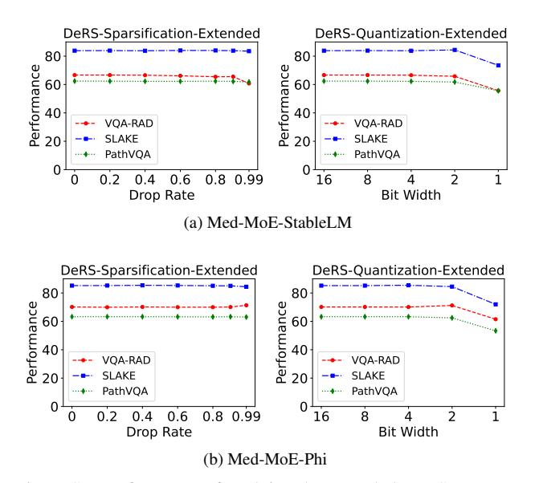

# References

- [1] Marah Abdin, Sam Ade Jacobs, Ammar Ahmad Awan, Jyoti Aneja, Ahmed Awadallah, Hany Awadalla, Nguyen Bach, Amit Bahree, Arash Bakhtiari, Harkirat Behl, et al. Phi-3 technical report: A highly capable language model locally on your phone. *arXiv preprint arXiv:2404.14219*, 2024. [1](#page-0-1)
- [2] Jacob Austin, Augustus Odena, Maxwell Nye, Maarten Bosma, Henryk Michalewski, David Dohan, Ellen Jiang, Carrie Cai, Michael Terry, Quoc Le, et al. Program synthesis with large language models. *arXiv preprint arXiv:2108.07732*, 2021. [7](#page-6-2)
- [3] Jinze Bai, Shuai Bai, Yunfei Chu, Zeyu Cui, Kai Dang, Xiaodong Deng, Yang Fan, Wenbin Ge, Yu Han, Fei Huang, et al. Qwen technical report. *arXiv preprint arXiv:2309.16609*, 2023. [5](#page-4-2)
- [4] Marco Bellagente, Jonathan Tow, Dakota Mahan, Duy Phung, Maksym Zhuravinskyi, Reshinth Adithyan, James Baicoianu, Ben Brooks, Nathan Cooper, Ashish Datta, et al. Stable lm 2 1.6 b technical report. *arXiv preprint arXiv:2402.17834*, 2024. [5](#page-4-2)
- [5] Mark Chen, Jerry Tworek, Heewoo Jun, Qiming Yuan, Henrique Ponde De Oliveira Pinto, Jared Kaplan, Harri Edwards, Yuri Burda, Nicholas Joseph, Greg Brockman, et al. Evaluating large language models trained on code. *arXiv preprint arXiv:2107.03374*, 2021. [7](#page-6-2)
- [6] Yifeng Ding, Jiawei Liu, Yuxiang Wei, Terry Yue Zhuo, and Lingming Zhang. Xft: Unlocking the power of code instruction tuning by simply merging upcycled mixture-of-experts. *arXiv preprint arXiv:2404.15247*, 2024. [1,](#page-0-1) [2,](#page-1-0) [7](#page-6-2)
- [7] Nan Du, Yanping Huang, Andrew M Dai, Simon Tong, Dmitry Lepikhin, Yuanzhong Xu, Maxim Krikun, Yanqi Zhou, Adams Wei Yu, Orhan Firat, et al. Glam: Efficient scaling of language models with mixture-of-experts. In *International Conference on Machine Learning*, pages 5547–5569. PMLR, 2022. [2](#page-1-0)
- [8] William Fedus, Barret Zoph, and Noam Shazeer. Switch transformers: Scaling to trillion parameter models with simple and efficient sparsity. *Journal of Machine Learning Research*, 23(120):1–39, 2022. [1,](#page-0-1) [2](#page-1-0)

- [9] Trevor Gale, Deepak Narayanan, Cliff Young, and Matei Zaharia. Megablocks: Efficient sparse training with mixtureof-experts. *Proceedings of Machine Learning and Systems*, 5: 288–304, 2023. [1](#page-0-1)
- [10] Yash Goyal, Tejas Khot, Douglas Summers-Stay, Dhruv Batra, and Devi Parikh. Making the v in vqa matter: Elevating the role of image understanding in visual question answering. In *Proceedings of the IEEE conference on computer vision and pattern recognition*, pages 6904–6913, 2017. [5](#page-4-2)
- [11] Daya Guo, Qihao Zhu, Dejian Yang, Zhenda Xie, Kai Dong, Wentao Zhang, Guanting Chen, Xiao Bi, Yu Wu, YK Li, et al. Deepseek-coder: When the large language model meets programming–the rise of code intelligence. *arXiv preprint arXiv:2401.14196*, 2024. [7](#page-6-2)
- [12] Danna Gurari, Qing Li, Abigale J Stangl, Anhong Guo, Chi Lin, Kristen Grauman, Jiebo Luo, and Jeffrey P Bigham. Vizwiz grand challenge: Answering visual questions from blind people. In *Proceedings of the IEEE conference on computer vision and pattern recognition*, pages 3608–3617, 2018. [5](#page-4-2)
- [13] Xumeng Han, Longhui Wei, Zhiyang Dou, Zipeng Wang, Chenhui Qiang, Xin He, Yingfei Sun, Zhenjun Han, and Qi Tian. Vimoe: An empirical study of designing vision mixtureof-experts. *arXiv preprint arXiv:2410.15732*, 2024. [1](#page-0-1)
- [14] Ethan He, Abhinav Khattar, Ryan Prenger, Vijay Korthikanti, Zijie Yan, Tong Liu, Shiqing Fan, Ashwath Aithal, Mohammad Shoeybi, and Bryan Catanzaro. Upcycling large language models into mixture of experts. *arXiv preprint arXiv:2410.07524*, 2024. [1](#page-0-1)
- [15] Shwai He, Daize Dong, Liang Ding, and Ang Li. Demystifying the compression of mixture-of-experts through a unified framework. *arXiv preprint arXiv:2406.02500*, 2024. [2](#page-1-0)
- [16] Xuehai He, Yichen Zhang, Luntian Mou, Eric Xing, and Pengtao Xie. Pathvqa: 30000+ questions for medical visual question answering. *arXiv preprint arXiv:2003.10286*, 2020. [6](#page-5-2)
- [17] Drew A Hudson and Christopher D Manning. Gqa: A new dataset for real-world visual reasoning and compositional question answering. In *Proceedings of the IEEE/CVF conference on computer vision and pattern recognition*, pages 6700–6709, 2019. [5](#page-4-2)
- [18] Mojan Javaheripi, Sebastien Bubeck, Marah Abdin, Jyoti ´ Aneja, Sebastien Bubeck, Caio Cesar Teodoro Mendes, ´ Weizhu Chen, Allie Del Giorno, Ronen Eldan, Sivakanth Gopi, et al. Phi-2: The surprising power of small language models. *Microsoft Research Blog*, 2023. [5](#page-4-2)
- [19] Albert Q Jiang, Alexandre Sablayrolles, Antoine Roux, Arthur Mensch, Blanche Savary, Chris Bamford, Devendra Singh Chaplot, Diego de las Casas, Emma Bou Hanna, Florian Bressand, et al. Mixtral of experts. *arXiv preprint arXiv:2401.04088*, 2024. [1](#page-0-1)
- [20] Songtao Jiang, Tuo Zheng, Yan Zhang, Yeying Jin, Li Yuan, and Zuozhu Liu. Med-moe: Mixture of domain-specific experts for lightweight medical vision-language models, 2024. [1,](#page-0-1) [2,](#page-1-0) [6](#page-5-2)
- [21] Aran Komatsuzaki, Joan Puigcerver, James Lee-Thorp, Carlos Riquelme Ruiz, Basil Mustafa, Joshua Ainslie, Yi Tay,

- Mostafa Dehghani, and Neil Houlsby. Sparse upcycling: Training mixture-of-experts from dense checkpoints. *arXiv preprint arXiv:2212.05055*, 2022. [1,](#page-0-1) [2](#page-1-0)
- [22] Jason J Lau, Soumya Gayen, Asma Ben Abacha, and Dina Demner-Fushman. A dataset of clinically generated visual questions and answers about radiology images. *Scientific data*, 5(1):1–10, 2018. [6](#page-5-2)
- [23] Dmitry Lepikhin, HyoukJoong Lee, Yuanzhong Xu, Dehao Chen, Orhan Firat, Yanping Huang, Maxim Krikun, Noam Shazeer, and Zhifeng Chen. Gshard: Scaling giant models with conditional computation and automatic sharding. *arXiv preprint arXiv:2006.16668*, 2020. [1,](#page-0-1) [2](#page-1-0)
- [24] Bo Li, Yifei Shen, Jingkang Yang, Yezhen Wang, Jiawei Ren, Tong Che, Jun Zhang, and Ziwei Liu. Sparse mixture-ofexperts are domain generalizable learners. *arXiv preprint arXiv:2206.04046*, 2022. [1,](#page-0-1) [2](#page-1-0)
- [25] Bo Li, Yuanhan Zhang, Liangyu Chen, Jinghao Wang, Fanyi Pu, Jingkang Yang, Chunyuan Li, and Ziwei Liu. Mimic-it: Multi-modal in-context instruction tuning. *arXiv preprint arXiv:2306.05425*, 2023. [5](#page-4-2)
- [26] Chunyuan Li, Cliff Wong, Sheng Zhang, Naoto Usuyama, Haotian Liu, Jianwei Yang, Tristan Naumann, Hoifung Poon, and Jianfeng Gao. Llava-med: Training a large languageand-vision assistant for biomedicine in one day. *Advances in Neural Information Processing Systems*, 36, 2024. [6](#page-5-2)
- [27] Jiachen Li, Xinyao Wang, Sijie Zhu, Chia-Wen Kuo, Lu Xu, Fan Chen, Jitesh Jain, Humphrey Shi, and Longyin Wen. Cumo: Scaling multimodal llm with co-upcycled mixture-ofexperts. *arXiv preprint arXiv:2405.05949*, 2024. [1](#page-0-1)
- [28] Pingzhi Li, Zhenyu Zhang, Prateek Yadav, Yi-Lin Sung, Yu Cheng, Mohit Bansal, and Tianlong Chen. Merge, then compress: Demystify efficient smoe with hints from its routing policy. *arXiv preprint arXiv:2310.01334*, 2023. [2](#page-1-0)
- [29] Yifan Li, Yifan Du, Kun Zhou, Jinpeng Wang, Wayne Xin Zhao, and Ji-Rong Wen. Evaluating object hallucination in large vision-language models. *arXiv preprint arXiv:2305.10355*, 2023. [5](#page-4-2)
- [30] Bin Lin, Zhenyu Tang, Yang Ye, Jiaxi Cui, Bin Zhu, Peng Jin, Junwu Zhang, Munan Ning, and Li Yuan. Moe-llava: Mixture of experts for large vision-language models. *arXiv preprint arXiv:2401.15947*, 2024. [1,](#page-0-1) [2,](#page-1-0) [5](#page-4-2)
- [31] Aixin Liu, Bei Feng, Bin Wang, Bingxuan Wang, Bo Liu, Chenggang Zhao, Chengqi Dengr, Chong Ruan, Damai Dai, Daya Guo, et al. Deepseek-v2: A strong, economical, and efficient mixture-of-experts language model. *arXiv preprint arXiv:2405.04434*, 2024. [1](#page-0-1)
- [32] Bo Liu, Li-Ming Zhan, Li Xu, Lin Ma, Yan Yang, and Xiao-Ming Wu. Slake: A semantically-labeled knowledgeenhanced dataset for medical visual question answering. In *2021 IEEE 18th International Symposium on Biomedical Imaging (ISBI)*, pages 1650–1654. IEEE, 2021. [6](#page-5-2)
- [33] Enshu Liu, Junyi Zhu, Zinan Lin, Xuefei Ning, Matthew B Blaschko, Shengen Yan, Guohao Dai, Huazhong Yang, and Yu Wang. Efficient expert pruning for sparse mixture-of-experts language models: Enhancing performance and reducing inference costs. *arXiv preprint arXiv:2407.00945*, 2024. [2](#page-1-0)
- [34] Fuxiao Liu, Kevin Lin, Linjie Li, Jianfeng Wang, Yaser Yacoob, and Lijuan Wang. Aligning large multi-modal

- model with robust instruction tuning. *arXiv preprint arXiv:2306.14565*, 2023. [5](#page-4-2)
- [35] Haotian Liu, Chunyuan Li, Yuheng Li, and Yong Jae Lee. Improved baselines with visual instruction tuning. In *Proceedings of the IEEE/CVF Conference on Computer Vision and Pattern Recognition*, pages 26296–26306, 2024. [2,](#page-1-0) [5](#page-4-2)
- [36] Jiawei Liu, Chunqiu Steven Xia, Yuyao Wang, and Lingming Zhang. Is your code generated by chatgpt really correct? rigorous evaluation of large language models for code generation. *Advances in Neural Information Processing Systems*, 36, 2024. [7](#page-6-2)
- [37] Yuan Liu, Haodong Duan, Yuanhan Zhang, Bo Li, Songyang Zhang, Wangbo Zhao, Yike Yuan, Jiaqi Wang, Conghui He, Ziwei Liu, et al. Mmbench: Is your multi-modal model an all-around player? In *European Conference on Computer Vision*, pages 216–233. Springer, 2025. [5](#page-4-2)
- [38] Pan Lu, Swaroop Mishra, Tanglin Xia, Liang Qiu, Kai-Wei Chang, Song-Chun Zhu, Oyvind Tafjord, Peter Clark, and Ashwin Kalyan. Learn to explain: Multimodal reasoning via thought chains for science question answering. *Advances in Neural Information Processing Systems*, 35:2507–2521, 2022. [5](#page-4-2)
- [39] Xudong Lu, Qi Liu, Yuhui Xu, Aojun Zhou, Siyuan Huang, Bo Zhang, Junchi Yan, and Hongsheng Li. Not all experts are equal: Efficient expert pruning and skipping for mixture-of-experts large language models. *arXiv preprint arXiv:2402.14800*, 2024. [2](#page-1-0)
- [40] Ziyang Luo, Can Xu, Pu Zhao, Qingfeng Sun, Xiubo Geng, Wenxiang Hu, Chongyang Tao, Jing Ma, Qingwei Lin, and Daxin Jiang. Wizardcoder: Empowering code large language models with evol-instruct. *arXiv preprint arXiv:2306.08568*, 2023. [7](#page-6-2)
- [41] Joan Puigcerver, Carlos Riquelme, Basil Mustafa, and Neil Houlsby. From sparse to soft mixtures of experts. *arXiv preprint arXiv:2308.00951*, 2023. [1](#page-0-1)
- [42] Alec Radford, Jong Wook Kim, Chris Hallacy, Aditya Ramesh, Gabriel Goh, Sandhini Agarwal, Girish Sastry, Amanda Askell, Pamela Mishkin, Jack Clark, et al. Learning transferable visual models from natural language supervision. In *International conference on machine learning*, pages 8748–8763. PMLR, 2021. [5](#page-4-2)
- [43] Carlos Riquelme, Joan Puigcerver, Basil Mustafa, Maxim Neumann, Rodolphe Jenatton, Andre Susano Pinto, Daniel ´ Keysers, and Neil Houlsby. Scaling vision with sparse mixture of experts. *Advances in Neural Information Processing Systems*, 34:8583–8595, 2021. [1](#page-0-1)
- [44] Noam Shazeer, Azalia Mirhoseini, Krzysztof Maziarz, Andy Davis, Quoc Le, Geoffrey Hinton, and Jeff Dean. Outrageously large neural networks: The sparsely-gated mixtureof-experts layer. *arXiv preprint arXiv:1701.06538*, 2017. [1](#page-0-1)
- [45] Amanpreet Singh, Vivek Natarajan, Meet Shah, Yu Jiang, Xinlei Chen, Dhruv Batra, Devi Parikh, and Marcus Rohrbach. Towards vqa models that can read. In *Proceedings of the IEEE/CVF conference on computer vision and pattern recognition*, pages 8317–8326, 2019. [5](#page-4-2)
- [46] Junke Wang, Lingchen Meng, Zejia Weng, Bo He, Zuxuan Wu, and Yu-Gang Jiang. To see is to believe: Prompting

- gpt-4v for better visual instruction tuning. *arXiv preprint arXiv:2311.07574*, 2023. [5](#page-4-2)
- [47] Tianwen Wei, Bo Zhu, Liang Zhao, Cheng Cheng, Biye Li, Weiwei Lu, Peng Cheng, Jianhao Zhang, Xiaoyu Zhang, ¨ Liang Zeng, et al. Skywork-moe: A deep dive into training techniques for mixture-of-experts language models. *arXiv preprint arXiv:2406.06563*, 2024. [1](#page-0-1)
- [48] Fuzhao Xue, Zian Zheng, Yao Fu, Jinjie Ni, Zangwei Zheng, Wangchunshu Zhou, and Yang You. Openmoe: An early effort on open mixture-of-experts language models. *arXiv preprint arXiv:2402.01739*, 2024. [2](#page-1-0)
- [49] An Yang, Baosong Yang, Binyuan Hui, Bo Zheng, Bowen Yu, Chang Zhou, Chengpeng Li, Chengyuan Li, Dayiheng Liu, Fei Huang, et al. Qwen2 technical report. *arXiv preprint arXiv:2407.10671*, 2024. [1](#page-0-1)
- [50] Le Yu, Bowen Yu, Haiyang Yu, Fei Huang, and Yongbin Li. Language models are super mario: Absorbing abilities from homologous models as a free lunch. In *Forty-first International Conference on Machine Learning*, 2024. [4](#page-3-1)
- [51] Weihao Yu, Zhengyuan Yang, Linjie Li, Jianfeng Wang, Kevin Lin, Zicheng Liu, Xinchao Wang, and Lijuan Wang. Mm-vet: Evaluating large multimodal models for integrated capabilities. *arXiv preprint arXiv:2308.02490*, 2023. [5](#page-4-2)
- [52] Bo Zhao, Boya Wu, Muyang He, and Tiejun Huang. Svit: Scaling up visual instruction tuning. *arXiv preprint arXiv:2307.04087*, 2023. [5](#page-4-2)
- [53] Barret Zoph, Irwan Bello, Sameer Kumar, Nan Du, Yanping Huang, Jeff Dean, Noam Shazeer, and William Fedus. Stmoe: Designing stable and transferable sparse expert models. *arXiv preprint arXiv:2202.08906*, 2022. [1](#page-0-1)

### A. Extended DeRS Compression and Upcycling

In our medical multi-modal and code generation experiments, the original FFN layer in a pre-trained dense model is upcycled into a parallel structure consisting of a universal FFN layer and a MoE layer containing N FFN experts. The universal FFN and the N experts are all initialized from the original FFN weight. The universal FFN processes all inputs, while the N experts are sparsely activated by a router for each input. The outputs from the universal FFN and the MoE layer are then summed to form the final output.

In the main body, we applied the proposed DeRS paradigm only to the N experts in the MoE layer, since the universal FFN is not sparsely activated by the router, meaning it cannot be strictly considered as a MoE expert. Here, considering that both the universal FFN and the N MoE experts share the same initial weight, we extend our DeRS compression and DeRS upcycling to the universal FFN layer to further reduce parameter redundancy.

Specifically, when applying the extended DeRS compression to compress a vanilla upcycled MoE model, both the universal FFN and the N MoE experts are treated as a whole and decomposed into one expert-shared base weight and N+1 delta weights. Subsequently, sparsification or quantization techniques are applied to the N+1 delta weights to reduce redundancy. Similarly, when applying the extended DeRS upcycling to convert a pre-trained dense model into the MoE architecture, the universal FFN and the N MoE experts are treated as a whole, sharing one base FFN and introducing N+1 unique, parameter-efficient weights in the form of sparse or low-rank matrixes.

#### A1. Extended DeRS Compression on Medical Task

Fig. S7 shows the performance of applying the extended DeRS compression to two vanilla upcycled Med-MoE models on the medical multimodal task. The detailed results are presented in Tab. S11 and Tab. S12. As we can see, even when simultaneously compressing the universal FFN and MoE experts, the extended DeRS-Sparsification with a 0.8 drop rate and the extended DeRS-Quantization with a 4-bit width can reduce the additional parameter count by 75% and 69%, respectively, while maintaining performance.

Different from the results shown in Fig. 5, where only the MoE experts were compressed, simultaneously compressing the universal FFN and MoE experts leads to a slight performance drop under extreme compression settings (0.99 drop rate or 1-bit width). This degradation occurs because extreme compression of the universal FFN significantly impacts the model's output, as the universal FFN processes all input tokens. However, since the two dense models utilized within the Med-MoE framework have been previously finetuned on relevant yet non-overlapping medical multi-modal datasets, the overall performance of upcycled MoE models does not collapse under these extreme compression settings.

Figure S7. Performance of applying the extended DeRS compression to compress two vanilla upcycled Med-MoE models respectively. For each dataset, we report the average performance of the open-set and closed-set.

### A2. Extended DeRS Upcycling on Medical Task

As shown in Tab. S7, when treating the construction of the universal FFN and MoE experts as a whole, both of our extended DeRS upcycling methods achieve comparable performance to vanilla upcycling while introducing significantly fewer additional parameters. For example, when achieving the same performance on the Med-MoE-Phi architecture, our extended DeRS-SM and DeRS-LM upcycling strategies introduce only 5.18 million and 9.18 million additional parameters respectively, while vanilla upcycling introduces a massive 3.36 billion parameters. These results highlight the ability of our DeRS upcycling to achieve extremely efficient upcycled MoE models.

### A3. Extended DeRS Compression on Code Task

Fig. S8 shows the performance of applying the extended DeRS compression to the vanilla upcycled Coder-MoE model on the code generation task, with detailed results presented in Tab. S9 and Tab. S10. As we can see, for the delta weights obtained by the unified decomposition of the universal FFN and MoE experts, removing 40% of their elements or quantizing them to 4 bits can effectively eliminate redundancy without degrading performance. However, since the dense model utilized for constructing Coder-MoE has not undergone any prior fine-tuning, excessive simultaneous compression of both the universal FFN and MoE experts can lead to a collapse in the performance of the vanilla upcycled Coder-MoE model.

Table S7. Performance comparison between vanilla upcycling and our extended DeRS upcycling on two Med-MoE models on the medical multi-modal task. DeRS-SM† and DeRS-LM† denote the extended Sparse-Matrix-based and Low-rank-Matrix-based DeRS upcycling respectively. **Added Params** represents the number of additional parameters of the upcycled MoE model compared to its corresponding dense model.

| MoE Model                      | Upcycling            | Added   | VQA  | VQA-RAD |      | SLAKE  |      | PathVQA |         |
|--------------------------------|----------------------|---------|------|---------|------|--------|------|---------|---------|
| MOE Model                      | Method               | Params. | Open | Closed  | Open | Closed | Open | Closed  | Overall |
| Med-MoE-StableLM (EMNLP 24) | Vanilla              | 1.66B   | 51.0 | 82.3    | 82.4 | 85.3   | 33.4 | 91.4    | 71.0    |
|                                | DeRS-SM † | 2.17M   | 51.2 | 81.3    | 84.5 | 84.4   | 33.6 | 90.9    | 71.0    |
|                                | DeRS-LM † | 5.63M   | 50.4 | 81.6    | 83.6 | 84.4   | 33.9 | 91.4    | 70.9    |
| Med-MoE-Phi (EMNLP 24)      | Vanilla              | 3.36B   | 55.1 | 85.3    | 84.6 | 85.8   | 35.1 | 91.5    | 72.9    |
|                                | DeRS-SM † | 5.18M   | 54.8 | 84.6    | 84.0 | 87.2   | 35.0 | 91.6    | 72.9    |
|                                | DeRS-LM † | 9.18M   | 55.3 | 83.8    | 84.3 | 86.5   | 35.6 | 91.9    | 72.9    |

#### A4. Extended DeRS Upcycling on Code Task

As shown in Tab. S8, our extended DeRS upcycling remains effective and extremely efficient on the code generation task. For example, our extended DeRS-LM upcycling strategy achieves an overall performance improvement of 0.7%, while only introducing only 11.3 million additional parameters, whereas vanilla upcycling introduces a significant 3.24 billion extra parameters. These results demonstrate that our proposed DeRS upcycling method propels upcycled MoE models towards a new level of efficiency.

