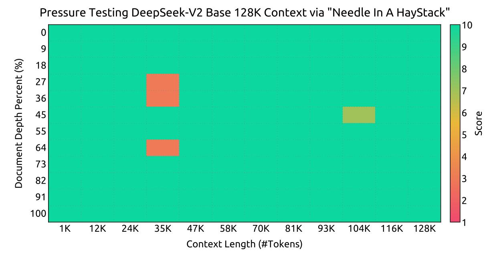

# **3. Pre-Training**

#### **3.1. Experimental Setups**

## *3.1.1. Data Construction*

While maintaining the same data processing stages as for DeepSeek 67B [\(DeepSeek-AI, 2024\)](#page-22-1), we extend the amount of data and elevate the data quality. In order to enlarge our pre-training corpus, we explore the potential of the internet data and optimize our cleaning processes, thus recovering a large amount of mistakenly deleted data. Moreover, we incorporate more Chinese data, aiming to better leverage the corpus available on the Chinese internet. In addition to the amount of data, we also focus on the data quality. We enrich our pre-training corpus with high-quality data from various sources, and meanwhile improve the quality-based filtering algorithm. The improved algorithm ensures that a large amount of non-beneficial data will be removed, while the valuable data will be mostly retained. In addition, we filter out the contentious content from our pre-training corpus to mitigate the data bias introduced from specific regional cultures. A detailed discussion about the influence of this filtering strategy is presented in Appendix [E.](#page-30-3)

We adopt the same tokenizer as used in DeepSeek 67B, which is built based on the Byte-level Byte-Pair Encoding (BBPE) algorithm and has a vocabulary size of 100K. Our tokenized pretraining corpus contains 8.1T tokens, where Chinese tokens are approximately 12% more than English ones.

#### 3.1.2. Hyper-Parameters

**Model Hyper-Parameters.** We set the number of Transformer layers to 60 and the hidden dimension to 5120. All learnable parameters are randomly initialized with a standard deviation of 0.006. In MLA, we set the number of attention heads  $n_h$  to 128 and the per-head dimension  $d_h$  to 128. The KV compression dimension  $d_c$  is set to 512, and the query compression dimension  $d_c$  is set to 1536. For the decoupled queries and key, we set the per-head dimension  $d_h^R$  to 64. Following Dai et al. (2024), we substitute all FFNs except for the first layer with MoE layers. Each MoE layer consists of 2 shared experts and 160 routed experts, where the intermediate hidden dimension of each expert is 1536. Among the routed experts, 6 experts will be activated for each token. In addition, the low-rank compression and fine-grained expert segmentation will impact the output scale of a layer. Therefore, in practice, we employ additional RMS Norm layers after the compressed latent vectors, and multiply additional scaling factors at the width bottlenecks (i.e., the compressed latent vectors and the intermediate hidden states of routed experts) to ensure stable training. Under this configuration, DeepSeek-V2 comprises 236B total parameters, of which 21B are activated for each token.

Training Hyper-Parameters. We employ the AdamW optimizer (Loshchilov and Hutter, 2017) with hyper-parameters set to  $\beta_1 = 0.9$ ,  $\beta_2 = 0.95$ , and weight\_decay = 0.1. The learning rate is scheduled using a warmup-and-step-decay strategy (DeepSeek-AI, 2024). Initially, the learning rate linearly increases from 0 to the maximum value during the first 2K steps. Subsequently, the learning rate is multiplied by 0.316 after training about 60% of tokens, and again by 0.316 after training about 90% of tokens. The maximum learning rate is set to  $2.4 \times 10^{-4}$ , and the gradient clipping norm is set to 1.0. We also use a batch size scheduling strategy, where the batch size is gradually increased from 2304 to 9216 in the training of the first 225B tokens, and then keeps 9216 in the remaining training. We set the maximum sequence length to 4K, and train DeepSeek-V2 on 8.1T tokens. We leverage pipeline parallelism to deploy different layers of a model on different devices, and for each layer, the routed experts will be uniformly deployed on 8 devices (D = 8). As for the device-limited routing, each token will be sent to at most 3 devices (M = 3). As for balance losses, we set  $\alpha_1$  to 0.003,  $\alpha_2$  to 0.05, and  $\alpha_3$  to 0.02. We employ the token-dropping strategy during training for acceleration, but do not drop any tokens for evaluation.

#### 3.1.3. Infrastructures

DeepSeek-V2 is trained based on the HAI-LLM framework (High-flyer, 2023), an efficient and light-weight training framework developed internally by our engineers. It employs a 16-way zero-bubble pipeline parallelism (Qi et al., 2023), an 8-way expert parallelism (Lepikhin et al., 2021), and ZeRO-1 data parallelism (Rajbhandari et al., 2020). Given that DeepSeek-V2 has relatively few activated parameters, and a portion of the operators are recomputed to save activation memory, it can be trained without the necessity of tensor parallelism, thereby decreasing the communication overhead. Moreover, in order to further improve the training efficiency, we overlap the computation of shared experts with the expert parallel all-to-all communication. We also customize faster CUDA kernels for communications, routing algorithms, and fused

Figure 4 | Evaluation results on the "Needle In A Haystack" (NIAH) tests. DeepSeek-V2 performs well across all context window lengths up to 128K.

linear computations across different experts. In addition, MLA is also optimized based on an improved version of FlashAttention-2 (Dao, 2023).

We conduct all experiments on a cluster equipped with NVIDIA H800 GPUs. Each node in the H800 cluster contains 8 GPUs connected using NVLink and NVSwitch within nodes. Across nodes, InfiniBand interconnects are utilized to facilitate communications.

#### 3.1.4. Long Context Extension

After the initial pre-training of DeepSeek-V2, we employ YaRN (Peng et al., 2023) to extend the default context window length from 4K to 128K. YaRN was specifically applied to the decoupled shared key  $\mathbf{k}_t^R$  as it is responsible for carrying RoPE (Su et al., 2024). For YaRN, we set the scale s to 40,  $\alpha$  to 1,  $\beta$  to 32, and the target maximum context length to 160K. Under these settings, we can expect the model to respond well for a context length of 128K. Slightly diverging from original YaRN, due to our distinct attention mechanism, we adjust the length scaling factor to modulate the attention entropy. The factor  $\sqrt{t}$  is computed as  $\sqrt{t} = 0.0707 \ln s + 1$ , aiming at minimizing the perplexity.

We additionally train the model for 1000 steps, with a sequence length of 32K and a batch size of 576 sequences. Although the training is conducted solely at the sequence length of 32K, the model still demonstrates robust performance when being evaluated at a context length of 128K. As shown in Figure 4, the results on the "Needle In A Haystack" (NIAH) tests indicate that DeepSeek-V2 performs well across all context window lengths up to 128K.

#### 3.2. Evaluations

#### 3.2.1. Evaluation Benchmarks

DeepSeek-V2 is pretrained on a bilingual corpus, so we evaluate it on a series of benchmarks in English and Chinese. Our evaluation is based on our internal evaluation framework integrated

in our HAI-LLM framework. Included benchmarks are categorized and listed as follows, where underlined benchmarks are in Chinese:

**Multi-subject multiple-choice** datasets include MMLU [\(Hendrycks et al., 2020\)](#page-22-5), C-Eval [\(Huang et al., 2023\)](#page-22-6), and CMMLU [\(Li et al., 2023\)](#page-23-5).

**Language understanding and reasoning** datasets include HellaSwag [\(Zellers et al., 2019\)](#page-25-1), PIQA [\(Bisk et al., 2020\)](#page-21-3), ARC [\(Clark et al., 2018\)](#page-21-4), and BigBench Hard (BBH) [\(Suzgun et al., 2022\)](#page-24-10).

**Closed-book question answering** datasets include TriviaQA [\(Joshi et al., 2017\)](#page-23-6) and NaturalQuestions [\(Kwiatkowski et al., 2019\)](#page-23-7).

**Reading comprehension** datasets include RACE [Lai et al.](#page-23-8) [\(2017\)](#page-23-8), DROP [\(Dua et al., 2019\)](#page-22-7), C3 [\(Sun et al., 2019\)](#page-24-11), and CMRC [\(Cui et al., 2019\)](#page-21-5).

**Reference disambiguation** datasets include WinoGrande [Sakaguchi et al.](#page-24-12) [\(2019\)](#page-24-12) and CLUEWSC [\(Xu et al., 2020\)](#page-24-13).

**Language modeling** datasets include Pile [\(Gao et al., 2020\)](#page-22-8).

**Chinese understanding and culture** datasets include CHID [\(Zheng et al., 2019\)](#page-25-2) and CCPM [\(Li et al., 2021\)](#page-23-9).

**Math** datasets include GSM8K [\(Cobbe et al., 2021\)](#page-21-6), MATH [\(Hendrycks et al., 2021\)](#page-22-9), and CMath [\(Wei et al., 2023\)](#page-24-14).

**Code** datasets include HumanEval [\(Chen et al., 2021\)](#page-21-7), MBPP [\(Austin et al., 2021\)](#page-21-8), and CRUXEval [\(Gu et al., 2024\)](#page-22-10).

**Standardized exams** include AGIEval [\(Zhong et al., 2023\)](#page-25-3). Note that AGIEval includes both English and Chinese subsets.

Following our previous work [\(DeepSeek-AI, 2024\)](#page-22-1), we adopt perplexity-based evaluation for datasets including HellaSwag, PIQA, WinoGrande, RACE-Middle, RACE-High, MMLU, ARC-Easy, ARC-Challenge, CHID, C-Eval, CMMLU, C3, and CCPM, and adopt generationbased evaluation for TriviaQA, NaturalQuestions, DROP, MATH, GSM8K, HumanEval, MBPP, CRUXEval, BBH, AGIEval, CLUEWSC, CMRC, and CMath. In addition, we perform languagemodeling-based evaluation for Pile-test and use Bits-Per-Byte (BPB) as the metric to guarantee fair comparison among models with different tokenizers.

For an intuitive overview of these benchmarks, we additionally provide our evaluation formats for each benchmark in Appendix [G.](#page-32-0)

