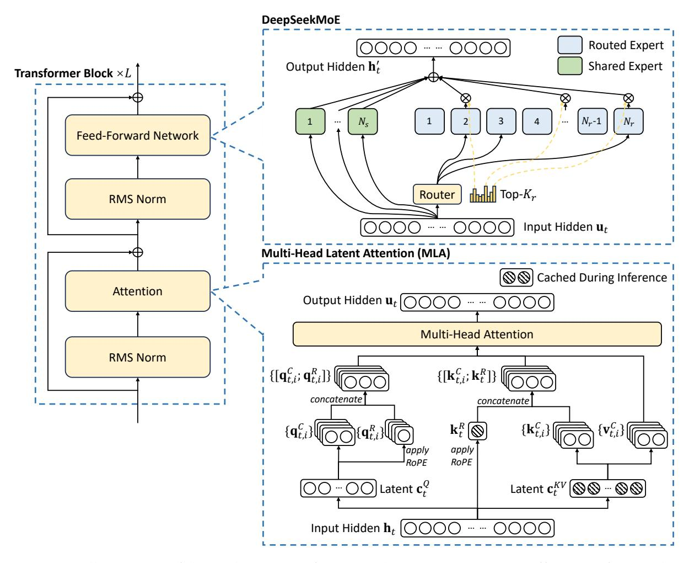
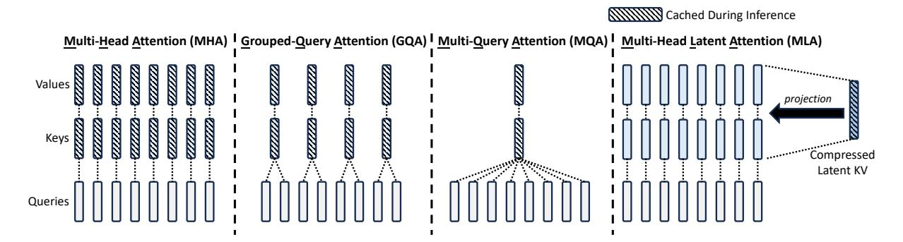

# **1. Introduction**

In the past few years, Large Language Models (LLMs) [\(Anthropic, 2023;](#page-21-0) [Google, 2023;](#page-22-0) [OpenAI,](#page-23-0) [2022,](#page-23-0) [2023\)](#page-23-1) have undergone rapid development, offering a glimpse into the dawn of Artificial General Intelligence (AGI). In general, the intelligence of an LLM tends to improve as the number of parameters increases, allowing it to exhibit emergent capabilities across various tasks [\(Wei](#page-24-0) [et al., 2022\)](#page-24-0). However, the improvement comes at the cost of larger computing resources for training and a potential decrease in inference throughput. These constraints present significant challenges that impede the widespread adoption and utilization of LLMs. In order to tackle this problem, we introduce DeepSeek-V2, a strong open-source Mixture-of-Experts (MoE) language model, characterized by economical training and efficient inference through an innovative Transformer architecture. It is equipped with a total of 236B parameters, of which 21B are activated for each token, and supports a context length of 128K tokens.

We optimize the attention modules and Feed-Forward Networks (FFNs) within the Transformer framework [\(Vaswani et al., 2017\)](#page-24-1) with our proposed **Multi-head Latent Attention (MLA)** and **DeepSeekMoE**. (1) In the context of attention mechanisms, the Key-Value (KV) cache of the Multi-Head Attention (MHA) [\(Vaswani et al., 2017\)](#page-24-1) poses a significant obstacle to the inference efficiency of LLMs. Various approaches have been explored to address this issue, including Grouped-Query Attention (GQA) [\(Ainslie et al., 2023\)](#page-20-1) and Multi-Query Attention (MQA) [\(Shazeer, 2019\)](#page-24-2). However, these methods often compromise performance in their attempt to reduce the KV cache. In order to achieve the best of both worlds, we introduce MLA, an attention mechanism equipped with low-rank key-value joint compression. Empirically, MLA achieves superior performance compared with MHA, and meanwhile significantly reduces the KV cache during inference, thus boosting the inference efficiency. (2) For Feed-Forward Networks (FFNs), we follow the DeepSeekMoE architecture [\(Dai et al., 2024\)](#page-21-1), which adopts fine-grained expert segmentation and shared expert isolation for higher potential in expert specialization. The DeepSeekMoE architecture demonstrates great advantages compared with conventional MoE architectures like GShard [\(Lepikhin et al., 2021\)](#page-23-2), enabling us to train strong models at an economical cost. As we employ expert parallelism during training, we also devise supplementary mechanisms to control communication overheads and ensure load balance. By combining these two techniques, DeepSeek-V2 features strong performance (Figure [1\(a\)\)](#page-0-0), economical training costs, and efficient inference throughput (Figure [1\(b\)\)](#page-0-1), simultaneously.

We construct a high-quality and multi-source pre-training corpus consisting of 8.1T tokens. Compared with the corpus used in DeepSeek 67B (our previous release) [\(DeepSeek-AI, 2024\)](#page-22-1), this corpus features an extended amount of data, especially Chinese data, and higher data quality. We first pretrain DeepSeek-V2 on the full pre-training corpus. Then, we collect 1.5M conversational sessions, which encompass various domains such as math, code, writing, reasoning, safety, and more, to perform Supervised Fine-Tuning (SFT) for DeepSeek-V2 Chat (SFT). Finally, we follow DeepSeekMath [\(Shao et al., 2024\)](#page-24-3) to employ Group Relative Policy Optimization (GRPO) to further align the model with human preference and produce DeepSeek-V2 Chat (RL).

We evaluate DeepSeek-V2 on a wide range of benchmarks in English and Chinese, and compare it with representative open-source models. Evaluation results show that even with only 21B activated parameters, DeepSeek-V2 still achieves top-tier performance among open-source models and becomes the strongest open-source MoE language model. Figure [1\(a\)](#page-0-0) highlights that, on MMLU, DeepSeek-V2 achieves top-ranking performance with only a small number of activated parameters. In addition, as shown in Figure [1\(b\),](#page-0-1) compared with DeepSeek 67B, DeepSeek-V2 saves 42.5% of training costs, reduces the KV cache by 93.3%, and boosts the maximum generation throughput to 5.76 times. We also evaluate DeepSeek-V2 Chat (SFT) and

Figure 2 | Illustration of the architecture of DeepSeek-V2. MLA ensures efficient inference by significantly reducing the KV cache for generation, and DeepSeekMoE enables training strong models at an economical cost through the sparse architecture.

DeepSeek-V2 Chat (RL) on open-ended benchmarks. Notably, DeepSeek-V2 Chat (RL) achieves 38.9 length-controlled win rate on AlpacaEval 2.0 (Dubois et al., 2024), 8.97 overall score on MT-Bench (Zheng et al., 2023), and 7.91 overall score on AlignBench (Liu et al., 2023). The English open-ended conversation evaluations demonstrate that DeepSeek-V2 Chat (RL) has top-tier performance among open-source chat models. In addition, the evaluation on AlignBench indicates that in Chinese, DeepSeek-V2 Chat (RL) outperforms all of open-source models, and even beats most of closed-source models.

In order to facilitate further research and development on MLA and DeepSeekMoE, we also release DeepSeek-V2-Lite, a smaller model equipped with MLA and DeepSeekMoE, for the open-source community. It has a total of 15.7B parameters, where 2.4B are activated for each token. Detailed descriptions about DeepSeek-V2-Lite can be found in Appendix B.

In the rest of this paper, we first provide a detailed description of the model architecture of DeepSeek-V2 (Section 2). Subsequently, we introduce our pre-training endeavors, including the training data construction, hyper-parameter settings, infrastructures, long context extension, and the evaluation of model performance and efficiency (Section 3). Following this, we demonstrate our efforts in alignment, encompassing Supervised Fine-Tuning (SFT), Reinforcement

Learning (RL), the evaluation results, and other discussion (Section 4). Finally, we summarize the conclusion, deliberate on the current limitations of DeepSeek-V2, and outline our future work (Section 5).

#### 2. Architecture

By and large, DeepSeek-V2 is still in the Transformer architecture (Vaswani et al., 2017), where each Transformer block consists of an attention module and a Feed-Forward Network (FFN). However, for both the attention module and the FFN, we design and employ innovative architectures. For attention, we design MLA, which utilizes low-rank key-value joint compression to eliminate the bottleneck of inference-time key-value cache, thus supporting efficient inference. For FFNs, we adopt the DeepSeekMoE architecture (Dai et al., 2024), a high-performance MoE architecture that enables training strong models at an economical cost. An illustration of the architecture of DeepSeek-V2 is presented in Figure 2, and we will introduce the details of MLA and DeepSeekMoE in this section. For other tiny details (e.g., layer normalization and the activation function in FFNs), unless specifically stated, DeepSeek-V2 follows the settings of DeepSeek 67B (DeepSeek-AI, 2024).

## 2.1. Multi-Head Latent Attention: Boosting Inference Efficiency

Conventional Transformer models usually adopts Multi-Head Attention (MHA) (Vaswani et al., 2017), but during generation, its heavy Key-Value (KV) cache will become the bottle-neck that limit the inference efficiency. In order to reduce the KV cache, Multi-Query Attention (MQA) (Shazeer, 2019) and Grouped-Query Attention (GQA) (Ainslie et al., 2023) are proposed. They require a smaller magnitude of KV cache, but their performance does not match MHA (we provide the ablation of MHA, GQA and MQA in Appendix D.1).

For DeepSeek-V2, we design an innovative attention mechanism called Multi-head Latent Attention (MLA). Equipped with low-rank key-value joint compression, MLA achieves better performance than MHA, but requires a significantly smaller amount of KV cache. We introduce its architecture in the following, and also provide a comparison between MLA and MHA in Appendix D.2.

#### 2.1.1. Preliminaries: Standard Multi-Head Attention

We first introduce the standard MHA mechanism as background. Let d be the embedding dimension,  $n_h$  be the number of attention heads,  $d_h$  be the dimension per head, and  $\mathbf{h}_t \in \mathbb{R}^d$  be the attention input of the t-th token at an attention layer. Standard MHA first produces  $\mathbf{q}_t, \mathbf{k}_t, \mathbf{v}_t \in \mathbb{R}^{d_h n_h}$  through three matrices  $W^Q, W^K, W^V \in \mathbb{R}^{d_h n_h \times d}$ , respectively:

$$\mathbf{q}_t = W^{\mathcal{Q}} \mathbf{h}_t, \tag{1}$$

$$\mathbf{k}_t = W^K \mathbf{h}_t, \tag{2}$$

$$\mathbf{v}_t = W^V \mathbf{h}_t, \tag{3}$$

Figure 3 | Simplified illustration of Multi-Head Attention (MHA), Grouped-Query Attention (GQA), Multi-Query Attention (MQA), and Multi-head Latent Attention (MLA). Through jointly compressing the keys and values into a latent vector, MLA significantly reduces the KV cache during inference.

Then,  $\mathbf{q}_t$ ,  $\mathbf{k}_t$ ,  $\mathbf{v}_t$  will be sliced into  $n_h$  heads for the multi-head attention computation:

$$[\mathbf{q}_{t,1};\mathbf{q}_{t,2};...;\mathbf{q}_{t,n_h}] = \mathbf{q}_t, \tag{4}$$

$$[\mathbf{k}_{t,1}; \mathbf{k}_{t,2}; ...; \mathbf{k}_{t,n_h}] = \mathbf{k}_t,$$
 (5)

$$[\mathbf{v}_{t,1}; \mathbf{v}_{t,2}; ...; \mathbf{v}_{t,n_h}] = \mathbf{v}_{t,t}$$
 (6)

$$\mathbf{o}_{t,i} = \sum_{i=1}^{t} \text{Softmax}_{j}(\frac{\mathbf{q}_{t,i}^{T} \mathbf{k}_{j,i}}{\sqrt{d_{h}}}) \mathbf{v}_{j,i},$$
 (7)

$$\mathbf{u}_{t} = W^{O}[\mathbf{o}_{t,1}; \mathbf{o}_{t,2}; ...; \mathbf{o}_{t,n_{h}}], \tag{8}$$

where  $\mathbf{q}_{t,i}$ ,  $\mathbf{k}_{t,i}$ ,  $\mathbf{v}_{t,i} \in \mathbb{R}^{d_h}$  denote the query, key, and value of the *i*-th attention head, respectively;  $W^O \in \mathbb{R}^{d \times d_h n_h}$  denotes the output projection matrix. During inference, all keys and values need to be cached to accelerate inference, so MHA needs to cache  $2n_h d_h l$  elements for each token. In model deployment, this heavy KV cache is a large bottleneck that limits the maximum batch size and sequence length.

#### 2.1.2. Low-Rank Key-Value Joint Compression

The core of MLA is the low-rank joint compression for keys and values to reduce KV cache:

$$\mathbf{c}_{t}^{KV} = W^{DKV} \mathbf{h}_{t}, \tag{9}$$

$$\mathbf{k}_{t}^{C} = W^{UK} \mathbf{c}_{t}^{KV}, \tag{10}$$

$$\mathbf{v}_{t}^{C} = W^{UV} \mathbf{c}_{t}^{KV}, \tag{11}$$

where  $\mathbf{c}_t^{KV} \in \mathbb{R}^{d_c}$  is the compressed latent vector for keys and values;  $d_c(\ll d_h n_h)$  denotes the KV compression dimension;  $W^{DKV} \in \mathbb{R}^{d_c \times d}$  is the down-projection matrix; and  $W^{UK}, W^{UV} \in \mathbb{R}^{d_h n_h \times d_c}$  are the up-projection matrices for keys and values, respectively. During inference, MLA only needs to cache  $\mathbf{c}_t^{KV}$ , so its KV cache has only  $d_c l$  elements, where l denotes the number of layers. In addition, during inference, since  $W^{UK}$  can be absorbed into  $W^Q$ , and  $W^{UV}$  can be absorbed into  $W^Q$ , we even do not need to compute keys and values out for attention. Figure 3 intuitively illustrates how the KV joint compression in MLA reduces the KV cache.

Moreover, in order to reduce the activation memory during training, we also perform

low-rank compression for the queries, even if it cannot reduce the KV cache:

$$\mathbf{c}_t^Q = W^{DQ} \mathbf{h}_t, \tag{12}$$

$$\mathbf{c}_{t}^{Q} = W^{DQ} \mathbf{h}_{t}, \tag{12}$$

$$\mathbf{q}_{t}^{C} = W^{UQ} \mathbf{c}_{t}^{Q}, \tag{13}$$

where  $\mathbf{c}_t^Q \in \mathbb{R}^{d_c'}$  is the compressed latent vector for queries;  $d_c' (\ll d_h n_h)$  denotes the query compression dimension; and  $W^{DQ} \in \mathbb{R}^{d_c' \times d}, W^{UQ} \in \mathbb{R}^{d_h n_h \times d_c'}$  are the down-projection and upprojection matrices for queries, respectively.

#### 2.1.3. Decoupled Rotary Position Embedding

Following DeepSeek 67B (DeepSeek-AI, 2024), we intend to use the Rotary Position Embedding (RoPE) (Su et al., 2024) for DeepSeek-V2. However, RoPE is incompatible with low-rank KV compression. To be specific, RoPE is position-sensitive for both keys and queries. If we apply RoPE for the keys  $\mathbf{k}_{t}^{C}$ ,  $W^{UK}$  in Equation 10 will be coupled with a position-sensitive RoPE matrix. In this way,  $W^{UK}$  cannot be absorbed into  $W^Q$  any more during inference, since a RoPE matrix related to the currently generating token will lie between  $W^Q$  and  $W^{UK}$  and matrix multiplication does not obey a commutative law. As a result, we must recompute the keys for all the prefix tokens during inference, which will significantly hinder the inference efficiency.

As a solution, we propose the decoupled RoPE strategy that uses additional multi-head queries  $\mathbf{q}_{t,i}^R \in \mathbb{R}^{d_h^R}$  and a shared key  $\mathbf{k}_t^R \in \mathbb{R}^{d_h^R}$  to carry RoPE, where  $d_h^R$  denotes the per-head dimension of the decoupled queries and key. Equipped with the decoupled RoPE strategy, MLA performs the following computation:

$$[\mathbf{q}_{t,1}^{R}; \mathbf{q}_{t,2}^{R}; ...; \mathbf{q}_{t,n_{b}}^{R}] = \mathbf{q}_{t}^{R} = \text{RoPE}(W^{QR} \mathbf{c}_{t}^{Q}),$$
 (14)

$$\mathbf{k}_{t}^{R} = \text{RoPE}(W^{KR}\mathbf{h}_{t}), \tag{15}$$

$$\mathbf{q}_{t,i} = [\mathbf{q}_{t,i}^C; \mathbf{q}_{t,i}^R], \tag{16}$$

$$\mathbf{k}_{t,i} = [\mathbf{k}_{t,i}^C; \mathbf{k}_t^R], \tag{17}$$

$$\mathbf{o}_{t,i} = \sum_{j=1}^{t} \text{Softmax}_{j} \left( \frac{\mathbf{q}_{t,i}^{T} \mathbf{k}_{j,i}}{\sqrt{d_h + d_h^R}} \right) \mathbf{v}_{j,i}^{C}, \tag{18}$$

$$\mathbf{u}_{t} = W^{O}[\mathbf{o}_{t,1}; \mathbf{o}_{t,2}; ...; \mathbf{o}_{t,n_{h}}], \tag{19}$$

where  $W^{QR} \in \mathbb{R}^{d_h^R n_h \times d_c'}$  and  $W^{KR} \in \mathbb{R}^{d_h^R \times d}$  are matrices to produce the decouples queries and key, respectively; RoPE( $\cdot$ ) denotes the operation that applies RoPE matrices; and  $[\cdot;\cdot]$  denotes the concatenation operation. During inference, the decoupled key should also be cached. Therefore, DeepSeek-V2 requires a total KV cache containing  $(d_c + d_h^R)l$  elements.

In order to demonstrate the complete computation process of MLA, we also organize and provide its full formulas in Appendix C.

## 2.1.4. Comparison of Key-Value Cache

We demonstrate a comparison of the KV cache per token among different attention mechanisms in Table 1. MLA requires only a small amount of KV cache, equal to GQA with only 2.25 groups, but can achieve stronger performance than MHA.

| Attention Mechanism           | KV Cache per Token (# Element)           | Capability |
|-------------------------------|------------------------------------------|------------|
| Multi-Head Attention (MHA)    | $2n_hd_hl$                               | Strong     |
| Grouped-Query Attention (GQA) | $2n_gd_hl$                               | Moderate   |
| Multi-Query Attention (MQA)   | $2d_h l$                                 | Weak       |
| MLA (Ours)                    | $(d_c + d_h^R)l \approx \frac{9}{2}d_hl$ | Stronger   |

Table 1 | Comparison of the KV cache per token among different attention mechanisms.  $n_h$ denotes the number of attention heads,  $d_h$  denotes the dimension per attention head, l denotes the number of layers,  $n_g$  denotes the number of groups in GQA, and  $d_c$  and  $d_h^R$  denote the KV compression dimension and the per-head dimension of the decoupled queries and key in MLA, respectively. The amount of KV cache is measured by the number of elements, regardless of the storage precision. For DeepSeek-V2,  $d_c$  is set to  $4d_h$  and  $d_h^R$  is set to  $\frac{d_h}{2}$ . So, its KV cache is equal to GQA with only 2.25 groups, but its performance is stronger than MHA.

#### 2.2. DeepSeekMoE: Training Strong Models at Economical Costs

#### 2.2.1. Basic Architecture

For FFNs, we employ the DeepSeekMoE architecture (Dai et al., 2024). DeepSeekMoE has two key ideas: segmenting experts into finer granularity for higher expert specialization and more accurate knowledge acquisition, and isolating some shared experts for mitigating knowledge redundancy among routed experts. With the same number of activated and total expert parameters, DeepSeekMoE can outperform conventional MoE architectures like GShard (Lepikhin et al., 2021) by a large margin.

Let  $\mathbf{u}_t$  be the FFN input of the *t*-th token, we compute the FFN output  $\mathbf{h}_t'$  as follows:

$$\mathbf{h}'_{t} = \mathbf{u}_{t} + \sum_{i=1}^{N_{s}} \text{FFN}_{i}^{(s)}(\mathbf{u}_{t}) + \sum_{i=1}^{N_{r}} g_{i,t} \, \text{FFN}_{i}^{(r)}(\mathbf{u}_{t}),$$

$$g_{i,t} = \begin{cases} s_{i,t}, & s_{i,t} \in \text{Topk}(\{s_{j,t}|1 \leq j \leq N_{r}\}, K_{r}), \\ 0, & \text{otherwise,} \end{cases}$$
(21)

$$g_{i,t} = \begin{cases} s_{i,t}, & s_{i,t} \in \text{Topk}(\{s_{j,t}|1 \leq j \leq N_r\}, K_r), \\ 0, & \text{otherwise,} \end{cases}$$
 (21)

$$s_{i,t} = \text{Softmax}_i \left( \mathbf{u}_t^T \mathbf{e}_i \right), \tag{22}$$

where  $N_s$  and  $N_r$  denote the numbers of shared experts and routed experts, respectively; FFNi(s)(·) and  $\text{FFN}_i^{(r)}(\cdot)$  denote the *i*-th shared expert and the *i*-th routed expert, respectively;  $K_r$  denotes the number of activated routed experts;  $g_{i,t}$  is the gate value for the *i*-th expert;  $s_{i,t}$  is the tokento-expert affinity;  $\mathbf{e}_i$  is the centroid of the *i*-th routed expert in this layer; and Topk( $\cdot, K$ ) denotes the set comprising *K* highest scores among the affinity scores calculated for the *t*-th token and all routed experts.

#### 2.2.2. Device-Limited Routing

We design a device-limited routing mechanism to bound MoE-related communication costs. When expert parallelism is employed, the routed experts will be distributed across multiple devices. For each token, its MoE-related communication frequency is proportional to the number of devices covered by its target experts. Due to the fine-grained expert segmentation in DeepSeekMoE, the number of activated experts can be large, so the MoE-related communication will be more costly if we apply expert parallelism.

For DeepSeek-V2, beyond the naive top-K selection of routed experts, we additionally ensure that the target experts of each token will be distributed on at most devices. To be specific, for each token, we first select devices that have experts with the highest affinity scores in them. Then, we perform top-K selection among experts on these devices. In practice, we find that when ⩾ 3, the device-limited routing can achieve a good performance roughly aligned with the unrestricted top-K routing.

## *2.2.3. Auxiliary Loss for Load Balance*

We take the load balance into consideration for automatically learned routing strategies. Firstly, unbalanced load will raise the risk of routing collapse [\(Shazeer et al., 2017\)](#page-24-5), preventing some experts being fully trained and utilized. Secondly, when expert parallelism is employed, unbalanced load will diminish computation efficiency. During the training of DeepSeek-V2, we design three kinds of auxiliary losses, for controlling expert-level load balance (LExpBal), device-level load balance (LDevBal), and communication balance (LCommBal), respectively.

**Expert-Level Balance Loss.** We use an expert-level balance loss [\(Fedus et al., 2021;](#page-22-3) [Lepikhin](#page-23-2) [et al., 2021\)](#page-23-2) to mitigate the risk of routing collapse:

$$\mathcal{L}_{\text{ExpBal}} = \alpha_1 \sum_{i=1}^{N_r} f_i P_i, \tag{23}$$

$$f_i = \frac{N_r}{K_r T} \sum_{t=1}^{T} \mathbb{1}(\text{Token } t \text{ selects Expert } i),$$
 (24)

$$P_i = \frac{1}{T} \sum_{t=1}^{T} s_{i,t}, \tag{25}$$

where 1 is a hyper-parameter called expert-level balance factor; 1(·) denotes the indicator function; and denotes the number of tokens in a sequence.

**Device-Level Balance Loss.** In addition to the expert-level balance loss, we additionally design a device-level balance loss to ensure balanced computation across different devices. In the training process of DeepSeek-V2, we partition all routed experts into groups {E1, E2, ..., E}, and deploy each group on a single device. The device-level balance loss is computed as follows:

$$\mathcal{L}_{\text{DevBal}} = \alpha_2 \sum_{i=1}^{D} f_i' P_i', \tag{26}$$

$$f_i' = \frac{1}{|\mathcal{E}_i|} \sum_{j \in \mathcal{E}_i} f_j, \tag{27}$$

$$P_i' = \sum_{j \in \mathcal{E}_i} P_j,\tag{28}$$

where 2 is a hyper-parameter called device-level balance factor.

**Communication Balance Loss.** Finally, we introduce a communication balance loss to ensure that the communication of each device is balanced. Although the device-limited routing mechanism guarantees that the sending communication of each device is bounded, if a certain device

receives more tokens than other devices, the practical communication efficiency will also be affected. In order to mitigate this issue, we design a communication balance loss as follows:

$$\mathcal{L}_{\text{CommBal}} = \alpha_3 \sum_{i=1}^{D} f_i^{\prime\prime} P_i^{\prime\prime}, \tag{29}$$

$$f_i^{"} = \frac{D}{MT} \sum_{t=1}^{T} \mathbb{1}(\text{Token } t \text{ is sent to Device } i), \tag{30}$$

$$P_i^{\prime\prime} = \sum_{j \in \mathcal{E}_i} P_j,\tag{31}$$

where 3 is a hyper-parameter called communication balance factor. The device-limited routing mechanism operates on the principle of ensuring that each device transmits at most hidden states to other devices. Simultaneously, the communication balance loss is employed to encourage each device to receive around hidden states from other devices. The communication balance loss guarantees a balanced exchange of information among devices, promoting efficient communications.

### *2.2.4. Token-Dropping Strategy*

While balance losses aim to encourage a balanced load, it is important to acknowledge that they cannot guarantee a strict load balance. In order to further mitigate the computation wastage caused by unbalanced load, we introduce a device-level token-dropping strategy during training. This approach first computes the average computational budget for each device, which means that the capacity factor for each device is equivalent to 1.0. Then, inspired by [Riquelme](#page-24-6) [et al.](#page-24-6) [\(2021\)](#page-24-6), we drop tokens with the lowest affinity scores on each device until reaching the computational budget. In addition, we ensure that the tokens belonging to approximately 10% of the training sequences will never be dropped. In this way, we can flexibly decide whether to drop tokens during inference according to the efficiency requirements, and always ensure consistency between training and inference.

