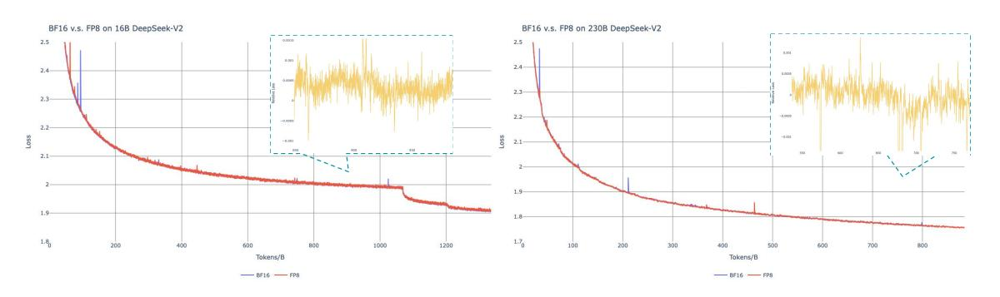

# **B. Ablation Studies for Low-Precision Training**

Figure 10 | Loss curves comparison between BF16 and FP8 training. Results are smoothed by Exponential Moving Average (EMA) with a coefficient of 0.9.

#### **B.1. FP8 v.s. BF16 Training**

We validate our FP8 mixed precision framework with a comparison to BF16 training on top of two baseline models across different scales. At the small scale, we train a baseline MoE model comprising approximately 16B total parameters on 1.33T tokens. At the large scale, we train a baseline MoE model comprising approximately 230B total parameters on around 0.9T tokens. We show the training curves in Figure [10](#page-46-3) and demonstrate that the relative error remains below 0.25% with our high-precision accumulation and fine-grained quantization strategies.

### **B.2. Discussion About Block-Wise Quantization**

Although our tile-wise fine-grained quantization effectively mitigates the error introduced by feature outliers, it requires different groupings for activation quantization, i.e., 1x128 in forward pass and 128x1 for backward pass. A similar process is also required for the activation gradient. A straightforward strategy is to apply block-wise quantization per 128x128 elements like the way we quantize the model weights. In this way, only transposition is required for backward. Therefore, we conduct an experiment where all tensors associated with Dgrad are quantized on a block-wise basis. The results reveal that the Dgrad operation which computes the activation gradients and back-propagates to shallow layers in a chain-like manner, is highly sensitive to precision. Specifically, block-wise quantization of activation gradients leads to model divergence on an MoE model comprising approximately 16B total parameters, trained for around 300B tokens. We hypothesize that this sensitivity arises because activation gradients are highly imbalanced among tokens, resulting in token-correlated outliers [\(Xi et al., 2023\)](#page-42-9). These outliers cannot be effectively managed by a block-wise quantization approach.

