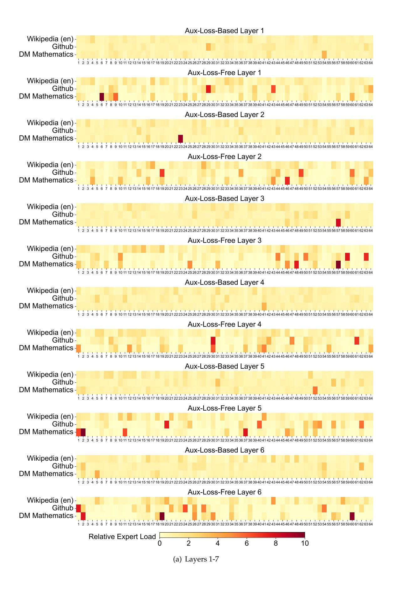
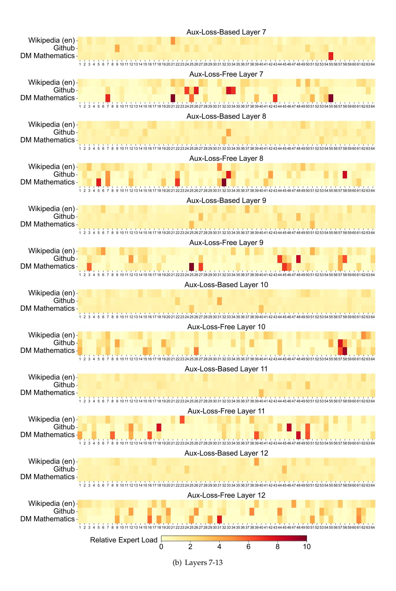
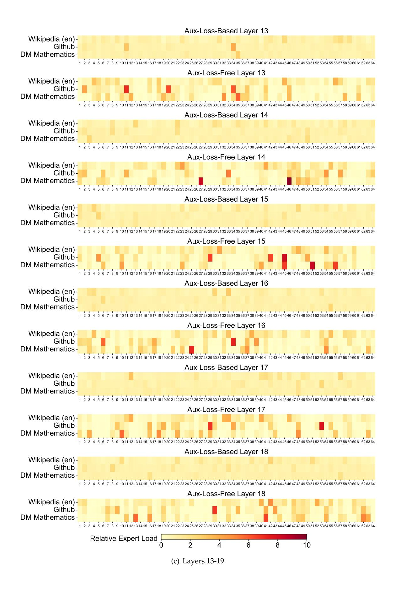
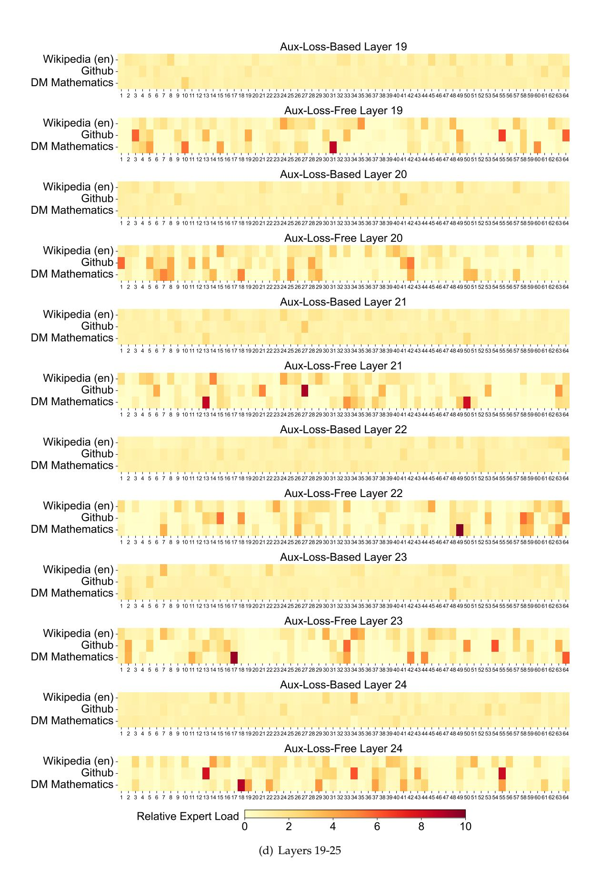
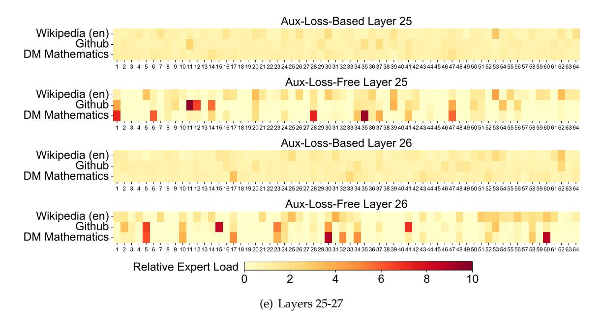

# **C. Expert Specialization Patterns of the 16B Aux-Loss-Based and Aux-Loss-Free Models**

We record the expert load of the 16B auxiliary-loss-based baseline and the auxiliary-loss-free model on the Pile test set. The auxiliary-loss-free model tends to have greater expert specialization across all layers, as demonstrated in Figure [10.](#page-52-0)

Figure 10 | Expert load of auxiliary-loss-free and auxiliary-loss-based models on three domains in the Pile test set. The auxiliary-loss-free model shows greater expert specialization patterns than the auxiliary-loss-based one. The relative expert load denotes the ratio between the actual expert load and the theoretically balanced expert load.