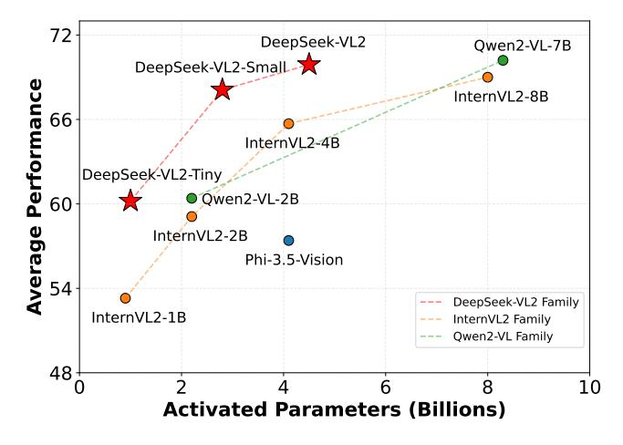

# DeepSeek-VL2: Mixture-of-Experts Vision-Language Models for Advanced Multimodal Understanding

Zhiyu Wu\*, Xiaokang Chen\*, Zizheng Pan\*, Xingchao Liu\*, Wen Liu\*, †, Damai Dai, Huazuo Gao, Yiyang Ma, Chengyue Wu, Bingxuan Wang, Zhenda Xie, Yu Wu, Kai Hu, Jiawei Wang, Yaofeng Sun, Yukun Li, Yishi Piao, Kang Guan, Aixin Liu, Xin Xie, Yuxiang You, Kai Dong, Xingkai Yu, Haowei Zhang, Liang Zhao, Yisong Wang, Chong Ruan‡

#### DeepSeek-AI

## **Abstract**

We present DeepSeek-VL2, an advanced series of large Mixture-of-Experts (MoE) Vision-Language Models that significantly improves upon its predecessor, DeepSeek-VL, through two key major upgrades. For the vision component, we incorporate a dynamic tiling vision encoding strategy designed for processing high-resolution images with different aspect ratios. For the language component, we leverage DeepSeekMoE models with the Multi-head Latent Attention mechanism, which compresses Key-Value cache into latent vectors, to enable efficient inference and high throughput. Trained on an improved vision-language dataset, DeepSeek-VL2 demonstrates superior capabilities across various tasks, including but not limited to visual question answering, optical character recognition, document/table/chart understanding, and visual grounding. Our model series is composed of three variants: DeepSeek-VL2-Tiny, DeepSeek-VL2-Small and DeepSeek-VL2, with 1.0B, 2.8B and 4.5B activated parameters respectively. DeepSeek-VL2 achieves competitive or state-of-the-art performance with similar or fewer activated parameters compared to existing open-source dense and MoE-based models. Codes and pre-trained models are publicly accessible at https://github.com/deepseek-ai/DeepSeek-VL2.

Figure 1 | Average performance vs. activated parameters among different open-source models. We average the accuracy of MMBench v1.1, MMStar, MMMU (Val), MathVista (TestMini), AI2D (Test), and OCRBench. The scores of OCRBench are divided by 10 to scale them to [0,100].

\*: Core contributors. †: Project lead. ‡: Corresponding author.

## **Contents**

| 1 |                                             | Introduction                            | 3  |  |  |  |  |  |  |  |  |
|---|---------------------------------------------|-----------------------------------------|----|--|--|--|--|--|--|--|--|
| 2 |                                             | Model Architecture                      | 4  |  |  |  |  |  |  |  |  |
| 3 |                                             | Data Construction                       |    |  |  |  |  |  |  |  |  |
|   | 3.1                                         | Vision-Language Alignment Data          | 6  |  |  |  |  |  |  |  |  |
|   | 3.2 Vision-Language Pretraining Data  |                                         |    |  |  |  |  |  |  |  |  |
|   | 3.3                                         | Supervised Fine-tuning Data          | 8  |  |  |  |  |  |  |  |  |
| 4 | Training Methodology                        |                                         |    |  |  |  |  |  |  |  |  |
|   | 4.1                                         | Training Pipelines                      | 9  |  |  |  |  |  |  |  |  |
|   | 4.2                                         | Hyperparameters and Infrastructures  | 10 |  |  |  |  |  |  |  |  |
| 5 |                                             | Evaluation                              | 11 |  |  |  |  |  |  |  |  |
|   | 5.1                                         | Multimodal Performance                  | 11 |  |  |  |  |  |  |  |  |
|   | 5.2                                         | Qualitative Study                    | 12 |  |  |  |  |  |  |  |  |
| 6 |                                             | Conclusion                              | 20 |  |  |  |  |  |  |  |  |

