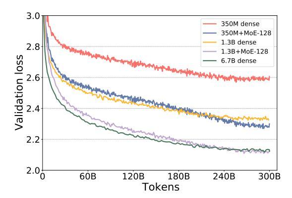

## DeepSpeed-MoE: Advancing Mixture-of-Experts Inference and Training to Power Next-Generation AI Scale

Samyam Rajbhandari, Conglong Li, Zhewei Yao, Minjia Zhang, Reza Yazdani Aminabadi, Ammar Ahmad Awan, Jeff Rasley, and Yuxiong He

### Microsoft

#### Abstract

As the training of giant dense models hits the boundary on the availability and capability of the hardware resources today, Mixture-of-Experts (MoE) models become one of the most promising model architectures due to their significant training cost reduction compared to a quality-equivalent dense model. Its training cost saving is demonstrated from encoder-decoder models (prior works) to a 5x saving for auto-aggressive language models (this work along with parallel explorations). However, due to the much larger model size and unique architecture, how to provide fast MoE model inference remains challenging and unsolved, limiting its practical usage. To tackle this, we present DeepSpeed-MoE, an end-to-end MoE training and inference solution as part of the DeepSpeed library, including novel MoE architecture designs and model compression techniques that reduce MoE model size by up to 3.7x, and a highly optimized inference system that provides 7.3x better latency and cost compared to existing MoE inference solutions. DeepSpeed-MoE offers an unprecedented scale and efficiency to serve massive MoE models with up to 4.5x faster and 9x cheaper inference compared to quality-equivalent dense models. We hope our innovations and systems help open a promising path to new directions in the large model landscape, a shift from dense to sparse MoE models, where training and deploying higher-quality models with fewer resources becomes more widely possible.

## 1 Introduction

In the last three years, the largest trained model has increased in size by over 1000x, from a few hundred million parameters to half a trillion parameters (Megatron-Turing NLG 530B). Improvements in model quality with size suggest that this trend will continue, with larger model sizes bringing better model quality.

However, sustaining the growth in model size is getting more and more difficult due to the increasing compute requirements. For example, the largest single dense model in existence as of Dec 2021, the Megatron-Turing NLG 530B model, took around 3 months to train on over 2000 A100 GPUs on the NVIDIA Selene Supercomputer, consuming over 3 million GPU hours [\[2\]](#page-26-0). Another 3 to 5 times of increase in dense model size would be infeasible within a reasonable timeframe.

Given the exorbitant compute resources required to train the state-of-art models, a natural question to ask is: "Is it possible to make non-trivial improvement to model quality without

This paper is published at ICML 2022 [\[1\]](#page-26-1): <https://proceedings.mlr.press/v162/rajbhandari22a>. Author contributions listed at [the end of paper.](#page-25-0)

increasing the compute cost?" Or equivalently, "Is it possible to produce model with similar quality using 3 to 5 times less resources?"

There have been numerous efforts to reduce the compute requirements to train large models without sacrificing model quality. To this end, architectures based on Mixture-of-Experts (MoE) [\[3,](#page-26-2) [4,](#page-26-3) [5\]](#page-26-4) have paved a promising path, enabling sub-linear compute requirements with respect to the model parameters and allowing for improved model quality without increasing training cost. However, MoE based models have their own set of challenges that limit their use in a wide range of real world scenarios:

- Limited Scope The scope of MoE based models in the NLP area is primarily limited to encoder-decoder models and sequence-to-sequence tasks, with limited work done in exploring its application in other domains. Application of MoE to auto-regressive natural language generation (NLG) like GPT-3 and MT-NLG 530B, where the compute cost of training state-of-art language models can be orders of magnitude higher than for encoderdecoder models, is less explored.
- Massive Memory Requirements While MoE models require less compute to achieve the same model quality as their dense counterparts, they need significantly more number of parameters. For example, the MoE based Switch-Base model has 10x more parameters than T5-large (7.4B vs 0.74B) and still it does not have the same model quality when compared across a wide range of downstream tasks [\[5\]](#page-26-4). In other words, MoE based models have a much lower "parameter efficiency" compared to quality-equivalent dense models. Larger model size and lower parameter efficiency bring challenges in both training and inference.

For training, this massive increase in model size requires a proportional increase in device memory. Note that the above mentioned T5-large (0.74B) can fit in the memory of a single 32GB V100 GPU, while training Switch-Base (7.4B) requires at least 8-10 such GPUs to even just fit the model in device memory for training. If we scale the dense model size to MT-NLG equivalent with 500B parameters, achieving similar quality with MoE based model might need a model with over 5 trillion parameters (assuming the 10x scaling still holds), which would require over 5K GPUs to just fit the model states for training. This massive model size makes MoE based model training at scale challenging due to both the device memory required as well as the system support required to effectively utilize the device memory across thousands of GPUs.

• Limited Inference Performance Due to the large model size and poor parameter efficiency mentioned above, fast inference of MoE based models is even more challenging. On one hand, the larger parameter size requires more GPUs to fit, and multi-gpu inference technology is not designed to work with MoE based models. On the other hand, as inference is often memory bandwidth bound, MoE based models, which can be 10x larger than their dense equivalent, could require 10x higher achievable memory bandwidth to achieve similar inference latency as the dense models.

Despite the promising and non-trivial reduction in training cost, these above mentioned challenges severely limits the practical applicability of MoE. In an effort to make MoE practical, accessible and applicable, in this paper, we address these challenges by offering three corresponding solutions:

• We expand the scope of MoE based models to auto-regressive NLG tasks, demonstrating training cost reduction of 5x to achieve same model quality for models like GPT-3 and MT-NLG. These results not only demonstrate clear opportunities to reduce the cost of training massive NLG models, but also opens up the possibilities to reach much higher nextgeneration model quality under the limitation of current generation hardware resource.

- We improve parameter efficiency of MoE based models by developing a novel MoE architecture that we call Pyramid-Residual MoE (PR-MoE). PR-MoE is a hybrid dense and MoE model created using residual connections, while applying experts only where they are most effective. PR-MoE can reduce MoE model parameter size by up to 3x with no change to model quality and minimal change to the compute requirements. In addition, we create a distilled version of PR-MoE, which we call Mixture-of-Students (MoS), via staged knowledge distillation. MoS reduces the MoE model size by up to 3.7x while retaining comparable model quality.
- We develop DeepSpeed-MoE inference system, a highly optimized MoE inference system which enables efficient scaling of inference workloads on hundreds of GPUs, providing up to 7.3x reduction in inference latency and cost when compared with existing MoE inference solutions. It offers ultra-fast inference latencies (under 25 ms) for trillion-parameter MoE models. DeepSpeed-MoE also offers up to 4.5x faster and 9x cheaper inference for MoE models compared to quality-equivalent dense models by combining both system and model optimizations.

Together, our innovations and systems enable MoE to be a more effective and economic alternative comparing to dense models, achieving significantly lower training and inference cost while obtaining the same model quality. Or equivalently, they can be used to empower the models of the next generation AI scale without requiring an increase in compute resources. We hope DeepSpeed-MoE helps open a promising path to new directions in the large model landscape, a shift from dense to sparse MoE models, where training and deploying higherquality models with fewer resources becomes more widely possible.

Paper outline We begin the remainder of this paper with necessary background and related work followed by the three solutions above presented as self-contained sections.

Software We are in the process of open sourcing DeepSpeed-MoE as part of the DeepSpeed library over multiple stages. Please find the code, tutorials, and documents at DeepSpeed GitHub (<https://github.com/microsoft/DeepSpeed>) and website (<https://www.deepspeed.ai/>). Experiments in this paper were conducted on the Microsoft Azure AI platform, the best place to train and serve models using DeepSpeed. Our tutorials include how to get started with DeepSpeed on Azure and experiment with different models using Azure ML.

## 2 Related Work

### 2.1 Large Scale Dense NLP Models

To test and verify the upper bound of scaling law [\[6\]](#page-26-5) for model capacity with respect to number of parameters, the pretrained natural language processing model size has been increasing 10x per year for the last several years. Earlier works are generally in the scale of hundreds of millions of parameters, including BERT [\[7\]](#page-26-6), XLNet [\[8\]](#page-26-7), RoBERTa [\[9\]](#page-26-8), ALBERT [\[10\]](#page-27-0), and GPT [\[11\]](#page-27-1), etc. Later on, billions to dozens of billions models, like GPT-2 [\[12\]](#page-27-2), TuringNLG [\[13\]](#page-27-3), Megatron-LM [\[14\]](#page-27-4), T5 [\[15\]](#page-27-5) etc, are introduced and they are shown to have better generalization performance on various of natural language understanding and generation tasks [\[16,](#page-27-6) [17,](#page-27-7) [18,](#page-27-8) [19,](#page-27-9) [20,](#page-27-10) [21\]](#page-27-11). The GPT-3 [\[22\]](#page-27-12) further pushes the upper limit to 175 billions parameters, and shows that with zero/few-shot learning, it can achieve comparable or even better performance than previous small scale models with finetuning. More recently, the extra-large Megatron-Turing NLG 530B model [\[2\]](#page-26-0) achieves 530 billions parameters by software support from DeepSpeed [\[23\]](#page-27-13) and Megatron-LM [\[14\]](#page-27-4), and it achieves new state-of-the-art results of zero/few-shot learning within one dense model. However, as the training takes 3 months on over 2000 A100 GPUs, it is no longer feasible to achieve better model quality by simply increasing the model size due to unsurmountable compute requirements.

### 2.2 Reducing Training Cost by MoE Architecture

One promising way to reduce the training cost is using Mixture of Expert (MoE) [\[24\]](#page-28-0). In [\[3\]](#page-26-2) authors scale LSTM based model to 127B by applying convolutional MoE layers between stacked LSTM layers [\[25\]](#page-28-1) for language modelings and machine translation. The sparsity nature of MoE significantly improves the scaling of model size without increasing the computational cost. GShard [\[4\]](#page-26-3) utilizes MoE to train a transformer-based model [\[26\]](#page-28-2) to 600B parameters for multi-language translation, and it shows that the training cost of this 600B MoE model is even cheaper than that of a 100B dense model. Switch Transformer [\[5\]](#page-26-4) continues this based on the T5 model and scales the model to 1.6 trillion. To achieve same accuracy performance, [\[5\]](#page-26-4) shows a 2.5x faster training speed of MoE models as compared to large dense models. Following by this, more recent work [\[27,](#page-28-3) [28,](#page-28-4) [29\]](#page-28-5) exhibit the sparsity advantage of MoE.

A few recent and parallel works [\[30,](#page-28-6) [31\]](#page-28-7) show that MoE model can also be applied to auto-regressive natural language generation tasks, including preliminary results on multiple downstream evaluation tasks. However, our work has major differences compared to these parallel explorations: (1) our work investigates training, model design, and inference opportunities of MoE models while [\[30,](#page-28-6) [31\]](#page-28-7) primarily focuses on MoE training; (2) we propose PR-MoE architecture and MoS knowledge distillation to achieve better MoE parameter efficiency and on-par/better zero-shot eval quality as described in Section [3.3;](#page-5-0) (3) we develop DeepSpeed-MoE inference system to efficiently serve large scale MoE models with high throughput and low latency. While recent studies like [\[30\]](#page-28-6) and [\[31\]](#page-28-7) discuss reduction of FLOPs, it is pertinent to mention that unlike training, inference latency and cost do not depend on computation alone. Efficient inference depends on model size, memory bandwidth, and the capability of a system to read data from memory efficiently. DeepSpeed-MoE inference system is an end-to-end system that combines model architecture innovations (Section [4\)](#page-6-0) and myriad of optimizations and techniques (Section [5\)](#page-14-0) to deliver ultra low latency and super-linear speedups for throughput.

### 2.3 MoE Training and Inference Systems

Given the recent uptake of MoE models by many researchers around the world, open source systems and frameworks are being developed or extended to support MoE model training. To the best of our knowledge, there are no MoE systems specifically designed and optimized for inference yet. Several MoE training systems have been presented recently. Below we discuss a few of them.

DeepSpeed MoE training system [\[32\]](#page-28-8) was primarily targeted for optimized training of MoE models at scale. The main goal of this work was to establish a flexible user-facing API for extending existing training codes for efficient and scalable MoE model training. It supports up to 8x bigger model sizes by leveraging flexible combinations of different types of parallelism including tensor-slicing, data parallelism, ZeRO [\[23\]](#page-27-13)-powered data parallelism, and expert parallelism. It was used to train Z-code MoE, a 10 billion-parameter multitask multilingual MoE model (transformer encoder-decoder architecture) on 50 languages with 5x less training time compared to a dense model of equal quality.

FastMoE [\[33\]](#page-28-9) is a research software developed to show how MoE models can be trained under data and expert (model) parallelism. The combination of various parallelism dimensions is not fully supported. Fast-MoE examples include Transformer-XL and Megatron-LM but results about large-scale end-to-end training are not available yet. Fairseq-MoE [\[31\]](#page-28-7) offers an MoE API as well as a training pipeline for generic language models. The Fairseq system has been further optimized by Tutel [\[34\]](#page-28-10), which offers up to 40 percent improvement over Fairseq.

## 3 DeepSpeed-MoE for NLG: Reducing the Training Cost of Language Models by 5 Times

Autoregressive transformer-based natural language generation (NLG) models offer convincing solutions to a broad range of language tasks from document summarization, headline generation, question and answering to even generating code in a wide variety of programming languages. Due to the general applicability of these models, improving their quality has been of great interest for both academia and industry alike. Given the tremendous compute and energy requirements for training NLG family of models, we explore the opportunities that MoE presents to reduce their training cost. We show that MoE can be applied to NLG family of models to significantly improve their model quality with the same training cost. Alternatively, it can achieve 5x reduction in training cost to achieve the same model quality of a dense NLG model.

### 3.1 MoE based NLG Model Architecture

To create an MoE based NLG model, we studied the GPT like transformer-based NLG model. To complete training in a reasonable timeframe, the following models are selected: 350M (24 layers, 1024 hidden size, 16 attention heads), 1.3B (24 layers, 2048 hidden size, 16 attention heads), and 6.7B (32 layers, 4096 hidden size, 32 attention heads). We use "350M+MoE-128" to denote a MoE model that uses 350M dense model as the base model and adds 128 experts on every other feedforward layer. That is to say, there are in total 12 MoE layers for both 350M+MoE-128 and 1.3B+MoE-128.

We use a gating function to activate a subset of experts in the MoE layer for each token. Specifically, in our experiments, only the top-1 expert is selected. Therefore, during both training and inference, our MoE model will have the same number of parameters to be activated for each token as their dense part (illustrated in Figure [3](#page-9-0) (left)). For example, 1.3B+MoE-128 will only activate 1.3B parameter per token, and the amount of training computation per token will be similar to a 1.3B dense model. We also tested top-2 gating function and found it provides some convergence improvement, but it is a diminishing return and it comes with a large training computation/communication overhead compared to top-1 gating.

### 3.2 Training and Evaluation Settings

We pre-trained both the dense and MoE version of the above models using DeepSpeed on 128 Ampere A100 GPUs (Azure ND A100 instances). These Azure instances are powered by the latest Azure HPC docker images that provide a fully optimized environment and best performing library versions of NCCL, Mellanox OFED, Sharp, and CUDA. DeepSpeed uses a combination of data parallel and expert parallel training to effectively scale the MoE model training. We used the same training data for the MT-NLG model [\[2\]](#page-26-0). For a fair comparison, we use 300B tokens to train both the dense model and the MoE models.

Table 1: Hyperparameters for different dense and MoE NLG models.

|                          | Dense  | Dense  | Dense  | 350M+   | 1.3B+   | 350M+PR-  | 1.3B+PR    |
|--------------------------|--------|--------|--------|---------|---------|-----------|------------|
|                          | 350M   | 1.3B   | 6.7B   | MoE-128 | MoE-128 | MoE-32/64 | MoE-64/128 |
| Num. layers              | 24     | 24     | 32     | 24      | 24      | 24        | 24         |
| Hidden size              | 1024   | 2048   | 4096   | 1024    | 2048    | 1024      | 2048       |
| Num. attention heads     | 16     | 16     | 32     | 16      | 16      | 16        | 16         |
| Num. experts per layer   | N/A    | N/A    | N/A    | 128     | 128     | 32/64     | 64/128     |
| Num. parameters          | 350M   | 1.3B   | 6.7B   | 13B     | 52B     | 4B        | 31B        |
| Context/sequence length  | 2K     | 2K     | 2K     | 2K      | 2K      | 2K        | 2K         |
| Training tokens          | 300B   | 300B   | 300B   | 300B    | 300B    | 300B      | 300B       |
| Batch size               | 256    | 512    | 1024   | 256     | 512     | 256       | 512        |
| Batch size rampup tokens | 0B     | 4B     | 10B    | 0B      | 0B      | 0B        | 0B         |
| Learning rate            | 3.0e-4 | 2.0e-4 | 1.2e-4 | 2.0e-4  | 1.2e-4  | 3.0e-4    | 1.2e-4     |
| Min. learning rate       | 3.0e-5 | 2.0e-5 | 1.2e-5 | 2.0e-6  | 1.0e-6  | 1.0e-6    | 1.0e-6     |
| LR linear warmup tokens  | 375M   | 375M   | 375M   | 375M    | 375M    | 375M      | 375M       |
| LR cosine decay tokens   | 260B   | 260B   | 260B   | 300B    | 300B    | 300B      | 300B       |
| Model parallel degree    | 1      | 1      | 8      | 1       | 1       | 1         | 1          |
| MoE loss coefficient     | N/A    | N/A    | N/A    | 0.01    | 0.01    | 0.01      | 0.01       |

Table [1](#page-5-1) summarizes the hyperparameters for training the dense and MoE models. For dense models we followed the hyperparameters from the GPT-3 work [\[22\]](#page-27-12). For MoE models, we find that using a lower learning rate and longer learning rate decay duration compared to the dense counter parts (e.g., dense 1.3B versus 1.3B+MoE-128) could provide better convergence. We believe that this is because MoE models have much larger number of parameters. MoE models have two additional hyperparameters: the number of experts per MoE layer, and a coefficient when adding the MoE layer losses to the total training loss.

In addition to comparing the validation loss during pre-training, we employ 6 zero-shot evaluation tasks to compare the final model quality: 1 completion prediction task (LAMBADA [\[16\]](#page-27-6)), 1 common sense reasoning task (PIQA [\[35\]](#page-28-11)), 2 reading comprehension tasks (BoolQ [\[18\]](#page-27-8), RACEh [\[36\]](#page-28-12)), and 2 question answering tasks (TriviaQA [\[21\]](#page-27-11), WebQs [\[20\]](#page-27-10)).

### 3.3 MoE Leads to Better Quality for NLG Models

Figure [1](#page-6-1) shows that the validation loss for the MoE versions of the model is significantly better than their dense counter parts. Furthermore, notice that the validation loss of the MoE model, 350M+MoE-128, is on par with the validation loss of the 1.3B dense model with 4x larger base. This is also true for 1.3B+MoE-128 in comparison with 6.7B dense model with 5x larger base. Furthermore, the model quality is on par not only for the validation loss but also for the zero-shot evaluation on the 6 downstream tasks as shown in Table [2,](#page-7-0) demonstrating that MoE models and their dense counter part with 4-5x larger base have very similar model quality.

In addition, in Table [2](#page-7-0) we also compare our zero-shot results with related works that explored MoE for NLG models in parallel with ours [\[30,](#page-28-6) [31\]](#page-28-7). Although with the caveats that the training data and hyperparamters are not the same, the comparisons demonstrate that on certain tasks our MoE models are able to achieve on-par or better quality with less number of parameters: Compared to 8B+MoE-64 (143B) in [\[30\]](#page-28-6), our MoE models (1.3B+MoE-128 (52B), 1.3B+PR-MoE-64/128 (31B), 1.3B+PR-MoE+L21+MoS (27B)) are able to achieve better LAMBADA accuracy with up to 5.3x less number of parameters. Compared to the 355M+MoE-512 (52B) in [\[31\]](#page-28-7), our MoE models (1.3B+PR-MoE-64/128 (31B) and 1.3B+PR-MoE+L21+MoS (27B)) are able to achieve better PIQA/BoolQ accuracy with up to 1.9x less number of parameters.

Figure 1: Token-wise validation loss curves for dense and MoE NLG models with different model sizes.

### 3.4 Same Quality with 5x Less Training Cost

As we saw from the results above, adding MoE with 128 experts to the NLG model significantly improves the quality of the NLG model. However, these experts do not change the compute requirements of the model as each token is only processed by a single expert. Therefore, the compute requirements for dense model and its corresponding MoE models with the same base are similar. More concretely, a 1.3B+MoE-128 model training requires roughly the same amount of compute operations as 1.3B dense model, while offering much better model quality.

Furthermore, our results show that by applying MoE we can achieve the model quality of a 6.7B parameter dense model at the training cost of 1.3B parameter dense model, resulting in an effective training compute reduction of 5x. This compute cost reduction can directly be translated into throughput gain, training time and training cost reduction by leveraging the efficient DeepSpeed MoE training system. Table 3 shows the training throughput of the 1.3B+MoE-128 model in comparison to the 6.7B dense model on 128 NVIDIA A100 GPUs.

To conclude, this section shows significant training cost saving of using MoE on NLG models: by applying MoE we achieved the model quality of a 6.7B parameter dense NLG model at the cost of training a 1.3B base model, thanks to the sparse structure of MoE. Assuming the scaling holds, the results have the potential to transform the large model training landscape and power much bigger model scale under more affordable time and cost using the hard resources available today. For example, a model with comparable accuracy as trillion-parameter dense model can be potentially trained at the cost of a 200B parameter (like GPT-3) sized dense model, translating to millions of dollars in training cost reduction and energy savings [22].

