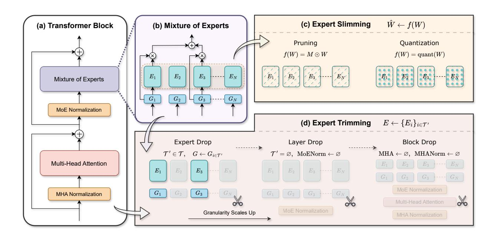
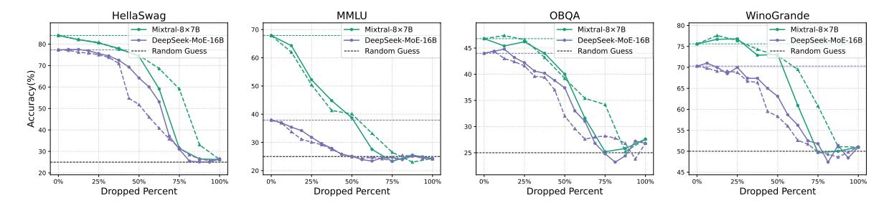
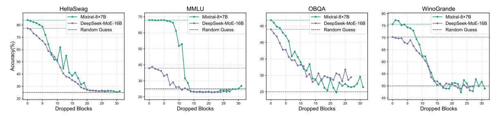
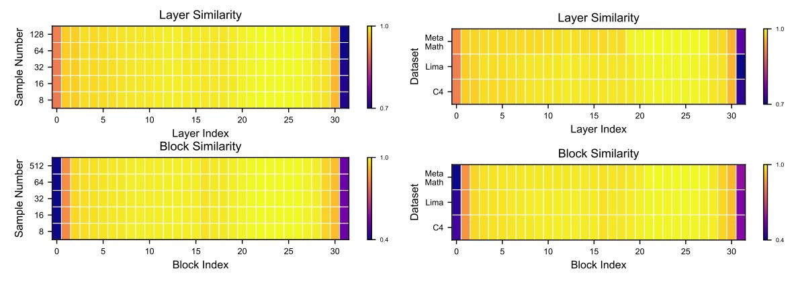

# **1 Introduction**

While scaling large language models has shown exceptional performance across various domains [\(Ramesh](#page-13-0) [et al., 2021;](#page-13-0) [OpenAI, 2024;](#page-13-1) [Team, 2024a\)](#page-14-0), the increasing model size poses significant challenges in real-world deployments [\(Sun et al., 2023;](#page-14-1) [Frantar et al., 2022\)](#page-11-0) due to excessive computational demands and associated costs. The Mixture of Experts (MoE) [\(Shazeer et al., 2017\)](#page-13-2), which selectively activates a subset of parameters during inference, offers a promising solution to reduce these computational burdens. Additionally, integrating

∗Equal contribution

†Work done during assistantship

MoE with Large Language Models (LLMs) has been shown to further enhance performance [\(Jiang et al.,](#page-12-0) [2024;](#page-12-0) [Dai et al., 2024\)](#page-11-1).

Despite these advancements, MoE models still suffer from significant redundancies that increase deployment costs. Standard MoE implementations replicate feed-forward layers across multiple experts, resulting in heavily parameterized models. For instance, Mixtral-8×7B [\(Jiang et al., 2024\)](#page-12-0) contains 47B parameters, but only 13B parameters are activated per token, leading to substantial GPU memory consumption and limited scalability. In addition, replicating experts often introduces redundant experts. For example, [He et al.](#page-12-1) [\(2023\)](#page-12-1) observed that expert parameters could be compressed through parameter sharing. Similarly, [Lu et al.](#page-13-3) [\(2024\)](#page-13-3) noted that not all experts are essential, suggesting that some can be safely removed. These findings underscore the potential for compressing MoE models to improve efficiency without sacrificing effectiveness.

In this paper, we first investigate the Expert Trimming based compression techniques, which reduce the number of experts to enhance the efficiency of MoE [\(Cheng et al., 2020;](#page-11-2) [Liang et al., 2021\)](#page-12-2). The most prevalent approach for Expert Trimming is Expert Drop, which scores each expert and drops the less important ones [\(Lu et al., 2024;](#page-13-3) [Muzio et al., 2024\)](#page-13-4). While Expert Drop reduces model size, it does not eliminate costly computations within the MoE layer and complex communication among experts, leading to negligible improvements in the inference speed. To this end, we propose more aggressive Expert Trimming methods to enhance MoE efficiency. Specifically, to mitigate communication and computation costs, we present Layer Drop that removes the entire MoE layer. Additionally, given the computation-intensive nature of the attention mechanism within transformer blocks, we further propose Block Drop, which removes the whole transformer blocks. We use similarity-based metrics to demonstrate the feasibility of Layer Drop and Block Drop. Surprisingly, these two coarse-grained methods outperform fine-grained Expert Drop by a large margin in balancing performance and efficiency. Additionally, with small-scale post-finetuning, the compressed models can be further optimized to achieve near-original performance.

Beyond removing experts, we also explore Expert Slimming, which focuses on compressing individual experts. Techniques such as network pruning [\(Han et al., 2016;](#page-12-3) [Zhu & Gupta, 2017\)](#page-14-2) and quantization [\(Jacob et al.,](#page-12-4) [2017;](#page-12-4) [Nagel et al., 2021\)](#page-13-5) have proven effective for the model compression, with quantization being particularly suitable for hardware acceleration. By integrating Expert Slimming with Expert Trimming, we propose a unified framework for compressing MoE models that further maximizes efficiency gains while maintaining strong performance.

Our experimental results on representative MoE models, Mixtral-8×7B [\(Jiang et al., 2024\)](#page-12-0) and DeepSeek-MoE-16B [\(Dai et al., 2024\)](#page-11-1), demonstrate the effectiveness of our proposed methods. For Expert Trimming, Expert Drop significantly reduces the memory usage but it provides only marginal improvements in inference speed. In contrast, Layer Drop and Block Drop significantly accelerate inference and reduce memory usage while maintaining comparable performance to the original models. The combined strategy of Expert Trimming and Expert Slimming results in a 6.05× speedup with only 22.8% memory usage (20.0GB) while maintaining over 92% of the original performance on Mixtral-8×7B. The findings offer valuable insights for enhancing the efficiency of MoE models. Additionally, post-finetuning allows compressed models to recover most of their original performance, resulting in a minimal 0.6% performance gap compared to the uncompressed DeepSeek-MoE-16B model.

In summary, by conducting a holistic study on compressing Mixture of Experts, our key contributions are:

- We extend Expert Trimming to a higher architectural with Layer Drop and Block Drop, significantly enhancing computation and memory efficiency while preserving model performance.
- We integrate Expert Trimming with Expert Slimming to further achieve efficiency gains without compromising performance.
- Extensive experimental results demonstrate the effectiveness of our proposed methods, achieving a 6*.*05× speedup and reducing memory usage to just 20*.*0 GB, all while maintaining over 92% of performance on Mixtral-8×7B.

### 2 Related Work

Mixture of Experts The Mixture of Experts (MoE) is a kind of neural network architecture with an extended set of parameters (referred to as "experts") controlled by a router, which is first introduced in the context of conditional computation (Jacobs et al., 1991; Jordan & Jacobs, 1994). The potential of sparse activation in MoE is subsequently exploited by Shazeer et al. (2017) for efficient training and inference on pretrained models with special designs, opening the door for MoE in various vision (Riquelme et al., 2021) and language (Lepikhin et al., 2020; Du et al., 2022; Fedus et al., 2022) scenarios. Attributed to its exceptional efficiency, MoE has been adopted as a foundational framework in the designs of large language models (LLMs) (Jiang et al., 2024; Dai et al., 2024; Xue et al., 2024a; Zhu et al., 2024; Team, 2024b), achieving superior scaling laws at low computational costs (Clark et al., 2022). Further investigations emerge in developing improved expert structures (Gururangan et al., 2022; Rajbhandari et al., 2022; Dai et al., 2024), router designs (Lewis et al., 2021; Roller et al., 2021; Zhou et al., 2022), and training strategies (Shen et al., 2023; Chen et al., 2022), propelling the continuous evolution on the representation capability and computational efficiency of MoE models. Despite the success, MoE also suffers from efficiency issues. For instance, MoE replicates the experts, significantly increasing the parameter budget (He et al., 2023). On the other hand, adopting multiple experts to process input tokens introduces communication costs and enhances latency (Song et al., 2023; Xue et al., 2024b).

Compression Methods The increasing size of large language models presents considerable challenges for their practical implementation. Consequently, a range of efficient methods has emerged to address the implementation issues. Among them, model quantization (Frantar et al., 2022; Lin et al., 2024) and network pruning (Sun et al., 2023; Frantar & Alistarh, 2023) are widely utilized. Model quantization reduces the precision of neural network weights to lower bits (Jacob et al., 2017), while network pruning (Han et al., 2016) removes redundant parameters or architectures. Although these methods have shown promising results on dense models, they lack consideration for the inductive bias inherent in MoE. To bridge this gap, Expert Drop, as proposed in studies like (Muzio et al., 2024; Lu et al., 2024), addresses the unique nature of MoE by removing unimportant experts. By eliminating redundant experts, the MoE architecture becomes more compact and can be deployed at a lower cost. However, while Expert Drop leads to a more compact architecture, it may also lead to non-negligible performance drop and rely on post-training for recovery.

### 3 Preliminaries

### 3.1 Mixture of Experts

A Mixture of Experts (MoE) layer consists of a collection of n experts,  $\{E_1, E_2, \ldots, E_n\}$ , each associated with weights  $\{W_1, W_2, \ldots, W_n\}$ , and a router G that dynamically selects the most relevant experts for a given input x. The router computes selection scores,  $G(x) \in \mathbb{R}^n$ , for all experts and selects the top k experts, resulting in a sparse activation pattern. The input x is processed by the selected experts, and their outputs are combined into a weighted sum based on the router's scores. This process is mathematically expressed as:

$$\mathcal{K} = \text{TopK}(\text{Softmax}(\mathbf{G}(\mathbf{x})), k), \tag{1}$$

$$y = \sum_{i \in \mathcal{K}} G(x)_i \cdot E_i(x|W_i), \tag{2}$$

where K denotes the indices of selected experts,  $G(x)_i$  represents the selection score for the *i*-th expert, and  $E_i(x)$  is the output from the *i*-th expert. In transformer models, the MoE layer usually replaces the feed-forward network (FFN). In this context, each expert functions as an independent FFN module, enhancing the model's capacity without a proportional increase in the computational cost (Vaswani et al., 2017).

Challenges While MoE models have demonstrated strong performance across various tasks (Jiang et al., 2024; Dai et al., 2024), they also encounter significant deployment challenges. On one hand, MoE models replicate multiple expert networks, inflating the model size and memory usage. For instance, Mixtral-8×7B has a total of 47B parameters and requires 87.7GB of memory for deployment, though only 13B parameters

are activated for each token. On the other hand, the communication required to manage multiple expert networks increases latency and slows down inference speed, especially in distributed environments (Song et al., 2023; Yu et al., 2024).

#### 3.2 Overview of Previous Compression Methods

To address the efficiency challenges, we first review several mainstream and state-of-the-art compression techniques for MoE models.

**Pruning:** Pruning reduces the number of active parameters by selectively disabling parts of the model's weights. In an MoE layer with n experts  $\{E_i\}_{i=1}^n$  and corresponding weights  $\{W_i\}_{i=1}^n$ , pruning introduces binary masks  $\{M_i\}_{i=1}^n$  to deactivate certain weights:

$$\hat{\boldsymbol{W}}_i = \boldsymbol{M}_i \odot \boldsymbol{W}_i. \tag{3}$$

Pruning can be unstructured (Lee et al., 2021; Bai et al., 2022), semi-structured, or structured. Unstructured sparsity tends to yield the best performance, semi-structured sparsity strikes a balance between efficiency and performance, and structured sparsity, while hardware-friendly, often results in lower performance.

**Quantization**: Unlike pruning, which involves masking out unimportant parameters, quantization reduces memory usage by converting model weights to lower-bit representations. For MoE layers, quantization is applied in the following way:

$$\hat{\boldsymbol{W}}_i = \text{Quant}(\boldsymbol{W}_i), \tag{4}$$

where "Quant" denotes the quantization function. Quantization decreases the computation and memory consumption without reducing FLOPs or the total number of parameters, making it particularly advantageous for hardware acceleration.

**Expert Drop**: Different from fine-grained pruning and quantization, Expert Drop entails the removal of expert networks, based on the observation that not all experts are equally important (Lu et al., 2024; Muzio et al., 2024). Given expert-wise importance scores S (e.g., the routing scores,  $S(E_i) = G(x)_i$ ), Expert Drop retains only the experts with the highest n' scores:

$$\mathcal{T}' = \text{TopK}(\mathbf{S}(\{\mathbf{E}_i\}_{i=1}^n), n'), \tag{5}$$

$$E \leftarrow \{E_i\}_{i \in \mathcal{T}'}, \quad G \leftarrow G_{i \in \mathcal{T}'}.$$
 (6)

Here,  $\mathcal{T}'$  denotes the subset of the original expert indices  $\mathcal{T} = \{1, 2, ..., n\}$ . Expert Drop reduces FLOPs conditionally: when  $\mathcal{T}'$  contains more than or equal to k indices, MoE still utilizes the top k experts for each input; otherwise, it uses all remaining experts. While this approach reduces communication between experts, the resulting speedup is usually insignificant when maintaining acceptable performance.

Other Compression Techniques: Other methods, such as low-rank decomposition (Li et al., 2024b;a), aim to compress model weights into smaller matrices, further reducing memory and computational costs. In this work, we primarily focus on the widely-used methods (pruning, quantization, and Expert Drop), leaving a more detailed exploration of these additional methods for future research.

### 4 A Holistic Study of MoE Compression Techiniques

In this section, we propose a general framework that unifies various compression methods for MoE. This framework provides a comprehensive understanding of MoE model efficiency issues and helps identify new design spaces for further performance improvements.

#### 4.1 Overview

Existing MoE compression methods primarily address two types of inefficiencies: **structural redundancies** in the overall architecture and **internal redundancies** within individual experts. To address both issues, we categorize these methods into two complementary perspectives: Expert Trimming that focuses on removing

Figure 1: **The Unified View of MoE Compression.** The view integrates two complementary perspectives: Expert Slimming and Expert Trimming. Expert Slimming compresses individual experts, while Expert Trimming directly drops structured modules.

Table 1: **Summary of Compression Methods.** "✓" means effective, indicating that the method performs well as intended. "✗" means ineffective, where the method fails to optimize the specified metric. "❍" represents conditionally effective, depending on specific settings and environments.

|                 | Method                   | Formulation             | Parameter | Memory | FLOPs  | Speedup |
|-----------------|--------------------------|-------------------------|-----------|--------|--------|---------|
|                 | Expert Drop              | ′ T ← T              | ✓         | ✓      | ❍      | ❍       |
| Expert Trimming | Layer Drop Block Drop | ∅ T ←                | ✓         | ✓      | ✓      | ✓       |
| Expert Slimming | Pruning Quantization  | M ⊙ W Quant(W) | ✓ ✗    | ❍ ✓ | ✓ ✗ | ❍ ✓  |

structured components (e.g., experts, layers, and blocks), and Expert Slimming that compresses individual experts through techniques like pruning or quantization. An overview of these compression perspectives is illustrated in Figure [1.](#page-4-0)

Expert Trimming deals with compressing structured modules by selecting and retaining only a subset of the experts, denoted as T ′ . This is represented by the transformation T ← T ′ . Methods like Expert Drop, which selectively drops unimportant experts, are examples of this approach. On the other hand, the compression of individual experts (Expert Slimming) focuses on the transformation and reduction of expert weights, denoted as *W*. We utilize a transformation function *f*(*W*) to represent this process. The transformation function *f*(*W*) can be understood as a general mapping that applies various compression techniques to the weights of the model. For example, in pruning, *f*(*W*) could be a function that sets a subset of the weights to zeros. In quantization, *f*(*W*) might reduce the precision of the weights from 32-bit floats to 8-bit integers. By integrating these two perspectives, we can derive a general form for efficient MoE models. The compression **within** and **across** experts can be expressed as follows:

$$y = \sum_{i \in \mathcal{T}'} G_i \cdot E_i(x|f(W_i)). \tag{7}$$

In the following sections, we will elaborate on Expert Trimming and Expert Slimming, respectively.

### **4.2 Expert Trimming**

The core operation of Expert Trimming involves updating the set of remaining experts denoted as T ← T ′ , where T ′ is a subset of the original expert indices T . Specifically, Expert Drop updates the experts and their corresponding routing weights as follows: *E* ← {*Ei*}*i*∈T ′ and *G* ← *Gi*∈T ′ .

However, Expert Drop carries the risk of collapsing feature transformation. The absence of certain experts can lead to incorrect selections for given inputs, thereby degrading model performance [\(Chen et al., 2022\)](#page-11-6). Additionally, partially reducing experts can disrupt routing patterns, negatively impacting the model's overall efficiency and effectiveness. Despite its benefits, Expert Drop still retains the costly computation within each expert and the complex communication between experts. These limitations highlight the need for further optimization of Expert Trimming to promote the efficiency. By systematically analyzing the redundancies and inefficiencies inherent in MoE models, we propose extending beyond expert-level optimizations to identify new design spaces for efficiency improvements.

We propose two novel techniques: **Layer Drop** and **Block Drop**. Layer Drop focuses on removing entire MoE layers, which significantly reduces both computation and communication overhead. Block Drop extends this concept by eliminating entire blocks, including attention layers and MoE layers, within transformer models. These advanced techniques aim to streamline the model architecture, improve performance, and enhance overall efficiency.

**Layer Drop** Inspired by [Raposo et al.](#page-13-11) [\(2024\)](#page-13-11); [Elhoushi et al.](#page-11-9) [\(2024\)](#page-11-9), we consider a special scenario of Expert Drop where all experts are dropped (T ← T ′ = ∅), effectively removing entire MoE layers. We refer to this approach as Layer Drop. To perform Layer Drop, we use a similarity-based metric where high similarity indicates high redundancy in transformation. One straightforward metric is the cosine similarity between the input *x* and the output *y* = MoE(*x*):

Figure 2: **Illustration of Similarity Measurements in Layer Drop**. Features for calculating *S* (M) and *S* (NM) are colored with red and blue, respectively.

$$\mathbf{S}^{(\mathrm{M})} = \frac{\mathbf{x} \cdot \mathbf{y}}{||\mathbf{x}||_2 ||\mathbf{y}||_2}, \text{ where } \mathbf{y} = \mathrm{MoE}(\mathbf{x}).$$
(8)

However, this metric alone does not adequately capture the impact of the MoE layer within the context of a transformer block, which includes a layer normalization module ("Norm") [\(Ba et al., 2016\)](#page-11-10) and residual connections [\(He et al., 2015\)](#page-12-14). To address this, we propose concurrently removing both the MoE and Norm layers. This approach ensures that the similarity metric more accurately reflects the combined functionality of these layers, allowing for a more precise identification of redundancy and a streamlined model architecture, as illustrated in Figure [2.](#page-5-0) By considering the similarity between the raw residual input and the aggregated output, we can better evaluate the necessity of the MoE layer in the overall architecture:

$$\mathbf{S}^{(\mathrm{NM})} = \frac{\mathbf{x}' \cdot \mathbf{y}'}{||\mathbf{x}'||_2 ||\mathbf{y}'||_2}, \text{ where } \mathbf{y}' = \mathbf{x}' + \mathrm{MoE}(\mathrm{Norm}(\mathbf{x}')).$$
(9)

**Block Drop** Within a transformer block, Layer Drop removes the MoE layers but retains the computationcostly attention layers [\(Ribar et al., 2024;](#page-13-12) [Zhang et al., 2023\)](#page-14-10). To address this issue, we further utilize the same similarity-based metrics to investigate whether the attention layer can be dropped without a significant performance drop. If feasible, this allows us to drop the entire block within MoE models, thus enhancing efficiency. We introduce Block Drop as an extension of Layer Drop, which also removes the attention layers. Specifically, for the *i*-th block, we assess its importance score by evaluating the similarity between its inputs *xl* and outputs *yl* . Compared to Expert Drop, both Layer Drop and Block Drop focus on structures beyond expert level, with the potential to further enhance the efficiency of MoE models.

### 4.3 Expert Slimming

Given that employing multiple experts in MoE significantly escalates parameters and inference costs, Expert Slimming, stemming from single-model compression techniques, targets the compression of individual expert weights W exclusively. We denote any efficient transformation function as  $f(\cdot)$ , which encompasses pruning  $M \odot W$  and quantization Quant(W). Through the application of such functions, we reduce the redundancy within each expert and create several light-weighted slim experts, thus improving their intrinsic efficiency. However, it is important to note that Expert Slimming primarily focuses on compressing individual experts without addressing the redundancy across multiple experts. For maximum efficiency gains, Expert Slimming and Expert Trimming can be integrated to compress both individual experts and structured components. We summarize the efficiency contributions of all the discussed Expert Trimming and Expert Slimming methods in Table 1, highlighting the unique advantages of each approach.

### 5 Experiments on Expert Trimming

In this section, we evaluate the effectiveness of Expert Trimming techniques, starting with Expert Drop, and comparing it with our proposed methods, Layer Drop and Block Drop. Implementation details are provided in Appendix A.

Expert Drop: Performance Degradation with Limited Efficiency Gains While experts are specific structures in MoE, not all experts hold equal significance. Figure 11 visualizes the distribution of expert-wise importance scores, highlighting this variability. To systematically drop experts at varying proportions, we conduct experiments using both layer-wise and global dropping approaches (see Appendix A.3). Given the importance of shared experts (Appendix E), we only dropped normal experts for DeepSeek-MoE-16B. Under both settings, Expert Drop causes consistent performance degradation. For example, dropping 25% of experts in Mixtral-8×7B results in a 23% performance drop on the MMLU task. The efficiency improvement from Expert Drop is also marginal. For instance, dropping 12.5% of experts results in less than a 1% speedup, despite significant performance losses. More experimental results are available in Appendix F.

Figure 3: **Evaluation of Expert Drop.** We consider two strategies: layer-wise dropping (dotted lines) and global dropping (solid lines). "Random Guess" refers to randomly generating an output rather than using the model's predictions, serving as a baseline to assess the extent of performance degradation.

Layer Drop: Comparable Performance with Greater Efficiency To verify the feasibility of Layer Drop, we visualize feature similarity across different modules in Figure 4. This visualization shows a high level of similarity for features across the MoE normalization module (Norm) and the MoE layer. In contrast, the low similarity for features across the MoE layer indicates the infeasibility of removing only MoE layers. Results from Figure 5 show that Layer Drop preserves performance within a wide range of compression ratio, e.g. 1% performance drop on MMLU when dropping 8 layers for Mixtral-8×7B, revealing significant redundancy in the MoE layers.

Figure 4: **Layer-Wise Similarity.** We consider two scenarios, i.e., for "MoE" and "Norm + MoE".

Figure 5: **Evaluation of Layer Drop.** We show results on Mixtral-8×7B and DeepSeek-MoE-16B (solid lines), along with the baseline and random guess performances (dotted lines).

Figure 6: **Evaluation of Block Drop.** We show results on Mixtral-8×7B and DeepSeek-MoE-16B (solid lines), along with the baseline and random guess performances (dotted lines).

Block Drop: Further Optimizing Efficiency by Pruning Entire Transformer Blocks While Layer Drop maintains the performance of the original models, it still preserves the computation-costly attention layers. To address this, Block Drop extends Layer Drop by removing whole transformer blocks, including both MoE and attention layers, further reducing computational and memory costs. Figure 7 visualizes block-wise similarity, where both Mixtral-8×7B and DeepSeek-MoE-16B demonstrate high similarity between specific blocks. Based on this observation, we conduct the empirical study by varying the number of dropped blocks.

Surprisingly, as shown in Figure 6, the Mixtral- $8\times7B$  maintains over 90% of the original performance even after removing 5 blocks (over 7 billion parameters). Similar observations are also found in DeepSeek-MoE-16B, where 4 blocks can be removed when maintaining 90% performance. Since Block Drop removes computationally expensive attention layers, it outperforms Layer Drop by a large margin in terms of both memory and inference cost, as illustrated in Figure 8.

Table 2: Comparison of Layer Drop and Block Drop on dense and MoE models. "-Ln/m", "-Bn/m" represents dropping n out of m corresponding modules with Layer Drop and Block Drop, respectively.

Mistral 7P (Dongs)

|                       | Mistral-7B (Dense) |                   |                       |      |                     |  |  |  |  |  |  |  |  |
|-----------------------|--------------------|-------------------|-----------------------|------|---------------------|--|--|--|--|--|--|--|--|
| Method                | ARC-C              | HellaSwag         | MMLU                  | OBQA | Average             |  |  |  |  |  |  |  |  |
| Baseline              | 61.5               | 83.7              | 62.5                  | 43.8 | 62.9                |  |  |  |  |  |  |  |  |
| + L4/32               | 53.2               | 77.7              | 61.7                  | 40.0 | <u>58.2</u> (-4.7)  |  |  |  |  |  |  |  |  |
| + L8/32               | 36.7               | 33.6              | 53.3                  | 30.6 | 38.6 (-24.3)        |  |  |  |  |  |  |  |  |
| $+ \bar{B}4/\bar{3}2$ | 53.1               | 77.5              | 61.6                  | 40.0 | 58.1 (-4.8)         |  |  |  |  |  |  |  |  |
| + B8/32               | 40.0               | 63.9              | 60.0                  | 30.6 | <u>48.6</u> (-14.3) |  |  |  |  |  |  |  |  |
|                       |                    | Mixtral-8>        | <7В (Мо               | oE)  |                     |  |  |  |  |  |  |  |  |
| Method                | ARC-C              | ${\it HellaSwag}$ | $\operatorname{MMLU}$ | OBQA | Average             |  |  |  |  |  |  |  |  |
| Baseline              | 59.4               | 84.0              | 67.9                  | 46.8 | 64.6                |  |  |  |  |  |  |  |  |
| + L4/32               | 56.2               | 81.3              | 67.6                  | 44.6 | 62.4 (-2.2)         |  |  |  |  |  |  |  |  |
| + L8/32               | 47.7               | 75.2              | 67.3                  | 40.0 | <u>57.6</u> (-7.0)  |  |  |  |  |  |  |  |  |
| $+ \bar{B}4/\bar{3}2$ | 53.8               | 80.2              | 67.9                  | 43.0 | 61.2 (-3.4)         |  |  |  |  |  |  |  |  |
| + B8/32               | 40.8               | 55.8              | 66.3                  | 37.2 | 50.0 (-14.6)        |  |  |  |  |  |  |  |  |

On the other hand, Block Drop prunes attention layers along with their corresponding KV-Cache Pope et al. (2022). For instance, an input sequence with a batch size of 128 and a sequence length of 2048 results in 32GB of KV-Cache, which can be reduced by 5GB using Block Drop. Overall, by targeting higher-level structures, Layer Drop and Block Drop achieve substantial efficiency improvements while maintaining acceptable performance levels.

MoE Layers are More Redundant than Dense Counterparts Since Layer Drop and Block Drop can also be applied to dense models, we take Mistral-7B, the corresponding dense model of Mixtral-8×7B for comparison. Both models have the same depth and differ only in the FFN implementation, so we remove the same number of layers or blocks from each. When dropping an equal number of blocks, both MoE and dense models exhibit performance degradation. However, the MoE model suffers less performance drop under the

Figure 7: Normalized Block-Wise Similarity. We measure the cosine similarity among hidden features between blocks.

Figure 8: Speedup Scaling Curves of Expert Trimming Methods. where we measure the averaged decoding speed during generation.

same compression setting. For example, when dropping 8 MoE layers, the Mistral-7B receives a performance drop of 24.3, while Mixtral-8×7B only receives a drop of 7.0. This interesting finding highlights the higher redundancy in MoE layers, and further validates the effectiveness of applying Layer Drop and Block Drop to MoE models.

### 6 Visualization Examples of Layer Drop and Block Drop

In this section, we visualize the layer-wise similarity and the corresponding dropping order of MoE layers and blocks to investigate the varying levels of redundancy across different depths.

Since our similarity-based metrics depend on the hidden states of each block, the choice of data may influence feature similarity across layers. To investigate this, we conducted ablation studies on Mixtral- $8 \times 7B$ , examining both the number of samples and the types of datasets used for feature extraction. This analysis helps us understand how data selection affects decisions regarding the dropping of layers or blocks. The results are presented in Figure 9.

(a) Similarities under different number of samples.

(b) Similarities under different datasets.

Figure 9: Influence of Data Choices on Feature Similarity. We measure the similarity among layers and blocks on Mixtral-8×7B. (a) The similarity calculated using different number of samples from C4 Raffel et al. (2019). (b) The normalized similarity calculated using 1,024 samples from different datasets, i.e., C4, Lima Zhou et al. (2023) and MetaMathQA Yu et al. (2023).

Robustness to Calibration Datasets In Figure 9a, we note that the feature similarity remains relatively stable across different layers as the sample size increases, indicating that Layer Drop and Block Drop maintain consistency regardless of the sample quantity. This confirms that using 128 samples suffices for computing similarity, which is adopted for all our experiments. Similarly, Figure 9b shows that varying the datasets, from pretraining with C4 to instruction tuning with Lima and MetaMathQA, does not significantly alter the feature similarity. This demonstrates the resilience of Layer Drop and Block Drop to variations in data distribution.

Figure 10: **Dropping Patterns for Layer Drop and Block Drop.** We visualize of the remaining layers and blocks under different dropped numbers, where yellow areas represent the retained portions and red areas indicate the dropped layers/blocks.

**Redundant Deeper Layers** Figure [10](#page-9-0) visualizes the remaining and dropped layers/blocks as the number of dropped modules increases. Both MoE architectures exhibit similar patterns in Layer Drop and Block Drop: initially, both models tend to drop the deeper layers, followed by the shallower ones. These findings are consistent with Xu *et al.* [Men et al.](#page-13-15) [\(2024\)](#page-13-15), which suggests that deeper layers tend to be more redundant.

Table 3: **Experimental Results of the Integration of Expert Trimming and Expert Slimming**. "-E*n/m*" denotes dropping *n* out of *m* experts per MoE layer on average. "-L*n/m*", "-B*n/m*" represents dropping *n* out of *m* layers/blocks with Layer Drop and Block Drop, respectively. The speedup quantifies the relative reduction in processing time achieved by the compressed models compared to the baseline. Both the speedup and FLOPs are evaluated by running a forward pass on an input sequence of length 2*,* 048.

|          |       |       |              |      |      | Mixtral-8×7B     |      |      |      |      |                                                                               |      |
|----------|-------|-------|--------------|------|------|------------------|------|------|------|------|-------------------------------------------------------------------------------|------|
| Method   |       |       |              |      |      |                  |      |      |      |      | SpeedUp FLOPs Memory ARC-C BoolQ HellaSwag MMLU OBQA PIQA RTE WinoGrande Avg. |      |
| Baseline | –     | 54.4T | 87.7GB       | 59.4 | 84.2 | 84.0             | 67.9 | 46.8 | 83.8 | 70.4 | 75.6                                                                          | 71.5 |
| w/AWQ    | 5.08× | 54.4T | 24.4GB       | 58.4 | 84.2 | 83.3             | 66.6 | 45.8 | 83.0 | 69.0 | 76.3                                                                          | 70.8 |
| + E2/8   | 1.06× | 54.4T | 66.7GB       | 53.2 | 77.7 | 80.5             | 52.2 | 46.2 | 81.7 | 55.6 | 76.8                                                                          | 65.5 |
| w/AWQ    | 5.28× | 54.4T | 20.1GB       | 50.7 | 79.1 | 78.9             | 52.4 | 44.2 | 81.2 | 55.6 | 75.9                                                                          | 64.8 |
| + L8/32  | 1.19× | 42.9T | 66.6GB       | 47.7 | 85.3 | 75.2             | 67.3 | 40.0 | 75.8 | 69.7 | 74.6                                                                          | 67.0 |
| w/AWQ    | 6.05× |       | 42.9T 20.0GB | 46.2 | 84.2 | 74.2             | 66.2 | 39.0 | 75.5 | 69.3 | 74.2                                                                          | 66.1 |
| + B5/32  | 1.17× | 46.0T | 74.1GB       | 51.3 | 85.3 | 78.7             | 67.9 | 42.0 | 79.3 | 69.7 | 74.3                                                                          | 68.6 |
| w/AWQ    | 5.94× | 46.0T | 21.9GB       | 50.6 | 85.1 | 77.5             | 66.9 | 41.4 | 76.1 | 71.8 | 74.5                                                                          | 68.0 |
|          |       |       |              |      |      | DeepSeek-MoE-16B |      |      |      |      |                                                                               |      |
| Method   |       |       |              |      |      |                  |      |      |      |      | SpeedUp FLOPs Memory ARC-C BoolQ HellaSwag MMLU OBQA PIQA RTE WinoGrande Avg. |      |
| Baseline | –     | 11.7T | 30.8GB       | 48.1 | 72.4 | 77.3             | 37.9 | 44.0 | 80.4 | 63.9 | 70.3                                                                          | 61.8 |
| w/AWQ    | 3.16× | 11.7T | 9.8GB        | 46.8 | 71.2 | 76.6             | 36.4 | 43.6 | 80.1 | 62.1 | 70.1                                                                          | 60.9 |
| + E16/64 | 1.06× | 11.7T | 23.9GB       | 45.0 | 67.1 | 75.6             | 31.8 | 42.2 | 80.2 | 59.9 | 70.0                                                                          | 59.0 |
| w/AWQ    | 3.34× | 11.7T | 7.7GB        | 44.0 | 66.0 | 74.5             | 27.9 | 42.6 | 78.5 | 56.3 | 67.3                                                                          | 57.1 |
| + L4/28  | 1.14× | 10.6T | 26.6GB       | 39.5 | 70.2 | 67.6             | 35.2 | 40.4 | 75.8 | 48.4 | 65.7                                                                          | 55.3 |
| w/AWQ    | 3.60× | 10.6T | 8.5GB        | 42.1 | 72.0 | 69.2             | 33.7 | 39.8 | 75.1 | 47.7 | 66.5                                                                          | 55.8 |
| + B4/28  | 1.16× | 10.1T | 26.4GB       | 40.3 | 71.3 | 69.0             | 36.2 | 37.8 | 75.8 | 51.6 | 68.0                                                                          | 56.3 |
| w/AWQ    | 3.67× | 10.1T | 8.4GB        | 40.1 | 70.2 | 68.6             | 36.1 | 38.4 | 76.2 | 51.6 | 66.4                                                                          | 56.0 |
|          |       |       |              |      |      |                  |      |      |      |      |                                                                               |      |

