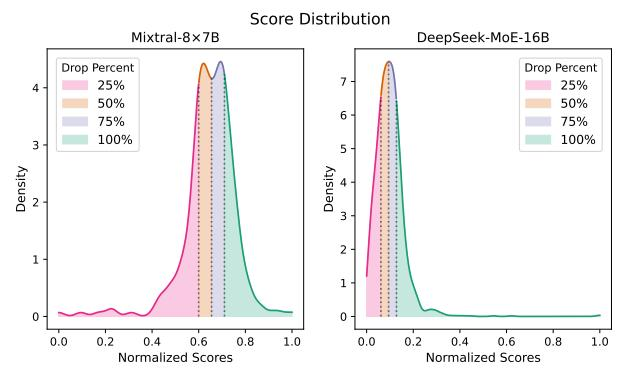

# B Expert Slimming

Pruning: Comparable Performance with Deployment Challenges. In Table 5, we evaluate representative pruning algorithms (i.e., Wanda (Sun et al., 2023), SparseGPT (Frantar & Alistarh, 2023)) on Mixtral-8×7B and DeepSeek-MoE-16B. Since DeepSeek-MoE-16B utilizes both shared experts and normal experts, we conduct an ablation study on whether to prune shared experts, as discussed in Appendix E. We find that unstructured pruning preserves more than 95% of performance. However, it is not compatible with existing hardware. Conversely, the hardware-friendly semi-structured pruning (i.e., 4:8 and 2:4 patterns) undergoes a significant performance drop. Nevertheless, according to Lu et al. (2024), semi-structured sparsity is ineffective in speeding up MoE models.

Table 5: **Performance of Pruning on MoE.** We consider two mainstream pruning methods (i.e., Wanda (Sun et al., 2023) and SparseGPT (Frantar & Alistarh, 2023)) under 50% unstructured sparsity and 2:4 semi-structured sparsity.

|                    |          |              |                        | Mixtra            | $al-8 \times 7B$    |                          |              |              |                    |                     |
|--------------------|----------|--------------|------------------------|-------------------|---------------------|--------------------------|--------------|--------------|--------------------|---------------------|
| Method             | Sparsity | ARC-C        | $\operatorname{BoolQ}$ | ${\it HellaSwag}$ | MMLU                | OBQA                     | PIQA         | RTE          | ${\bf WinoGrande}$ | Avg                 |
| Baseline           | 0%       | 59.4         | 84.2                   | 84.0              | 67.9                | 46.8                     | 83.8         | 70.4         | 75.6               | 71.5                |
| Wanda SparseGPT | 50%      | 56.1 56.4 | 85.8 85.7           | 81.7 81.5      | 64.3 64.6        | 46.4 45.0             | 82.2 82.4 | 65.0 66.8 | 76.0 75.8       | 69.7 69.8        |
| Wanda SparseGPT | 2:4      | 51.4 49.2 | 79.4 81.0           | 77.8 77.6      | 60.3 59.2        | 44.0 44.0             | 80.7 80.6 | 65.3 63.9 | 74.1 74.8       | 66.6 66.3        |
|                    |          |              |                        | DeepSeek          | -MoE-16             | В                        |              |              |                    |                     |
| Method             | Sparsity | ARC-C        | BoolQ                  | HellaSwag         | MMLU                | OBQA                     | PIQA         | RTE          | WinoGrande         | Avg                 |
| Baseline           | 0%       | 48.1         | 72.4                   | 77.3              | 37.9                | 44.0                     | 80.4         | 63.9         | 70.3               | 61.8                |
| Wanda SparseGPT | 50%      | 43.6 43.9 | 74.3 73.5           | 72.6 74.0      | 31.1 33.8        | 43.0 41.4             | 79.5 79.0 | 58.1 61.0 | 69.4 68.3       | <u>59.0</u> 59.4 |
| Wanda SparseGPT | 2:4      | 38.2 43.1 | 66.1 68.9           | 67.5 71.6      | $\frac{27.6}{27.6}$ | $39.\overline{4}$ $41.6$ | 77.0 78.3 | 53.8 57.4 | 66.6               | $\frac{54.}{56.9}$  |

Quantization: Better Performance and Greater Efficiency In Table 6, we evaluate the impact of 4-bit quantization on MoE. The quantization offers two major benefits: it maintains the comparable performance of the original models and significantly reduces memory costs. Specifically, the quantized models achieve over 98% of the original performance while using less than 30% of the memory. When quantized with AWQ (Lin et al., 2024), Mixtral-8×7B and DeepSeek-MoE-16B achieve impressive speedups of  $\times 5.08$  and  $\times 3.16$ , respectively. This demonstrates that 4-bit quantization is effective for deploying MoE models in resource-constrained environments.

Table 6: **Performance of Quantization on MoE.** We utilize GPTQ (Frantar et al., 2022) and AWQ (Lin et al., 2024) as the quantization methods for 4-bit compression.

|                         | ${\bf Mixtral \hbox{-} 8 \times 7 B}$ |                  |                               |                                                             |                           |                                          |                                           |                                       |                                |                            |                                                                   |  |
|-------------------------|---------------------------------------|------------------|-------------------------------|-------------------------------------------------------------|---------------------------|------------------------------------------|-------------------------------------------|---------------------------------------|--------------------------------|----------------------------|-------------------------------------------------------------------|--|
| Method                  | Bits                                  | Memory           | ARC-C                         | $\operatorname{BoolQ}$                                      | ${\it HellaSwag}$         | MMLU                                     | OBQA                                      | PIQA                                  | RTE                            | ${\bf WinoGrande}$         | Avg.                                                              |  |
| Baseline GPTQ AWQ | _ <u>16_</u> _ 4                      | 87.7GB 24.4GB | <u>59.4</u> - 59.0 58.4 | $\begin{array}{r} -\frac{84.2}{84.4} - \\ 84.2 \end{array}$ | $-\frac{84.0}{83.4}$ 83.3 | $-\frac{67.9}{67.1} - \frac{66.6}{66.6}$ | $- \frac{46.8}{45.2} - \frac{45.8}{45.8}$ | \frac{83.8}{83.1} - \frac{83.0}{83.0} | $-\frac{70.4}{70.1} - \\ 69.0$ | $\frac{75.6}{75.2}$ $76.3$ | $\begin{array}{r} 71.5 \\ \hline 70.9 \\ \hline 70.8 \end{array}$ |  |
|                         |                                       |                  |                               |                                                             | DeepSeek-N                | /IoE-16B                                 |                                           |                                       |                                |                            |                                                                   |  |
| Method                  | Bits                                  | 3.5              | ADOO                          | D 10                                                        | TT 11 G                   |                                          | 0 = 0 1                                   |                                       |                                |                            |                                                                   |  |
| Wicthou                 | DIUS                                  | Memory           | ARC-C                         | BoolQ                                                       | HellaSwag                 | MMLU                                     | OBQA                                      | PIQA                                  | RTE                            | WinoGrande                 | Avg.                                                              |  |

### C Analysis on the Dropping Patterns of Expert Drop

Score Distribution Directs Expert Drop The distribution of importance scores is informative to determine the proportion of dropped experts. In Figure 11, we visualize the score distribution of Expert Drop for Mixtral-8×7B and DeepSeek-MoE-16B. DeepSeek-MoE-16B, which allocates more experts, shows a left-skewed distribution where most experts have low scores. In contrast, Mixtral-8×7B demonstrates a right-skewed distribution, with only a few experts being deemed unimportant. This distribution difference results in different resistance capabilities against Expert Drop, where DeepSeek-MoE-16B can drop more experts than Mixtral-8×7B while maintaining competitive performance, as demonstrated in Table 3 and Figure 13.

Global Expert Drop Removes Experts Fine-Grainedly We employed two different strategies for Expert Drop, namely layer-wise and global. Layer-wise dropping treats each layer equally by dropping the same number of experts, while global dropping results in different proportions of remaining experts across layers. We visualize the distribution of remaining experts after global dropping in Figure 12. We find the global dropping shows a more fine-grained pattern on dropping experts, where the bottom layers are more vulnerable under lower dropping ratios (yellow part).

Figure 11: **Distribution of Normalized Importance Scores** *S* **for Expert Drop.** We highlight the density of scores under different drop ratios with different colors.

Figure 12: **Distribution of Dropped Experts for Expert Drop.** We visualize the dropped experts under different drop ratios, where the dropped experts are colored from **yellow** to **blue** as the drop ratio increases.

