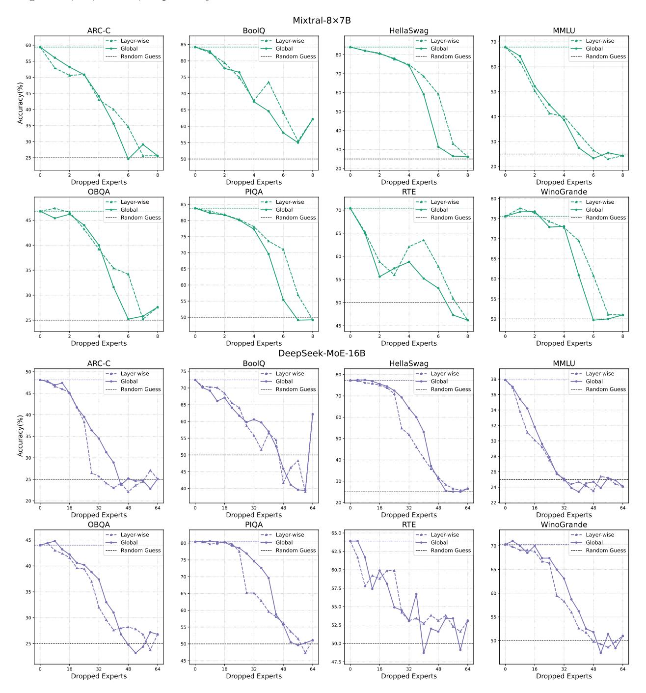
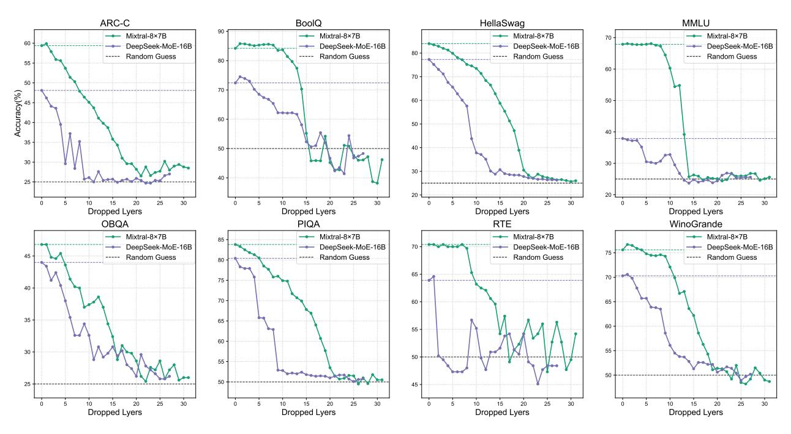
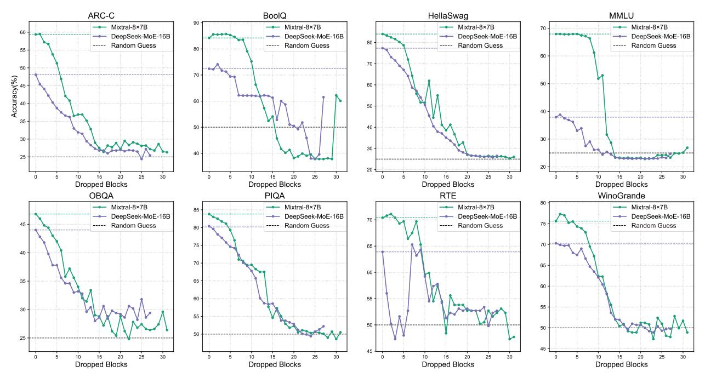

# F Full Experimental Results

We provide the full results of Expert Trimming, including Expert Drop, Layer Drop and Block Drop, in Figure 13, 14, and 15, respectively.

Figure 13: Full Results for Expert Drop. We consider two strategies: layer-wise (dotted lines) and global (solid lines).

Figure 14: Full Results for Layer Drop. We show results on Mixtral-8×7B and DeepSeek-MoE-16B (solid lines), along with the baseline and random guess performances (dotted lines).

Figure 15: Full Results for Block Drop. We show results on Mixtral-8×7B and DeepSeek-MoE-16B (solid lines), along with the baseline and random guess performances (dotted lines).