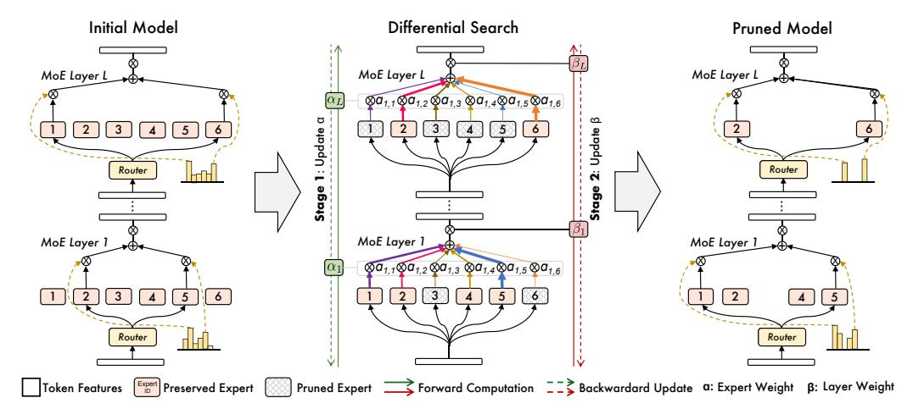

# 3 Preliminary: Mixture-of-Experts (MoE) Language Model

Generally, a Mixture-of-Experts (MoE) model consists of L layers, where each layer l (l = 1, . . . , L) contains N experts. The input to all experts in the l-th layer is denoted as x (l) ∈ R d , where d is the input dimension. A router network produces routing logits ζ (l) i for each expert i (i = 1, . . . , N), which are normalized using a softmax function to compute the routing weights w (l) i :

$$w_i^{(l)} = \frac{\exp(\zeta_i^{(l)})}{\sum_{j=1}^N \exp(\zeta_j^{(l)})},\tag{1}$$

where w (l) i represents the contribution of expert i in layer l.

To enforce sparsity, the router network selects the top-k experts with the largest routing weights w (l) i . The output of the l-th MoE layer is then computed as:

$$\boldsymbol{y}^{(l+1)} = \sum_{i \in \text{Top-}k(\boldsymbol{w}^{(l)})} w_i^{(l)} \cdot \text{FFN}_i(\boldsymbol{x}^{(l)}), \tag{2}$$

Figure 2: The schematic illustration of the Differentiable Expert Pruning (DiEP) Framework. (a) Initial MoE model with substantial expert redundancy and memory cost. (b) Differentiable Pruning: transforming discrete expert search into a continuous optimization by jointly learning intra-layer expert scores  $(\alpha)$  and inter-layer importance  $(\beta)$  via an alternating update strategy, enabling adaptive non-uniform pruning. (c) Final pruned model: achieving a streamlined MoE architecture that maintains high performance while reducing the model's footprint.

where  $FFN_i(\cdot)$  denotes the feed-forward function of expert i, and  $Top-k(w^{(l)})$  refers to the indices of the k-largest routing weights. The final output  $y^{(l+1)}$  is passed to the subsequent layer.

#### 4 Method

#### 4.1 Sparse Expert Search Space

Following the design principles of differentiable architecture search, we first define a sparse expert search space tailored for Mixture-of-Experts (MoE) architectures, as illustrated in Figure 2. In this framework, an MoE layer is modeled as a directed acyclic graph (DAG) consisting of only two nodes: an input node representing the token representations entering the expert layer and an output node representing the sum of selected expert transformations. Instead of treating individual experts as independent computational units, we formulate the expert pruning process as a discrete operation over a single aggregated expert node.

Based on expert pruning principles, a subset of experts is retained according to their importance, governed by a binary selection mask  $m_i^{(l)} \in \{0,1\}$ , where  $m_i^{(l)} = 1$  indicates that expert i is retained, and  $m_i^{(l)} = 0$  indicates pruning. The expert aggregation process in an MoE layer is then expressed as:

$$\mathbf{y}^{(l+1)} = \sum_{i=1}^{N} (m_i^{(l)} \cdot \text{FFN}_i)(\mathbf{x}^{(l)}),$$
 (3)

where  $FFN_i(\cdot)$  denotes the feed-forward function of expert i.

This discrete selection process inherently results in a non-differentiable search space, making direct optimization intractable. To enable gradient-based optimization and structured pruning within the MoE framework, we introduce a continuous relaxation mechanism, allowing smooth updates to the expert selection process while preserving the structured sparsity of the model.

### 4.2 Continuous Relaxation and Optimization

Specifically, we decompose the expert importance into two components: intra-layer importance scores  $\alpha$  that determine the relative significance of experts within each layer and inter-layer importance scores  $\beta$  that regulate the contribution of different layers in the selection process. This formulation allows us to perform structured pruning in a data-driven and globally optimized manner.

We define the intra-layer importance weights, α¯ (l) i , by normalizing the intra-layer importance scores α (l) i using a softmax function:

$$\bar{\alpha}_i^{(l)} = \frac{\exp(\alpha_i^{(l)})}{\sum_{j=1}^N \exp(\alpha_j^{(l)})},\tag{4}$$

where α (l) i are learnable logits that determine the relative importance of experts within layer l. This normalization ensures a smooth and differentiable selection process. Similarly, the inter-layer importance score β (l) is introduced as a trainable scalar that modulates the overall contribution of layer l. The output of an MoE layer l is then computed as:

$$\boldsymbol{y}^{(l+1)} = \beta^{(l)} \sum_{i=1}^{N} \bar{\alpha}_i^{(l)} \cdot \text{FFN}_i(\boldsymbol{x}^{(l)}). \tag{5}$$

To ensure that the pruned model retains fidelity to the original MoE model F(x) (before pruning), we introduce a reconstruction regularization term Φ(α, β), defined as:

$$\Phi(\alpha, \beta) = \|\mathcal{F}'(\boldsymbol{x}; \alpha, \beta) - \mathcal{F}(\boldsymbol{x})\|_F,$$
(6)

where ∥ · ∥F denotes the Frobenius norm. This regularization encourages the pruned model F ′ to maintain consistency with the original model.

The overall objective function is formulated as:

$$\min_{\alpha,\beta} \mathcal{L}(\alpha,\beta) := \mathcal{L}_{ce}(\boldsymbol{y}, \mathcal{F}'(\boldsymbol{x}; \alpha, \beta)) + \lambda \Phi(\alpha, \beta), \tag{7}$$

where λ is a regularization coefficient, and Lce is the cross-entropy loss.

Alternating Update Strategy. To optimize the objective function, we adopt an alternating update strategy where the intra-layer importance scores α and inter-layer importance scores β are updated iteratively:

$$\alpha^t \leftarrow \alpha^t - \eta_\alpha \nabla_\alpha \mathcal{L}(\alpha^t, \beta^t), \tag{8}$$

$$\beta^t \leftarrow \beta^t - \eta_\beta \nabla_\beta \mathcal{L}(\alpha^t, \beta^t). \tag{9}$$

Here, t denotes the iteration index, ηα and ηβ are the learning rates for α and β, respectively, and L(α, β) represents the overall objective function defined in Equation [7.](#page-4-0) From the theoretical perspective, we summarize the optimization process in Algorithm [1](#page-15-0) and provide the detailed convergence analysis in Appendix [B.2.](#page-16-0)

Pruning Strategy. To derive a discrete architecture, we apply a structured pruning mechanism that eliminates the least significant experts based on their global contribution across all layers. Instead of pruning experts layer-by-layer in isolation, we leverage the learned intra-layer importance scores α (l) i and inter-layer importance scores β (l) to determine expert significance in a unified manner.

Formally, the overall importance of expert i in layer l is computed as the product of its intra-layer and inter-layer importance scores:

$$s_i^{(l)} = \alpha_i^{(l)} \cdot \beta^{(l)}. \tag{10}$$

Given the expert sparsity ratio r, the total number of experts to be pruned across the entire MoE model is K = NLr, where N is the number of experts per layer and L is the number of layers. The pruning process is performed by globally sorting all experts based on their importance scores s (l) i and removing the bottom-K least significant experts. The resulting pruning mask m (l) i is defined as:

$$m_i^{(l)} = \begin{cases} 0 & \text{if } i \in P, \\ 1 & \text{otherwise,} \end{cases}$$
 (11)

where P is the set of the bottom-K experts selected for pruning.

By jointly considering both intra-layer and inter-layer importance scores, this pruning strategy ensures a globally optimized selection of experts, effectively reducing computational redundancy while maintaining structural balance across layers.

#### 4.3 Adaptive Skipping During Inference

During the inference process, processing each token with all selected top-k experts introduces unnecessary computational overhead, but researchers in [30] find that not every selected expert provides essential contributions for tokens. This observation motivates the need for adaptive expert skipping, which selectively bypasses less significant experts during inference to enhance efficiency. For each token  $\boldsymbol{x}$  in an MoE layer, the top-k experts are chosen using routing weights  $\boldsymbol{w} = \{w_{e_0}, w_{e_1}, \dots, w_{e_{k-1}}\}$ , and their outputs are denoted as  $y_{e_0}, y_{e_1}, \dots, y_{e_N}$ . Following common practice, we assume k=2 for simplicity. Unlike previous approaches [30] that rely solely on routing weights, our method incorporates expert similarity to dynamically skip less important experts during inference, thereby enhancing computational efficiency.

Assume experts with indices  $e_0$  and  $e_1$  are selected, with  $w_{e_1} < w_{e_0}$ . To improve inference speed, if  $w_{e_1} < \gamma w_{e_0}$ , expert  $e_1$  is skipped, where  $\gamma$  is a hyperparameter specific to each MoE layer and generation step.

In our implementation,  $\gamma$  is calculated as the product of two factors. First,  $\gamma_1$  is determined as the median value of  $\frac{w_{e_1}}{w_{e_0}}$  across sampled calibration data for each MoE layer. Second,  $\gamma_2$  is computed based on the similarity between expert outputs, evaluated using Centered Kernel Alignment (CKA) [20]. Specifically,  $\gamma_2$  is the ratio of the CKA similarity  $\rho(y_{e_0},y_{e_1})$  to the mean CKA similarity  $\rho(y_{e_i},y_{e_j})$  across all data samples in layer l. The final value of  $\gamma$  is given by:

$$\gamma = \gamma_1 \times \gamma_2. \tag{12}$$

This method dynamically adjusts expert skipping based on both expert routing weights and similarity, significantly enhancing inference efficiency and maintaining model performance. In our experiments, we observe a speedup in inference  $1.2\times$  to  $1.3\times$  while retaining approximately 92% of the average performance with only half of the experts on Mixtral  $8\times7B$ .

