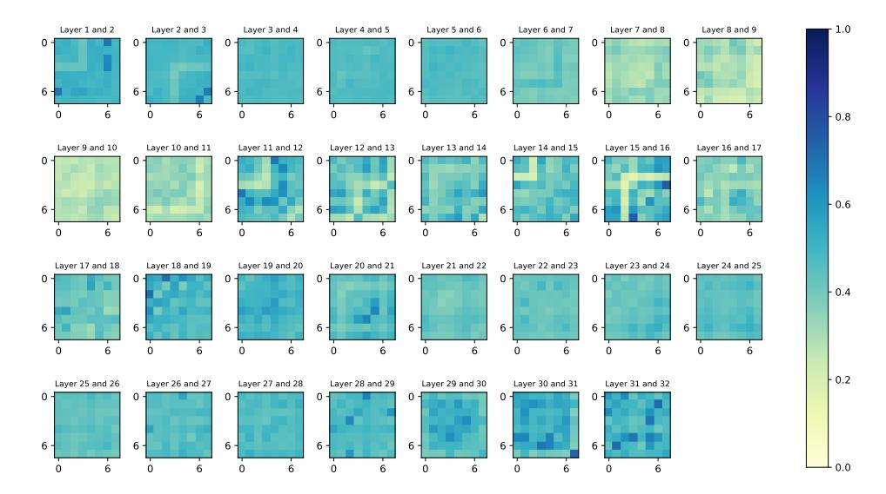

# A.1 Visualized Analysis of Expert Activation Frequency

To demonstrate the efficacy of adaptive expert pruning in our DiEP, we conducted a comparative analysis of different methods in terms of expert activation frequency. As shown in Figure 5, while the full MoE utilizes almost all experts, there are significant disparities in activation frequencies among different experts, leading to substantial resource waste. Previous methods (i.e., Layer-wise Pruning) apply uniform expert pruning ratios across all layers, overlooking the intra-layer and interlayer variations and dependencies among experts in different MoE layers. In contrast, our method

obtains non-uniform and adaptive expert pruning that varies pruning ratios according to expertspecific characteristics. On Mixtral 8×7B, we observed an increasing trend in expert pruning rates from shallow to higher layers. We attribute this phenomenon the fact that shallow layers primarily process diverse low-level linguistic features, such as part-of-speech tagging and local word ordering, necessitating a larger number of experts to capture detailed linguistic information. Meanwhile, higher layers primarily handle global contextual and semantic information, abstract away from fine-grained details, and thus can operate effectively with fewer experts.

### A.2 Efficiency Analysis for Inference on Deepseek-MoE-16B.

We further verify the efficiency of our adaptive skipping strategy on Deepseek-MoE-16B in Table [5,](#page-12-0) and it can be observed that our method maintains more than 95% performance of the full model while reducing model size and improving inference efficiency.

| Model            | r     | Pruning | Skipping | Avg. Acc | Speedup ↑ | GPU ↓  |  |  |
|------------------|-------|---------|----------|----------|-----------|--------|--|--|
|                  | 0%    |         |          | 56.2     | 1.00×     | 1.00 × |  |  |
|                  | 0%    |         | ✓        | 55.7     | 1.04×     | 1.00 × |  |  |
|                  | 6.25% | ✓       |          | 54.8     | 1.07×     | 0.95×  |  |  |
| Deepseek-MoE-16B | 6.25% | ✓       | ✓        | 54.4     | 1.08×     | 0.95×  |  |  |
|                  | 12.5% | ✓       |          | 54.1     | 1.11×     | 0.89×  |  |  |
|                  | 12.5% | ✓       | ✓        | 53.6     | 1.13×     | 0.89×  |  |  |

Table 5: Inference cost analysis on Deepseek-MoE-16B.

### A.3 Efficiency Analysis for GPU Memory Pruning Cost

To investigate the efficiency of DiEP concerning its memory footprint during the pruning process, we conducted a detailed comparison of GPU memory costs in Table [6,](#page-12-1) highlighting DiEP's advantages in both efficiency and scalability. *Computational Efficiency (Time Cost):* Compared to NAEE (1.31 hours), DiEP's pruning process is 5.7 times faster, requiring only 0.23 hours. DiEP also demonstrates 25.8% faster execution (0.23 hours) compared to MC-MoE (0.31 hours). This indicates a significant advantage for DiEP in terms of the time required for pruning. *Memory Optimization (Peak Memory):* DiEP utilizes 60% less peak memory (139.0GB) than MC-MoE (348.4GB), showcasing superior memory efficiency. While DiEP's peak memory (139.0GB) is 46% higher than NAEE's (95.1GB), this is offset by its dramatically faster pruning time, a factor reflected in its overall resource efficiency. *Overall Resource Efficiency (Memory-Hour Cost):* DiEP's memory-hour cost (31.97 GB·h) is 70% lower than that of MC-MoE (108.00 GB·h). Furthermore, DiEP's memory-hour cost is 74% lower than that of NAEE (124.58 GB·h). These results clearly demonstrate that DiEP maintains a lightweight resource footprint while drastically reducing runtime, positioning it as a more resource-efficient choice for MoE pruning.

| Method      | Peak Memory(GB) | Time (h) | Memory-hour Cost (GB·h) |  |  |  |  |  |
|-------------|-----------------|----------|-------------------------|--|--|--|--|--|
| NAEE        | 95.1            | 1.31     | 124.58                  |  |  |  |  |  |
| MC-MoE      | 348.4           | 0.31     | 108.00                  |  |  |  |  |  |
| DiEP (Ours) | 139.0           | 0.23     | 31.97                   |  |  |  |  |  |

Table 6: GPU memory pruning cost on Mixtral 8×7B.

### A.4 More calibration data validation on adaptability

To further validate DiEP's adaptability, we evaluated its performance on the domain-specific GSM8K dataset using two distinct calibration datasets: the general-purpose C4 dataset and the domainrelevant Math dataset, comparing DiEP against the NAEE method. As detailed in Table [7,](#page-13-0) the experimental results systematically demonstrate DiEP's advantages across these varied calibration settings. Specifically, when employing the general-purpose C4 calibration data, DiEP achieved consistent improvements over NAEE, outperforming it by +3.93 points at a 50% pruning rate and by +4.96 points at a 25% pruning rate, indicating robust performance gains with common calibration

data. Furthermore, when utilizing the domain-specific MATH calibration data, DiEP maintained its superior performance, securing a +1.10 point advantage at 50% pruning and extending this lead to +2.21 points at 25% pruning. These findings collectively underscore DiEP's enhanced generalization capabilities and adaptability across calibration datasets with different data distributions.

Table 7: Adaptability validation on GSM8K using different calibration datasets (C4 and Math).

| Method      | Pruning Dataset | r=25% | r=50% |
|-------------|-----------------|-------|-------|
| Random      |                 | 36.39 | 0.68  |
| NAEE        | C4              | 41.02 | 24.87 |
| DiEP (Ours) | C4              | 45.98 | 28.80 |
| NAEE        | MATH            | 51.25 | 37.07 |
| DiEP (Ours) | MATH            | 53.46 | 38.17 |

### A.5 Merging Strategy

Inspired by S-SMoE [\[47\]](#page-11-1), we introduce a merging strategy for DiEP to consolidate redundant experts while preserving their diversity. Specifically, pruned experts are grouped with their most similar retained counterparts based on normalized CKA similarity, which is then normalized by the softmax function as the merging weight. Table [8](#page-13-1) demonstrates that the merging strategy further enhances performance under 25% and 50% expert sparsity, which highlights the strong scalability of our DiEP. It not only effectively maintains the performance of the full model but also further restores the diversity of pruned experts by incorporating other orthogonal strategies.

Table 8: Performance analysis when integrating merging strategy.

| Samples | Strategy     | MMLU | BoolQ | OpenBookQA | RTE  | Avg. |
|---------|--------------|------|-------|------------|------|------|
| 25%     | DiEP         | 64.9 | 86.6  | 33.1       | 70.7 | 63.8 |
|         | DiEP+Merging | 66.6 | 86.1  | 34.1       | 71.0 | 64.4 |
| 50%     | DiEP         | 57.9 | 84.0  | 29.6       | 68.2 | 59.9 |
|         | DiEP+Merging | 58.2 | 84.0  | 29.8       | 68.8 | 60.2 |

## A.6 Impact of Calibration Data Size

To analyze the impact of calibration data size, we randomly sampled 32, 64, 128, 256, 512, and 1024 sequences from C4 dataset [\[35\]](#page-10-16) to learn DiEP's intra-layer scores (α) and inter-layer scores β. As shown in Table [9,](#page-13-2) 128 sequences achieve optimal performance when pruning Mixtral 8×7B from 8 to 6 experts. More importantly, DiEP avoids performance collapse with only 32 samples. We attribute it to KD regularization enforcing DiEP's features aligned with the full model.

Table 9: Performances of expert pruning when changing the number of samples in the calibration dataset.

| Samples | MMLU | BoolQ | OpenBookQA | RTE  | Avg. |
|---------|------|-------|------------|------|------|
| 32      | 62.8 | 84.3  | 31.6       | 65.5 | 61.1 |
| 64      | 63.6 | 85.3  | 32.2       | 66.4 | 61.9 |
| 128     | 64.9 | 86.6  | 33.1       | 70.7 | 63.8 |
| 256     | 64.7 | 85.9  | 32.6       | 70.4 | 63.4 |
| 512     | 64.3 | 84.5  | 32.6       | 67.5 | 62.3 |
| 1,024   | 63.7 | 83.9  | 32.8       | 66.3 | 61.9 |

### A.7 Complete Visualized Analysis of Expert Similarity

To validate our motivation regarding the necessity of cross-layer pruning, we first visualized the intra-layer expert similarities in each layer using the CKA similarity metric [\[20\]](#page-10-6) for Mixtral 8×7B in Figure [6.](#page-14-0) The analysis reveals significant variations in expert similarities, particularly pronounced in layer 31. Moreover, substantial differences in expert similarities exist between different layers,

Figure 6: Visualization for feature similarity of expert-pairs within each MoE layer.

Figure 7: Visualization for feature similarity of expert-pairs across adjacent MoE layers.

with layers 28-29 showing higher similarity compared to layers 8-10. Furthermore, we investigate expert-pairs similarities in adjacent layers in Figure [7,](#page-14-1) which demonstrates varying degrees of expert relationships across layers, exemplified by the strong correlation between expert 6 in layer 30 and expert 5 in layer 31. These cross-layer expert dependencies have been overlooked by previous pruning methods. Our approach effectively captures both inter-layer and intra-layer variations through alternating differentiable optimization of expert weight α and layer weight β. In addition, we observed that the learned intra-layer and inter-layer scores do not fully correspond to the visualized inter-layer similarity between expert pairs. It is plausible because we only provide expert similarity across adjacent layers for visualized analysis. However, our DiEP can learn expert redundancy and dependency across all MoE layers.

