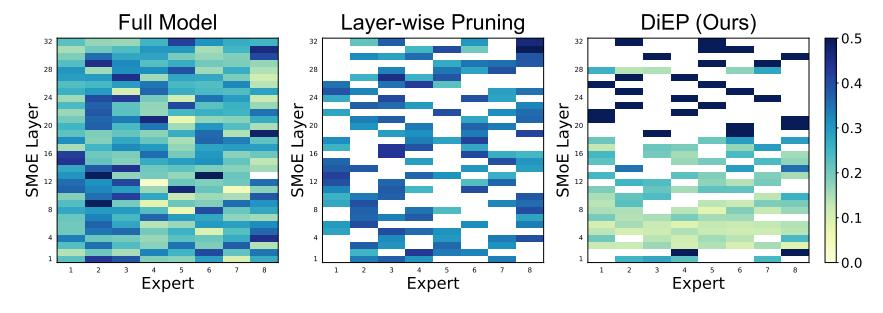

# **A Experimental Appendices**

Figure 5: Distribution of expert activation frequencies in the Mixtral 8×7B. The full model (left) uses all experts across all 32 layers, resulting in substantial memory consumption. Layer-wise pruning (middle) enforces uniform expert sparsity per layer. Our DiEP (right) provides a more flexible approach, performing cross-layer expert pruning based on their global contributions.

