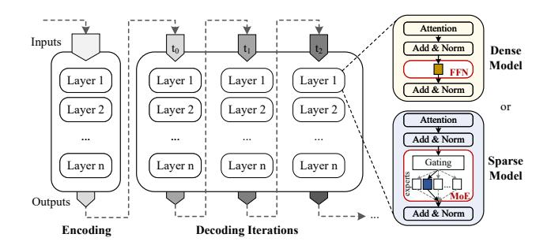
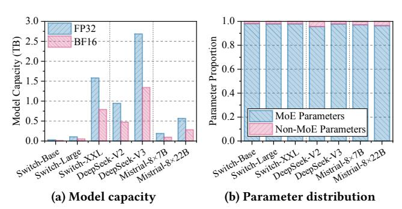
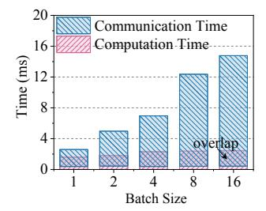
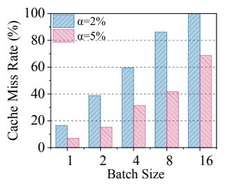

# Diff-MoE: Efficient Batched MoE Inference with Priority-Driven Differential Expert Caching

## [Kexin Li](https://orcid.org/0009-0007-8431-0864)∗

National Engineering Research Center for Big Data Technology and System, Services Computing Technology and System Lab, Cluster and Grid Computing Lab, School of Computer Science and Technology Huazhong University of Science and

> Technology Wuhan, China kx\_li@hust.edu.cn

## [Long Zheng](https://orcid.org/0000-0001-7903-2061)

National Engineering Research Center for Big Data Technology and System, Services Computing Technology and System Lab, Cluster and Grid Computing Lab, School of Computer Science and Technology Huazhong University of Science and Technology Wuhan, China

longzh@hust.edu.cn

## [Wenkan Huang](https://orcid.org/0009-0005-0581-522X)∗

National Engineering Research Center for Big Data Technology and System, Services Computing Technology and System Lab, Cluster and Grid Computing Lab, School of Computer Science and Technology Huazhong University of Science and Technology

Wuhan, China wenkanedward@hust.edu.cn

## [Xiaofei Liao](https://orcid.org/0000-0001-6302-813X)

National Engineering Research Center for Big Data Technology and System, Services Computing Technology and System Lab, Cluster and Grid Computing Lab, School of Computer Science and Technology Huazhong University of Science and Technology

Wuhan, China xfliao@hust.edu.cn

## [Jingling Xue](https://orcid.org/0000-0003-0380-3506) School of Computer Science and Engineering University of New South Wales Sydney, NSW, Australia jingling@cse.unsw.edu.au

## [Qinggang Wang](https://orcid.org/0000-0002-9951-3345)† National Engineering Research Center for Big Data Technology and System, Services Computing

Technology and System Lab, Cluster and Grid Computing Lab, School of Computer Science and Technology Huazhong University of Science and

> Technology Wuhan, China qgwang@hust.edu.cn

## [Hai Jin](https://orcid.org/0000-0002-3934-7605)

National Engineering Research Center for Big Data Technology and System, Services Computing Technology and System Lab, Cluster and Grid Computing Lab, School of Computer Science and Technology Huazhong University of Science and Technology Wuhan, China hjin@hust.edu.cn

## Abstract

The emerging Mixture-of-Experts (MoE) model mitigates the high compute cost of large-scale LLMs by sparsely activating a subset of experts during inference. However, MoE requires storing massive expert parameters, creating a severe memory bottleneck on resource-constrained GPUs. Existing approaches offload parameters to host memory and prefetch activated experts to GPU memory with sophisticated policies, but these solutions are tailored to

Permission to make digital or hard copies of all or part of this work for personal or classroom use is granted without fee provided that copies are not made or distributed for profit or commercial advantage and that copies bear this notice and the full citation on the first page. Copyrights for components of this work owned by others than the author(s) must be honored. Abstracting with credit is permitted. To copy otherwise, or republish, to post on servers or to redistribute to lists, requires prior specific permission and/or a fee. Request permissions from permissions@acm.org.

SC '25, St Louis, MO, USA

© 2025 Copyright held by the owner/author(s). Publication rights licensed to ACM. ACM ISBN 979-8-4007-1466-5/25/11

<https://doi.org/10.1145/3712285.3759903>

single-batch inference and suffer from communication bottlenecks at larger batch sizes, limiting throughput. We identify two forms of locality in expert activation: a small set of experts are frequently invoked across inference (global locality), while others recur within short decoding bursts (temporal locality). To exploit this, we propose Diff-MoE, which introduces a differential cache hierarchy in GPU memory. Globally hot experts reside in per-layer high-priority caches, locally hot ones are dynamically managed in per-layer medium-priority caches under a priority-driven replacement policy, and the remaining cold experts are cached temporarily and evicted on demand. Moreover, Diff-MoE incorporates a lightweight predictor that prefetches experts likely needed in the next MoE layer, overlapping migration with computation to further reduce latency. Our evaluation shows that Diff-MoE improves inference throughput by 2.74×, 2.22×, and 1.55× over DeepSpeed, Pre-gated MoE, and MoE-Infinity, respectively.

## CCS Concepts

• Computing methodologies → Machine learning.

∗Equal contribution.

†Corresponding author: Qinggang Wang (qgwang@hust.edu.cn).

## Keywords

Mixture-of-Experts, Batched Inference, Differential Cache

#### ACM Reference Format:

Kexin Li, Wenkan Huang, Qinggang Wang, Long Zheng, Xiaofei Liao, Hai Jin, and Jingling Xue. 2025. Diff-MoE: Efficient Batched MoE Inference with Priority-Driven Differential Expert Caching. In The International Conference for High Performance Computing, Networking, Storage and Analysis (SC '25), November 16–21, 2025, St Louis, MO, USA. ACM, New York, NY, USA, [15](#page-14-0) pages. <https://doi.org/10.1145/3712285.3759903>

## 1 Introduction

Transformer-based large language models (LLMs) have achieved remarkable performance and are now widely adopted in diverse domains such as natural language processing (NLP) [\[31\]](#page-12-0), computer vision (CV) [\[48,](#page-12-1) [50\]](#page-12-2), and multimodal understanding [\[49\]](#page-12-3). However, the continuous scaling of model sizes has led to exponential growth in both computation and storage demands, posing major challenges for efficient inference serving. To address this, mainstream sparse LLMs increasingly adopt the Mixture-of-Experts (MoE) architecture, which has attracted significant attention for its ability to mitigate the high compute requirements of large-scale inference [\[7,](#page-11-0) [12,](#page-11-1) [19\]](#page-11-2).

As illustrated in Figure [1,](#page-1-0) sparse LLMs typically replace the Feed-Forward Network (FFN) within a dense Transformer layer with an MoE layer, consisting of a gating network and a large pool of experts. Unlike dense LLMs that activate all model parameters during inference, the gating network in an MoE selectively activates only a small subset of experts for each input token. This selective activation enables further scaling of model capacity while conserving computational cost [\[12,](#page-11-1) [23,](#page-11-3) [39\]](#page-12-4).

Despite its benefits, MoE imposes substantial memory overhead due to the large number of experts [\[9,](#page-11-4) [11,](#page-11-5) [18\]](#page-11-6). For example, the MoEbased Google Switch-XXL model [\[12\]](#page-11-1) has 395 billion parameters, with each layer containing 128 experts, whereas its non-MoE counterpart T5-XXL [\[3\]](#page-11-7), with a single FFN per layer, requires only 11 billion parameters. Loading Switch-XXL in FP32 precision demands more than 1.5 TB of GPU memory, far exceeding the capacity of modern GPUs (e.g., NVIDIA H200 with 141 GB), making single-GPU deployment highly challenging.

Fortunately, MoE layers exhibit inherent sparsity, as only a small subset of experts is activated per token during inference. Prior works [\[2,](#page-11-8) [16\]](#page-11-9) exploit this by offloading expert parameters to host memory and transferring only activated experts to GPU memory on demand. While this reduces GPU memory usage, it introduces costly host-to-GPU communication, increasing inference latency [\[53\]](#page-12-5).

To mitigate this overhead, recent studies propose two types of solutions: prefetch-based [\[9,](#page-11-4) [18,](#page-11-6) [20,](#page-11-10) [53\]](#page-12-5) and cache-based [\[10,](#page-11-11) [40,](#page-12-6) [51\]](#page-12-7). Prefetching proactively loads all or predicted experts of the next MoE layer in advance, overlapping data migration with ongoing computation. In contrast, caching retains frequently activated experts in GPU memory using policies like Least Recently Used (LRU), avoiding redundant transfers and reducing communication traffic.

However, our investigations reveal that existing prefetch- and cache-based offloading solutions are mainly designed for batch size one and suffer from severe communication bottlenecks when scaled to larger batches. For prefetch-based methods [\[9,](#page-11-4) [18,](#page-11-6) [20,](#page-11-10) [53\]](#page-12-5),

Figure 1: Architecture of dense and MoE-based LLMs. Inference consists of an encoding phase followed by autoregressive decoding, where tokens 0, 1, 2, . . . are generated. Each layer contains either a standard FFN (dense) or an MoE with a gating network selecting experts.

increasing batch size activates more experts, significantly amplifying communication overhead under the limited PCIe bandwidth between host and GPU. In contrast, GPU computation time remains relatively stable due to massive parallelism. As a result, communication time eventually surpasses computation time, dominating overall MoE inference latency. Cache-based approaches [\[10,](#page-11-11) [40,](#page-12-6) [51\]](#page-12-7) also degrade at scale, as larger batches cause rapidly increasing cache miss rates. This triggers frequent expert migrations, incurring prohibitive communication overhead.

In this work, we observe that expert activation in MoE inference exhibits strong layer-specific locality. Within each MoE layer, a small subset of experts are frequently invoked throughout the entire inference phase, which we term global locality. In contrast, some experts are repeatedly activated over a few consecutive decoding iterations, exhibiting temporal locality.

These observations motivate a differential cache management scheme in GPU memory: globally hot experts in each layer are kept permanently resident, locally hot experts are dynamically managed with a locality-preserving replacement policy, and cold experts are fetched on demand and evicted immediately after use.

Realizing this design poses two key challenges. First, accurately identifying globally and locally hot experts is non-trivial, as their activations depend on both input tokens and model structure. Second, the set of locally hot experts in a layer evolves dynamically across decoding iterations, complicating the design of a replacement policy that fully exploits temporal locality.

In this paper, we propose Diff-MoE, an efficient batched inference framework for MoE-based sparse LLMs on host-GPU heterogeneous architectures. Diff-MoE integrates a differential caching architecture with a lightweight expert predictor. This architecture consists of per-layer high-priority caches that permanently store globally hot experts identified during fine-tuning, per-layer medium-priority caches that dynamically maintain locally hot experts under a new replacement policy to maximize hit rates, and a shared low-priority cache that temporarily holds the remaining cold experts and evicts them immediately after use.

Beyond reducing communication traffic through differential cache management, Diff-MoE employs a lightweight predictor to forecast the experts likely to be activated in the next MoE layer, enabling their migration to overlap with the current layer's computation and thereby reducing communication latency. Importantly, DIFF-MoE requires no modifications to the underlying MoE architecture, making it broadly applicable and easy to deploy.

This paper makes the following main contributions:

- We analyze the communication bottlenecks of existing offloading solutions for MoE inference under large-batch settings and identify previously overlooked expert activation locality as an opportunity to alleviate these bottlenecks.
- We design DIFF-MoE, which combines a differential cache management mechanism that exploits expert activation locality to reduce communication traffic with a lightweight expert predictor that overlaps expert migration with computation to further mitigate communication latency.
- We implement and evaluate DIFF-MoE on popular MoE models across diverse tasks. Our results show that DIFF-MoE outperforms three state-of-the-art offloading solutions—DeepSpeed, Pre-gated MoE, and MoE-Infinity—by 2.74×, 2.22×, and 1.55× throughput improvement, on average.

The rest of this paper is organized as follows. §2 provides background and motivation, and §3 gives an overview of DIFF-MoE. §4 and §5 describe the priority-based expert classification and differential expert caching, respectively. §6 presents the lightweight expert predictor. §7 reports and analyzes experimental results. §8 reviews related work, and §9 concludes the paper.

#### 2 Background and Motivation

#### 2.1 Preliminaries

**Transformer.** The Transformer architecture [41], known for its ability to capture long-range dependencies via self-attention, has become ubiquitous across many domains. It consists of encoder and decoder modules, which can be configured into three variants depending on application needs: encoder-only [8, 38], decoder-only [21, 32, 33], and encoder-decoder [24, 34]. As illustrated in Figure 1, both encoder and decoder stacks comprise multiple layers, each with three key components: an attention layer, a *feed-forward network* (FFN), and normalization.

During inference, the encoder processes all input tokens in parallel to produce contextualized representations, which are used to generate the first output token. The decoder then proceeds autoregressively: at each step, it consumes the tokens generated so far along with the encoder outputs to predict exactly one new token. This process continues until an end-of-sentence token appears or a maximum sequence length is reached, and the resulting tokens are concatenated to form the final output sequence.

Mixture of Experts. As Transformer models continue to scale, their computational demands grow rapidly. The *Mixture-of-Experts* (MoE) architecture [12, 17, 23, 37, 46, 57] has emerged as a promising approach to alleviate this cost while preserving model capacity. Recent leading models, including GPT-4 [30], Mixtral [19], and DeepSeek [7], have demonstrated the effectiveness of MoE at scale. As shown in Figure 1, MoE modifies the Transformer by replacing the standard FFN with an MoE layer that contains a gating network and multiple experts. During inference, the gating network selectively activates only a subset of experts for each token, allowing the model to expand its parameter count without a proportional increase in computation.

Figure 2: Memory capacity requirements (a) and parameter distribution (b) of representative MoE-based LLMs. MoE parameters dominate the memory footprint, with FP32 models requiring terabyte-scale capacity.

Despite its benefits, MoE also incurs substantial memory demands and suffers from very low memory utilization. Figure 2 illustrates the memory requirements and parameter distribution of several popular MoE-based LLMs, including Switch-Transformer, DeepSeek, and Mixtral. As shown in Figure 2a, accommodating these models in FP32 precision requires terabyte-scale memory, far exceeding the capacity of a single GPU (e.g., NVIDIA H200 with 141 GB). Figure 2b further shows that MoE parameters—dominated by expert and gating network parameters—constitute the majority of the overall memory footprint.

However, since only a small subset of experts is activated for each token during inference, most experts loaded into costly GPU memory remain idle, resulting in extremely poor utilization. For example, the Switch-XXL model consists of 24 encoder layers and 24 decoder layers, where the feed-forward sublayer alternates between a dense FFN and an MoE layer. Each MoE layer contains 128 experts, which together account for 97.91% of the total parameters. Although the model's memory footprint reaches 1.58 TB, only the top-1 expert in each MoE layer is activated for any given token.

MoE Deployment on Host-GPU Heterogeneous Architectures. To mitigate the substantial memory demands and low utilization of MoE models, prior works [2, 9, 10, 18, 20, 42–44, 51, 53] deploy MoE on host-GPU heterogeneous architectures using offloading techniques, which store most experts in host memory and fetch only the activated experts into GPU memory on demand.

Existing solutions fall into two categories: (1) *Prefetch-based offloading* [18, 20, 53], which proactively preloads all or predicted experts of the next MoE layer to overlap migration with the current layer's computation; (2) *Cache-based offloading* [10, 40, 51], which retains frequently accessed experts in GPU memory under various cache replacement policies.

Batched Inference of LLMs. Batched inference is a widely used technique to improve end-to-end throughput by processing multiple tokens simultaneously [1, 5]. It enhances throughput in two ways. First, by grouping multiple request sequences into a single batch, it amortizes fixed overheads (e.g., kernel launches), which are incurred once per batch rather than once per request. Second, handling concurrent sequences in parallel better utilizes the underlying hardware resources.

Nowadays, batched inference is widely adopted in both single-device [11] and large-scale cloud inference services [56].

ing iteration of Pre-gated MoE under different batch sizes

(a) Average computation and (b) Cache miss rates of MoEcommunication time per decod- Infinity under different batch sizes when  $\alpha$  of experts are cached in GPU memory

Figure 3: Performance of the state-of-the-art prefetch-based solution Pre-gated MoE [18] and cache-based solution MoE-Infinity [51] on an H200 GPU using the Switch-Base model with the XSum [28] dataset.

#### 2.2 **Limitations of Existing Offloading Efforts**

Existing offloading approaches, including prefetch-based [9, 18, 20] and cache-based solutions [10, 40, 51], are primarily designed for single-batch MoE inference (batch size = 1). When scaled to batched inference (batch size  $\geq 2$ ), they suffer from excessive communication overhead between host and GPU. To illustrate this, we evaluate the state-of-the-art prefetch-based method Pre-gated MoE [18] and the cache-based method MoE-Infinity [51] on an H200 GPU using the Switch-Base model with the XSum [28] dataset. Figure 3 presents the results, with further experimental details in §7.

Figure 3a reports the average computation and communication time per decoding iteration of Pre-gated MoE [18] under varying batch sizes. With batch size 1, computation and communication take 1.58 ms and 2.20 ms, respectively. Due to expert prefetching, over half of the communication is hidden behind computation, reducing the average per-iteration decoding time from 3.78 ms (1.58 ms + 2.20 ms) to 2.59 ms.

As batch size increases, communication time grows sharply while computation time remains relatively stable. For example, when the batch size rises from 1 to 16, communication increases by 6.53×, whereas computation grows by only 1.55×. The modest growth in computation reflects the abundant parallel resources on the GPU, which efficiently handle larger batches. In contrast, the number of activated experts grows proportionally with batch size, substantially increasing communication time under limited PCIe bandwidth.

As a result, at larger batch sizes communication overtakes computation and dominates overall MoE inference latency. At batch size 16, communication overhead accounts for 97.19% of the periteration decoding time in Pre-gated MoE.

Figure 3b shows the cache miss rates of MoE-Infinity under varying batch sizes, assuming 2% and 5% of experts are cached in GPU memory, which correspond to memory footprints of 0.27 GB and 0.68 GB, respectively. In general, larger batch sizes lead to higher cache miss rates. For example, with 5% of experts cached, the miss rate rises from 6.91% at batch size 1 to 68.84% at batch size 16. This occurs because larger batches activate more experts, forcing some cached experts to be evicted before reuse and causing additional expert migrations.

Takeaway. In batched MoE inference, prefetch-based offloading fails to hide the rapidly growing communication overhead, while cache-based offloading struggles to maintain effective expert caching with high hit rates.

