# **Efficient Offloading for Batched MoE**

In this work, we observe that not all experts in MoE inference are activated equally. In practice, expert activation exhibits two forms of locality, described below:

Observation 1 (Global Locality). In each MoE layer, a small subset of experts is frequently activated across the entire inference process.

This first observation is supported by an experiment shown in Figure 4, which reports expert activation frequencies of the Switch-Base model on multiple tasks, including summarization (XSum) and question answering (SQuAD and CoQA). For each MoE layer, we compute the expert activation ratio, defined as the number of activations of a given expert divided by the total activations of all experts in that layer. Experts are then sorted in descending order by activation ratio. Let  $S_i^k$  denote the sum of the top-k experts' ratios at MoE layer i. The cumulative activation ratio across all l MoE layers is then defined as  $\frac{\sum_{i=1}^{l} S_i^k}{l}$ .

Figure 4a shows the expert activation ratios for the first and fifth MoE layers of the Switch-Base model on the XSum dataset. In these layers, Expert #79 and Expert #62 achieve the highest activation ratios, reaching 14.14% and 22.08%, respectively. Figure 4b plots the cumulative activation ratios across all 6 MoE layers of the Switch-Base model as a function of the top-k experts on the three datasets (XSum, SQuAD, and CoQA). We observe that 33.12%-83.09% of activations are concentrated on just the top-6 experts, which represent only 4.69% of the total experts  $(\frac{6}{128})$ .

However, most offloading solutions do not ensure that these globally hot experts-those frequently activated throughout inference-remain in GPU memory. Instead, they are often repeatedly fetched from host memory, incurring redundant migrations. Ideally, such globally hot experts should be permanently cached in GPU memory to eliminate this overhead.

Observation 2 (Temporal Locality). In each MoE layer, some experts are repeatedly activated within short decoding windows.

This second observation is validated by another experiment on the Switch-Base model, also shown in Figure 4. For each MoE layer, we measure expert reactivations within a window of w decoding iterations (excluding the initial activation), referred to as a decoding window of size w. Figure 4c illustrates the activation traces of experts in the first MoE layer of Switch-Base on the XSum dataset. When an expert is first activated at the j-th decoding iteration, we record how many times it is reactivated within the following w iterations of its decoding window. For instance, with w = 4, Expert #14 and Expert #79 are first activated at the 21st and 6th iterations, respectively, and each is reactivated twice within its four-iteration decoding window (highlighted by the red rectangles in Figure 4c).

For the *i*-th MoE layer under a fixed window size w, let  $N_i^w$  denote the total number of decoding windows of size w across experts,

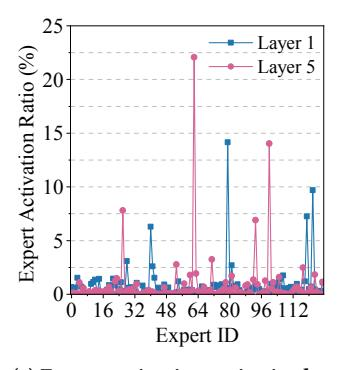

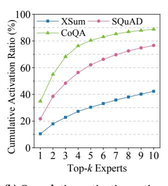

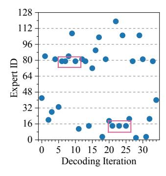

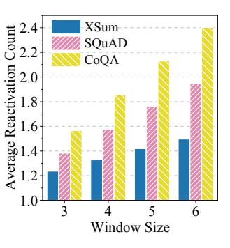

(a) Expert activation ratios in the first and fifth MoE layers with the XSum dataset

(b) Cumulative activation ratios of the 6 MoE layers w.r.t. the topk experts across datasets

(c) Expert activation traces in the first MoE layer with the XSum dataset across decoding iterations

(d) Average expert reactivation counts under varying window sizes across datasets

Figure 4: Statistical analysis of expert activation patterns in the Switch-Base model across distinct tasks, including summarization (XSum) and question answering (SQuAD and CoQA).

and let  $C_i^w$  denote the total number of expert reactivations observed within these windows. The average expert reactivation count is then defined as  $\frac{\sum_{i=1}^{l} C_i^w}{\sum_{i=1}^{l} N_i^w}$ . Figure 4d shows the average reactivation counts of the Switch-Base model across three datasets (XSum, SQuAD, and CoQA) under different window sizes. On average, once activated, certain experts are reactivated  $1.13\times-2.40\times$  within the next 3–6 decoding iterations.

However, existing cache-based offloading solutions [10, 40, 51] do not exploit this temporal locality. As a result, experts that are repeatedly activated within a decoding window may be evicted prematurely, triggering unnecessary migrations. To avoid this, locally hot experts should be retained in the cache using a locality-preserving replacement policy, ensuring their residency until the relevant decoding iterations are complete. This reduces expert migrations and alleviates communication overhead.

The observed global and temporal locality motivates the design of a differential cache hierarchy. In this hierarchy, globally hot experts are permanently stored in a per-layer high-priority cache, locally hot experts are dynamically maintained in a per-layer medium-priority cache under a locality-preserving replacement policy, and all remaining cold experts are temporarily placed in a shared low-priority cache and evicted immediately after use. This design reduces expert transfers between host and GPU by improving cache hit rates, thereby increasing opportunities to overlap communication with computation.

Despite these benefits, leveraging expert activation locality to mitigate communication overhead remains challenging. First, accurately identifying globally and locally hot experts is difficult because their activation patterns depend on both the input tokens and the model. Second, the set of locally hot experts changes dynamically across decoding iterations, making it hard to design a replacement policy that fully captures and exploits temporal locality.

#### 3 DIFF-MoE Overview

We introduce DIFF-MoE, a framework for high-throughput batched inference of MoE-based LLMs on host-GPU heterogeneous architectures. Existing offloading solutions often suffer from excessive expert transfers and fail to effectively mitigate communication

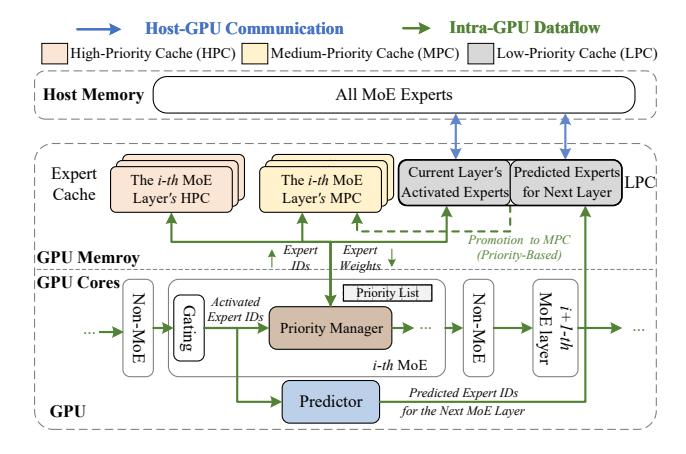

Figure 5: Overview of DIFF-MoE.

overhead. To address these challenges, DIFF-MoE adopts a locality-aware differential cache management strategy. Instead of caching all experts uniformly, it prioritizes keeping globally and locally hot experts in GPU memory, thereby improving cache hit rates, reducing expert migrations, and maximizing the overlap between communication and computation to hide latency.

The architecture of DIFF-MoE is shown in Figure 5. It consists of three main components: the priority manager, the differential cache hierarchy, and the predictor. The priority manager pins globally hot experts at initialization and dynamically updates the priority scores of all other experts, periodically classifying them into locally hot or cold categories (§4). The differential cache hierarchy organizes GPU memory into per-layer high-priority caches for globally hot experts, per-layer medium-priority caches for locally hot experts, and a shared low-priority cache for cold experts (§5). The predictor further reduces latency by forecasting experts likely to be needed in the next layer and preloading them into GPU memory (§6).

Algorithm 1 outlines the workflow of DIFF-MoE, illustrating how expert priorities are initialized, updated, and used to guide caching and prediction during inference. For each MoE layer, the gating network selects activated experts, their priority scores are updated, and missing experts are fetched into GPU memory. A

## Algorithm 1: The workflow of DIFF-MoE **Input:** Token Embedding X**Output:** Output Embedding Y /\* Model Fine-tuning & Priority Initialization \*/ 1 Model Fine Tuning() 2 foreach MoE layer i do $GloHotExp_i \leftarrow TopN(Layer i)$ 4 foreach MoE layer i do foreach expert E do if $E \in GloHotExp_i$ then 6 $Priority(E) \leftarrow MaxP$ $HPC_i \leftarrow E$ **else** Priority(E) $\leftarrow 0$ /\* Online Inference for the Current MoE Layer i \*/ 10 $G \leftarrow \text{Softmax}(\text{LinearGate}(X))$ 11 $I \leftarrow \text{TopK}(G)$ 12 $\mathcal{A} \leftarrow \{E_k^i : k \in I\}$ 13 Priority( $E \in \text{Layer } i$ ).Update( $\mathcal{A}$ ) 14 **foreach** expert $E_k^i \in \mathcal{A}$ **do**15 | **if** $E_k^i \notin HPC_i \cup MPC_i \cup LPC$ **then**16 | $LPC \leftarrow FetchFromHost(E_k^i)$ 17 Initialize $Y \leftarrow \mathbf{0}$ 18 **foreach** expert $E_k^i \in \mathcal{A}$ **do**19 $M_k \leftarrow$ set of tokens assigned to expert $E_k^i$ for each token $t \in \mathcal{M}_k$ do $Y_t \leftarrow \text{Execute}(E_k^i, X_t)$ $Y \leftarrow Y + Y_t$ 23 Promote( $LPC \rightarrow MPC_i$ ) 24 Clear(LPC) /\* Expert Prediction for the Next MoE Layer i' \*/ 25 $\mathcal{P} \leftarrow \text{PredictExperts}(\mathcal{A}, i')$ 26 $Q \leftarrow \text{TopK}(\{E \in \mathcal{P} \mid E \notin HPC_{i'} \cup MPC_{i'}\})$ for each $E \in Q$ do $LPC \leftarrow FetchFromHost(E)$

locality-preserving replacement policy governs promotions from the shared low-priority cache to the medium-priority cache, while the predictor prefetches likely future experts to overlap communication with computation.

At initialization, each MoE layer i creates its high-priority cache (HPC $_i$ ) (Lines 1–9). During offline fine-tuning, the top-N most frequently activated experts in each layer are identified as globally hot (Lines 1–3) and assigned the maximum priority score (MaxP), which remains fixed throughout inference (Lines 7–8). All other experts are initialized with a priority score of zero (Line 9), and their scores evolve dynamically during inference. We sometimes refer to these remaining experts as non-global experts, which may later be classified as locally hot or cold depending on their scores.

During inference of the current layer (i.e., the i-th MoE layer), an input token embedding X is transformed into an output embedding

Y using DIFF-MoE 's differential cache hierarchy (Lines 9–24). The gating network determines the set of activated experts  $\mathcal{A}$  (Lines 10–12), and the corresponding priority scores are updated (Line 13). If any activated expert is not present in GPU memory, it is fetched from host memory into the LPC (Lines 14–16). Once all activated experts are available, tokens in the batch are dispatched to their assigned experts for parallel computation (Lines 17–22). After computation, a locality-preserving replacement policy is applied (§5), during which some experts in the LPC may be promoted to MPC $_i$  (Line 23). The LPC is then cleared (Line 24).

Finally, DIFF-MoE leverages a predictor to estimate the activation probability distribution of experts in the next layer i' (Line 25). Once the activated experts for the current layer are loaded, the predictor selects the top-k uncached experts with the highest probabilities (Line 26) and prefetches them into the LPC (Lines 27–28). This prefetching overlaps with ongoing computation, further reducing communication latency.

## 4 Priority-based Expert Classification

In this section, we present our priority-based expert classification method, which forms the foundation of the differential expert caching scheme employed in Algorithm 1 and its locality-preserving replacement policy described in §5. §4.1 details how expert priorities are quantified, including both initialization and dynamic updates, while §4.2 introduces the classification of experts into three categories: globally hot, locally hot, and cold.

#### 4.1 Expert Priority Quantification

**Priority Initialization.** Let  $E_k^i$  denote the k-th expert  $(k \in [0, |E| - 1])$  in the i-th MoE layer  $(i \in [0, l - 1])$ , where |E| is the number of experts per layer and l is the total number of MoE layers. Each expert  $E_k^i$  is assigned a priority score  $p_k^i \in [0, MaxP]$ , where MaxP is a tunable hyperparameter representing the maximum possible score. During the offline fine-tuning stage, the top-N most frequently activated experts in each layer are identified as globally hot and initialized with  $p_k^i = MaxP$ , which remains fixed throughout inference. All other experts are initialized with  $p_k^i = 0$ , and their scores evolve dynamically during inference. Each MoE layer i maintains a priority list  $PriorityList_i$  to track the scores of these experts.

**Dynamic Priority Updating.** During inference in the i-th MoE layer, the priority scores of non-global experts are dynamically adjusted based on their activation frequency, allowing DIFF-MoE to adapt to input variations by distinguishing locally hot experts (maintained in MPC $_i$ ) from cold experts (stored in the shared LPC). Whenever the gating network activates a set of experts (denoted by  $\mathcal{A}$ ), the scores are updated as follow:

$$p_{k}^{i} = \operatorname{clip} \begin{pmatrix} p_{k}^{i} + \Delta_{inc}, & \text{if } E_{k}^{i} \in \mathcal{A} \\ p_{k}^{i} - \Delta_{dec}^{in}, & \text{if } E_{k}^{i} \notin \mathcal{A} \text{ and } E_{k}^{i} \in C \\ p_{k}^{i} - \Delta_{dec}^{out}, & \text{if } E_{k}^{i} \notin \mathcal{A} \text{ and } E_{k}^{i} \notin C \end{pmatrix}$$
(1)

Here, the clip() function constrains scores to the valid range [0, MaxP], preventing overflow or underflow. C denotes the set of experts currently stored in GPU memory. The parameters  $\Delta_{inc}$ ,  $\Delta_{dec}^{in}$ , and  $\Delta_{dec}^{out}$ 

represent the increment and decrements applied under three different scenarios, where  $\Delta_{inc} > \Delta_{dec}^{in} \geq \Delta_{dec}^{out}$ . The update operations for each case are defined as follows:

- Activated Experts: If an expert is activated by the gating network (Eik ∈ A), its priority score is increased by a fixed increment Δinc.
- Inactive but Cached Experts: If an expert resides in GPU memory but is not activated by the current gating network  $(E_k^i \notin \mathcal{A} \text{ and } E_k^i \in C)$ , its priority score is decreased by  $\Delta_{dec}^{in}$ .
- Inactive and Uncached Experts: If an expert is neither activated nor present in GPU memory  $(E_k^i \notin \mathcal{A} \text{ and } E_k^i \notin \mathcal{C})$ , its priority score is decreased by  $\Delta_{dec}^{out}$ .

We intentionally apply a larger decrement to experts residing in GPU memory but not activated by the current gating network (i.e.,  $\Delta_{dec}^{in} > \Delta_{dec}^{out}$ ). This accelerates the demotion of inactive experts occupying limited GPU capacity, freeing space for recently activated candidates to be promptly admitted into MPCi. However,  $\Delta_{dec}^{in}$  should not be set excessively higher than  $\Delta_{dec}^{out}$ , since experts in CPU memory must be demoted more gradually to preserve their potential for future reuse and to avoid unnecessary cache churn. In practice, we empirically set  $\Delta_{inc}=1, \Delta_{dec}^{in}=0.4\times\Delta_{inc}$ , and  $\Delta_{dec}^{out}=0.2\times\Delta_{inc}$ , which achieves a balanced trade-off between cache turnover and reuse effectiveness.

#### 4.2 Priority-Based Expert Classification

To enable differential expert caching, experts are classified into three categories: globally hot, locally hot, and cold. Globally hot experts are identified during the offline stage, assigned the maximum priority score MaxP, and remain fixed throughout inference. All other experts in the i-th MoE layer are classified at runtime based on their priority scores: an expert  $E_k^i$  is considered locally hot if  $P_k^i \geq threshold_{\mathrm{hot}}$ , and cold otherwise.

We empirically set  $threshold_{hot} = \Delta_{inc}$ . With this choice, any non-global expert in the i-th MoE layer becomes locally hot after a single activation and is thus eligible to be kept in MPC $_i$ , avoiding immediate eviction and capturing short-term reuse.

We further set  $MaxP = 2 \times threshold_{hot}$ , creating a margin  $Diff = MaxP - threshold_{hot}$ . Since priority scores are clipped to [0, MaxP] in Equation (1), once a score reaches the lower bound, further decrements are no-ops, and once it reaches the upper bound, further increments are no-ops. If Diff is too large, locally hot experts retain high scores and linger in  $MPC_i$ , hindering admission of newly useful experts. Conversely, if Diff is too small, recently activated locally hot experts may be evicted before their reuse is observed, weakening caching effectiveness. Empirically, this setting, supported by our analysis in Section 2.3, strikes a balance between responsiveness and stability while avoiding excessive score accumulation.

#### 5 Differential Expert Caching

In this section, we present DIFF-MoE's differential cache hierarchy and locality-preserving replacement policy, designed to exploit global and temporal locality in expert activations efficiently.

#### 5.1 Differential Cache Hierarchy

As shown in Figure 5, each MoE layer i maintains a private  $high-priority\ cache\ (HPC_i)$  that permanently stores its globally hot experts, identified during fine-tuning and loaded before inference. Each layer also has a  $medium-priority\ cache\ (MPC_i)$ , managed dynamically at runtime to hold experts with strong temporal locality. During inference, the priority scores of all non-global experts are updated whenever the routing network activates experts. If an expert's score exceeds the locally hot threshold, it becomes a candidate for admission into MPC $_i$ , subject to the locality-preserving replacement policy described in §5.2.

In addition to  $HPC_i$  and  $MPC_i$ , all MoE layers share a global low-priority cache (LPC), which acts as a temporary buffer similar to those in prior offloading solutions [18, 29]. The LPC consists of two parts: one stores the activated experts of the current layer i, and the other holds prefetched experts predicted by our forecasting mechanism (§6). If an activated expert is absent from  $HPC_i$ ,  $MPC_i$ , and the LPC, it is fetched from CPU memory into the LPC. Once layer i completes, the experts in the LPC are either promoted to  $MPC_i$  (if classified as locally hot) or evicted. As a result, after each layer, the LPC retains only the prefetched experts for the next layer, improving memory utilization and reducing redundant transfers.

In practice, for each MoE layer i, we set the capacity of MPC $_i$  to twice that of HPC $_i$ , which empirically provides a good balance and yields high cache hit rates. Within the LPC, the buffer for prefetched experts is fixed to hold one or two experts (Line 26 of Algorithm 1), whereas the buffer for the current layer's activated experts fetched from host memory is allocated dynamically at runtime.

#### 5.2 Locality-Preserving Cache Replacement

Whenever a locally hot expert qualifies for admission into MPC $_i$  of layer i, DIFF-MoE first checks whether MPC $_i$  has free space. If space is available, the expert is inserted directly. Otherwise, the locality-preserving replacement policy is triggered. MPC $_i$  is updated only when new experts must be admitted. In such cases, candidate experts (i.e., currently activated experts not already in MPC $_i$ ) are sorted in descending order of priority, while the experts currently in MPC $_i$  are sorted in ascending order. If an MPC $_i$ -resident expert has a priority score below  $threshold_{hot}$ , the lowest-scoring one is replaced by the highest-scoring candidate. This process repeats until either no resident experts fall below the threshold or no candidates remain. It should be pointed out that no replacement occurs if all resident experts have scores at least  $threshold_{hot}$ .

Figure 6 compares our locality-preserving cache replacement policy with the traditional *least recently used* (LRU) strategy. LRU selects victims purely based on recency, disregarding temporal locality. In existing offloading solutions that adopt LRU [10, 14], the least recently used experts are evicted whenever new ones are activated. However, during batched inference, the combined footprint of all activated experts in a single decoding iteration can exceed cache capacity, causing the entire cache to be refreshed. As shown in Figure 6, this leads to two issues in the first iteration ( $I_1$ ): (1) some locally hot experts (e.g.,  $E_3$ ) are evicted, and (2) lower-priority experts (e.g.,  $E_4$  and  $E_5$ ) remain in the cache while higher-priority ones (e.g.,  $E_0$ ) are evicted. This results in high miss ratios in the next iteration ( $I_2$ ), where all three activated experts miss.

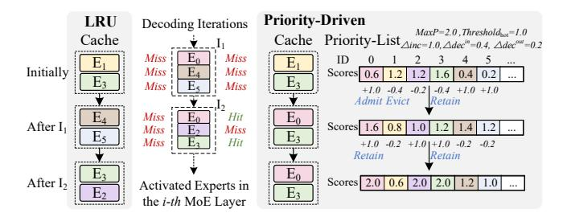

Figure 6: Comparison of LRU and our priority-driven replacement. Each MPC holds two experts per MoE layer, while three are activated per iteration. LRU may evict hot experts (e.g.,  $E_3$ ) and retain lower-priority ones (e.g.,  $E_4$ ,  $E_5$ ), discarding higher-priority experts (e.g.,  $E_0$ ) and causing later misses. In contrast, our policy updates priorities, demotes cold experts (e.g.,  $E_1$ ), and admits higher-scoring ones (e.g.,  $E_0$ ), preserving temporal locality and yielding hits (e.g.,  $E_0$ ,  $E_3$  in  $E_2$ ).

Our locality-preserving cache replacement policy resolves these issues by integrating both temporal locality and recency into the replacement decision. As illustrated in Figure 6, during the first iteration ( $I_1$ ), the priority list is updated prior to replacement. Since all cached experts are inactive, their scores decrease. As a result,  $E_1$  drops below  $threshold_{hot}$  and is demoted to cold, while  $E_3$  remains locally hot. The cache then replaces  $E_1$  with the newly activated expert of highest priority,  $E_0$ . In the subsequent iteration ( $I_2$ ), this policy achieves two cache hits ( $E_0$  and  $E_3$ ), whereas LRU produces none, thereby highlighting the effectiveness of our approach.

## 6 Expert Prediction Mechanism

Expert activations across MoE layers often exhibit strong correlations [6, 26], allowing future usage to be inferred from historical activation patterns. This makes it possible to overlap expert transfers with the computation of the current layer *i*, thereby hiding communication latency. To leverage this property, DIFF-MoE incorporates a lightweight online predictor that forecasts the experts likely to be activated in the next MoE layer and prefetches them from host to GPU memory in advance.

Prediction Scope Consideration. As analyzed in §2.2, when the batch size increases, the computation time of MoE inference remains relatively stable, whereas the communication time grows significantly with the number of activated experts. In this setting, predicting and prefetching experts across multiple future layers would not effectively hide communication latency and could even interfere with more urgent data transfers. Therefore, DIFF-MoE restricts expert prediction strictly to the immediate next MoE layer.

The number of experts to prefetch is determined by the balance between computation and communication. As shown in Figure 3a, with a batch size of 4, computation overlaps with the transfer of only one expert; hence Diff-MoE prefetches a single expert when batch size  $\leq$  4. Prefetching beyond what can be hidden is wasteful, as it is speculative. For larger batches, Diff-MoE prefetches two experts, which maximizes overlap in practice. Although larger batches might seem to justify more, our evaluation shows that increasing the batch size from 4 to 64 extends computation time by only 1.26 $\times$ , covering at most 1.26 additional transfers. Thus, prefetching two experts is

sufficient even in large-batch scenarios. During prefetching, cached top-ranked experts are skipped in favor of uncached ones.

**Lightweight Predictor Design.** To capture inter-layer activation dependencies, we employ a *gated recurrent unit* (GRU) network [4], a variant of *recurrent neural networks* (RNNs) well suited for modeling sequential patterns. The gating mechanism of GRU allows it to retain both long- and short-term dependencies, making it effective for learning expert activation sequences across MoE layers.

Specifically, we implement a 6-layer GRU model in PyTorch, trained on expert activation traces collected during the MoE model's fine-tuning stage. The traces are randomly shuffled and partitioned into training and validation sets with an 8:2 ratio to facilitate effective training and evaluation.

During inference, each sample generates an activation trace. The predictor takes the expert IDs activated in the current MoE layer and, through the GRU's hidden state, models historical activation patterns. It then outputs a probability distribution over experts in the next layer. For a batch containing a single sample (batch size = 1), the expert with the highest probability is selected. For larger batches, the distributions from all samples are aggregated, experts are ranked by their aggregated scores, and the top 1-2 are prefetched according to the batch-size policy, thereby overlapping communication with computation.

#### 7 Evaluation

We evaluate the effectiveness of DIFF-MoE by comparing its inference throughput with three state-of-the-art systems—DeepSpeed [2], Pre-gated MoE [18], and MoE-Infinity [51]—using Switch-Base and Switch-Large as benchmark models.

#### 7.1 Experimental Setup

**Software and Hardware.** Our implementation builds on NVIDIA's FasterTransformer library [29]. Experiments are conducted on a server equipped with a single NVIDIA H200 GPU (141 GB HBM), two Intel Xeon Gold 6430 CPUs, and 1 TB of host DRAM. The GPU is connected to the CPUs via PCIe 5.0, providing a bidirectional bandwidth of 128 GB/s.

**Workloads.** We evaluate DIFF-MoE on two representative MoE models: Switch-Base [12] with 7B parameters and Switch-Large [12] with 26B parameters. These models contain 12 and 24 layers, respectively, with half of the layers implemented as MoE layers, each comprising 128 experts. To capture diverse downstream scenarios, we consider three representative tasks: (1) summarization on the BBC XSum dataset [28], (2) *question answering* (QA) on the SQuAD dataset [35], and (3) *conversational QA* (CQA) on the CoQA dataset [36]. All models are fine-tuned using a consistent procedure to adapt the pretrained MoE models to each task. Unless otherwise specified, we set the cache ratio  $\alpha$  to 5%, allocating this fraction of experts to HPC and MPC in GPU memory. Sensitivity to  $\alpha$  is evaluated in §7.4, where we vary it across 2%, 5%, and 10%.

Algorithm 1 leaves several parameters model-dependent. In our evaluation, we set them as follows: (i) Line 3 caches two global experts per MoE layer under the default cache ratio  $\alpha = 5\%$ , since MPCi is twice the size of HPCi (§5); (ii) Line 11 activates the top-1 expert in both models by default [12]; and (iii) Line 26 prefetches at most two experts per layer (§6).

**Baselines.** We compare DIFF-MoE against an ideal No-Offload setting and three state-of-the-art offloading approaches. For all offloading-based baselines, we use a consistent setup: non-MoE parameters are stored in GPU memory, while MoE experts reside in CPU memory. During inference, each method manages expert loading and retention according to its own policy.

These baselines are detailed as follows:

- No-Offload: Serves as an upper bound for throughput by storing the entire model in GPU memory without offloading. While Switch-Base and Switch-Large fit within the H200 GPU's memory capacity, such high-end GPUs are not always available in practice. Moreover, increasingly larger MoE models already exceed the memory limits of any single GPU. We include this configuration primarily to analyze memory usage and efficiency, with our main focus being offloading methods suitable for resource-constrained environments.
- DeepSpeed-Offload [2]: A representative offloading approach implemented in the DeepSpeed framework. This method dynamically transfers only the activated experts (as selected by the gating network) to GPU memory on demand, evicting them after computation completes.
- Pre-gated MoE [18]: A prefetch-based offloading approach that modifies the gating mechanism to route (i.e., prefetch) all active experts required by the next MoE layer in advance, thereby overlapping parameter transfer with computation and reducing communication latency.
- MoE-Infinity [51]: A cache-based offloading method that maintains a global shared cache across layers and evicts experts based on estimated reuse probability.

Metrics. We evaluate performance using four key metrics: (1) Cache Hit Rate: the fraction of expert accesses served directly from the cache during inference. (2) End-to-End Throughput: the token processing rate during inference, measured in tokens per second (tokens/s). (3) Memory Consumption: the peak GPU memory usage, measured in gigabytes (GB). (4) Memory Efficiency: the ratio of throughput (tokens/s) to peak memory usage (GB), expressed as tokens per gigabyte per second (tokens/(GB·s)).

### 7.2 End-to-End Throughput

Figure 7 reports the end-to-end inference throughput of Diff-MoE and baselines on Switch-Base with the XSum dataset.

**DIFF-MoE vs. DeepSpeed-Offload:** DIFF-MoE achieves 1.99×–3.46× speedups over DeepSpeed-Offload, averaging 2.74×. As batch size grows, the number of simultaneously activated experts increases, causing DeepSpeed-Offload to suffer from severe communication bottlenecks that limit throughput scaling. Since DeepSpeed-Offload fetches experts only after gating and performs no prefetching, it incurs the highest latency due to the complete absence of overlap between communication and computation.

**DIFF-MoE vs. Pre-gated MoE:** Pre-gated MoE represents the state-of-the-art prefetch-based approach, routing experts one layer in advance to enable expert preloading. This scheduling hides part of the communication latency compared with the pure on-demand loading in DeepSpeed-Offload. However, the transfer that can be overlapped with computation is limited by the parallel processing of batch inputs. For example, with a batch size of 64, up to 34 experts

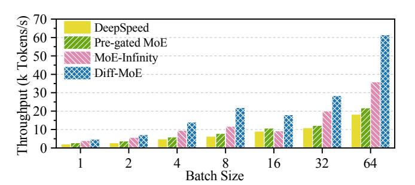

Figure 7: End-to-end throughput under varying batch sizes on the Switch-Base model with the XSum dataset.

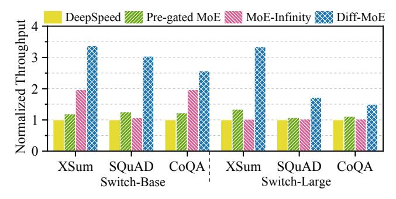

Figure 8: End-to-end throughput (normalized to DeepSpeed-Offload) across different model scales and datasets.

may be activated, but the computation time can hide the loading of only two experts, leaving the remaining transfers uncovered. This significantly constrains performance gains. In contrast, DIFF-MoE reduces redundant transfers through differential caching, mitigating communication overhead and sustaining higher throughput. As a result, DIFF-MoE delivers  $1.66 \times -2.82 \times$  speedups over Pre-gated MoE, with an average improvement of  $2.22 \times$ .

**DIFF-MoE vs. MoE-Infinity:** MoE-Infinity is a representative cache-based method that stores experts in GPU memory for reuse across decoding iterations. For fairness, it is configured with the same cache capacity as DIFF-MoE (e.g., caching 36 experts, corresponding to a 5% cache ratio in Switch-Base). However, under large batches it suffers from frequent evictions that prevent cached experts from being reused. For example, with a batch size of 64, about 34 experts are activated, nearly exhausting the cache (34/36) and forcing almost complete replacement. As a result, experts cannot be preserved for the next decoding iteration of the same layer, leading to rapid cache turnover and degraded performance in memoryconstrained settings. DIFF-MoE overcomes this by using a localitypreserving replacement policy that retains globally and locally hot experts, thereby improving cache hit ratios and reducing communication overhead. Consequently, DIFF-MoE delivers 1.19×-1.93× speedups over MoE-Infinity, averaging 1.55×.

To further assess the robustness and generality of DIFF-MoE, we fix the batch size to 64 and evaluate performance on Switch-Base and Switch-Large across three datasets (XSum, SQuAD, and CoQA). Figure 8 reports the results. DIFF-MoE consistently outperforms all baselines, delivering 1.72×-3.37× speedups over DeepSpeed-Offload, 1.60×-2.82× over Pre-gated MoE, and 1.30×-3.27× over MoE-Infinity. These gains stem from the consistent effectiveness of

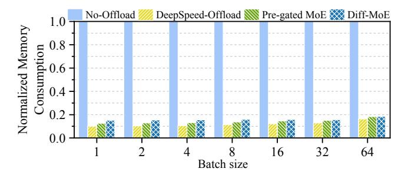

Figure 9: Peak GPU memory consumption of No-Offload, DeepSpeed-Offload, Pre-gated MoE, and DIFF-MoE on the Switch-Base model with XSum (normalized to No-Offload).

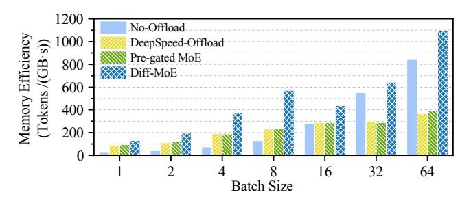

Figure 10: Memory efficiency under different batch sizes on the Switch-Base model with the XSum dataset.

differential caching across model scales and datasets, highlighting both the robustness and generality of DIFF-MoE.

## 7.3 Memory Consumption and Efficiency

Figure 9 reports the peak GPU memory usage of No-Offload, Pregated MoE, DeepSpeed-Offload, and DIFF-MoE across batch sizes, normalized to No-Offload on Switch-Base with the XSum dataset. MoE-Infinity is omitted, as it uses the same cache capacity as DIFF-MoE and requires a similar LPC buffer for cached experts during parallel computation, resulting in comparable memory usage.

With fixed cache ratio  $\alpha$ , DIFF-MoE shows consistent memory trends, averaging 16.0% of No-Offload's usage. Compared to DeepSpeed-Offload and Pre-gated MoE, it requires 1.36× and 1.13× more memory, respectively, due to differential caching, though the gap shrinks with larger batch sizes.

Although DIFF-MoE incurs slightly higher memory consumption than other offloading solutions, it delivers substantial performance gains. To evaluate the trade-off between memory usage and throughput, we adopt the memory efficiency metric defined in §7.1, measured in tokens/(GB·s). Figure 10 presents results on the Switch-Base model with the XSum dataset. Across all batch sizes, DIFF-MoE consistently achieves the highest efficiency, surpassing No-Offload, DeepSpeed-Offload, and Pre-gated MoE by averages of 5.16×, 1.97×, and 1.60×, respectively. These results highlight its superior memory efficiency, demonstrating DIFF-MoE 's effectiveness in memory-constrained environments.

## 7.4 Impact of Cache Ratios

Figure 11 shows the effect of varying cache ratios on Diff-MoE's throughput and memory efficiency on the Switch-Base model with

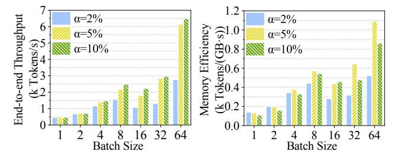

- (a) Throughput vs. batch size
- (b) Mem. eff. vs. batch size

Figure 11: Impact of cache ratios ( $\alpha = 2\%, 5\%, 10\%$ ) on throughput and memory efficiency of the Switch-Base model with the XSum dataset across varying batch sizes.

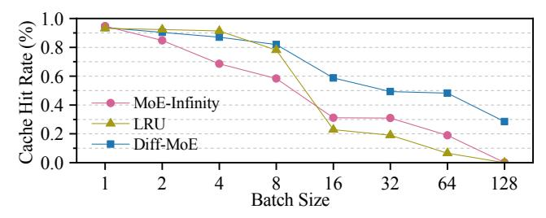

Figure 12: Cache hit rates of MoE-Infinity, LRU, and DIFF-MoE under varying batch sizes on the Switch-Base model with the XSum dataset (5% cache ratio).

the XSum dataset. We define the cache ratio  $\alpha$  as the fraction of cache capacity relative to the total expert capacity in the MoE model (Section 7.1). Among the three evaluated settings ( $\alpha \in \{2\%, 5\%, 10\%\}$ ),  $\alpha = 5\%$  provides the best trade-off between performance and efficiency. At  $\alpha = 2\%$ , the cache is too small to retain frequently accessed experts, limiting performance gains. Conversely, increasing  $\alpha$  to 10% offers only marginal throughput improvement while substantially raising memory usage. Thus, a moderate cache size (5%) captures activation locality effectively while keeping the memory footprint low, making DIFF-MoE well-suited for resource-constrained environments.

## 7.5 Impact of Cache Hit Rates

Figure 12 compares the cache hit rates of Diff-MoE with MoE-Infinity and the classical *least recently used* (LRU) policy. In small-batch scenarios (batch size < 8), our locality-preserving replacement strategy achieves hit rates comparable to LRU. For 8  $\leq$  batch size < 128, Diff-MoE surpasses MoE-Infinity and LRU by 1.40×–2.54× and 1.03×–7.28×, respectively.

The difference arises from cache organization: DIFF-MoE assigns cache space independently for each MoE layer, whereas MoE-Infinity and LRU share a global cache across all layers. In small-batch cases, a global cache can flexibly allocate more space to layers with many activated experts, improving hit rates. However, as batch size increases, the number of activated experts per layer grows rapidly, often exceeding cache capacity (e.g., up to 40% or 50/128 experts per layer when batch size = 128), which triggers frequent evictions. Consequently, MoE-Infinity and LRU hit rates collapse to below 0.1%. In contrast, DIFF-MoE 's layer-wise differential caching sustains a 28.5% hit rate even under large-batch conditions.

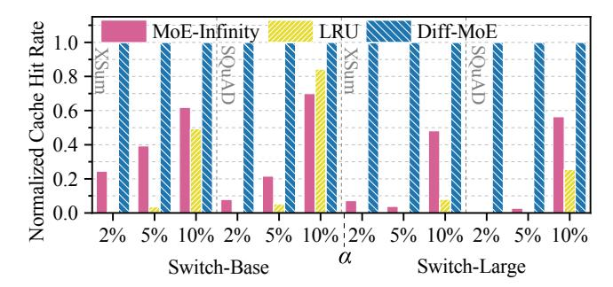

Figure 13: Cache hit rates of MoE-Infinity, LRU, and DIFF-MoE under cache ratios  $\alpha$  with batch size 64 on Switch-Base and Switch-Large across the XSum and SQuAD datasets.

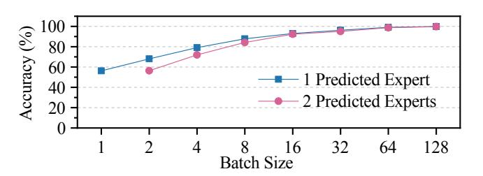

Figure 14: Prediction accuracy of forecasting one and two experts in the next MoE layer across batch sizes on the Switch-Base model with the XSum dataset.

Figure 13 reports further the cache hit rates of MoE-Infinity, LRU, and DIFF-MoE under different cache ratios on the Switch-Base and Switch-Large models with the XSum and SQuAD datasets (normalized to DIFF-MoE). The batch size is fixed to 64. Overall, DIFF-MoE consistently outperforms MoE-Infinity and LRU across all cache ratios, models, and datasets. For the Switch-Large model, MoE-Infinity and LRU require at least 10% of experts to be cached to achieve noticeable gains, whereas DIFF-MoE remains effective even with only 2% of experts cached.

### 7.6 Prediction Accuracy

Figure 14 reports top-1 and top-2 next-layer expert prediction accuracy across batch sizes. At batch size 1, the top-1 accuracy is 56.3%, i.e., more than half of the activated experts are correctly identified. Accuracy improves with larger batches because each sample contributes its own activation trace: the predictor produces a probability distribution per sample, and aggregating these distributions over the batch amplifies consistently likely experts. Selecting the highest aggregated probabilities thus more reliably targets the experts most often activated. For batch size  $\geq 16$ , both top-1 and top-2 accuracies stabilize above 90%. These results show that the predictor effectively exploits inter-layer activation regularities, enabling timely prefetching and improved communication–computation overlap.

#### 8 Related Work

We review prior research most relevant to our study that has not been discussed earlier in the paper.

MoE Inference in Resource-Constrained Environments. Recent work has explored diverse strategies for enabling efficient MoE inference under resource constraints. Beyond offloading, parameter compression has been widely applied to reduce memory footprints. Quantization-based methods such as AWQ [25], MoQE [22], and QMoE [13] compress weights into lower-bit formats (e.g., W4A16), significantly reducing memory consumption with minimal accuracy loss. Structured pruning approaches like MoE-I2 [27, 52] eliminate redundant neurons within and across experts, retaining only high-contributing experts and further pruning within each expert to preserve critical parameters. Low-rank decomposition techniques [15, 52] approximate expert weights with compact low-rank matrices, reducing both memory and compute overhead. More recently, DeepSeek [7] introduced a shared expert architecture that consolidates common knowledge across experts into a statically selected shared expert, effectively removing redundancy and shrinking model size. In contrast, DIFF-MoE focuses on reducing communication overhead between host and GPU, orthogonal to prior efforts that primarily shrink model size for efficient MoE inference under resource constraints.

Scalable MoE Deployment. As MoE models scale beyond single-device inference, system-level challenges such as communication efficiency and load balancing become critical. Tutel [17] addresses these challenges by introducing pipelined execution and optimized expert placement strategies to improve GPU-to-GPU bandwidth utilization and overlap communication with computation. Smart-MoE [55] focuses on model parallelism, mitigating expert-level load imbalance to enhance system throughput.

Beyond conventional architectures, other works investigate MoE inference on specialized hardware. FLAME [26] proposes an FPGA-optimized pipeline [45, 47], exploiting hardware parallelism and sparsity. Duplex [54] leverages *processing-in-memory* (PIM) devices to mitigate bandwidth bottlenecks through in-situ computation.

#### 9 Conclusion

We presented DIFF-MoE, a high-performance batched inference framework for MoE models that addresses inefficiencies of existing offloading approaches. DIFF-MoE employs a differential caching hierarchy that classifies experts into three categories and uses a locality-preserving replacement strategy, coupled with a lightweight predictor that anticipates expert activations. Together, these techniques reduce communication overhead while keeping memory usage low. Extensive experiments on two classic MoE models and diverse tasks show that DIFF-MoE consistently outperforms state-of-the-art solutions, achieving average speedups of 2.74×, 2.22×, and 1.55× over DeepSpeed-Offload, Pre-gated MoE, and MoE-Infinity, respectively. Moreover, DIFF-MoE delivers higher memory efficiency, making it a practical and scalable solution for deploying MoE models in resource-constrained environments.

#### Acknowledgments

We thank the anonymous reviewers for their valuable feedback and Shaoxian Xu for his support. This work was supported by the National Key Research and Development Program of China (Grant No. 2023YFB4503400), the National Natural Science Foundation of China (Nos. 62402456 and 62402457), and the Zhejiang Provincial Natural Science Foundation of China (No. LQ24F020027). Correspondence should be addressed to Qinggang Wang.

## References

- [1] Ahsan Ali, Riccardo Pinciroli, Feng Yan, and Evgenia Smirni. 2020. Batch: machine learning inference serving on serverless platforms with adaptive batching. In Proceedings of the International Conference for High Performance Computing, Networking, Storage and Analysis (SC'20), Virtual Event / Atlanta, Georgia, USA, November 9-19, 2020. IEEE/ACM, 1–15. [https://doi.org/10.1109/SC41405.2020.](https://doi.org/10.1109/SC41405.2020.00073) [00073](https://doi.org/10.1109/SC41405.2020.00073)
- [2] Reza Yazdani Aminabadi, Samyam Rajbhan dari, Ammar Ahmad Awan, Cheng Li, Du Li, Elton Zheng, Olatunji Ruwase, Shaden Smith, Minjia Zhang, Jeff Rasley, and Yuxiong He. 2022. DeepSpeed-Inference: Enabling Efficient Inference of Transformer Models at Unprecedented Scale. In Proceedings of the International Conference on High Performance Computing, Networking, Storage and Analysis (SC'22), Dallas, TX, USA, November 13-18, 2022. IEEE, 1–15. [https://doi.org/10.](https://doi.org/10.1109/SC41404.2022.00051) [1109/SC41404.2022.00051](https://doi.org/10.1109/SC41404.2022.00051)
- [3] Hyung Won Chung, Le Hou, Shayne Longpre, Barret Zoph, Yi Tay, William Fedus, Eric Li, Xuezhi Wang, Mostafa Dehghani, Siddhartha Brahma, Albert Webson, Shixiang Shane Gu, Zhuyun Dai, Mirac Suzgun, Xinyun Chen, Aakanksha Chowdhery, Sharan Narang, Gaurav Mishra, Adams Yu, Vincent Y. Zhao, Yanping Huang, Andrew M. Dai, Hongkun Yu, Slav Petrov, Ed H. Chi, Jeff Dean, Jacob Devlin, Adam Roberts, Denny Zhou, Quoc V. Le, and Jason Wei. 2022. Scaling Instruction-Finetuned Language Models. CoRR abs/2210.11416 (2022). <https://doi.org/10.48550/arXiv.2210.11416>
- [4] Junyoung Chung, Çaglar Gülçehre, KyungHyun Cho, and Yoshua Bengio. 2014. Empirical Evaluation of Gated Recurrent Neural Networks on Sequence Modeling. CoRR abs/1412.3555 (2014).<http://arxiv.org/abs/1412.3555>
- [5] Daniel Crankshaw, Xin Wang, Giulio Zhou, Michael J. Franklin, Joseph E. Gonzalez, and Ion Stoica. 2017. Clipper: A Low-Latency Online Prediction Serving System. In Proceedings of the 14th USENIX Symposium on Networked Systems Design and Implementation (NSDI'17), Boston, MA, USA, March 27-29, 2017. USENIX Association, 613–627. [https://www.usenix.org/conference/nsdi17/technical](https://www.usenix.org/conference/nsdi17/technical-sessions/presentation/crankshaw)[sessions/presentation/crankshaw](https://www.usenix.org/conference/nsdi17/technical-sessions/presentation/crankshaw)
- [6] Weihao Cui, Zhenhua Han, Lingji Ouyang, Yichuan Wang, Ningxin Zheng, Lingxiao Ma, Yuqing Yang, Fan Yang, Jilong Xue, Lili Qiu, Lidong Zhou, Quan Chen, Haisheng Tan, and Minyi Guo. 2023. Optimizing Dynamic Neural Networks with Brainstorm. In Proceedings of the 17th USENIX Symposium on Operating Systems Design and Implementation (OSDI'23), Boston, MA, USA, July 10-12, 2023. USENIX Association, 797–815. [https://www.usenix.org/conference/osdi23/presentation/](https://www.usenix.org/conference/osdi23/presentation/cui) [cui](https://www.usenix.org/conference/osdi23/presentation/cui)
- [7] Damai Dai, Chengqi Deng, Chenggang Zhao, R. X. Xu, Huazuo Gao, Deli Chen, Jiashi Li, Wangding Zeng, Xingkai Yu, Y. Wu, Zhenda Xie, Y. K. Li, Panpan Huang, Fuli Luo, Chong Ruan, Zhifang Sui, and Wenfeng Liang. 2024. DeepSeekMoE: Towards Ultimate Expert Specialization in Mixture-of-Experts Language Models. In Proceedings of the 62nd Annual Meeting of the Association for Computational Linguistics (ACL'24), Bangkok, Thailand, August 11-16, 2024. Association for Computational Linguistics, 1280–1297.<https://doi.org/10.18653/v1/2024.acl-long.70>
- [8] Jacob Devlin, Ming-Wei Chang, Kenton Lee, and Kristina Toutanova. 2019. BERT: Pre-training of Deep Bidirectional Transformers for Language Understanding. In Proceedings of the 2019 Conference of the North American Chapter of the Association for Computational Linguistics: Human Language Technologies (NAACL-HLT'19), Minneapolis, MN, USA, June 2-7, 2019. Association for Computational Linguistics, 4171–4186.<https://doi.org/10.18653/v1/n19-1423>
- [9] Zhixu Du, Shiyu Li, Yuhao Wu, Xiangyu Jiang, Jingwei Sun, Qilin Zheng, Yongkai Wu, Ang Li, Hai Li, and Yiran Chen. 2024. SiDA: Sparsity-Inspired Data-Aware Serving for Efficient and Scalable Large Mixture-of-Experts Models. In Proceedings of the Seventh Annual Conference on Machine Learning and Systems (MLSys'24), Santa Clara, CA, USA, May 13-16, 2024. mlsys.org, 224–238. [https://proceedings.mlsys.org/paper\\_files/paper/2024/hash/](https://proceedings.mlsys.org/paper_files/paper/2024/hash/698cfaf72a208aef2e78bcac55b74328-Abstract-Conference.html) [698cfaf72a208aef2e78bcac55b74328-Abstract-Conference.html](https://proceedings.mlsys.org/paper_files/paper/2024/hash/698cfaf72a208aef2e78bcac55b74328-Abstract-Conference.html)
- [10] Artyom Eliseev and Denis Mazur. 2023. Fast Inference of Mixture-of-Experts Language Models with Offloading. CoRR abs/2312.17238 (2023). [https://doi.org/](https://doi.org/10.48550/arXiv.2312.17238) [10.48550/arXiv.2312.17238](https://doi.org/10.48550/arXiv.2312.17238)
- [11] Zhiyuan Fang, Yuegui Huang, Zicong Hong, Yufeng Lyu, Wuhui Chen, Yue Yu, Fan Yu, and Zibin Zheng. 2025. Klotski: Efficient Mixture-of-Expert Inference via Expert-Aware Multi-Batch Pipeline. CoRR abs/2502.06888 (2025). [https:](https://doi.org/10.48550/arXiv.2502.06888) [//doi.org/10.48550/arXiv.2502.06888](https://doi.org/10.48550/arXiv.2502.06888)
- [12] William Fedus, Barret Zoph, and Noam Shazeer. 2022. Switch Transformers: Scaling to Trillion Parameter Models with Simple and Efficient Sparsity. Journal of Machine Learning Research 23 (2022), 1–39. [https://jmlr.org/papers/v23/21-](https://jmlr.org/papers/v23/21-0998.html) [0998.html](https://jmlr.org/papers/v23/21-0998.html)
- [13] Elias Frantar and Dan Alistarh. 2024. QMoE: Sub-1-Bit Compression of Trillion Parameter Models. In Proceedings of the Seventh Annual Conference on Machine Learning and Systems (MLSys'24), Santa Clara, CA, USA, May 13-16, 2024. mlsys.org, 439–451. [https://proceedings.mlsys.org/paper\\_files/paper/2024/hash/](https://proceedings.mlsys.org/paper_files/paper/2024/hash/c74b624843218d9b6713fcf299d6d5e4-Abstract-Conference.html) [c74b624843218d9b6713fcf299d6d5e4-Abstract-Conference.html](https://proceedings.mlsys.org/paper_files/paper/2024/hash/c74b624843218d9b6713fcf299d6d5e4-Abstract-Conference.html)
- [14] Georgi Gerganov. 2024. llama.cpp.<https://github.com/ggml-org/llama.cpp>
- [15] Hao Gu, Wei Li, Lujun Li, Qiyuan Zhu, Mark G. Lee, Shengjie Sun, Wei Xue, and Yike Guo. 2025. Delta Decompression for MoE-based LLMs Compression. CoRR

- abs/2502.17298 (2025).<https://doi.org/10.48550/arXiv.2502.17298>
- [16] HuggingFace. 2022. HuggingFace accelerate. [https://huggingface.co/docs/](https://huggingface.co/docs/accelerate/index) [accelerate/index](https://huggingface.co/docs/accelerate/index)
- [17] Changho Hwang, Wei Cui, Yifan Xiong, Ziyue Yang, Ze Liu, Han Hu, Zilong Wang, Rafael Salas, Jithin Jose, Prabhat Ram, HoYuen Chau, Peng Cheng, Fan Yang, Mao Yang, and Yongqiang Xiong. 2023. Tutel: Adaptive Mixture-of-Experts at Scale. In Proceedings of the Sixth Conference on Machine Learning and Systems (MLSys'23), Miami, FL, USA, June 4-8, 2023. mlsys.org, 269–287. [https://proceedings.mlsys.org/paper\\_files/paper/2023/hash/](https://proceedings.mlsys.org/paper_files/paper/2023/hash/5616d34cf8ff73942cfd5aa922842556-Abstract-mlsys2023.html) [5616d34cf8ff73942cfd5aa922842556-Abstract-mlsys2023.html](https://proceedings.mlsys.org/paper_files/paper/2023/hash/5616d34cf8ff73942cfd5aa922842556-Abstract-mlsys2023.html)
- [18] Ranggi Hwang, Jianyu Wei, Shijie Cao, Changho Hwang, Xiaohu Tang, Ting Cao, and Mao Yang. 2024. Pre-gated MoE: An Algorithm-System Co-Design for Fast and Scalable Mixture-of-Expert Inference. In Proceedings of the 51st ACM/IEEE Annual International Symposium on Computer Architecture (ISCA'24), Buenos Aires, Argentina, June 29 - July 3, 2024. IEEE, 1018–1031. [https://doi.org/10.1109/](https://doi.org/10.1109/ISCA59077.2024.00078) [ISCA59077.2024.00078](https://doi.org/10.1109/ISCA59077.2024.00078)
- [19] Albert Q. Jiang, Alexandre Sablayrolles, Antoine Roux, Arthur Mensch, Blanche Savary, Chris Bamford, Devendra Singh Chaplot, Diego de Las Casas, Emma Bou Hanna, Florian Bressand, Gianna Lengyel, Guillaume Bour, Guillaume Lample, Lélio Renard Lavaud, Lucile Saulnier, Marie-Anne Lachaux, Pierre Stock, Sandeep Subramanian, Sophia Yang, Szymon Antoniak, Teven Le Scao, Théophile Gervet, Thibaut Lavril, Thomas Wang, Timothée Lacroix, and William El Sayed. 2024. Mixtral of Experts. CoRR abs/2401.04088 (2024). [https://doi.org/10.48550/arXiv.](https://doi.org/10.48550/arXiv.2401.04088) [2401.04088](https://doi.org/10.48550/arXiv.2401.04088)
- [20] Keisuke Kamahori, Tian Tang, Yile Gu, Kan Zhu, and Baris Kasikci. 2025. Fiddler: CPU-GPU Orchestration for Fast Inference of Mixture-of-Experts Models. In Proceedings of the 13th International Conference on Learning Representations (ICLR'25), Singapore, April 24-28, 2025. OpenReview.net, 1–17. [https:](https://openreview.net/forum?id=N5fVv6PZGz) [//openreview.net/forum?id=N5fVv6PZGz](https://openreview.net/forum?id=N5fVv6PZGz)
- [21] Nitish Shirish Keskar, Bryan McCann, Lav R. Varshney, Caiming Xiong, and Richard Socher. 2019. CTRL: A Conditional Transformer Language Model for Controllable Generation. CoRR abs/1909.05858 (2019). [http://arxiv.org/abs/1909.](http://arxiv.org/abs/1909.05858) [05858](http://arxiv.org/abs/1909.05858)
- [22] Young Jin Kim, Raffy Fahim, and Hany Hassan Awadalla. 2023. Mixture of Quantized Experts (MoQE): Complementary Effect of Low-bit Quantization and Robustness. CoRR abs/2310.02410 (2023). [https://doi.org/10.48550/arXiv.2310.](https://doi.org/10.48550/arXiv.2310.02410) [02410](https://doi.org/10.48550/arXiv.2310.02410)
- [23] Dmitry Lepikhin, HyoukJoong Lee, Yuanzhong Xu, Dehao Chen, Orhan Firat, Yanping Huang, Maxim Krikun, Noam Shazeer, and Zhifeng Chen. 2021. GShard: Scaling Giant Models with Conditional Computation and Automatic Sharding. In Proceedings of the 9th International Conference on Learning Representations (ICLR'21), Virtual Event, Austria, May 3-7, 2021. OpenReview.net, 1–23. [https:](https://openreview.net/forum?id=qrwe7XHTmYb) [//openreview.net/forum?id=qrwe7XHTmYb](https://openreview.net/forum?id=qrwe7XHTmYb)
- [24] Mike Lewis, Yinhan Liu, Naman Goyal, Marjan Ghazvininejad, Abdelrahman Mohamed, Omer Levy, Veselin Stoyanov, and Luke Zettlemoyer. 2020. BART: Denoising Sequence-to-Sequence Pre-training for Natural Language Generation, Translation, and Comprehension. In Proceedings of the 58th Annual Meeting of the Association for Computational Linguistics (ACL'20), Online, July 5-10, 2020. Association for Computational Linguistics, 7871–7880. [https://doi.org/10.18653/](https://doi.org/10.18653/v1/2020.acl-main.703) [v1/2020.acl-main.703](https://doi.org/10.18653/v1/2020.acl-main.703)
- [25] Ji Lin, Jiaming Tang, Haotian Tang, Shang Yang, Wei-Ming Chen, Wei-Chen Wang, Guangxuan Xiao, Xingyu Dang, Chuang Gan, and Song Han. 2024. AWQ: Activation-aware Weight Quantization for On-Device LLM Compression and Acceleration. In Proceedings of the Seventh Annual Conference on Machine Learning and Systems (MLSys'24), Santa Clara, CA, USA, May 13-16, 2024. mlsys.org, 87–100. [https://proceedings.mlsys.org/paper\\_files/paper/2024/hash/](https://proceedings.mlsys.org/paper_files/paper/2024/hash/42a452cbafa9dd64e9ba4aa95cc1ef21-Abstract-Conference.html) [42a452cbafa9dd64e9ba4aa95cc1ef21-Abstract-Conference.html](https://proceedings.mlsys.org/paper_files/paper/2024/hash/42a452cbafa9dd64e9ba4aa95cc1ef21-Abstract-Conference.html)
- [26] Xuanda Lin, Huinan Tian, Wenxiao Xue, Lanqi Ma, Jialin Cao, Manting Zhang, Jun Yu, and Kun Wang. 2024. FLAME: Fully Leveraging MoE Sparsity for Transformer on FPGA. In Proceedings of the 61st ACM/IEEE Design Automation Conference (DAC'24), San Francisco, CA, USA, June 23-27, 2024. ACM, 1–6. [https://doi.org/10.](https://doi.org/10.1145/3649329.3656507) [1145/3649329.3656507](https://doi.org/10.1145/3649329.3656507)
- [27] Xudong Lu, Qi Liu, Yuhui Xu, Aojun Zhou, Siyuan Huang, Bo Zhang, Junchi Yan, and Hongsheng Li. 2024. Not All Experts are Equal: Efficient Expert Pruning and Skipping for Mixture-of-Experts Large Language Models. In Proceedings of the 62nd Annual Meeting of the Association for Computational Linguistics (ACL'24), Bangkok, Thailand, August 11-16, 2024. Association for Computational Linguistics, 6159–6172.<https://doi.org/10.18653/v1/2024.acl-long.334>
- [28] Shashi Narayan, Shay B. Cohen, and Mirella Lapata. 2018. Don't Give Me the Details, Just the Summary! Topic-Aware Convolutional Neural Networks for Extreme Summarization. In Proceedings of the 2018 Conference on Empirical Methods in Natural Language Processing (EMNLP'18), Brussels, Belgium, October 31 - November 4, 2018. Association for Computational Linguistics, 1797–1807. <https://doi.org/10.18653/v1/d18-1206>
- [29] NVIDIA. 2019. FasterTransformer. [https://github.com/NVIDIA/](https://github.com/NVIDIA/FasterTransformer) [FasterTransformer](https://github.com/NVIDIA/FasterTransformer)
- [30] OpenAI. 2023. GPT-4 Technical Report. CoRR abs/2303.08774 (2023). [https:](https://doi.org/10.48550/arXiv.2303.08774) [//doi.org/10.48550/arXiv.2303.08774](https://doi.org/10.48550/arXiv.2303.08774)

- [31] Narendra Patwardhan, Stefano Marrone, and Carlo Sansone. 2023. Transformers in the Real World: A Survey on NLP Applications. Information 14, 4 (2023), 242. [doi:10.3390/INFO14040242](https://doi.org/10.3390/INFO14040242)
- [32] Alec Radford, Karthik Narasimhan, Tim Salimans, Ilya Sutskever, et al. 2018. Improving language understanding by generative pre-training. OpenAI blog (2018), 1–12. [https://cdn.openai.com/research-covers/language-unsupervised/](https://cdn.openai.com/research-covers/language-unsupervised/language_understanding_paper.pdf) [language\\_understanding\\_paper.pdf](https://cdn.openai.com/research-covers/language-unsupervised/language_understanding_paper.pdf)
- [33] Alec Radford, Jeffrey Wu, Rewon Child, David Luan, Dario Amodei, Ilya Sutskever, et al. 2019. Language models are unsupervised multitask learners. OpenAI blog 1, 8 (2019), 1–24. [https://cdn.openai.com/better-language-models/language\\_](https://cdn.openai.com/better-language-models/language_models_are_unsupervised_multitask_learners.pdf) [models\\_are\\_unsupervised\\_multitask\\_learners.pdf](https://cdn.openai.com/better-language-models/language_models_are_unsupervised_multitask_learners.pdf)
- [34] Colin Raffel, Noam Shazeer, Adam Roberts, Katherine Lee, Sharan Narang, Michael Matena, Yanqi Zhou, Wei Li, and Peter J. Liu. 2020. Exploring the Limits of Transfer Learning with a Unified Text-to-Text Transformer. Journal of Machine Learning Research 21 (2020), 1–67.<https://jmlr.org/papers/v21/20-074.html>
- [35] Pranav Rajpurkar, Jian Zhang, Konstantin Lopyrev, and Percy Liang. 2016. SQuAD: 100, 000+ Questions for Machine Comprehension of Text. In Proceedings of the 2016 Conference on Empirical Methods in Natural Language Processing (EMNLP'16), Austin, Texas, USA, November 1-5, 2016, Jian Su, Xavier Carreras, and Kevin Duh (Eds.). The Association for Computational Linguistics, 2383–2392. [doi:10.18653/V1/D16-1264](https://doi.org/10.18653/V1/D16-1264)
- [36] Siva Reddy, Danqi Chen, and Christopher D. Manning. 2019. CoQA: A Conversational Question Answering Challenge. Transactions of the Association for Computational Linguistics 7 (2019), 249–266.<https://aclanthology.org/Q19-1016>
- [37] Carlos Riquelme, Joan Puigcerver, Basil Mustafa, Maxim Neumann, Rodolphe Jenatton, André Susano Pinto, Daniel Keysers, and Neil Houlsby. 2021. Scaling Vision with Sparse Mixture of Experts. In Proceedings of the Advances in Neural Information Processing Systems 34: Annual Conference on Neural Information Processing Systems (NIPS'21), December 6-14, 2021, virtual. 8583–8595. [https://proceedings.](https://proceedings.neurips.cc/paper/2021/hash/48237d9f2dea8c74c2a72126cf63d933-Abstract.html) [neurips.cc/paper/2021/hash/48237d9f2dea8c74c2a72126cf63d933-Abstract.html](https://proceedings.neurips.cc/paper/2021/hash/48237d9f2dea8c74c2a72126cf63d933-Abstract.html)
- [38] Victor Sanh, Lysandre Debut, Julien Chaumond, and Thomas Wolf. 2019. Distil-BERT, A Distilled Version of BERT: Smaller, Faster, Cheaper and Lighter. CoRR abs/1910.01108 (2019).<http://arxiv.org/abs/1910.01108>
- [39] Noam Shazeer, Azalia Mirhoseini, Krzysztof Maziarz, Andy Davis, Quoc V. Le, Geoffrey E. Hinton, and Jeff Dean. 2017. Outrageously Large Neural Networks: The Sparsely-Gated Mixture-of-Experts Layer. In Proceedings of the 5th International Conference on Learning Representations (ICLR'17), Toulon, France, April 24-26, 2017. OpenReview.net, 1–19.<https://openreview.net/forum?id=B1ckMDqlg>
- [40] Xiaoniu Song, Zihang Zhong, and Rong Chen. 2024. ProMoE: Fast MoE-based LLM Serving using Proactive Caching. CoRR abs/2410.22134 (2024). [https:](https://doi.org/10.48550/arXiv.2410.22134) [//doi.org/10.48550/arXiv.2410.22134](https://doi.org/10.48550/arXiv.2410.22134)
- [41] Ashish Vaswani, Noam Shazeer, Niki Parmar, Jakob Uszkoreit, Llion Jones, Aidan N. Gomez, Lukasz Kaiser, and Illia Polosukhin. 2017. Attention is All you Need. In Proceedings of the Advances in Neural Information Processing Systems 30: Annual Conference on Neural Information Processing Systems (NIPS'17), December 4-9, 2017, Long Beach, CA, USA. 5998–6008. [https://proceedings.neurips.cc/](https://proceedings.neurips.cc/paper/2017/hash/3f5ee243547dee91fbd053c1c4a845aa-Abstract.html) [paper/2017/hash/3f5ee243547dee91fbd053c1c4a845aa-Abstract.html](https://proceedings.neurips.cc/paper/2017/hash/3f5ee243547dee91fbd053c1c4a845aa-Abstract.html)
- [42] Qinggang Wang, Long Zheng, Zhaozeng An, Haoqin Huang, Haoran Zhu, Yu Huang, Pengcheng Yao, Xiaofei Liao, and Hai Jin. 2024. High-Performance and Resource-Efficient Dynamic Memory Management in High-Level Synthesis. In Proceedings of the 61st ACM/IEEE Design Automation Conference (DAC'24), San Francisco, CA, USA, June 23-27, 2024. ACM, 1–6. [https://doi.org/10.1145/3649329.](https://doi.org/10.1145/3649329.3655945) [3655945](https://doi.org/10.1145/3649329.3655945)
- [43] Qinggang Wang, Long Zheng, Zhaozeng An, Shuyi Xiong, Runze Wang, Yu Huang, Pengcheng Yao, Xiaofei Liao, Hai Jin, and Jingling Xue. 2024. A Scalable, Efficient, and Robust Dynamic Memory Management Library for HLS-based FPGAs. In Proceedings of the 57th IEEE/ACM International Symposium on Microarchitecture (MICRO'24), Austin, TX, USA, November 2-6, 2024. IEEE, 437–450. <https://doi.org/10.1109/MICRO61859.2024.00040>
- [44] Qinggang Wang, Long Zheng, Ao Hu, Yu Huang, Pengcheng Yao, Chuangyi Gui, Xiaofei Liao, Hai Jin, and Jingling Xue. 2022. A Data-Centric Accelerator for High-Performance Hypergraph Processing. In Proceedings of the 55th IEEE/ACM International Symposium on Microarchitecture (MICRO'22), Chicago, IL, USA, October 1-5, 2022. IEEE, 1326–1341. [doi:10.1109/MICRO56248.2022.00088](https://doi.org/10.1109/MICRO56248.2022.00088)
- [45] Qinggang Wang, Long Zheng, Yu Huang, Pengcheng Yao, Chuangyi Gui, Xiaofei Liao, Hai Jin, Wenbin Jiang, and Fubing Mao. 2021. GraSU: A Fast Graph

- Update Library for FPGA-based Dynamic Graph Processing. In Proceedings of The 2021 ACM/SIGDA International Symposium on Field Programmable Gate Arrays (FPGA'21), Virtual Event, USA, February 28 - March 2, 2021. ACM, 149–159. <https://doi.org/10.1145/3431920.3439288>
- [46] Qinggang Wang, Long Zheng, Jingrui Yuan, Yu Huang, Pengcheng Yao, Chuangyi Gui, Ao Hu, Xiaofei Liao, and Hai Jin. 2022. Hardware-Accelerated Hypergraph Processing with Chain-Driven Scheduling. In Proceedings of the IEEE International Symposium on High-Performance Computer Architecture (HPCA'22), Seoul, South Korea, April 2-6, 2022. IEEE, 184–198. [https://doi.org/10.1109/HPCA53966.2022.](https://doi.org/10.1109/HPCA53966.2022.00022) [00022](https://doi.org/10.1109/HPCA53966.2022.00022)
- [47] Qinggang Wang, Long Zheng, Jieshan Zhao, Xiaofei Liao, Hai Jin, and Jingling Xue. 2020. A Conflict-free Scheduler for High-performance Graph Processing on Multi-pipeline FPGAs. ACM Transactions on Architecture and Code Optimization 17, 2 (2020), 1–26.<https://doi.org/10.1145/3390523>
- [48] Haiping Wu, Bin Xiao, Noel Codella, Mengchen Liu, Xiyang Dai, Lu Yuan, and Lei Zhang. 2021. CvT: Introducing Convolutions to Vision Transformers. In Proceedings of the 2021 IEEE/CVF International Conference on Computer Vision (ICCV'21), Montreal, QC, Canada, October 10-17, 2021. IEEE, 22–31. [https://doi.](https://doi.org/10.1109/ICCV48922.2021.00009) [org/10.1109/ICCV48922.2021.00009](https://doi.org/10.1109/ICCV48922.2021.00009)
- [49] Peng Xu, Xiatian Zhu, and David A. Clifton. 2023. Multimodal Learning With Transformers: A Survey. IEEE Transactions on Pattern Analysis and Machine Intelligence 45, 10 (2023), 12113–12132. [doi:10.1109/TPAMI.2023.3275156](https://doi.org/10.1109/TPAMI.2023.3275156)
- [50] Yufei Xu, Qiming Zhang, Jing Zhang, and Dacheng Tao. 2021. ViTAE: Vision Transformer Advanced by Exploring Intrinsic Inductive Bias. In Proceedings of the Advances in Neural Information Processing Systems 34: Annual Conference on Neural Information Processing Systems (NIPS'21), December 6-14, 2021, virtual. 28522–28535. [https://proceedings.neurips.cc/paper/2021/hash/](https://proceedings.neurips.cc/paper/2021/hash/efb76cff97aaf057654ef2f38cd77d73-Abstract.html) [efb76cff97aaf057654ef2f38cd77d73-Abstract.html](https://proceedings.neurips.cc/paper/2021/hash/efb76cff97aaf057654ef2f38cd77d73-Abstract.html)
- [51] Leyang Xue, Yao Fu, Zhan Lu, Luo Mai, and Mahesh Marina. 2025. MoE-Infinity: Efficient MoE Inference on Personal Machines with Sparsity-Aware Expert Cache. CoRR abs/2401.14361 (2025).<https://arxiv.org/abs/2401.14361>
- [52] Cheng Yang, Yang Sui, Jinqi Xiao, Lingyi Huang, Yu Gong, Yuanlin Duan, Wenqi Jia, Miao Yin, Yu Cheng, and Bo Yuan. 2024. MoE-I2 : Compressing Mixture of Experts Models through Inter-Expert Pruning and Intra-Expert Low-Rank Decomposition. In Proceedings of the Findings of the Association for Computational Linguistics (EMNLP'24) , Miami, Florida, USA, November 12-16, 2024. Association for Computational Linguistics, 10456–10466. [https://aclanthology.org/2024.](https://aclanthology.org/2024.findings-emnlp.612) [findings-emnlp.612](https://aclanthology.org/2024.findings-emnlp.612)
- [53] Dianhai Yu, Liang Shen, Hongxiang Hao, Weibao Gong, HuaChao Wu, Jiang Bian, Lirong Dai, and Haoyi Xiong. 2024. MoESys: A Distributed and Efficient Mixture-of-Experts Training and Inference System for Internet Services. IEEE Transactions on Services Computing 17, 5 (2024), 2626–2639. [https://doi.org/10.](https://doi.org/10.1109/TSC.2024.3399654) [1109/TSC.2024.3399654](https://doi.org/10.1109/TSC.2024.3399654)
- [54] Sungmin Yun, Kwanhee Kyung, Juhwan Cho, Jaewan Choi, Jongmin Kim, Byeongho Kim, Sukhan Lee, Kyomin Sohn, and Jung Ho Ahn. 2024. Duplex: A Device for Large Language Models with Mixture of Experts, Grouped Query Attention, and Continuous Batching. In Proceedings of the 57th IEEE/ACM International Symposium on Microarchitecture (MICRO'24), Austin, TX, USA, November 2-6, 2024. IEEE, 1429–1443.<https://doi.org/10.1109/MICRO61859.2024.00105>
- [55] Mingshu Zhai, Jiaao He, Zixuan Ma, Zan Zong, Runqing Zhang, and Jidong Zhai. 2023. SmartMoE: Efficiently Training Sparsely-Activated Models through Combining Offline and Online Parallelization. In Proceedings of the 2023 USENIX Annual Technical Conference (ATC'23), Boston, MA, USA, July 10-12, 2023. USENIX Association, 961–975. [https://www.usenix.org/conference/atc23/presentation/](https://www.usenix.org/conference/atc23/presentation/zhai) [zhai](https://www.usenix.org/conference/atc23/presentation/zhai)
- [56] Chengliang Zhang, Minchen Yu, Wei Wang, and Feng Yan. 2019. MArk: Exploiting Cloud Services for Cost-Effective, SLO-Aware Machine Learning Inference Serving. In Proceedings of the 2019 USENIX Annual Technical Conference (ATC'19), Renton, WA, USA, July 10-12, 2019. USENIX Association, 1049–1062. <https://www.usenix.org/conference/atc19/presentation/zhang-chengliang>
- [57] Bin Zhu, Peng Jin, Munan Ning, Bin Lin, Jinfa Huang, Qi Song, Jiaxi Cui, Junwu Zhang, Zhenyu Tang, Mingjun Pan, Xing Zhou, and Li Yuan. 2024. LLMBind: A Unified Modality-Task Integration Framework. CoRR abs/2402.14891 (2024). <https://doi.org/10.48550/arXiv.2402.14891>

## Appendix: Artifact Description

### A Overview of Contributions and Artifacts

#### A.1 Paper's Main Contributions

- C1 We propose Diff-MoE, an efficient batched inference framework tailored for MoE-based sparse LLMs in host-GPU heterogeneous architectures, aiming to enhance inference throughput and memory efficiency under large-batch settings. Diff-MoE operates without requiring any modifications to the original MoE architecture, ensuring broad applicability and ease of deployment.
- C2 The differential cache management mechanism in Diff-MoE permanently places global hot experts in a high-priority cache, dynamically maintains local hot experts in a medium-priority cache, and temporarily stores other experts in a low-priority cache, thereby maximizing cache hit rates to reduce expert migrations.
- C3 The cross-layer expert activation prediction strategy in Diff-MoE anticipates expert usage in upcoming MoE layers, enabling the overlap of expert migration with the current layer's computation to hide communication latency.

### A.2 Computational Artifacts

A1 DOI: https://doi.org/10.5281/zenodo.15879848
Repository: https://github.com/ceciliawinter/Diff-MoE.git

| Artifact ID | Contributions Supported | Related Paper Elements |
|-------------|----------------------------|---------------------------|
| $A_1$       | $C_1$                      | Figures 7-10              |
| $A_1$       | $C_2$                      | Figures 11-13             |
| $A_1$       | C 3             | Figure 14                 |

#### **B** Artifact Identification

## **B.1** Computational Artifact $A_1$

#### **Relation To Contributions**

This artifact contains the source code of Diff-MoE and covers all contributions of this paper, including C1, C2, and C3.

## **Expected Results**

Diff-MoE aims to enhance the performance of batched MoE inference under host-GPU heterogeneous architectures. We adopt three state-of-the-art offloading solutions—DeepSpeed-Offload, Pre-gated MoE, and MoE-Infinity—as baselines for comparison. First, we hope to demonstrate that Diff-MoE can achieve higher end-to-end inference throughput (measured in tokens per second) and superior memory efficiency (measured in throughput per gigabyte of GPU memory usage) relative to the baselines. Second, we aim to validate that Diff-MoE delivers a higher cache hit rate compared to MoE-Infinity and the classical LRU cache replacement strategy. Third, we evaluate the accuracy of our expert activation prediction strategy, aiming to demonstrate its effectiveness. Experiments are conducted on both the Switch-Base and Switch-Large models across multiple datasets under varying batch sizes.

## **Expected Reproduction Time (in Minutes)**

**Setup:** 5~30 minutes (depends on model size and disk speed). This includes converting the original Huggingface-format model into the FasterTransformer-compatible format using the provided scripts. **Execution:** 5~20 minutes (for batch size 64, Switch-Base model). The execution time varies with the model scale, dataset size, and batch size configuration. Execution time may increase substantially for smaller batch sizes (e.g., batch size 1). This runtime includes model and dataset loading, environment setup, and the execution of batched inference.

Analysis: <5 minutes. All results are written to log files during execution.

## **Artifact Setup (incl. Inputs)**

*Hardware.* All experiments are conducted on a server equipped with an NVIDIA H200 GPU (141 GB HBM memory). The server is also configured with two Intel Xeon Gold 6430 CPUs and 1024 GB of host DRAM. The GPU is connected to the CPUs via a PCIe 5.0 interface, providing a bidirectional bandwidth of 128 GB/s.

Software. The software environment used for evaluation is configured as follows: Ubuntu@22.04, Python@3.8, CUDA@12.4, PyTorch@1.13.0a0+d0d6b1f, Transformers@4.31.0, NVIDIA Faster-Transformer@5.2, VNCC@11.8.89, NCCL@2.15.1.

*Datasets / Inputs.* We use two MoE models and three datasets in our evaluation, as listed below. The models and datasets can be downloaded and preprocessed using the scripts provided in the README.md file.

- Models:
  - Switch-Base (7B)
  - Switch-Large (26B)
- Datasets
  - Extreme Summarization (XSum)
  - Stanford Question Answering Dataset (SQuAD)
  - Conversational Question Answering (CoQA)

Installation and Deployment. We use the Nvidia container image nvcr.io/nvidia/pytorch:22.09-py3 as the base execution environment. After loading the corresponding container, please follow the instructions in the README.md file to set up the environment and install the required Python dependencies.

#### **Artifact Execution**

 $T_1$ : The pretrained models are first downloaded and undergo necessary preprocessing, including splitting the original *.bin* files into fine-grained model components. This enables fine-grained expert parameters offloading and loading in host–GPU heterogeneous architectures

 $T_2$ : Fine-tune the target models on specific datasets and identify globally hot experts for each model-dataset pair.

 $T_3$ : Train a lightweight expert activation predictor based on the activation sequences collected during the fine-tuning stage.

*T*4: Run inference with Diff-MoE under various configurations (e.g., batch size, cache ratio, model, and dataset), and evaluate key metrics, including end-to-end throughput, memory usage, and

cache hit rate. All performance results are averaged over three independent repetitions for each configurations.

The workflow dependency is as follows: 1 → 2 → 3 → 4

## Artifact Analysis (incl. Outputs)

The output of 1 is saved in a text file containing key metrics for each evaluation configuration—end-to-end throughput, memory usage, and cache hit rate—to facilitate comparisons across different batch sizes, cache ratios, models, and datasets.