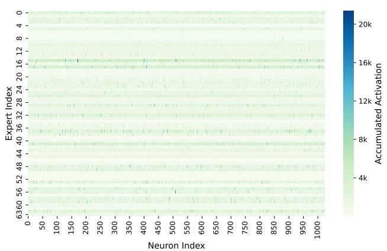
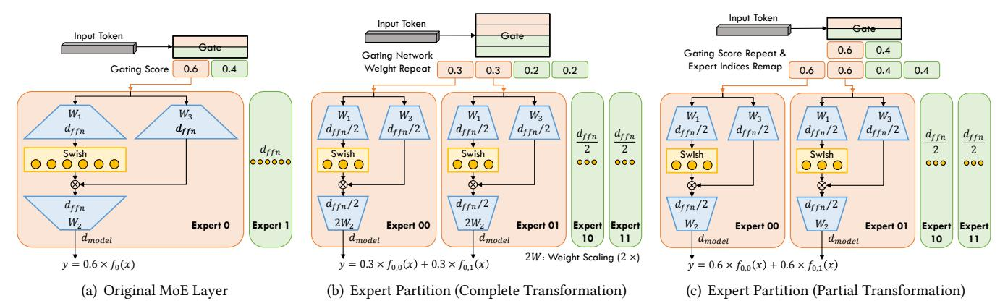
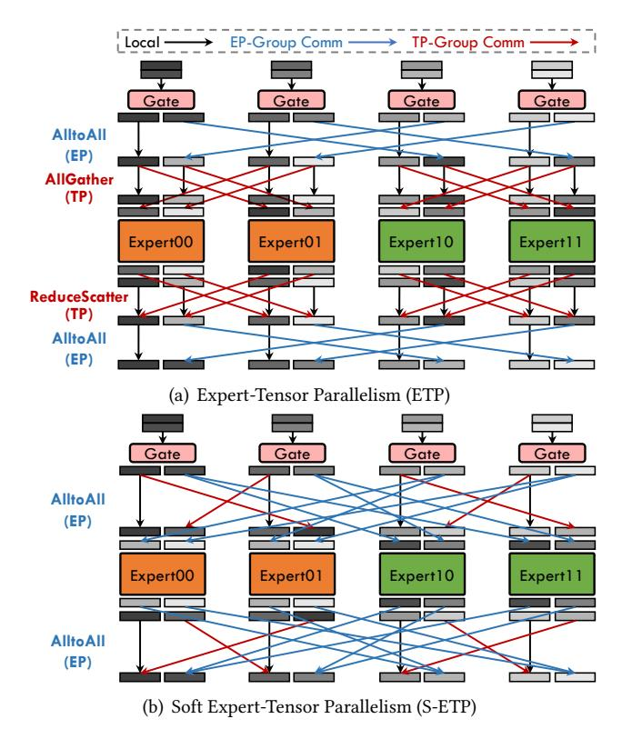
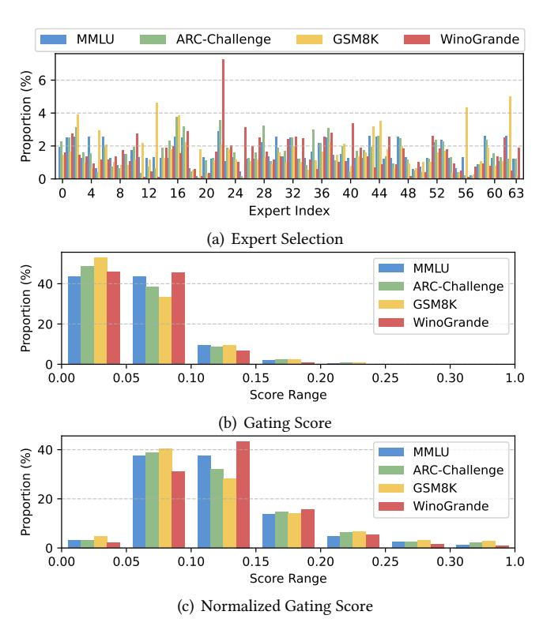
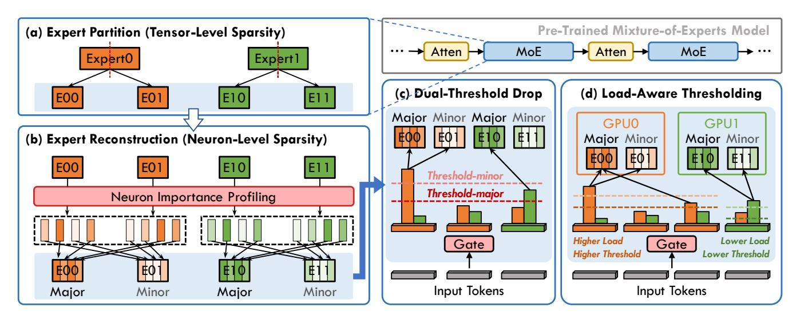

# 1 Introduction

Recently, the Mixture of Experts (MoE) architecture [\[12,](#page-11-0) [26,](#page-12-0) [39,](#page-12-1) [47\]](#page-13-0) has emerged as the mainstream design for Large Language Models (LLMs) [\[7,](#page-11-1) [21,](#page-12-2) [28,](#page-12-3) [35\]](#page-12-4), primarily due to

its superior trade-off between computational efficiency and model quality. This trade-off is achieved through the tensorlevel sparsity inherent in the MoE architecture, which can be viewed as partitioning a large Feed-Forward Network (FFN) into fine-grained sub-FFNs (termed experts) and selectively activates only a subset of these experts for processing each input token. By reducing computational workload compared to dense activation, existing hardware and systems can accommodate scaling model parameters to unprecedented sizes, thereby enabling higher levels of intelligence [\[29,](#page-12-5) [53,](#page-13-1) [54,](#page-13-2) [56\]](#page-13-3).

Building upon the inherent tensor-level sparsity of the MoE architecture, existing research has developed specialized methods to enhance the deployment of MoE models across various scenarios. For instance, Expert Parallelism (EP) and its systematic optimizations [\[6,](#page-11-2) [17,](#page-12-6) [29,](#page-12-5) [39,](#page-12-1) [49\]](#page-13-4) have been proposed to enable efficient distributed training and inference of MoE models; MoE compression techniques [\[8,](#page-11-3) [22,](#page-12-7) [23,](#page-12-8) [32\]](#page-12-9), motivated by observations of unbalanced expert selection, have been introduced to facilitate MoE model inference on edge devices. However, MoE models continue to present significant challenges for current machine learning systems, primarily due to their unprecedented model size and unpredictable sparse activation patterns.

To facilitate efficient post-training deployment of MoE models, we begin by analyzing the activation patterns within the MoE modules. As shown in Figure [1,](#page-1-0) we observe pronounced imbalance in activation at both the tensor and neuron levels. We refer to this pattern as dual sparsity, wherein the output of each FFN neuron is modulated by the product of its gating score and activation value. We further identify dual sparsity as a key factor affecting both the efficiency and accuracy of MoE models, evident in two aspects: (1) Tensor-level sparsity—prior studies [\[3,](#page-11-4) [12,](#page-11-0) [18,](#page-12-10) [33\]](#page-12-11) have shown that pre-training models with increased tensor-level sparsity through more granular expert design can improve model accuracy, but may also increase gate routing overhead and

1

∗Corresponding author.

lower compute intensity, leading to reduced GPU utilization; (2) Neuron-level sparsity—research on dense models has revealed a trade-off between accuracy and efficiency by omitting neurons with zero activation (as in ReLU) [27, 31] or negligible activation values (as in SwiGLU) [58].

The tensor-level sparsity configuration (expert granularity) established during pre-training may not be optimal for deployment. To address this, we propose expert partition methods (complete and partial transformations) to promote additional sparsity in the post-training phase. These methods preserve the mathematical consistency of model transformations while improving deployment efficiency. Specifically, complete transformation converts a pre-trained MoE model into one with finer-grained experts, thereby enhancing model quality during fine-tuning. In contrast, partial transformation targets efficiency improvements, notably by enabling our proposed Soft Expert-Tensor Parallelism (S-ETP), which provides benefits across diverse scenarios.

Moreover, we present DualSparse-MoE, an inference system that improves efficiency in a training-free manner while minimizing accuracy loss. DualSparse-MoE incorporates three key strategies: (1) Static expert partition and reconstruction, which divides neurons in each expert into major and minor sub-experts based on importance profiling from calibration samples; (2) Dynamic token-expert computation dropping, which selectively skips computations through dual thresholding of normalized gating scores, applying lower and upper thresholds to major and minor sub-experts, respectively; (3) Load-aware thresholding, which dynamically adjusts thresholds according to workload imbalance across devices, thereby reducing the drop rate and preserving accuracy while achieving the same speedup benefits in expert-parallel (EP) deployment.

In our experiments, we apply complete transformation to partition the Mixtral-8×7B model from 8 experts into 32 finer-grained experts, reducing fine-tuning loss and improving downstream accuracy by 0.59%. Moreover, partial transformation enables S-ETP, which improves EP communication efficiency in both real-world and simulated environments. DualSparse-MoE system demonstrates significant advantages: enforcing a approximate 25% drop rate reduces average benchmark accuracy by only 0.08%-0.28% across three MoE models. Notably, nearly all drop rates translate directly into proportional computation reduction and speedup, a result difficult to achieve with other sparsity-based acceleration techniques. With load-aware thresholding in EP, our method achieves a 1.41× MoE module speedup with only 0.5% average accuracy loss. Unlike previous selection-aware MoE compression methods designed for edge deployment, which often suffer from significant accuracy degradation and limited generalization, our approach is tailored for distributed server-side inference, where acceleration with minimal accuracy loss is essential.

In summary, our contributions are as follows:

**Figure 1.** Visualization of accumulated absolute activation values for each neuron across 64 SwiGLU FFN experts in a single MoE layer OLMoE [35] model during inference, highlighting tensor-level sparsity (y-axis) and neuron-level sparsity (x-axis) inherent to MoE architectures.

- We identify dual sparsity in MoE architectures at the tensor and neuron levels, and demonstrate their pivotal role in balancing accuracy and efficiency.
- We propose expert partition methods—complete and partial transformations—to induce tensor-level sparsity during the post-training phase, achieving both accuracy and efficiency.
- We design DualSparse-MoE, an inference system that integrates dynamic tensor-level computation dropping with static neuron-level reconstruction, improving efficiency with minimal accuracy loss.
- We conduct extensive experiments to demonstrate the effectiveness of our approach in enabling more efficient post-training deployment of MoE models.

#### 2 Background

#### 2.1 Sparsity in Mixture-of-Experts Architecture

By visualizing MoE activation patterns during inference with the pre-trained OLMoE model [35], as shown in Figure 1, we observe that the output of MoE module is governed by dual sparse at both the tensor and neuron levels. Specifically, color variations across rows (y-axis) reflect tensor-level sparsity, while color differences among points within each row (xaxis) capture neuron-level sparsity.

**2.1.1 Tensor-Level Sparsity.** MoE [14, 26, 47] is a neural network architecture that dynamically selects experts to process each token. An MoE layer comprises E expert networks alongside a gating network G. The gating network, typically a linear network with a softmax activation function, calculates a selection probability (gating score s) for each expert, defined as:

$$\mathbf{s} = G(\mathbf{x}) = \text{Softmax}(\mathbf{x} \cdot \mathbf{W}_a),\tag{1}$$

where  $\mathbf{W}_g \in \mathbb{R}^{d_{model} \times E}$  is the weight matrix of the linear gating network. Based on the gating scores, the Top-K gating

method is commonly used to route each input token to a subset of experts for computation, defined as:

$$g_e(\mathbf{x}) = \begin{cases} \mathbf{s}_i & \text{if } i \in \text{TopK}(\mathbf{s}, K), \\ 0 & \text{otherwise,} \end{cases}$$
 (2)

where  $g_e(\mathbf{x})$  denotes the gating score for expert e. Each input token is processed by the K experts with the highest gating scores, and the MoE output is a weighted sum of the outputs of the selected experts:

$$\mathbf{y} = \sum_{e=1}^{E} g_e(\mathbf{x}) \cdot f_e(\mathbf{x}), \tag{3}$$

where  $f_e(\mathbf{x})$  denotes the output of expert e. Using the prevalent SwiGLU [46] feed-forward network (FFN) expert as an example, the expert output  $f(\mathbf{x})$  is formulated as:

$$f(\mathbf{x}) = (\operatorname{Swish}(\mathbf{x} \cdot \mathbf{W}_1) \odot (\mathbf{x} \cdot \mathbf{W}_3)) \cdot \mathbf{W}_2, \tag{4}$$

where  $\mathbf{W}_1, \mathbf{W}_3 \in \mathbb{R}^{d_{model} \times d_{ffn}}$  and  $\mathbf{W}_2 \in \mathbb{R}^{d_{ffn} \times d_{model}}$  denote FFN weights, and the Swish activation function [42] is used. The three linear transformations associated with  $\mathbf{W}_1, \mathbf{W}_3, \mathbf{W}_2$  are commonly referred to as the gate, up, and down projections, respectively.

Recent studies [3, 12, 18, 33] have systematically demonstrated that configuring experts at finer granularity—while maintaining a fixed per-token computational budget—can substantially reduce pre-training loss. For instance, a MoE model with 32 experts of intermediate size 1024 and Top-8 selection outperforms a MoE model with 8 experts of intermediate size 4096 and Top-2 selection. However, further increasing the number of experts may reduce computational efficiency due to lower compute intensity and increased gating overhead. These findings highlight a key trade-off: finer tensor-level sparsity can improve accuracy, but overly fine granularity may hurt efficiency.

Importantly, existing approaches determine expert granularity only before pre-training, making it difficult to adapt pre-trained MoE models to finer-grained structure for higher tensor sparsity. To address this limitation, we propose expert partition methods that restructure experts during post-training. Our approach preserves mathematical consistency while improving both accuracy and efficiency in deployment.

2.1.2 Neuron-Level Sparsity. In addition to the tensor-level sparsity inherent to the MoE architectures, prior research has investigated computation dropping and parameter pruning upon weight sparsity [13, 15, 52] and activation sparsity [51, 60] in dense FFN. However, these approaches face several challenges: (1) LLMs exhibit low tolerance to high drop or prune rates, with significant accuracy degradation as these rates increase; (2) Highly fine-grained sparsity at low drop rates is difficult to translate to real speedups due to limited sparsity support in hardware and kernel designs; and (3) Most methods focus primarily on the ReLU activation function [4], which naturally produce zeros, and

**Figure 2.** An example of a state-of-the-art 5-D hybrid parallel strategy for MoE model deployment. For simplicity, the illustration omits that EP can be extended cross DP groups. Our contributions mainly focus on improving the MoE part.

therefore cannot be directly applied to modern LLMs employing SwiGLU activations [46]. In this work, we identify the activation sparsity present in MoE FFN experts as neuron-level sparsity and propose a framework that coordinates it with tensor-level sparsity. By jointly leveraging these two complementary forms of sparsity, we address the aforementioned challenges and improve both algorithmic accuracy and system efficiency.

#### 2.2 Hybrid Parallelism for MoE Model Deployment

Scaling the training and inference of MoE models across distributed devices requires an effective hybrid parallelism strategy. In this work, we adopt one of the state-of-the-art hybrid parallelism strategies [2], as illustrated in Figure 2, to demonstrate the deployment pattern. This approach integrates Data Parallelism (DP) [40, 41, 44], Pipeline Parallelism (PP) [20, 36], Expert Parallelism (EP) [14, 26, 49], Tensor Parallelism (TP) [37, 48, 50], and Context Parallelism (CP) [1, 24]. Recent studies further suggest decoupling attention and MoE modules to enable more efficient resource allocation [30, 61]. Although specific implementations differ—for instance, EP may be realized using either AlltoAll or AllGather—this 5-D parallelism strategy is broadly representative and offers a general reference for both training and inference.

Importantly, tensor-level sparsity directly influences the choice and configuration of parallel strategies. In MoE layers, the number of experts and their intermediate sizes primarily affect EP and TP, since these parallel strategies handle the distribution of computational and memory loads and rely on communication patterns such as "AlltoAll+AllGather" and "ReduceScatter+AlltoAll." Therefore, the parallel strategy must comprehensively balance FLOPs utilization, communication overhead, GPU memory capacity, and other relevant factors.

**Figure 3.** Illustration of expert partition methods, demonstrated by transforming a pre-trained 2-expert MoE model into a finer-grained 4-expert model. (a) Original MoE layer in the pre-trained model. (b) Complete transformation, which involves repeating the gating network weights, partitioning expert neurons, and scaling the down-projection weights  $\mathbf{W}_2$ . (c) Partial transformation, which involves partitioning expert neurons, repeating gating scores, and remapping expert indices.

#### 3 Expert Partition

We propose two expert partition methods: complete transformation, which restructures the model to increase tensor-level sparsity after pre-training, and partial transformation, which enables compute efficiency optimization.

#### 3.1 Complete Transformation

Complete transformation partitions each expert of a pretrained MoE model into P finer-grained experts (e.g. P=2, as shown in Figure 3(b)). This approach allows the transformed MoE model to integrate seamlessly with existing MoE frameworks, functioning identically to the original model. Specifically, the transformation involves three steps: (1) Repeat the gating network weights P times and adjust the Top-K selection to Top- $(K \times P)$ ; (2) Evenly partition the original experts' neurons into P finer-grained experts; (3) Scale the down-projection weight  $\mathbf{W}_2$  of each partitioned expert by a factor of P.

Next, we provide a formal derivation to demonstrate that this transformation ensures mathematical consistency. According to Equation (1) in Section 2.1, MoE module first employs  $\mathbf{W}_g = [h_1, h_2, \dots, h_E] \in \mathbb{R}^{d_{model} \times E}$  to compute the gating logits  $\mathbf{l}$ , where each  $h_i$  is a vector of dimension  $d_{model}$ . Given an input token  $\mathbf{x}_i$ , its gating logits are computed as:

$$\mathbf{l} = \mathbf{x}_i \cdot \mathbf{W}_a = [l_1, l_2, \dots, l_E]. \tag{5}$$

These gating logits are passed through a softmax function to obtain the gating scores  $\mathbf{s} = [s_1, s_2, \dots, s_E]$ , where the gating score  $s_e$  for the expert e is calculated as follows:

$$s_e = \frac{\exp(l_e)}{\sum_{i=1}^{E} \exp(l_i)}.$$
 (6)

In the complete transformation, each vector  $h_e$  in  $\mathbf{W}_g$  is repeated P times to construct the new gating weight matrix

 $\mathbf{W}_{a}^{P} \in \mathbb{R}^{d_{model} \times (E \times P)}$ , defined as:

$$\mathbf{W}_g = [h_{1,1}, h_{1,2}, \dots, h_{1,P}, h_{2,1}, h_{2,2}, \dots, h_{2,P}, \dots, h_{E,1}, h_{E,2}, \dots, h_{E,P}].$$
(7)

where  $h_{e,p}$  denotes the p-th copy of the e-th original expertspecific vector. Accordingly, the new gating logits  $\mathbf{l}^P$  for an input token  $\mathbf{x}_i$ , obtained via  $\mathbf{W}_a^P$ , can be expressed as:

$$\mathbf{l}^{P} = \mathbf{x}_{i} \cdot \mathbf{W}_{g}^{P} = [l_{1,1}, l_{1,2}, \dots, l_{1,P}, l_{2,1}, l_{2,2}, \dots, l_{2,P}, \dots, l_{E,1}, l_{E,2}, \dots, l_{E,P}],$$
(8)

where  $l_{e,1} = l_{e,2} = \dots = l_{e,P}$  due to the repeated vectors  $h_{e,1} = h_{e,2} = \dots = h_{e,P}$  in  $\mathbf{W}_g^P$ . Given the extended gating logits  $\mathbf{l}^P$ , the gating score for each finer-grained expert  $s_{e,p}$  is calculated as:

$$s_{e,p} = \frac{\exp(l_{e,p})}{\sum_{i=1}^{E} \sum_{l=1}^{P} \exp(l_{i,k})} = \frac{1}{P} \cdot \frac{\exp(l_{e})}{\sum_{i=1}^{E} \exp(l_{i})}.$$
 (9)

Since all P finer-grained experts partitioned from the same original expert share identical gating scores, they are activated together under the Top- $(K \times P)$  selection mechanism. Moreover, the sum of their outputs equals the original expert output, as shown below:

$$f_e(\mathbf{x}_i) = \sum_{p=1}^{P} f_{e,p}(\mathbf{x}_i), \tag{10}$$

which is analogous to the effect of tensor parallelism. Consequently, the output  $\mathbf{y}_i^P$  of the partitioned MoE module for an input token  $\mathbf{x}_i$  can be formulated as:

$$\mathbf{y}_{i}^{P} = \sum_{e=1}^{E} \sum_{p=1}^{P} \frac{1}{P} \cdot \frac{\exp(l_{e,p})}{\sum_{j=1}^{E} \sum_{k=1}^{P} \exp(l_{j,k})} \cdot f_{e,p}(\mathbf{x}_{i})$$

$$= \frac{1}{P} \sum_{e=1}^{E} \cdot \frac{\exp(l_{e})}{\sum_{j=1}^{E} \exp(l_{j})} \cdot \sum_{p=1}^{P} f_{e,p}(\mathbf{x}_{i}) = \frac{\mathbf{y}_{i}}{P}.$$
(11)

**Figure 4.** Fine-tuning loss curves for Mixtral-8×7B [21] models under different configurations, including the original model (activating top-2 out of 8 experts) and models completely transformed with partitioned experts (activating top-4 out of 16 experts and top-8 out of 32 experts).

This derivation shows that the complete transformation preserves the overall MoE output by a scaling factor of P.

To ensure that  $\mathbf{y}_i^P$  is equivalent to the original output  $\mathbf{y}_i$ , the result must be scaled by a factor of P. There are two ways to achieve this: (1) multiplying the gating scores by P, or (2) scaling the expert weight  $\mathbf{W}_2$  of the down-projection by P. To preserve the original model structure without modifying the existing framework, we choose to scale the expert weights for complete transformation. For example, in Figure 3(b), the down-projection weights  $\mathbf{W}_2$  of each partitioned expert is multiplied by 2, as P=2.

Model Quality Improvements During Fine-Tuning. As discussed in Section 2.1.1, prior work has demonstrated that increasing tensor-level sparsity during pre-trainingby configuring finer-grained experts-can enhance model quality. Our proposed expert partitioning method (complete transformation) effectively promotes such sparsity for pretrained MoE models, improving model performance during fine-tuning. As shown in Figure 4, models with partitioned experts exhibit significantly lower loss curves compared to the original Mixtral-8×7B [21] model; moreover, finergrained experts yield further loss reduction. However, increasing the number of partitions beyond a certain point offers only marginal improvements. Experimental results on the downstream tasks, presented in Table 1 and discussed in Section 5.2, further confirm the model quality gains attributable to our approach.

#### 3.2 Partial Transformation

Partial transformation offers an alternative approach for partitioning experts in pre-trained MoE models, as illustrated in Figure 3(c). In contrast to complete transformation, partial transformation preserves the original gating network and only modifies the results of the Top-K selection through two operations: (1) repeating the gating scores and (2) remapping the expert indices. Specifically, the original gating scores of the selected expert  $[s_1, s_2, \ldots, s_K]$  are repeated P times, resulting in  $[s_1, s_2, \ldots, s_K]^P$ . The corresponding expert indices

**Figure 5.** Communication patterns in (a) Expert-Tensor Parallelism and (b) Soft Expert-Tensor Parallelism.

 $I = [i_1, i_2, ..., i_K]$  are remapped as follows:

$$\mathbf{I}^{P} = [i_{1}P, i_{2}P, \dots, i_{K}P, i_{1}P+1, i_{2}P+1, \dots, i_{K}P+1, \dots, i_{1}P+P-1, i_{2}P+P-1, \dots, i_{K}P+P-1],$$
(12)

where each original expert is partitioned and placed contiguously, maintaining its relative position. Each expert is evenly split into P finer-grained experts without scaling the down-projection weight. This is because the product of the partitioned experts' outputs and the repeated gating scores reproduces the original MoE outputs, formulated as follows:

$$\mathbf{y}_{i}^{P} = \sum_{e=1}^{E} \cdot \frac{\exp(l_{e})}{\sum_{j=1}^{E} \exp(l_{j})} \cdot \sum_{p=1}^{P} f_{e,p}(\mathbf{x}_{i}) = \mathbf{y}_{i}.$$
 (13)

While partial transformation requires additional modifications to the existing MoE framework, it reduces computational overhead compared to the extended gating network required by complete transformation, despite the gating network constituting only a minor portion of the overall MoE layer's cost. Moreover, partial transformation maintains the original gating network parameters, enabling mathematically consistent reverse transformation and focusing solely on system efficiency. Consequently, we apply partial transformation to the Soft Expert-Tensor Parallelism introduced in Section 3.3, as well as to the DualSparse-MoE inference system described in Section 4.2.

#### 3.3 Soft Expert-Tensor Parallelism (S-ETP)

As discussed in Section 2.2, EP and TP are employed to scale MoE deployment across distributed devices. In this context, applying TP to partition expert weights within EP is commonly referred to as Expert-Tensor Parallelism (ETP) [30, 49].

In contrast, we propose Soft Expert-Tensor Parallelism (S-ETP), which enables tensor-level partitioning of expert weight through an algorithmic approach rather than relying solely on system-level implementation. Specifically, S-ETP integrates expert partition (partial transformation) with EP to achieve the same functionality as ETP.

S-ETP offers the following advantages: (1) Reduced Framework Complexity. ETP often requires additional control mechanisms and framework modifications. In contrast, S-ETP addresses these challenges from an algorithmic rather than a system perspective, requiring only EP implementations, and thereby simplifying system optimization efforts. (2) Optimized Communication Patterns. S-ETP uses only the AlltoAll operation (Figure 5(b)) to achieve the same effects as the "AlltoAll+AllGather" and "ReduceScatter+AlltoAll" patterns used in ETP (Figure 5(a)). This approach reduces kernel launches and synchronization overhead, improving interconnect link utilization in both training and inference.

In addition to optimizing scenarios that traditionally require ETP, our expert partition approach also benefits cases that require scaling up EP. Specifically, our method enables the deployment of a larger number of experts, thereby involving more EP devices and enhancing scalability. Furthermore, the aforementioned advantages are also applicable to models restructured using complete expert transformation.

#### 4 DualSparse-MoE Inference System

Given the correlation between tensor-level sparsity and the superior accuracy-efficiency trade-off offered by MoE architectures, we analyze the behavior of the gating mechanism—arguably the most critical component of MoE—to identify exploitable features for inference acceleration.

Previous studies have observed imbalances in expert activation and have attempted to reduce computational cost or compress model size by skipping or pruning rarely activated experts [8, 22, 23, 32]. However, this approach often results in significant accuracy degradation and poor generalization across tasks, primarily due to the loss of dynamic tensor-level sparsity. As shown in Figure 6(a), expert activation patterns are highly dynamic across different benchmarks and input samples. We argue that diminishing the dynamic nature of tensor-level sparsity can harm model quality.

In contrast, our investigation reveals a relatively stable phenomenon within the gating mechanism: the distribution of gating scores for activated token-expert pairs. Figure 6(b) shows that across four tasks, the distribution of gating scores is remarkably similar, with most scores falling within the

**Figure 6.** Distributions of (a) expert selection, (b) gating scores, and (c) normalized gating scores observed during OL-MoE model inference across four distinct benchmark tasks.

**Figure 7.** Benchmark accuracy and token-expert computation drop rate for OLMoE model inference using different threshold values of 1T-Drop. "Stars" indicate the threshold that achieves the maximum accuracy for each benchmark.

ranges of 0-0.05 and 0.05-0.1, and progressively fewer scores in higher ranges. Further normalization of the gating scores, as illustrated in Figure 6(c), produces a flatter distribution while preserving the consistent pattern across various tasks.

Building on this insight, we propose the DualSparse-MoE inference system, which selectively drops token-expert computations to enhance efficiency while minimizing accuracy loss. By exploiting the consistent characteristics of gating

**Figure 8.** Overview of the proposed dual-threshold token-expert computation dropping approach (2T-Drop) and its enhancement through load-aware thresholding under EP, in the context of deploying pre-trained MoE models for inference.

score distributions, our approach maintains generalizability and robust performance across a wide range of cases.

