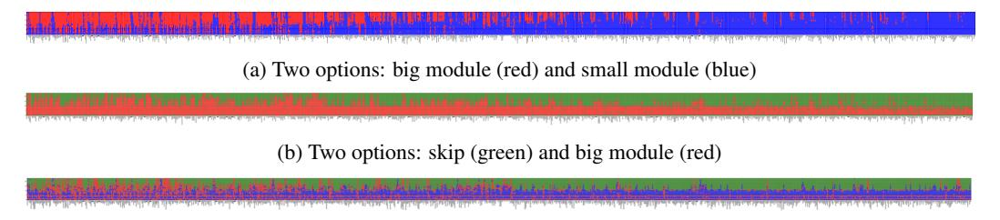

# A Learned Router in OPT Model

We conducted an additional study by training Duo-LLMs on the OPT 1.3B model with the same setup as described in the main paper, and trained a router on top of it. Figure [9](#page-12-8) illustrates the routing patterns across various budgets and settings. The key observations from these three setups are as follows:

- Early layers tend to use the small module, allowing later layers to benefit from additional compute.
- Early tokens often utilize the big modules, while later tokens, having sufficient context built up, require less compute for decoding.
- When skipping is an option, early layers and tokens tend to avoid skipping too much, whereas later layers and tokens tend to skip more, as sufficient compute has already been spent earlier in the sequence or model.

(c) Three options: big module (red), small module (blue), skip (green)

Figure 9: Learned routing of Duo-LLM with varying budget and options (a) when 70% small and 30% big modules is used. (b) when 50% small and 50% skip is used. (c) when 30% big, 20% skip, and 50% small is used.