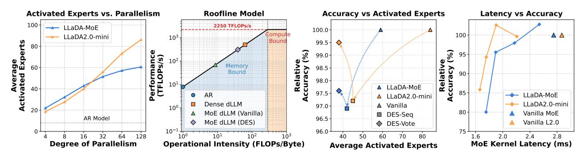

# 1. Introduction

Recent advances in large-scale foundation models have seen the emergence of native parallel decoding paradigms, most

*Preprint. February 3, 2026.*

notably diffusion large language models (dLLMs) [\(Zhu](#page-9-0) [et al.,](#page-9-0) [2025;](#page-9-0) [Ye et al.,](#page-9-1) [2025\)](#page-9-1). The state-of-the-art dLLMs typically leverage block-based parallel decoding [\(Arriola](#page-8-0) [et al.,](#page-8-0) [2025;](#page-8-0) [Wu et al.,](#page-9-2) [2025\)](#page-9-2) to achieve performance parity with traditional autoregressive (AR) models through concurrent token generation. To scale these architectures effectively, dLLMs increasingly integrate Mixture-of-Experts (MoE) [\(Guo et al.,](#page-8-1) [2025;](#page-8-1) [Yang et al.,](#page-9-3) [2025;](#page-9-3) [Agarwal et al.,](#page-8-2) [2025\)](#page-8-2) as a core architectural component [\(Bie et al.,](#page-8-3) [2025;](#page-8-3) [Zhu et al.,](#page-9-0) [2025;](#page-9-0) [Cheng et al.,](#page-8-4) [2025\)](#page-8-4). The primary advantage of MoE lies in its ability to decouple the model's overall knowledge capacity from its per-token computational cost. By activating only a sparse subset of experts for each input, MoE allows dLLMs to scale to massive parameter counts, significantly enhancing representational power without a proportional increase in FLOPs.

The integration of MoE into dLLMs, however, introduces an efficiency paradox, illustrated by our roofline analysis (Figure [1\)](#page-1-0). In particular, while transitioning from AR to parallel dLLM increases operational intensity, the sparse activation of MoE dLLMs makes them more memory-bound than their dense counterparts. In these memory-bound scenarios—typical of multi-GPU and CPU-offloading environments [\(Cao et al.,](#page-8-5) [2025;](#page-8-5) [Yu et al.,](#page-9-4) [2025\)](#page-9-4)—latency is dominated by the traffic from High Bandwidth Memory (HBM) to Static RAM (SRAM) required to load unique expert weights. This bottleneck is intensified by an "expert explosion" inherent to parallel generation: whereas AR decoding processes a single token per step, dLLMs process N tokens simultaneously. Consequently, if experts are selected independently, the unique expert load scales nearly linearly with the block size N, rapidly exceeding the steady-state memory traffic of AR decoding (Figure [1\)](#page-1-0). Crucially, as the parallel block scales, the overhead of transferring divergent experts from HBM to on-chip memory can negate the compute savings of MoE, potentially rendering these models slower than their smaller dense equivalents. This memory traffic overhead imposes a systemic ceiling on the throughput gains promised by parallelization.

Existing dynamic efficiency optimizations for MoE, such as expert skipping [\(Lu et al.,](#page-9-5) [2024;](#page-9-5) [Huang et al.,](#page-8-6) [2025a;](#page-8-6)

1 Imperial College London, London, UK 2 Samsung AI Center, Cambridge, UK. Correspondence to: Hao (Mark) Chen <hc1620@ic.ac.uk>.

Figure 1. From left to right: (a) Growth of unique activated experts relative to the degree of parallelism (input block size). (b) Roofline model demonstrating that MoE dLLMs are more memory-bound than their dense counterparts and how DES mitigates this bottleneck. (c) Trade-off between activated experts and relative accuracy, where DES-Vote notably extends the Pareto frontier. (d) MoE kernel latency versus relative accuracy. For (c) and (d), accuracy is reported relative to the vanilla baseline. Results in (c) are averaged across benchmarks, namely HumanEval, MBPP, MATH500, and GSM8K, while (d) evaluates DES-Vote's performance on MBPP. The average activated experts is defined as the mean number of active experts across all MoE layers in the respective model.

Aghdam et al., 2024), are primarily designed for AR models and remain strictly token-centric. While effective at reducing per-token computational FLOPs, these methods prioritize local sparsity rather than cross-token expert redundancy. Consequently, they fail to mitigate the global HBM traffic bottleneck, as the unique expert weights loaded per layer are not optimized at the sequence level. Crucially, these approaches do not directly address the memory traffic overhead encountered in block-wise parallel decoding, where the collective expert footprint, rather than per-token compute, becomes the primary constraint on throughput.

To address these challenges, we propose **Dynamic Expert Sharing (DES)**, a novel method designed to minimize the expert footprint by forming consensus across parallel tokens. Our approach shifts the optimization objective from pertoken pruning to sequence-level sharing. We hypothesize that, unlike standard AR batching where independent tokens may activate disparate experts, *parallel decoding in dLLMs inherently involves semantically coupled tokens that exhibit significant overlap in expert demand*. To exploit this, we introduce **coreset selection**, where a minimal, high-utility set of experts is dynamically identified at runtime to serve the entire parallel block. We explore two specific strategies:

- Intra-Sequence Sharing (DES-Seq): We take the union of experts chosen independently by each token in the block. This allows for vectorized execution, eliminating the need to handle divergent expert assignments for individual positions.
- Saliency-Aware Voting (DES-Vote): A novel mechanism where tokens collectively vote for experts based on their weighted router saliency. This prioritizes the most critical experts by focusing on the holistic semantic complexity of the sequence.

By restricting the expert selection to a shared coreset, we significantly reduce the HBM-to-SRAM traffic, effectively

mitigating the memory traffic overhead of parallel MoE decoding without compromising generative quality. As shown in Figure 1, DES reduces the active experts by up to 55% and the MoE kernel latency by up to 38.0% while achieving performance comparable to the vanilla baseline.

Our contributions are summarized as follows:

- 1. We identify and quantify the "expert explosion" bottleneck in parallel MoE decoding, demonstrating how independent expert selection across parallel tokens induces a critical memory traffic overhead (Section 3).
- 2. We propose **Dynamic Expert Sharing**, a method that shifts MoE optimization from token-centric pruning to sequence-level coreset selection, leveraging a novel saliency-aware voting mechanism to maximize expert reuse (Section 4).
- 3. Through extensive benchmarking on MoE dLLMs, we demonstrate that DES achieves significant memory saving and speedup with negligible accuracy drop, effectively decoupling memory traffic from the degree of parallelism (Section 5).

