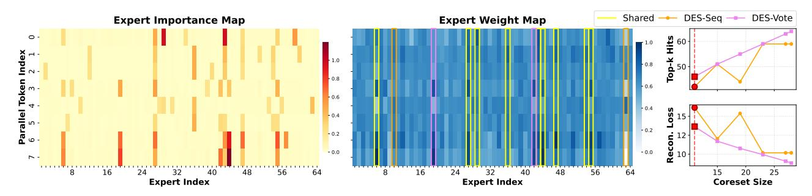

# 3. Motivation

The primary motivation for parallel decoding in dLLMs is to overcome the sequential bottleneck of AR generation, which is notoriously memory-bound due to the low arithmetic intensity of processing a single token per forward pass. While dLLMs scale concurrent tokens to increase arithmetic intensity, the integration of MoE reintroduces the memorybound bottleneck (Figure 1). This is exacerbated by both algorithmic constraints, where smaller parallel blocks (e.g., 16/32 tokens) are necessary to maintain competitive accuracy (Arriola et al., 2025), and hardware trends, where the FLOPs/byte ratio of modern GPUs continues to outpace memory bandwidth (Ma & Patterson, 2026). Consequently, MoE dLLM inference is still usually memory-bound, with latency dominated by the cost of loading unique expert weights, analogous to AR decoding's bandwidth bottleneck but at a larger scale of expert demand (Yu et al., 2025).

Within this regime, the MoE FFN layer emerges as the dominant latency contributor (Figure 2). Following the simplified latency model from previous work (Oncescu et al., 2025), the time f(c) to process c tokens through a single expert is f(c) = ac + b for c > 0, where b represents the weight fetching cost from HBM to on-chip SRAM and a is the marginal computation cost. The total MoE block latency for a sequence of N parallel tokens is thus:

$$L_{MoE} = \sum_{i=1}^{N_{total}} (b \cdot \mathbb{1}_{cnt_i > 0} + a \cdot cnt_i) = b \cdot \left| \bigcup_{n=1}^{N} S_n \right| + a \cdot (N \cdot K)$$
(2)

Figure 3. Overview of the Dynamic Expert Sharing method. (a) Vanilla MoE dLLM independently routes multiple tokens, leading to a high count of unique activated experts. (b) Dynamic Expert Skipping reduces local per-token computation (indicated by dotted lines) but often fails to optimize the global unique expert load. (c) Dynamic Expert Sharing employs sequence-level coreset selection (via DES-Seq or DES-Vote) to identify high-utility experts globally, significantly minimizing the unique expert weights transferred from HBM. (d) DES-Vote enforces sequence-level consensus by aggregating router weights across the parallel block, contrasting with the independent per-token selection utilized in DES-Seq. Greyed out boxes and bars represent experts not selected and not fetched to on-chip memory.

where  $cnt_i$  is the number of tokens routed to expert  $E_i$ , and  $S_n$  is the set of K experts activated by the n-th parallel token. In MoE architectures with uniform routing, the expected number of unique activated experts  $|\bigcup_{n=1}^N S_n|$  grows as  $N_{total}(1-(1-K/N_{total})^N)$ . As the degree of parallelism N increases, this union set expands rapidly (Figure 1), leading to an increase in latency (Figure 2).

This "expert explosion" underscores the limitations of existing expert skipping methods in parallel decoding:

- 1. Diminishing Returns from Compute Sparsity: As latency is dominated by the weight-fetching cost  $b \cdot |\bigcup_{n=1}^{N} S_n|$ , reducing the compute term a yields minimal speedup if an expert remains active for any other concurrent token. This motivates "re-activating" experts within a shared coreset to recover accuracy at near-zero marginal latency (Section 5).
- 2. Lack of Cross-Token Synergy: Token-centric skipping ignores the redundancy inherent in parallel decoding. Failing to enforce a collective consensus, they do not minimize the unique expert load  $|\bigcup_{n=1}^N \mathcal{S}_n|$ , leaving the memory bottleneck unresolved.

Optimizing parallel MoE inference thus requires a shift toward *Dynamic Expert Sharing*, which explicitly minimizes the unique expert load  $|\bigcup_{n=1}^{N} S_n|$  at the sequence level.

### 4. Methodology

#### 4.1. Dynamic Expert Sharing

To optimize the memory-bound bottleneck identified in Section 3, we define a **Coreset Selection Function**,  $\Phi: \mathcal{I} \to \mathcal{C}$ , which maps available runtime information  $\mathcal{I}$  (e.g., aggregated router logits or hidden states) to a shared subset of experts  $\mathcal{C} \subset \{E_1, \dots, E_M\}$ . The coreset selection function identifies the most salient experts for a parallel decoding block. Unlike traditional AR batching, where tokens often

belong to disparate tasks, parallel decoding tokens share a common context. We hypothesize that rather than allowing independent routing, we can identify a compact, sequence-level coreset via cross-token consensus. By restricting each token's Top-k selection to this shared subset, we maximize expert reuse and minimize HBM transfer.

By substituting this coreset into our latency model, we reformulate the MoE layer latency from Equation 2. In the vanilla setting, the unique expert load is defined by the union of independent selections  $|\bigcup_{n=1}^{N} \mathcal{S}_n|$ , which is implicitly upper-bounded by the total expert pool size M. With the introduction of the coreset, the latency is expressed as:

$$L_{\text{MoE}}(\Phi) \le b \cdot |\Phi(\mathcal{I})| + a \cdot (N \cdot k) \tag{3}$$

where  $|\Phi(\mathcal{I})|$  is the cardinality of the selected coreset. Crucially, whereas the vanilla expert load is constrained by a constant, this formulation transforms the upper bound into an explicit variable  $|\Phi(\mathcal{I})|$  that guides the optimization process. We therefore define the search for an optimal coreset selection strategy as a constrained optimization problem:

$$\begin{split} \Phi^* &= \arg\min_{\Phi} \quad |\Phi(\mathcal{I})| \\ \text{s.t.} \quad \mathcal{A}(\Phi(\mathcal{I})) &\geq \mathcal{A}_{base} - \epsilon \end{split} \tag{4}$$

where  $\mathcal{A}(\Phi)$  denotes model accuracy and  $\epsilon$  is a predefined threshold for tolerable performance degradation. By shifting from independent, token-centric routing to collective coreset selection, we decouple the HBM weight-fetching cost from the number of parallel tokens N.

The DES algorithm implements this by transitioning from token-level to sequence-level routing. As detailed in Algorithm 1, the process consists of two stages: (1) **Sequence-level Consensus**, where the shared coreset  $\mathcal{C}$  is identified, and (2) **Constrained Local Routing**, where each token selects its Top-k experts exclusively from  $\mathcal{C}$ . By re-normalizing weights via an activation function  $\sigma$  from the model architecture, we preserve the original routing in-

## Algorithm 1 Dynamic Expert Sharing (DES)

**Require:** Sequence information  $\mathcal{I}$ , Coreset selection function  $\Phi$ , Activation function  $\sigma$ , Target K.

**Ensure:** Layer output Y.

1: // Stage 1: Sequence-level Consensus

2:  $\mathcal{C} \leftarrow \Phi(\mathcal{I})$  {Identify high-utility expert coreset}

3: // Stage 2: Constrained Local Routing

4: **for** each token  $n \in \{1, \dots, N\}$  **do** 

 $S_n \leftarrow \text{TopK}(\mathcal{I}_n|_{i \in \mathcal{C}}, K) \text{ {Route within coreset}}$ 

 $g_n \leftarrow \sigma(\mathcal{I}_n|_{i \in \mathcal{S}_n})$  {Re-normalize gate weights}

 $y_n \leftarrow \sum_{i \in \mathcal{S}_n} g_{n,i} \cdot E_i(x_n)$ 

9: **return**  $Y = \{y_1, \dots, y_N\}$ 

tent within the optimized memory budget. The algorithm overview is shown in Figure 3.

#### 4.2. Coreset Selection Methods

While the optimization problem in Equation 4 is difficult to solve directly, we approximate the solution by proposing two strategies for dynamic coreset selection: Intra-Sequence Sharing (DES-Seq) and Saliency-Aware Voting (**DES-Vote**). These methods serve as the function  $\Phi(\mathcal{I})$  in Algorithm 1 to identify a sequence-wide consensus.

Intra-Sequence Sharing (DES-Seq). A straightforward approach to form a smaller coreset is to select a fixed number of the most salient experts from each token. While previously explored for batch-level optimization in AR models (Oncescu et al., 2025), we adapt this to the intrasequence level for dLLM parallel decoding. For each token n in the block, we select its top-k experts, where k is a hyperparameter satisfying k < K. The coreset C is the union of these local selections:

$$C_{\text{DES-Seq}} = \bigcup_{n=1}^{N} \text{TopK}(\mathcal{I}_n, k)$$
 (5)

The exact selection algorithm is shown in Algorithm 2.

Saliency-Aware Voting (DES-Vote). Despite its simplicity, DES-Seq has two primary limitations. First, it does not explicitly maximize expert sharing; it merely reduces local budgets without seeking a global consensus. Second, it utilizes a fixed selection threshold k for all tokens, ignoring that expert importance varies significantly across a sequence (e.g., the 2nd-ranked expert for token A might be more critical than the 2nd-ranked expert for token B).

To address these, we propose Saliency-Aware Voting (DES-**Vote**). To maximize consensus, we let tokens vote for a collective set. A naive approach is uniform voting for each token's top-k experts. However, as seen in the **Expert Im-**

## Algorithm 2 DES-Seq: Intra-Sequence Sharing

**Require:** Router logits  $\mathcal{I}$ , Threshold k.

1:  $\mathcal{C} \leftarrow \emptyset$ 

2: **for** n = 1 to N **do** 

 $\mathcal{C} \leftarrow \mathcal{C} \cup \text{TopK}(\mathcal{I}_n, k)$ 

4: end for

5: return C

#### **Algorithm 3** DES-Vote: Saliency-Aware Voting

**Require:** Router logits  $\mathcal{I}$ , Coreset size  $M_{\text{core}}$ , Top-K.

1:  $\mathcal{I}_m \leftarrow \text{Mask}(\mathcal{I}, K)$  {Keep only local top-K weights}

2:  $V \leftarrow \sum_{n=1}^{N} \mathcal{I}_{m,n}$  {Aggregate weighted votes} 3:  $\mathcal{C} \leftarrow \text{TopK}(V, M_{\text{core}})$  {Choose top collective saliency}

4: return C

portance Map and Expert Weight Map (Figure 4), there is a high correlation between raw gating weights and actual importance. We hypothesize that assigning vote weights based on router scores is more effective, as it accounts for varying influences within the top-k selection.

In practice, we aggregate the router weights across the sequence, but crucially mask out weights of experts falling outside each token's local top-k selection to filter noise. This addresses DES-Seq's second limitation by allowing the collective importance to naturally dictate which experts are retained. The coreset C is formed by selecting the top  $M_{\text{core}}$ experts by total vote:

$$V_i = \sum_{n=1}^{N} \operatorname{Masked}(\mathcal{I}_{n,i}), \quad \mathcal{C}_{\operatorname{DES-Vote}} = \operatorname{TopK}(V, M_{\operatorname{core}})$$
 (6)

As shown in Figure 4, DES-Vote outperforms DES-Seq in both top-K hit rate (preserving more ground truth selections) and reconstruction loss across varying coreset sizes.

#### 4.3. Custom Kernel for Coreset Selection

To mitigate the system overhead of fragmented operator execution, we develop a custom fused GPU kernel that collapses 12 kernels (e.g., softmax, top-k, and reduction) into just two. This design addresses the kernel launch and memory traffic bottlenecks, especially significant on high-throughput architectures like the NVIDIA B200. The primary kernel fuses per-token softmax and top-k filtering with weighted expert accumulation, utilizing register-level computation and atomic instructions to update global saliency scores efficiently. A second kernel then performs final expert masking based on a threshold-governed ranking.

Figure 4. Analysis of Dynamic Expert Sharing (DES) in LLaDA-MoE-7B (8 tokens, Layer 10). (Left) Expert Importance: Heatmap of reconstruction loss sensitivity to expert ablation. Darker regions indicate an increase in reconstruction loss when an expert is removed, revealing strong dependencies between specific token positions and experts. (Middle) Selection Overlays: DES-Seq (orange), DES-Vote (pink), and shared (yellow) selections overlaid on log-routing weights. DES-Vote captures high-importance experts (see index 42) that local ranking misses. (Right) Performance vs. Coreset Size ( $M_{\text{core}}$ ): DES-Vote achieves higher Top-k recall (top) and lower residual reconstruction loss (bottom) than DES-Seq across  $M_{\text{core}}$ . Red dashed lines denote the specific  $M_{\text{core}}$  visualized in the heatmaps.

