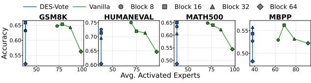

# 5. Experiments

## 5.1. Experimental Setup

**Implementations.** We evaluate two frontier MoE dLLMs optimized for parallel decoding: the 16B LLaDA2.0-minipreview (Bie et al., 2025) and 7B LLaDA-MoE-7B-A1B-**Instruct** (Zhu et al., 2025). Our experiments utilize the dInfer framework (Ma et al., 2025) with Fast-dLLM (Wu et al., 2025) as the KV cache method, adopting a 0.9 confidencebased sampling threshold and default hyperparameter configurations. All experiments were conducted on NVIDIA B200 GPUs (NVIDIA Corporation, 2025) with CUDA 13.1, paired with an Intel Xeon 6960P CPU. Kernel execution time was profiled using the NVIDIA Nsight Systems toolkit (NVIDIA Corporation, 2026). For DES, we parameterize DES-Vote using a budget factor  $\beta$  such that the coreset size  $M_{\text{core}} = \beta \times M$  (where M is the total expert pool size), while DES-Seq is controlled by the local selection count k. We vary  $\beta$  and k to adjust the coreset size, allowing us to study the behavior of our method under different expert sharing budgets.

**Datasets.** The algorithm performance is assessed across four benchmarks requiring long-form generative decoding and diverse reasoning: HumanEval (Chen et al., 2021), MBPP (Austin et al., 2021), GSM8K (Cobbe et al., 2021), and MATH500 (Lightman et al., 2023).

**Baselines.** As existing expert skipping baselines were primarily designed for AR models, we re-implement them for parallel dLLM decoding. Specifically, we adapt **NAEE** (Lu et al., 2024) by skipping the bottom experts i through K if their cumulative probability  $\sum_{u=i}^{K} \pi_{top-u}$  falls below a relative threshold  $\beta$  of the total routing sum. We calibrate  $\beta$  using the frontier search approach from Huang et al. (2025b). Additionally, we also compare with **MC-MoE** (Huang et al., 2025a), which preserves the experts of the important tokens.

Notably, we adopt only the dynamic expert skipping components of these baselines, ensuring a fair comparison solely focused on isolated dynamic expert allocation strategies. Finally, we compare against a **Top-**K baseline, which reduces expert traffic by directly decreasing the K value in expert selection.

#### 5.2. Main Results

As shown in Table 1, existing expert skipping methods such as NAEE and MC-MoE suffer from severe degradation for dLLMs, retaining only ~46% accuracy on LLaDA2.0-Mini. This failure stems from the suboptimality of applying static skipping thresholds across parallel tokens with diverse gating distributions as shown in Figure 4, which often leads to over-sparsification. In contrast, DES improves performance by exploring dynamic sequence-level expert sharing. On LLaDA2.0-Mini, DES-Vote maintains a 99.5% relative accuracy compared to vanilla while reducing the unique expert load by 55%, demonstrating an effective approximation of the optimization objective in Equation 4. Notably, incorporating local saliency (MC-MoE) yields negligible improvements over NAEE, suggesting that token-centric metrics are insufficient to address the collective redundancy inherent in parallel decoding. Finally, DES-Vote outperforms DES-Seq by achieving higher average accuracy with a smaller expert footprint. The relative accuracy of DES-Vote surpasses that of DES-Seq from 0.6% to 2.3%, consistently with lower active experts. These results validate that collective voting of DES-Vote effectively identifies a high-utility coreset that captures expert saliency across the entire parallel sequence in most cases.

#### 5.3. Efficiency Analysis

We evaluate the hardware efficiency of DES on a single NVIDIA B200 GPU. As shown in Figure 5, DES-Vote reduces MoE layer latency by up to 38.0% for LLaDA2.0-

Table 1. Main results on generative benchmarks for LLaDA2.0-Mini and LLaDA-MoE-7B.  $\mathcal{T}$  denotes the average number of unique activated experts per layer. We report the accuracy relative to the **Vanilla** model (R.Acc). *Mem.* represents the average memory footprint of unique activated parameters for the MoE component of a single layer. All experiments use a block length of 32 with 16 prefix and 16 suffix cache tokens. The best results are **bolded**, and the superior performer in adjacent DES-Seq vs. DES-Vote pairs is <u>underlined</u>.

| Method                                                                                                       | $ \tau $  | MBPP R. Acc. | $\mathcal{T}^{\mathbf{G}}$ | SM8K R. Acc.     | Hui T  | manEval R. Acc. | $\mathcal{T}$ | ATH500 R. Acc. | $\boxed{\text{Avg. } \mathcal{T}}$ | Mem. GB         | Avg. R. Acc        |
|--------------------------------------------------------------------------------------------------------------|-----------|-----------------|----------------------------|---------------------|-----------|--------------------|---------------|-------------------|------------------------------------|--------------------|--------------------|
| LLaDA2.0-Mini 16B                                                                                            |           |                 |                            |                     |           |                    |               |                   |                                    |                    |                    |
| Vanilla                                                                                                      | 78        | 100.0           | 87                         | 100.0               | 84        | 100.0              | 85            | 100.0             | 84                                 | 0.98               | 100.0              |
| top-k $(k = 4)$                                                                                              | 52        | 70.5            | 58                         | 53.8                | 56        | 91.4               | 58            | 83.6              | 56                                 | 0.66               | 74.8               |
| NAEE $(\beta = 0.6)$                                                                                         | 60        | 44.0            | 67                         | 61.6                | 67        | 20.5               | 66            | 60.5              | 65                                 | 0.76               | 46.6               |
| MC-MOE $(\beta = 0.6)$                                                                                       | 61        | 45.9            | 67                         | 60.2                | 68        | 18.0               | 67            | 62.7              | 66                                 | 0.77               | 46.7               |
| DES-Seq $(k = 3)$                                                                                            | 41        | 100.4           | 46                         | 99.7                | 45        | 92.4               | 46            | 96.5              | 45                                 | 0.53               | 97.2               |
| DES-Vote $(\beta = 0.15)$                                                                                    | <u>38</u> | <b>104.7</b>    | <u>38</u>                  | 98.4                | <u>38</u> | <u>97.5</u>        | <u>38</u>     | <b>97.4</b>       | 38                                 | <u>0.45</u>        | <b>99.5</b>        |
| DES-Seq $(k = 2)$                                                                                            | 31        | 95.1            | 35                         | 93.9                | 34        | 100.0              | 35            | 93.6              | 34                                 | 0.40               | 95.7               |
| DES-Vote $(\beta = 0.10)$                                                                                    | <u>25</u> | <u>96.4</u>     | <b>25</b>                  | <u>95.0</u>         | <u>25</u> | 97.5               | <b>25</b>     | <u>96.5</u>       | 25                                 | 0.29               | <u>96.4</u>        |
| LLaDA-MoE 7B                                                                                                 |           |                 |                            |                     |           |                    |               |                   |                                    |                    |                    |
| Vanilla                                                                                                      | 59        | 100.0           | 59                         | 100.0               | 59        | 100.0              | 59            | 100.0             | 59                                 | 0.35               | 100.0              |
| $\begin{array}{c} \text{top-k } (k=4) \\ \text{NAEE } (\beta=0.6) \\ \text{MC-MOE } (\beta=0.6) \end{array}$ | 46        | 85.6            | 48                         | 80.6                | 48        | 79.4               | 48            | 78.9              | 48                                 | 0.28               | 81.1               |
|                                                                                                              | 50        | 96.6            | 50                         | 96.6                | 51        | 99.0               | 50            | 93.5              | 50                                 | 0.29               | 96.4               |
|                                                                                                              | 52        | 84.8            | 53                         | 93.5                | 54        | 79.4               | 53            | 68.2              | 53                                 | 0.31               | 81.5               |
| DES-Seq $(k = 3)$                                                                                            | 41        | <b>98.7</b>     | 42                         | 99.1                | 42        | 96.1               | 42            | 93.9              | 42                                 | 0.25               | 96.9               |
| DES-Vote $(\beta = 0.6)$                                                                                     | <u>38</u> | 97.9            | <u>38</u>                  | <u><b>100.1</b></u> | <u>38</u> | 95.0               | <u>38</u>     | <b>97.3</b>       | 38                                 | <u>0.22</u>        | <u><b>97.6</b></u> |
| DES-Seq $(k = 2)$                                                                                            | 33        | 98.5            | 34                         | 98.8                | 34        | 96.1               | 34            | 88.1              | 34                                 | 0.20               | 95.4               |
| DES-Vote $(\beta = 0.4)$                                                                                     | 25        | 95.6            | 25                         | 98.0                | <u>25</u> | <b>101.0</b>       | <u>25</u>     | <u>89.3</u>       | 25                                 | <u><b>0.15</b></u> | <u>96.0</u>        |

Figure 5. Latency measurements for MoE kernel (left) and total end-to-end GPU kernel execution time (right) across models.

Figure 6. Profiling of coreset selection latency. Our custom fused kernel achieves huge speedup over the PyTorch baseline.

Mini and 31.9% for LLaDA-MoE-7B. Total end-to-end GPU kernel time improves by 8.2-14.3%. The expected dilution in relative gains stems from constant non-MoE operations like self-attention. These results confirm that by mitigating sequence-level HBM traffic, DES provides substantial wall-clock savings across the entire inference pipeline. As shown in Figure 6, our fused kernel (Sec. 4.3) achieves a  $6\times$  speedup in coreset selection by eliminating redundant HBM traffic and operator dispatch overhead.

#### 5.4. Ablation Studies

**Effect of coreset size.** Figure 7a, model performance generally correlates positively with the coreset size, showing a gradual decline as coreset becomes smaller. Across all evaluated benchmarks, DES-Vote consistently maintains

higher accuracy than DES-Seq when compared at similar coreset sizes. Furthermore, by leveraging the continuous  $\beta$ , DES-Vote offers greater flexibility in modulating coreset size, enabling extremely small coresets that bypass the one-expert-per-token lower bound inherent to DES-Seq. Interestingly, in certain instances, the accuracy gain is positive, indicating that the model achieves slightly higher performance than the vanilla baseline despite using significantly fewer active experts. This phenomenon could potentially be attributed to a regularization effect, where the coreset selection process prunes away lower-utility experts that may otherwise introduce noise.

**Robustness to block sizes.** Figure 7b demonstrates the performance of DES-Vote across varying parallel block

- (a) Accuracy gain across varying coreset sizes.
- (b) Accuracy vs. active experts across different block sizes.

Figure 7. Analysis of efficiency-accuracy trade-offs. (a) shows the impact of threshold  $\beta$  and budget k on coreset size; (b) illustrates the performance sensitivity to different block sizes. All experiments are done with LLaDA2.0-Mini.

Figure 8. Effect of active expert count on LLaDA2.0-mini. Both configurations activate the same number of unique experts, differing only in per-token expert computation (k = 8 vs. k = 4).

sizes ( $\{8, 16, 32, 64\}$ ). The accuracy drop remains consistently small across different tasks as the block size increases, indicating that the coreset selected from DES-Vote's collective voting effectively generalizes to larger degrees of parallelism. This shows that DES-Vote achieves a critical breakthrough by maintaining a constant and low count of activated experts regardless of block size. In contrast, the vanilla model suffers from a sharp increase in expert activations as the block size grows, leading to a severe memory traffic bottleneck. This decoupling of memory overhead from parallelism fundamentally shifts the design space for parallel decoding like dLLMs. While recent research emphasizes that block size is vital for balancing algorithmic performance and throughput (Lu et al., 2025), DES-Vote effectively neutralizes the associated efficiency penalties. Consequently, practitioners can optimize block size based purely on the trade-off between multi-token generation efficiency and model accuracy, unconstrained by the traditional limits of memory bandwidth.

Effect of active expert count. Figure 8 compares the performance of DES with different numbers of experts per token. Specifically, both configurations identify an equally sized, compact set of experts (Algorithm 1, Step 2), hence differing only in their per-token expert computation (Algorithm 1, Step 5). Notably, reducing per-token computation from 8 to 4 experts, even while activating the same total number of unique experts, results in a consistent and significant accuracy decrease across all benchmarks. This confirms that re-activating experts from the coreset can preserve performance even when these experts differ from the top-8 originally selected by the vanilla model.

Figure 9. Expert utilization analysis on the 10th layer of LLaDA-MoE7B on MBPP. (Left) Normalized hit-rate heatmaps across a parallel block, where s denotes the cosine similarity between the coreset and vanilla expert hit rate vectors. (Right) Expert activation frequencies obtained by ranking experts by their average hit counts within each method.

#### 5.5. Visualization of Expert Utilization

To evaluate how effectively our methods preserve the model's original routing logic, we analyze the expert activation patterns in Figure 9. First, both DES-Seq and DES-Vote exhibit high cosine similarity ( $s \geq 0.98$ ) with the vanilla expert hit rate vector. This high representational fidelity confirms that restricting the expert pool to a coreset does not distort the model's fundamental routing pattern. Second, the expert hit distribution reveals a concentration effect. The activation curve for DES-Vote is noticeably sharper than that of DES-Seq and the vanilla baseline. DES-Vote mitigates the long tail effect of expert hit distribution, hence reducing the memory traffic with concentrated expert activation.

#### 6. Conclusion

In this paper, we characterize the *expert explosion* phenomenon in dLLM MoE decoding, where the weight-fetching overhead scales linearly with the parallel block size. By identifying a compact, high-utility expert coreset through two strategies, DES-Seq and DES-Vote, our method effectively decouples HBM memory overhead from the degree of parallelism. Extensive experiments demonstrate that DES significantly reduces unique expert activations and MoE layer latency while retaining high accuracy. As memory bandwidth increasingly lags behind processor speed and model expert sparsity grows, we show that DES is a viable approach for realizing the high-throughput potential of parallel generation, motivating further research into sequence-level expert sharing for parallel decoding models.

